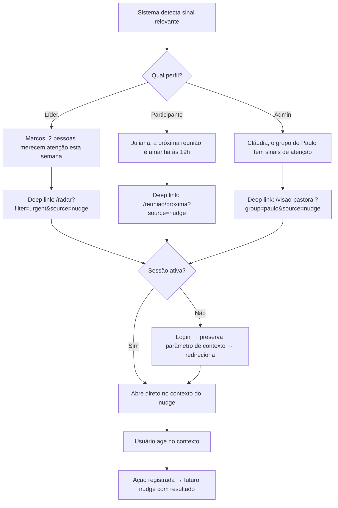
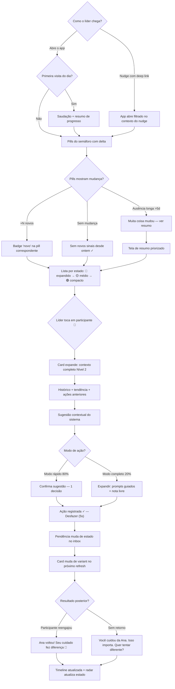
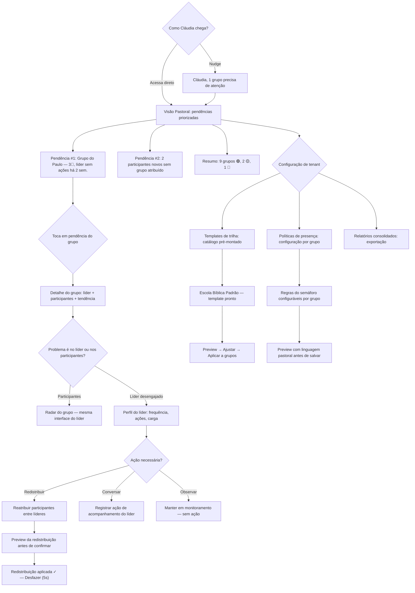
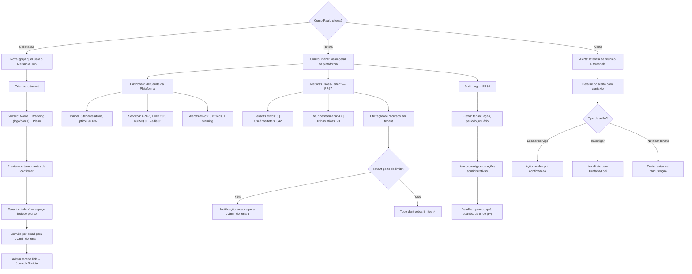
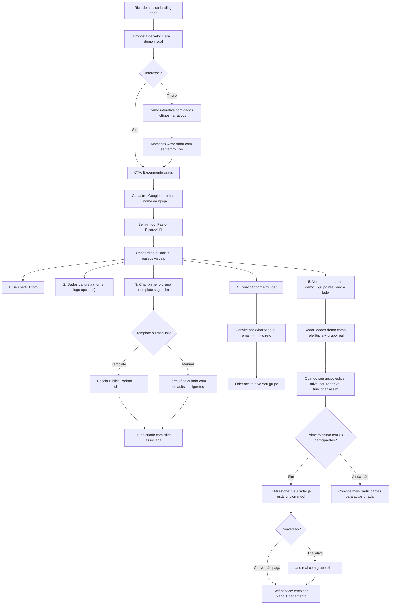

# UX Design Specification metanoia-hub

**Author:** Paulo
**Date:** 2026-04-05

---

## Executive Summary

### Visão do Projeto

O metanoia-hub é um SaaS B2B EdTech para discipulado cristão que transforma sinais digitais (presença, engajamento, progresso) em linguagem pastoral de cuidado. O conceito central — Radar Pastoral — diferencia a plataforma de qualquer LMS ou ferramenta de reunião existente ao oferecer visibilidade contextualizada e orientada à ação para líderes ministeriais.

O DNA do produto é **"cuidado pastoral, não vigilância"**. Esta diretriz deve permear cada decisão de design: desde a escolha de palavras na interface até a forma como dados são apresentados.

### Usuários-Alvo

**5 Personas Primárias:**

1. **Pastor Marcos (Líder de Grupo)** — Não-técnico, relacional, lidera um grupo de discipulado. Precisa de visibilidade rápida sobre seus participantes sem complexidade. Experiência primária: Dashboard Semáforo + Reunião ao Vivo + Ações de Cuidado.

2. **Juliana (Participante)** — Acessa majoritariamente por celular. Quer consumir trilhas, participar de reuniões e ver seu progresso. Experiência primária: Mobile-first, entrada rápida na reunião, trilha com progresso visual.

3. **Pastora Cláudia (Admin Tenant)** — Coordenadora geral, gerencia 8 líderes e ~200 participantes. Extremamente organizada, não-técnica. Experiência primária: Visibilidade agregada, configuração de políticas, relatórios consolidados.

4. **Paulo (Super Admin)** — Perfil técnico, gerencia a plataforma. Experiência primária: Control plane, provisionamento de tenants, observabilidade.

5. **Ricardo (Adoção)** — Avaliando a plataforma pela primeira vez. Experiência primária: Landing page, onboarding guiado, primeiro valor em <10 minutos.

### Desafios-Chave de Design

**Priorização por impacto de negócio (recomendação PM):**

#### 1. Vocabulário pastoral obrigatório

Toda a interface deve usar linguagem de cuidado. "Acompanhar" em vez de "monitorar", "cuidar" em vez de "rastrear". O enquadramento de FR62 é requisito funcional, não sugestão.

#### 2. Primeira tela do líder deve ser relacional, não analítica

Se o dashboard abrir com métricas e números, Pastor Marcos (não-técnico, relacional) vai se sentir num ERP. A primeira tela deve ser uma frase de cuidado:

> "Bom dia, Pastor Marcos. Seu grupo tem 12 pessoas. 9 estão bem 🟢, 2 merecem atenção 🟡, 1 precisa de cuidado 🔴"

Depois disso, ele desce para os detalhes se quiser. Isso reforça o DNA "cuidado, não vigilância" desde o primeiro segundo.

#### 3. Dualidade mobile/desktop

Consumo é mobile-first (trilhas, reunião, progresso). Gestão é desktop-first (dashboard líder, relatórios, admin). Breakpoints: mobile (<640px), tablet (640-1024px), desktop (>1024px). Touch targets ≥44px (WCAG AA).

#### 4. Público não-técnico como buyer primário

Pastores e líderes ministeriais. Onboarding ultra-rápido: Admin <10min, Líder <3min, Participante <2min. Zero jargão técnico na interface.

#### 5. Três experiências consolidadas (não 6 roles separados)

Em vez de criar experiências separadas para cada role RBAC, consolidar em 3 experiências com shell compartilhada e layout adaptativo:

- **(1) Consumo** — Participante: Minhas Trilhas, Minha Reunião, Meu Progresso
- **(2) Gestão de Grupo** — Líder + Editor de Conteúdo: Meu Grupo, Radar Pastoral, Próxima Reunião, Ações de Cuidado
- **(3) Administração** — Admin Tenant + Super Admin + Auditor: Visão Geral, Grupos, Líderes, Configurações, Relatórios

O Auditor é view-only do Admin. O Editor é subset do Líder. Transição suave entre roles para quem tem múltiplos.

### Oportunidades de Design

1. **Radar Pastoral como momento "wow"** — A tradução de dados comportamentais em linguagem pastoral é inédita no mercado. A experiência do semáforo com contexto expandido + CTA de ação pastoral pode ser o fator decisivo de conversão e retenção.

2. **Onboarding como motor de adoção** — Free tier com dados demo pré-populados com narrativa pastoral real (seed script — quick win, ~1 dia de trabalho, ROI altíssimo). Templates prontos e wizard guiado. Primeiro valor em <10min.

3. **WhatsApp como extensão nativa** — Integração com ChatMaster Veloz para lembretes, notificações e reengajamento no canal que o público-alvo já domina.

### Prevenções de Risco UX (Pre-mortem Analysis)

Cenários de falha identificados e priorizados por impacto de negócio:

| Prioridade | Risco | Prevenção-Chave |
|:---:|-------|----------------|
| 🥇 | **Onboarding sem valor** — Ricardo não vê valor em 10min. Dados demo genéricos não conectam com realidade pastoral | Dados demo com narrativa pastoral real. Momento wow guiado: "Veja como o Pastor Marcos descobriu que Ana precisava de atenção". Tour interativo simulando experiência do líder |
| 🥈 | **Fricção mobile na reunião** — Juliana não consegue entrar pelo celular. Link WhatsApp → browser → permissões → falha | Deep link + sessão persistente (reconhece dispositivo via cookie/token). Google One Tap como fallback seguro. Tela de preparação pré-reunião que testa câmera/microfone |
| 🥉 | **Abandono na configuração** — Cláudia desiste no setup. Configuração de 8 líderes e políticas complexa demais | Templates pré-montados ("Escola Bíblica Padrão"). Setup progressivo: essencial primeiro, refinamento depois. Wizard com linguagem pastoral + preview ao vivo |
| 4️⃣ | **Semáforo como vigilância** — Líderes usam 🔴 como cobrança. Participantes sentem-se vigiados | Contexto expandido como estado padrão. Cor secundária, texto primário. CTA de ação pastoral ao lado de cada indicador ("Registrar Cuidado", "Enviar Mensagem"). Sugestões de ação contextual |
| 5️⃣ | **Navegação multi-role confusa** — Menu dinâmico por role gera experiência "nem carne nem peixe" | 3 experiências consolidadas (Consumo, Gestão, Admin) com shell compartilhada e layout adaptativo |

## Core User Experience

### Defining Experience

A experiência que define o Metanoia Hub não é apenas reunir pessoas nem apenas entregar conteúdo. É ajudar o líder a perceber sinais relevantes, agir com rapidez e cuidar melhor antes que o afastamento se consolide.

O produto tem dois corações:

**Coração Diferencial — Radar Pastoral → Ação de Cuidado**
O líder vê um sinal relevante, entende o contexto e toma uma ação de cuidado com rapidez e clareza. Essa é a experiência que faz o Metanoia Hub ser Metanoia Hub e não "mais um LMS com Zoom".

**Coraç��o Operacional — Reunião ao Vivo + Trilha Formativa**
A base de uso recorrente que sustenta frequência, adoção e hábito. Sem ela o produto não sobrevive, mas ela sozinha não é o diferencial.

**Relação entre os dois:**
- A experiência operacional mantém o produto vivo
- A experiência diferencial faz o produto ser escolhido e lembrado
- Reunião + trilha alimentam os sinais que o Radar traduz em cuidado

**Regra de Investimento de UX:**
O coração operacional pode ser "bom o suficiente" — reunião funciona, trilha funciona. Mas o coração diferencial precisa ser **excepcional**. Se precisar cortar escopo de UX, proteja o diferencial. O Radar Pastoral recebe prioridade de refinamento sobre funcionalidades operacionais.

### Platform Strategy

- **Plataforma:** Web app responsivo (não app nativo)
- **Mobile-first:** Consumo — trilhas, reunião, progresso (Juliana)
- **Desktop-first:** Gestão — dashboard líder, relatórios, admin (Marcos, Cláudia)
- **Offline:** Fora do escopo atual
- **Canal de extensão:** WhatsApp via ChatMaster Veloz (canal bidirecional — mensagem sai E resultado volta)
- **Reuniões:** Provedor externo integrado (a definir — FR44)
- **3 experiências consolidadas:**
  - (1) Consumo — Participante
  - (2) Gestão de Grupo — Líder + Editor
  - (3) Administração — Admin + Super Admin + Auditor

### Effortless Interactions

Priorizadas por impacto no produto:

**1. Registro de ação de cuidado pelo líder (MAIS IMPORTANTE)**
Se o líder vê 🔴 e agir dá trabalho, o coração do produto quebra. O sistema sugere a ação, o líder apenas confirma:
- Sistema pré-seleciona: canal (WhatsApp se tem número), tom (baseado no contexto), visibilidade (padrão do tenant)
- Líder decide apenas "sim, cuidar" ou "não agora"
- Meta: **1 decisão**, não 2 cliques com 5 decisões escondidas

**2. Entrada na reunião pelo celular**
Momento mais crítico para volume. Deep link + sessão persistente (reconhece dispositivo). Google One Tap como fallback seguro. Tela de preparação pré-reunião que testa câmera/microfone.

**3. Primeira tela do líder**
Relacional, orientada a pessoas, clara quanto ao que precisa de atenção agora. Frase de cuidado como elemento primário, não dashboard analítico.

**4. Onboarding com primeiro valor em <10 minutos**
Levar o usuário até uma visão útil, não até uma configuração longa. Orientado ao job e ao valor percebido cedo, não à conclusão de passos técnicos.

**5. Reengajamento assistido via WhatsApp (canal bidirecional)**
O líder dispara ação de cuidado, a mensagem sai pelo WhatsApp, e o resultado volta para a plataforma:
- Captura automática via ChatMaster Veloz quando viável
- Fallback manual: quick-action para o líder — "Ana respondeu? [Sim, positivamente] [Sim, precisa de mais] [Não respondeu]" — 1 toque para fechar o loop

### Critical Success Moments

O produto tem dois momentos críticos sequenciais que determinam sucesso:

**Momento Aha — "Agora eu entendi o que esse produto faz por mim"**
Acontece quando o líder vê o Radar Pastoral, entende o contexto de um participante e percebe que consegue agir imediatamente. É o momento de ativação onde o usuário internaliza a proposta central de valor.

Gatilho: líder vê 🔴 com contexto progressivo + sugestão de ação → percebe que em 1 decisão pode cuidar de alguém.

**Momento Prova — "Agora eu acredito que isso realmente mudou meu discipulado"**
Acontece quando a ação gera resultado observável e o sistema mostra a correlação:
- Alguém volta para a reunião → sistema notifica: "Ana voltou! Seu cuidado fez diferença 💚"
- Timeline de cuidado no perfil do participante: sinal → ação do líder → resultado
- O líder percebe que não descobriu o afastamento tarde demais

**Mecânica do Momento Prova:**
- Correlação automática: quando participante muda de 🔴→🟡 ou 🟡→🟢 após ação registrada, sistema conecta os eventos
- Notificação ao líder com feedback de impacto
- Timeline visual no perfil: sequência sinal → ação → resultado

**Loop Completo de Valor:**
Radar (sinal) → Contexto progressivo (entendimento) → Sugestão de ação (sistema propõe) → Confirmação (líder decide) → Canal bidirecional (WhatsApp) → Resultado (reengajamento) → Feedback de impacto (sistema mostra) → Radar atualiza (loop fecha)

### Experience Principles

1. **Cuidado antes de dados** — Toda tela começa com pessoas e contexto, não com métricas e gráficos. O produto fala como um pastor, não como um BI.

2. **Ação em 1 decisão** — Do sinal à ação de cuidado, o líder toma apenas 1 decisão: "sim, cuidar" ou "não agora". O sistema sugere canal, tom e visibilidade com defaults inteligentes. Carga cognitiva mínima, não apenas cliques mínimos.

3. **Volume sem fricção** — Reunião e trilha (coração operacional) devem ser invisíveis em complexidade. Entrar, participar, progredir — sem pensar.

4. **Contexto progressivo** — Nenhum dado sem contexto, mas com progressive disclosure. Nível 1 (lista): cor + nome + 1 frase curta. Nível 2 (expandido): histórico completo, tendência, ações anteriores — sob demanda. Participantes 🔴 no topo com mais contexto, 🟢 compactos.

5. **Loop fechado** — A experiência não termina no insight. Termina quando a ação gera resultado e o líder vê o impacto do seu cuidado.

6. **WhatsApp como canal bidirecional** — A mensagem de cuidado sai pelo WhatsApp E o resultado volta para a plataforma. Captura automática quando viável, quick-action manual como fallback. O loop radar → ação → canal → resultado deve ser contínuo.

7. **Feedback de impacto visível** — Toda ação de cuidado tem resultado rastreável e visível. Quando um participante reengaja após uma ação, o sistema notifica o líder e registra na timeline. O "momento prova" é mecânica, não conceito.

## Desired Emotional Response

### Primary Emotional Goals

Cada persona tem uma assinatura emocional específica que guia todas as decisões de design:

**Pastor Marcos (Líder) — Clareza serena de cuidado**
Ele entende como estão suas pessoas, sabe quem precisa de atenção agora e consegue agir sem ansiedade, culpa ou sobrecarga. Não é "controle tranquilo" — é "cuidado com clareza".

**Juliana (Participante) — Pertencimento leve + segurança simples**
Participar é fácil, acolhedor e natural. Sem sensação de vigilância, pressão de performance ou confusão técnica. Ela sente que faz parte de algo sem esforço.

**Pastora Cláudia (Admin) — Segurança de governança + orgulho organizado**
O sistema parece confiável, claro e sustentável de operar. Sem excesso de dados, sem medo de configurar errado, sem solidão operacional.

**Ricardo (Adoção) — Curiosidade encantada + alívio imediato**
Entende rápido o que o produto faz e percebe que resolve uma dor real. O pensamento não é "que legal" — é "finalmente algo que faz sentido para esse contexto".

**Emoção que gera indicação — Alívio com confiança**
A emoção que faz um líder recomendar o produto para outro líder:
> "Me faz sentir que eu finalmente consigo cuidar sem me perder."

### Emotional Journey Mapping

| Estágio | Emoção Desejada | Anti-emoção (evitar) |
|---------|----------------|---------------------|
| **Descoberta** (Ricardo vê o produto) | Curiosidade + alívio ("isso resolve minha dor") | Ceticismo, tédio de setup |
| **Onboarding** (primeiro uso) | Encantamento rápido ("primeiro valor em <10min") | "Mais um software para alimentar" |
| **Uso diário — Participante** (Juliana) | Pertencimento leve, fluidez natural | Vigilância, pressão, confusão |
| **Uso diário — Líder** (Marcos) | Clareza serena, confiança para agir | Urgência caótica, culpa retroativa |
| **Uso diário — Admin** (Cláudia) | Governança segura, visibilidade sem esforço | Sobrecarga de dados, medo de errar |
| **Momento Aha** (líder vê radar + age) | Empoderamento calmo ("consigo cuidar em 1 decisão") | Paralisia por excesso de opções |
| **Momento Prova** (ação gera resultado) | Validação com propósito ("meu cuidado fez diferença") | Indiferença, desconexão causa-efeito |
| **Quando algo dá errado** | Confiança mantida ("o sistema me orienta") | Abandono, pânico, culpa |
| **Retorno após ausência** | Acolhimento informado ("bem-vindo de volta, aqui está o que importa agora") | Culpa retroativa, sobrecarga de acúmulo |
| **Retorno regular** | Familiaridade acolhedora ("tudo como eu deixei") | Reaprendizado, estranhamento |

### Micro-Emotions

**Emoções críticas para o sucesso do produto:**

| Emoção Positiva (cultivar) | Emoção Negativa (prevenir) | Contexto |
|---------------------------|--------------------------|----------|
| **Confiança** — "posso agir com segurança" | Hesitação — "será que devo clicar?" | Toda interação de cuidado pastoral |
| **Pertencimento** — "sou parte desse grupo" | Isolamento — "ninguém sabe que estou aqui" | Experiência do participante |
| **Competência** — "sei usar isso" | Confusão — "o que isso faz?" | Onboarding de todas as personas |
| **Propósito** — "isso serve para cuidar" | Burocracia — "isso é só mais um formulário" | Registro de ações de cuidado |
| **Autonomia** — "eu decido quando e como agir" | Pressão — "o sistema me cobra ação" | Semáforo e notificações |
| **Esperança** — "dá para continuar com constância" | Desânimo — "não consigo acompanhar tudo" | Dashboard do líder com muitos participantes |

### Design Implications

**Emoção → Decisão de Design:**

| Emoção Desejada | Implicação de UX |
|----------------|-----------------|
| Clareza serena | Primeira tela relacional com frase de cuidado, não dashboard analítico. Informação dosada por progressive disclosure |
| Pertencimento leve | Linguagem calorosa, nomes próprios sempre visíveis, saudações personalizadas. Zero jargão de sistema |
| Segurança de governança | Templates pré-montados, preview antes de salvar, confirmação gentil em ações importantes. Impossível "quebrar" algo sem aviso |
| Curiosidade encantada | Dados demo com narrativa real, tour interativo que simula experiência, momento wow no primeiro minuto |
| Alívio com confiança | Sugestões de ação pré-montadas pelo sistema, defaults inteligentes, fluxos que reduzem carga cognitiva |
| Validação com propósito | Timeline de cuidado visual, notificação "Seu cuidado fez diferença 💚", correlação ação↔resultado explícita. Validação celebra a ação de cuidar, não apenas o resultado |
| Confiança em falhas | Mensagens humanas e calmas: "Perdemos a conexão por um instante. Estamos tentando reconectar." Sempre com próximo passo claro |
| Acolhimento no retorno | Tela de re-entry contextual: "Bem-vindo de volta. Nas últimas 2 semanas: resumo priorizado do que mudou". Sem acúmulo bruto de 🔴, com priorização |

### Emotional Design Principles

1. **Cuidado proativo, nunca cobrança reativa** — O sistema lembra com gentileza no momento certo (nudge pastoral), mas nunca cobra retroativamente por inação. "Ana não apareceu nas últimas 2 reuniões. Quer mandar uma mensagem para ela?" é cuidado. Notificação diária repetida é cobrança. Cadência máxima definida por participante 🔴.

2. **Transparência calma em falhas** — Quando algo dá errado: dizer o que aconteceu, o que o sistema já está fazendo, e oferecer o próximo passo mais simples. Linguagem humana, nunca técnica. Nunca silêncio, nunca drama.

3. **Dignidade do participante** — Juliana nunca deve sentir que está sendo medida, classificada ou vigiada. O semáforo é ferramenta do líder, não rótulo do participante. O participante vê progresso próprio, nunca sua "cor".

4. **Validação proporcional e processual** — O sistema celebra quando cuidado gera resultado, mas de forma sóbria e pastoral. Quando o cuidado NÃO gera retorno imediato: "Você cuidou da Ana esta semana. Isso importa, independente da resposta dela." Validar a ação de cuidar, não apenas o resultado. Normalizar o não-retorno com esperança: "Às vezes o cuidado demora para fazer efeito. Quer tentar um contato diferente?"

5. **Simplicidade proporcional ao papel** — Cada experiência tem seu nível correto de simplicidade:
   - Consumo (Participante): ultra-simples, acolhimento máximo
   - Gestão (Líder): clareza com profundidade acessível (progressive disclosure)
   - Admin (Cláudia): poder analítico organizado — mais denso, mas estruturado

6. **Design que educa o comportamento** — A interface não apenas protege o participante visualmente, mas modela o tom que o líder deve usar fora da tela. Se o sistema diz "Ana merece atenção" (não "Ana está no vermelho"), o líder absorve essa linguagem e a replica. Onboarding inclui guia de boas práticas: "O radar é sua ferramenta de cuidado privada. Nunca mencione cores ou classificações para os participantes."

## UX Pattern Analysis & Inspiration

### Benchmark Line

> O Metanoia Hub deve ter a naturalidade do WhatsApp, a simplicidade de consumo do YouTube, a sensação de autonomia do Canva e o feedback de impacto do Strava — sem virar um Moodle com linguagem de igreja.

### Inspiring Products Analysis

#### WhatsApp — Referência de naturalidade e baixa fricção

O público-alvo (97% dos brasileiros acessam diariamente). A vida pastoral já acontece aqui.

**Padrões de sucesso:**
- Imediato, familiar e sem cerimônia — não se "entra num sistema", se responde
- Ações rápidas com linguagem humana
- Sensação de continuidade da relação
- Zero onboarding formal — qualquer pessoa já sabe usar
- **Lógica de "não lido"** — indicador visual de pendência que se resolve ao agir

**Lição para o Metanoia Hub:** Toda interação de cuidado deve ter a naturalidade de uma conversa no WhatsApp. O Radar Pastoral funciona como **inbox de cuidado**: "3 pessoas merecem atenção" = 3 mensagens não lidas. O líder "abre", entende, age. Depois de agir, o indicador muda — como "marcar como lido". A satisfação de "zerar pendências" é a mesma do WhatsApp.

#### YouTube — Referência de consumo simples e contínuo

144 milhões de usuários no Brasil. Já é hábito de consumo de conteúdo e formação.

**Padrões de sucesso:**
- Abriu, deu play, continua de onde parou
- Recomenda o próximo passo automaticamente
- Funciona bem no celular sem adaptação mental
- Zero esforço para "entender a plataforma"

**Lição para o Metanoia Hub:** Trilhas como playlists para **navegação e continuidade** — abrir, consumir, parar, voltar de onde parou. Próximo conteúdo sugerido automaticamente. Mas como **jornada guiada para engajamento** — cada item não é só "assistir", pode ser "fazer", "refletir", "responder". O indicador de progresso diferencia visualmente conteúdo consumido vs. atividade completada.

#### Canva — Referência de autonomia e resultado rápido

Especialmente relevante para pastores e admins que criam materiais sem depender de designer.

**Padrões de sucesso:**
- Começa com template, nunca com tela em branco
- Resultado rápido — produz algo bonito em minutos
- Reduz medo de errar (undo fácil, preview constante)
- Faz o usuário parecer mais competente do que se sente

**Lição para o Metanoia Hub:** Configuração de tenant e grupos deve começar com templates pré-montados ("Escola Bíblica Padrão"), não com formulários em branco. O admin deve sentir que "consegue" em minutos.

#### Strava/Fitbit — Referência de feedback de impacto

Referência para o Momento Prova — "sua ação gerou resultado".

**Padrões de sucesso:**
- Strava: "Seu amigo reagiu ao seu treino" — feedback social de ação
- Fitbit/Apple Health: "Seu sono melhorou 15% esta semana" — feedback de tendência
- Correlação visível entre ação e resultado

**Lição para o Metanoia Hub:** O feedback de impacto pastoral segue a mesma lógica — "Ana voltou! Seu cuidado fez diferença" — mas com tom pastoral e sem gamificação. O sistema mostra tendência e correlação (timeline de cuidado), não badges e streaks. Celebra a ação de cuidar, não a pontuação do líder.

### Competitive Landscape — Bons mas Incompletos

#### Planning Center / Church Center
**Forte em:** organização da igreja, grupos, eventos, app móvel para congregação
**Falta:** discipulado com leitura pastoral de cuidado. Não tem o loop sinal → discernimento → ação de cuidado

#### Disciple.Tools
**Forte em:** gestão de discipulado, contatos, grupos, acompanhamento intencional
**Falta:** reunião ao vivo + trilha + radar em tempo real. Cobre gestão mas não a experiência completa

#### Moodle / LMS genéricos
**Forte em:** progresso, conclusão de atividades, critérios mensuráveis
**Falta:** linguagem pastoral, contexto de discipulado, sinais relacionais. Framing de educação formal, não acompanhamento ministerial

**Gap de mercado:**
> Existem soluções boas para grupos, conteúdo ou gestão da igreja. O que ainda falta é uma experiência que conecte discipulado ao vivo, jornada formativa e radar pastoral de cuidado no mesmo fluxo.

**Barreira competitiva:** O loop sinal → ação → resultado requer integração de três camadas que normalmente são produtos separados (reunião ao vivo + LMS + CRM pastoral). Ninguém integrou porque cada camada é um negócio separado. O diferencial do Metanoia Hub vem da integração — e o UX deve reforçar isso: **o líder nunca deve sentir que está alternando entre 3 ferramentas dentro de uma.**

### Transferable UX Patterns

**Padrões de Navegação:**
- WhatsApp: navegação por conversas/contatos → Radar Pastoral como **inbox de cuidado** com navegação por pessoas, não por módulos
- WhatsApp: lógica de não-lido → indicador de pendências de cuidado que se resolve ao agir
- YouTube: navegação por conteúdo com continuidade → trilhas como playlists com "continue de onde parou"

**Padrões de Interação:**
- WhatsApp: resposta rápida em 1 toque → ação de cuidado em 1 decisão
- Canva: template como ponto de partida → configuração de tenant por template
- YouTube: autoplay/próximo sugerido → próximo conteúdo da trilha automático (mas sem pressão — autonomia > algoritmo)
- Strava: feedback de ação social → feedback de impacto pastoral na timeline

**Padrões Visuais:**
- WhatsApp: bolhas de conversa, linguagem direta → comunicação do sistema como diálogo, não como notificação de sistema
- Canva: preview em tempo real → preview de configuração antes de salvar
- YouTube: thumbnail + progress bar → cards de conteúdo com indicador visual de progresso (diferenciando consumo vs. atividade)

### Anti-Patterns to Avoid

| Anti-Pattern | Por que evitar | Referência negativa |
|-------------|---------------|-------------------|
| Visual de BI/dashboard corporativo | Gera sensação de "sistema frio" — oposto do DNA pastoral | Moodle analytics, Power BI |
| Vocabulário de monitoramento | "Rastrear", "monitorar", "métrica" destroem o enquadramento de cuidado | LMS genéricos, CRMs |
| Setup longo antes do primeiro valor | Público não-técnico abandona. Meta: <10min | Moodle, Salesforce |
| Muitas decisões por tela | Cada decisão é fricção. Líder quer cuidar, não configurar | Painéis admin complexos |
| Navegação por funcionalidades | "Módulos > Trilhas > Conteúdo" é pensamento de sistema, não de usuário | LMS tradicionais |
| Tela em branco para começar | Sem template = paralisia. Canva provou que template primeiro funciona | Google Docs em branco |
| Sensação de "mais um sistema para alimentar" | O maior matador de adoção neste público | Ferramentas que exigem manutenção constante |
| Parecer 3 ferramentas coladas | O diferencial é a integração. Se parecer "LMS + Zoom + CRM" colados, perde o valor | Plataformas Frankenstein |
| **Notificação genérica sem contexto pessoal** | Killer de engajamento para público não-técnico. "Novo módulo disponível" = ruído. O líder silencia o app em 2 semanas | Apps B2B com push genérico |

**Frases-guia:**
> O usuário não quer administrar software; ele quer cuidar de gente. Toda parte do produto que parecer burocracia vai ser rejeitada.

> Cada notificação deve ser sobre uma pessoa específica ou uma ação relevante agora. "Ana não apareceu na reunião" é relevante. "Novo módulo disponível" é ruído.

### Design Inspiration Strategy

**Adotar diretamente:**
- Naturalidade de comunicação do WhatsApp → tom de toda a interface
- Lógica de inbox/não-lido do WhatsApp → Radar Pastoral como inbox de cuidado
- Consumo contínuo do YouTube → modelo de trilhas como playlists
- Templates do Canva → onboarding e configuração por template
- Feedback de impacto do Strava → timeline de cuidado com correlação ação↔resultado

**Adaptar para o contexto pastoral:**
- Navegação por pessoas (WhatsApp) → adaptada para radar pastoral com semáforo contextual
- Autoplay do YouTube → sugestão de próximo conteúdo, mas sem pressão (autonomia > algoritmo). Diferenciar consumo passivo vs. engajamento ativo
- Preview do Canva → preview de configuração de políticas com linguagem pastoral
- Feedback social do Strava → feedback de impacto pastoral sem gamificação (sem badges, sem streaks, sem rankings)

**Evitar deliberadamente:**
- Qualquer padrão visual de LMS tradicional (Moodle, Teachable)
- Dashboards analíticos como primeira tela (Power BI, Metabase)
- Navegação por módulos/funcionalidades (sistema-centrismo)
- Vocabulário de monitoramento ou métricas de performance
- Notificações genéricas sem contexto pessoal
- UX fragmentada que pareça 3 ferramentas coladas

**Alerta estratégico:** O diferencial competitivo vem da integração, não de cada parte isolada. O UX deve reforçar a experiência integrada — o líder nunca deve sentir que está alternando entre 3 ferramentas dentro de uma. A transição entre radar → reunião → trilha → ação de cuidado deve ser fluida e contínua.

## Design System Foundation

### Design System Choice

**Fundação:** shadcn/ui + Tailwind CSS 4.2 + Radix UI

shadcn/ui como "a fundação do design system" — componentes acessíveis, extensíveis e sem lock-in. Componentes vivem no repositório (`packages/ui`), são copy-paste e totalmente customizáveis.

**Stack técnica completa:**
- shadcn/ui (CLI v4) → componentes base em `packages/ui/components/`
- Radix UI → primitivos acessíveis (WAI-ARIA, keyboard, focus management)
- Tailwind CSS 4.2 → styling mobile-first, config em `packages/config`
- Next.js 16.2 App Router → SSR (landing/SEO) + CSR (área autenticada)

**Decisão: Light-only no MVP.** O público-alvo (pastores, líderes ministeriais) não tem expectativa de dark mode. Tokens semânticos (`bg-surface`, `text-primary`) garantem que dark mode pode ser adicionado em fase futura sem retrabalho — desde que nunca se use cores hardcoded (`bg-white`, `text-gray-900`).

### Rationale for Selection

| Fator | Avaliação |
|-------|-----------|
| Velocidade de desenvolvimento | Alta — componentes prontos, sem biblioteca fechada |
| Customização visual | Total — Tailwind permite theming completo para tom pastoral |
| Acessibilidade | WCAG AA built-in via Radix UI (touch targets, focus, screen readers) |
| Mobile-first | Tailwind é mobile-first por design |
| Manutenção | Componentes no repositório, sem dependência externa |
| Performance | Tailwind purge + tree-shaking, zero CSS desnecessário |
| AI-assisted dev | shadcn/ui extremamente bem documentado para LLMs |
| Aderência ao stack | Conversa nativamente com Next.js App Router, Server/Client Components |

### Visual Direction

**Diretriz principal:**
> "Não é um dashboard frio. É uma interface de cuidado."

**Tom visual:** Base clean, estrutura clara, calor pastoral.

Híbrido entre clean e acolhedor: base luminosa e organizada com bastante respiro, tipografia clara e hierarquia simples, aquecida por tons suaves e naturais. Menos corporativo, mais humano. Menos vibrante, mais sereno.

**Direção emocional → visual:**
- Clareza serena → espaço generoso, hierarquia clara, poucos elementos por tela
- Pertencimento leve → cantos arredondados, tons quentes, linguagem calorosa
- Cuidado sem vigilância → cores suaves (nunca cores agressivas para o semáforo), ícones amigáveis, feedback gentil
- Segurança de governança → estrutura organizada, dados bem alinhados, consistência visual

**Paleta direcional do semáforo (definição prévia aos tokens):**
- 🔴 → **Terracota quente / coral profundo** — comunica "atenção necessária" sem gritar "PERIGO"
- 🟡 → **Âmbar quente** — não amarelo de warning, mas calor de atenção gentil
- 🟢 → **Verde salvia / verde oliva claro** — comunica "está bem" com suavidade

**O que evitar visualmente:**
- Frio corporativo (cinzas, cantos retos, grids rígidos)
- Vibrante demais (gradientes fortes, cores neon, animações excessivas)
- Terapêutico demais (pastéis lavanda, cursivas, visual de app de meditação)
- Inconsistência entre as 3 experiências — variação é de densidade e calor, não de identidade

**Coerência entre as 3 experiências:**
As 3 experiências (Consumo, Gestão, Admin) variam em densidade e calor, mas **compartilham a mesma paleta, tipografia, iconografia e componentes base**. A variação é de layout e densidade, não de identidade visual. Se cada experiência parecer um app diferente, quebramos a percepção de produto integrado.

### Identity Status

A identidade visual está em construção aberta. Ativos existentes (logo, nome tipográfico, paleta preliminar) serão absorvidos como insumo. A direção de marca e design system está sendo definida neste documento para sustentar o tom emocional do produto.

### Customization Strategy — Duas Camadas

#### Camada 1 — Design Tokens (Steps 7-8)

Tokens vivem em `packages/config` como extensão do Tailwind theme. São a fundação visual sobre a qual tudo é construído.

**Tokens pastorais como extensão, não substituição:**
Os tokens pastorais são uma camada semântica adicional que convive com tokens utilitários padrão do Tailwind:
```
// Tailwind theme extension
colors: {
  care: {
    urgent: '#...terracota...',    // 🔴 semáforo
    attention: '#...âmbar...',     // 🟡 semáforo
    ok: '#...verde salvia...',     // 🟢 semáforo
    neutral: '#...cinza quente...', // estado padrão
  }
}
```
Assim temos `text-care-urgent` para o semáforo E `text-red-500` para erro de validação de formulário. Dois sistemas semânticos convivendo.

**Tokens a definir:**
- Paleta de cores com semântica pastoral (`care-*`) + utilitária (Tailwind padrão)
- Tipografia: legível, calorosa, hierarquia clara
- Espaçamento: generoso (respiro = calma)
- Border radius: arredondado (acolhimento)
- Sombras: suaves (profundidade sem peso)
- Superfícies: `bg-surface`, `bg-surface-elevated` (tokens semânticos, nunca hardcoded)

**Nomenclatura em dois níveis:**
- **Nível de código (tokens):** `care-urgent`, `care-attention`, `care-ok` — técnico mas pastoral
- **Nível de interface (o que o líder vê):** "precisa de cuidado", "merece atenção", "está bem" — linguagem humana

#### Camada 2 — Componentes de Domínio (Step 11)

Componentes construídos sobre shadcn/ui + tokens. Definidos no Step 11 (Component Strategy).

**Organização em `packages/ui`:**
- `packages/ui/components/` → componentes base shadcn (Button, Card, Dialog, Input, etc.)
- `packages/ui/pastoral/` → componentes de domínio pastoral:
  - `SemaforoPastoral` — indicador 🟢🟡🔴 com contexto progressivo
  - `CardParticipante` — nome + frase de contexto + CTA de ação
  - `InboxCuidado` — lista de pendências estilo "não-lido" do WhatsApp
  - `TimelineCuidado` — sequência sinal → ação → resultado
  - `NudgePastoral` — notificação gentil com sugestão de ação
  - `TelaReentry` — resumo priorizado após ausência

**Variantes emocionais nos componentes:**
Estados visuais reforçam a assinatura emocional com nomenclatura pastoral no código e linguagem humana na interface:
- `variant="care-urgent"` → renderiza "precisa de cuidado"
- `variant="care-attention"` → renderiza "merece atenção"
- `variant="care-ok"` → renderiza "está bem"

**Variação controlada por experiência:**
- Consumo (Participante): mais quente, mais simples, mais mobile, menos componentes
- Gestão (Líder): equilíbrio entre calor e funcionalidade, progressive disclosure
- Admin: mais estruturado, mais denso, mas mesma identidade visual

## Defining Core Experience

### Defining Experience Statement

**Frase definidora interna do produto:**
> O líder percebe um sinal, entende o contexto e age com rapidez para cuidar melhor de alguém.

**Frase curta de posicionamento:**
> Veja quem precisa de cuidado e aja a tempo.

A experiência definidora do Metanoia Hub é o loop completo: sinal → contexto → ação → resultado. Não é apenas ver o radar. É ver, entender, agir e perceber que fez diferença.

### User Mental Model

**Como o líder resolve esse problema hoje:**
> Hoje, o líder quase nunca tem um radar; ele tem lembranças, sinais dispersos e boa intenção.

**Workarounds atuais:**
- Lembrar "de cabeça" quem faltou
- Alguém avisar no grupo de WhatsApp ("a Ana sumiu, né?")
- Olhar lista de presença depois que o problema já começou
- Mandar mensagem manualmente no WhatsApp
- Anotar em planilha ou caderno
- Depender da percepção subjetiva do líder ou de outro discipulador

**Ferramentas parciais que existem:**
- Planning Center Groups — registro de presença de grupos
- Disciple.Tools — gerenciar contatos, identificar quem precisa de atenção, follow-up com lembretes
- Pushpay/Subsplash — insights e ações recomendadas por IA no ecossistema church-tech

**Lacuna no modelo mental atual:**
O líder opera com sinais dispersos, memória e boa intenção. A descoberta de afastamento quase sempre acontece tarde demais — quando a pessoa já saiu ou quando alguém comenta casualmente. Não existe um sistema que transforme sinais digitais em linguagem pastoral acionável em tempo quase real.

**Expectativa do usuário:**
O líder não espera um dashboard analítico. Ele espera algo mais parecido com "abrir o WhatsApp e ver quem me mandou mensagem" — só que em vez de mensagens, são pessoas que precisam de atenção. O modelo mental é **inbox de cuidado**, não **painel de controle**.

### Success Criteria

**Três camadas de feedback — "você fez certo":**
> O radar vira verdade quando o líder vê que seu cuidado gerou resposta.

**Camada 1 — Feedback Imediato (obrigatório para UX):**
Confirmação instantânea de que a ação foi registrada e encaminhada.
- "Ação registrada ✓"
- "Mensagem enviada ✓"
- "Acompanhamento iniciado ✓"
- Indicador visual: pendência muda de estado (como "marcar como lido")

**Camada 2 — Feedback de Curto Prazo (MAIS IMPORTANTE para provar valor):**
O sistema mostra que houve resposta do participante. É aqui que o "momento prova" acontece.
- "Juliana voltou à reunião 💚"
- "Ana retomou a trilha"
- "Carlos respondeu ao contato"
- Timeline de cuidado atualizada com a correlação ação → resultado

**Camada 3 — Feedback de Longo Prazo (sustenta retenção — MVP mínimo obrigatório):**
O líder enxerga tendência de melhora no grupo ao longo do tempo. Mesmo no Release 2, incluir visão simplificada:
- 1 frase no topo do radar: "Seu grupo este mês: 80% estáveis ou melhorando ↑"
- Viável com materialized view simples (custo técnico negligível)
- Relatórios completos podem vir em releases futuras
- A camada 3 simplificada NÃO deve ser cortada do Release 2

**Prioridade de investimento de UX:**
Camada 2 (curto prazo) > Camada 1 (imediato) > Camada 3 (longo prazo).
A camada 2 é o que prova o valor do produto. As outras são suporte.

### Novel UX Patterns

**Classificação: Novel na combinação, não nos blocos isolados.**

> O novo no Metanoia Hub não é inventar cada bloco da interface. É juntar padrões conhecidos para criar uma nova experiência de cuidado pastoral.

**Blocos familiares:**

| Padrão | Referência | Familiaridade |
|--------|-----------|---------------|
| Inbox de pendências | WhatsApp "não lido" | Alta |
| Semáforo com cores | Triagem médica | Alta |
| Sugestão de ação contextual | Assistentes IA, Pushpay | Média |
| Timeline de correlação ação↔resultado | Strava, Fitbit | Média |
| Consumo de conteúdo em playlists | YouTube | Alta |

**Combinação novel:**
Nenhuma solução identificada une no mesmo fluxo:
1. Reunião ao vivo
2. Sinais de engajamento em tempo quase real
3. Trilha formativa
4. Semáforo em linguagem pastoral
5. Ação de cuidado + timeline de resultado

**Implicação para o design — Onboarding por narrativa com contraste:**
Como a combinação é nova mas os blocos são familiares, o onboarding não precisa ensinar cada componente — precisa ensinar a **conexão entre eles**.

O tour guiado deve:
- Seguir o loop completo como história, não highlight de telas
- Usar contraste antes/depois: "Sem o Metanoia Hub, Marcos só descobriria que Ana se afastou semanas depois. Com o Radar, ele percebeu em 3 dias e agiu a tempo."
- Incluir demo interativo do loop fechado com dados narrativos

### Experience Mechanics

**Mecânica detalhada do loop definidor:**

#### 1. Initiation — O líder abre o Radar

**Trigger:** Líder abre o app ou recebe nudge pastoral semanal
**O que vê:** Inbox de cuidado com progresso primeiro, pendências depois:
- "Bom dia, Pastor Marcos. Esta semana você cuidou de 4 pessoas. 3 ainda merecem atenção."
- Frase de tendência do grupo: "Seu grupo este mês: 80% estáveis ou melhorando ↑"
- Lista priorizada: 🔴 no topo (máximo 3-5 visíveis), 🟡 abaixo, 🟢 compactos
- Cada pessoa: nome + 1 frase de contexto (Nível 1)
- Indicador de pendências estilo "não lido"

**Estado "Inbox Zero Pastoral" (quando não há pendências):**
- "Bom dia, Pastor Marcos. Seu grupo está bem hoje. 12 pessoas estáveis 🟢. Nenhuma ação pendente. 🙌"
- Conteúdo secundário útil: "Próxima reunião: quinta às 19h. 9 confirmados."
- Resumo de impacto recente: "Na última semana, você cuidou de 2 pessoas e as duas reengajaram."
- Este estado reforça o hábito de abrir o app mesmo sem urgência

**Limite visual do inbox:**
- Máximo 3-5 pendências prioritárias visíveis de cada vez
- Restante em "ver mais" — evitar a parede de culpa
- Se pendências acumularem sem ação (>2 semanas): "Ana está no radar há 14 dias. Quer manter como prioridade ou deixar em observação?"

#### 2. Interaction — O líder entende e decide

**Ação do líder:** Toca em um participante 🔴
**O que vê:** Contexto progressivo (Nível 2)
- Histórico: "Ana faltou 2 reuniões, mas completou toda a trilha anterior"
- Tendência: melhorando ↑ / estável → / declínio ↓
- Ações anteriores: última vez que cuidou de Ana e resultado
- **Sugestão contextual do sistema** (algoritmo de escalação de cuidado):
  - 1ª vez 🔴: "Enviar mensagem pelo WhatsApp"
  - 2ª vez 🔴: "Ligar para Ana — mensagem anterior não gerou retorno"
  - 3ª vez 🔴: "Conversar com a coordenação sobre Ana — padrão recorrente"
  - Crônico: "Ana pode estar passando por algo maior. Considere uma conversa presencial"

**Algoritmo de escalação de cuidado:**
- MVP: regras simples configuráveis por tenant, não IA
- Baseado em: frequência de 🔴, histórico de ações, resultado de ações anteriores
- IA para sugestões é Phase 5 (Vision)
- Regras simples são mais confiáveis, mais auditáveis e mais fáceis de explicar para um pastor

**Fronteira de privacidade na escalação:**
- Níveis 1-2 (mensagem, ligação): **privados do líder** — só ele vê
- Nível 3 (envolver coordenação): **opt-in do líder** — sistema sugere, líder decide se compartilha. Nunca automático
- Nível 4 (crônico): **sugestão, não ação** — recomendação para o líder, não alerta para admin
- **Regra: a escalação sobe a sugestão, nunca a visibilidade.** Informação sobe de nível apenas com consentimento explícito do líder

**Dois modos de ação:**
- **Modo rápido** (padrão, 80% dos casos): 1 decisão — confirma sugestão do sistema. Canal, tom e visibilidade pré-selecionados
- **Modo completo** (acessível, 20% dos casos): expandir via link "Adicionar detalhes" para:
  - Prompts guiados opcionais: "O que você percebeu?", "O que você fez?", "Como quer acompanhar?"
  - Nota livre para contexto qualitativo
  - Tipo de contato, duração, observações pastorais
- Transição suave entre modos sem interromper o fluxo

#### 3. Feedback — O sistema confirma e acompanha

**Imediato:** "Mensagem enviada ✓" — pendência muda de estado
**Curto prazo (momento prova):** Se Ana reengaja → "Ana voltou! Seu cuidado fez diferença 💚"
**Se não reengaja:** "Você cuidou da Ana esta semana. Isso importa, independente da resposta dela. Quer tentar um contato diferente?" — feedback de processo, não só de resultado. Normalização do não-retorno com esperança
**Longo prazo:** Frase de tendência atualizada no topo do radar

#### 4. Completion — O loop fecha

**O líder vê na timeline:** sinal (🔴) → ação (mensagem WhatsApp) → resultado (Ana voltou / ainda não respondeu)
**O radar atualiza:** Ana muda de 🔴 para 🟡 ou 🟢
**O inbox de cuidado:** pendência resolvida — satisfação de "zerar"
**Ciclo reinicia:** novos sinais geram novas pendências

## Visual Design Foundation

### Color System

#### Paleta Principal

| Token | Hex | Uso |
|-------|-----|-----|
| `brand-teal` | `#2B7A78` | Cor principal de ação — CTAs, navegação ativa, links |
| `brand-teal-light` | `#3AAFA9` | Hover states, backgrounds sutis de ação |
| `brand-teal-dark` | `#17252A` | Texto em destaque sobre superfícies claras |
| `brand-terracotta` | `#C1666B` | Calor emocional — acentos, ilustrações, momentos de celebração |
| `brand-terracotta-light` | `#D4918A` | Backgrounds sutis de destaque emocional |

#### Paleta Pastoral (Semáforo)

Cores pastorais são uma camada semântica separada das cores de marca. Nunca usar cores pastorais para UI genérica nem cores de UI genérica para o semáforo.

| Token | Hex | Interface | Uso |
|-------|-----|-----------|-----|
| `care-urgent` | `#C1666B` | "precisa de cuidado" | 🔴 Participante com afastamento significativo |
| `care-attention` | `#D4A24C` | "merece atenção" | 🟡 Participante com sinal de atenção |
| `care-ok` | `#7BA38A` | "está bem" | 🟢 Participante engajado e estável |
| `care-neutral` | `#8E8D8A` | "sem dados suficientes" | Estado padrão, participante novo |

**Regra de acessibilidade:** Cor nunca é o único indicador. Sempre acompanhada de ícone + texto descritivo. Contraste mínimo WCAG AA (4.5:1 para texto, 3:1 para elementos gráficos).

#### Superfícies

| Token | Hex | Uso |
|-------|-----|-----|
| `surface-base` | `#FAFAF8` | Background principal — off-white com subtom rosé (não amarelado) |
| `surface-elevated` | `#FFFFFF` | Cards, modais, elementos elevados |
| `surface-sunken` | `#F2F0ED` | Áreas recuadas, backgrounds secundários |
| `surface-overlay` | `rgba(23,37,42,0.5)` | Overlays de modal e drawer |

**Decisão de teste:** `surface-base` com subtom neutro-rosé (não amarelado) para evitar aspecto "sujo" em telas baratas. Critério de aceite visual: testar em Moto G4/G5 com brilho a 50%.

#### Estados Interativos

Paleta completa de estados interativos para garantir consistência em toda a interface:

| Estado | Transformação | Exemplo com `brand-teal` |
|--------|--------------|--------------------------|
| Default | Cor base | `#2B7A78` |
| Hover | Lighten 8% | `#3AAFA9` |
| Focus | Ring 2px offset `brand-teal` + outline | `ring-2 ring-offset-2 ring-brand-teal` |
| Pressed/Active | Darken 12% | `#236563` |
| Disabled | Opacity 40% + cursor not-allowed | `opacity-40` |

**Regra:** Todo elemento interativo deve ter os 5 estados definidos. Nenhum componente pode ter hover sem focus visível (acessibilidade de teclado).

#### Regra 60-30-10

Distribuição cromática para manter equilíbrio visual em todas as telas:

| % | Elemento | Cores |
|---|----------|-------|
| 60% | Superfícies neutras | `surface-base`, `surface-elevated`, `surface-sunken` |
| 30% | Cor de ação (teal) | `brand-teal` em CTAs, navegação, links, ícones ativos |
| 10% | Calor emocional (terracotta) | `brand-terracotta` em acentos, celebrações, momentos de impacto |

**Exemplo concreto — Tela do Radar Pastoral:**
- **60% neutro:** Background `surface-base`, cards `surface-elevated`, separadores `surface-sunken`
- **30% teal:** Botão "Enviar mensagem", aba ativa "Meu Grupo", ícones de ação, link "ver mais"
- **10% terracotta:** Badge "Ana voltou! 💚", ilustração de celebração, destaque na timeline de cuidado

**Regra de conflito teal × terracotta:** Nunca lado a lado na mesma hierarquia visual. Terracotta é acento pontual, nunca fundo ou botão primário. Se numa tela o terracotta competir visualmente com o teal, reduzir a área do terracotta.

### Typography System

#### Fonte Primária: Inter

| Uso | Tamanho | Peso | Line Height | Letter Spacing |
|-----|---------|------|-------------|----------------|
| Display (h1 hero) | 36px / 2.25rem | 700 (Bold) | 1.2 | -0.02em |
| Heading 1 | 30px / 1.875rem | 700 (Bold) | 1.25 | -0.01em |
| Heading 2 | 24px / 1.5rem | 600 (Semibold) | 1.3 | -0.01em |
| Heading 3 | 20px / 1.25rem | 600 (Semibold) | 1.35 | 0 |
| Body Large | 18px / 1.125rem | 400 (Regular) | 1.6 | 0 |
| Body | 16px / 1rem | 400 (Regular) | 1.6 | 0 |
| Body Small | 14px / 0.875rem | 400 (Regular) | 1.5 | 0 |
| Caption | 12px / 0.75rem | 500 (Medium) | 1.4 | 0.01em |
| Overline | 11px / 0.6875rem | 600 (Semibold) | 1.4 | 0.05em |

**Fonte opcional para headings:** Plus Jakarta Sans (testagem visual necessária). Se usada, apenas em Display e H1. Demais headings e todo body permanecem Inter para consistência.

**Carregamento:** Via `next/font` para eliminação de FOUT (Flash of Unstyled Text) e otimização automática. Subsets: `latin`, `latin-ext`.

**Type scale como Tailwind preset:**
```
// packages/config/tailwind.preset.ts
fontSize: {
  'display': ['2.25rem', { lineHeight: '1.2', letterSpacing: '-0.02em', fontWeight: '700' }],
  'h1': ['1.875rem', { lineHeight: '1.25', letterSpacing: '-0.01em', fontWeight: '700' }],
  'h2': ['1.5rem', { lineHeight: '1.3', letterSpacing: '-0.01em', fontWeight: '600' }],
  'h3': ['1.25rem', { lineHeight: '1.35', letterSpacing: '0', fontWeight: '600' }],
  'body-lg': ['1.125rem', { lineHeight: '1.6', fontWeight: '400' }],
  'body': ['1rem', { lineHeight: '1.6', fontWeight: '400' }],
  'body-sm': ['0.875rem', { lineHeight: '1.5', fontWeight: '400' }],
  'caption': ['0.75rem', { lineHeight: '1.4', letterSpacing: '0.01em', fontWeight: '500' }],
  'overline': ['0.6875rem', { lineHeight: '1.4', letterSpacing: '0.05em', fontWeight: '600' }],
}
```

### Spacing & Layout Foundation

#### Base de Espaçamento

**Ritmo base:** 8px (0.5rem). Ajuste fino: 4px (0.25rem).

| Token | Valor | Uso típico |
|-------|-------|------------|
| `space-1` | 4px | Gaps internos mínimos, ícone-texto |
| `space-2` | 8px | Padding interno de badges, gaps de inline |
| `space-3` | 12px | Padding interno de inputs, gaps de lista |
| `space-4` | 16px | Padding de cards, gap entre elementos |
| `space-5` | 20px | Separação de seções internas |
| `space-6` | 24px | Padding de containers, margens de seção |
| `space-8` | 32px | Separação entre seções maiores |
| `space-10` | 40px | Margens de página mobile |
| `space-12` | 48px | Separação de blocos de conteúdo |
| `space-16` | 64px | Espaçamento de seções de página |

#### Breakpoints

| Breakpoint | Valor | Experiência |
|-----------|-------|-------------|
| `sm` | 640px | Mobile landscape |
| `md` | 768px | Tablet portrait |
| `lg` | 1024px | Tablet landscape / desktop pequeno |
| `xl` | 1280px | Desktop padrão |
| `2xl` | 1536px | Desktop grande |

**Mobile-first:** Todos os estilos base são mobile. Breakpoints adicionam complexidade progressiva.

#### Touch Targets

| Contexto | Tamanho mínimo | Espaçamento entre targets |
|----------|---------------|--------------------------|
| Botões e CTAs | 44×44px | 8px mínimo |
| Itens de lista | 44px altura mínima | 4px separação |
| Ícones interativos | 44×44px (área de toque, ícone visual pode ser menor) | 8px mínimo |
| Links inline | — | Padding vertical 4px para ampliar área |

#### Densidade por Experiência

| Experiência | Densidade | Padding base de card | Gap entre cards | Raio de borda |
|------------|-----------|---------------------|----------------|---------------|
| Consumo (Participante) | Baixa — respiração máxima | 20-24px | 16px | 12px |
| Gestão (Líder) | Média — equilíbrio | 16-20px | 12px | 8px |
| Admin | Alta — informação densa organizada | 12-16px | 8-12px | 6-8px |

**Gradiente de border-radius por densidade:** Quanto mais denso o contexto, mais reto. Consumo (12px) → Gestão (8px) → Admin (6-8px). Mantém coerência visual sem parecer infantil em telas complexas.

#### Sombras

| Token | Valor | Uso |
|-------|-------|-----|
| `shadow-sm` | `0 1px 2px rgba(23,37,42,0.06)` | Elevação sutil — inputs, badges |
| `shadow-md` | `0 4px 6px rgba(23,37,42,0.08)` | Cards, elementos flutuantes |
| `shadow-lg` | `0 10px 15px rgba(23,37,42,0.10)` | Modais, dropdowns, popovers |
| `shadow-focus` | `0 0 0 3px rgba(43,122,120,0.3)` | Focus ring — acessibilidade |

**Decisão:** Sombras neutro-quentes (`rgba(23,37,42,...)` = `brand-teal-dark` com baixa opacidade) em vez de sombras puras (`rgba(0,0,0,...)`). Mantém coerência com a paleta sem ficarem invisíveis em superfícies escuras. Opacidades calibradas para funcionar tanto sobre `surface-base` quanto sobre cards `surface-elevated`.

### Design Tokens — Implementação via CSS Custom Properties

Todos os tokens são definidos como CSS custom properties e consumidos pelo Tailwind via `var()`:

```css
:root {
  /* Brand */
  --color-brand-teal: #2B7A78;
  --color-brand-teal-light: #3AAFA9;
  --color-brand-teal-dark: #17252A;
  --color-brand-terracotta: #C1666B;
  --color-brand-terracotta-light: #D4918A;

  /* Pastoral / Semáforo */
  --color-care-urgent: #C1666B;
  --color-care-attention: #D4A24C;
  --color-care-ok: #7BA38A;
  --color-care-neutral: #8E8D8A;

  /* Surfaces */
  --color-surface-base: #FAFAF8;
  --color-surface-elevated: #FFFFFF;
  --color-surface-sunken: #F2F0ED;
}
```

**Extensão Tailwind:**
```js
// packages/config/tailwind.preset.ts
colors: {
  brand: {
    teal: { DEFAULT: 'var(--color-brand-teal)', light: 'var(--color-brand-teal-light)', dark: 'var(--color-brand-teal-dark)' },
    terracotta: { DEFAULT: 'var(--color-brand-terracotta)', light: 'var(--color-brand-terracotta-light)' },
  },
  care: {
    urgent: 'var(--color-care-urgent)',
    attention: 'var(--color-care-attention)',
    ok: 'var(--color-care-ok)',
    neutral: 'var(--color-care-neutral)',
  },
  surface: {
    base: 'var(--color-surface-base)',
    elevated: 'var(--color-surface-elevated)',
    sunken: 'var(--color-surface-sunken)',
  },
}
```

Estrutura preparada para dark mode futuro: basta redefinir os custom properties dentro de `@media (prefers-color-scheme: dark)` ou classe `.dark`.

### Accessibility Considerations

#### WCAG AA Compliance

| Critério | Requisito | Implementação |
|----------|-----------|---------------|
| Contraste de texto | 4.5:1 mínimo (texto normal), 3:1 (texto grande) | Verificar todas as combinações token × superfície |
| Contraste de elementos gráficos | 3:1 mínimo | Ícones do semáforo, bordas de input |
| Cor não como único indicador | Sempre ícone + texto + cor | Semáforo: 🔴 + "precisa de cuidado" + cor terracotta |
| Touch targets | 44×44px mínimo | Todos os elementos interativos |
| Focus visible | Ring visível em todos os interativos | `shadow-focus` + outline |
| Redução de movimento | `prefers-reduced-motion` respeitado | Desabilitar transições e animações |

#### Daltonismo

O semáforo pastoral foi desenhado para funcionar sem cor:
- **Forma:** Cada estado tem ícone distinto (não apenas círculo colorido)
- **Texto:** Cada estado tem label descritivo obrigatório
- **Posição:** Ordem consistente (urgente sempre no topo/esquerda)
- **Teste:** Simulação com deuteranopia, protanopia e tritanopia em todos os componentes pastorais

#### Critério de Aceite Visual

**Dispositivo de referência:** Moto G4/G5, brilho a 50%, Wi-Fi de 5Mbps.

Se a interface for legível, bonita e funcional neste dispositivo, estará excelente em qualquer outro. Este é o floor de qualidade visual do projeto — testes de aceitação visual devem incluir screenshots neste dispositivo (ou emulação equivalente) antes de aprovar qualquer release.

## Design Direction Decision

### Direções Exploradas

Foram geradas 4 direções de design com mockups interativos (`ux-design-directions.html`):

| Direção | Combinação | Conceito |
|---------|-----------|----------|
| **A — Interface de Cuidado** | 1C, 2C, 3B, 4B | Radar híbrido (pills + lista), navegação responsiva, peso equilibrado, cards médios |
| **B — WhatsApp do Cuidado** | 1A, 2C, 3A, 4A | Lista vertical pura, ultra-clean, cards compactos — velocidade máxima |
| **C — Contexto Expandido** | 1C, 2C, 3B, 4C | Híbrido com cards expandidos — todo contexto visível sem toque |
| **D — Dashboard Relacional** | 1B, 2C, 3B, 4B | Grid de cards — visão panorâmica para desktop com muitos participantes |

### Direção Escolhida

**Direção A — Interface de Cuidado** como base principal do produto.

**Elementos-chave:**
- **Radar Pastoral híbrido:** semáforo compacto (pills) no topo + lista detalhada abaixo
- **Navegação responsiva:** bottom tabs no mobile + sidebar lateral no desktop
- **Peso visual equilibrado:** clean e acolhedor — estrutura clara com calor nos acentos
- **Cards com densidade adaptativa por estado:** 🔴 expandido (contexto + sugestão + CTA), 🟡 médio (contexto + ver), 🟢 compacto (nome + status, colapsável)

### Design Rationale

- **Híbrido no Radar** preserva o diferencial do produto (semáforo no topo) com profundidade de ação (lista abaixo)
- **Navegação responsiva** respeita os contextos reais: consumo mobile-first, gestão mobile-primary com adaptação desktop
- **Peso equilibrado** é a expressão visual de "clareza serena + cuidado sem vigilância"
- **Densidade adaptativa** resolve o dilema "card longo demais para scroll / curto demais para decidir" — cada estado tem o nível de detalhe proporcional à urgência

### Comportamento das Pills do Semáforo

As pills no topo do Radar são **interativas e contextuais**, não estáticas:

**Delta de mudança:**
- Mostram mudança desde a última visita: "3 cuidado **(+1 novo)**"
- Pill que mudou tem destaque visual sutil (badge "novo")
- Se nada mudou: "Sem novos sinais desde ontem ✓"

**Filtro por scroll, não ocultação:**
- Tocar em uma pill faz scroll suave até a seção correspondente e destaca visualmente
- As demais seções continuam visíveis abaixo — preserva o panorama
- Filtro excludente (ocultar outras seções) apenas com segundo toque ou gesto de hold

**Cap para ausências longas:**
- Se o líder não abre o app por >5 dias e o delta é grande: "Muita coisa mudou desde sua última visita — ver resumo" em vez de deltas enormes
- Resumo priorizado: mudanças de estado (🟢→🔴) primeiro, novos participantes depois

**Implementação:** `lastSeenAt` no localStorage para MVP. Migrar para endpoint `/radar/changes-since?ts=` quando o grupo tiver 30+ pessoas.

### Seção 🟢 — Resumo Relacional

A lista de participantes estáveis não é apenas colapsada — tem resumo contextual:
- "14 estão bem — nenhuma mudança desde terça"
- Se um 🟢 virou 🟡 recentemente: aparece com destaque "novo nesta seção"
- Colapsável: por padrão mostra apenas o resumo, expandir para ver lista completa

### Navegação — 5 Tabs + NavigationConfig Única

**Mobile (bottom tabs):**

| Tab | Ícone | Conteúdo |
|-----|-------|----------|
| Radar | 📡 | Radar Pastoral (tela principal) |
| Reuniões | 📋 | Lista de reuniões + presença |
| Trilhas | 📚 | Trilhas formativas |
| Perfil | 👤 | Perfil, grupo, configurações pessoais |
| Mais | ⋯ | Relatórios, Configurações do Tenant (máximo 4-5 itens) |

**Desktop (sidebar):** Mesma `navigationConfig` renderizada como sidebar expandida com labels completos e ícones.

**Regra:** Uma única estrutura de navegação (`navigationConfig`) renderizada como bottom tabs no mobile e sidebar no desktop. Zero divergência de funcionalidade entre plataformas. Nunca funcionalidade exclusiva do desktop.

**Telas pequenas (≤360px):** Bottom tabs com ícones-only, sem labels, para evitar truncamento. Labels aparecem apenas no tab ativo.

### Componente ParticipantCard — Variante Única

Um único componente `<ParticipantCard>` com 3 variantes via props, não 3 componentes separados:

```
<ParticipantCard
  variant="expanded" | "medium" | "compact"
  participant={data}
  onAction={handleCare}
/>
```

**Mapeamento automático por estado:**
- `care-urgent` → `variant="expanded"` (avatar + nome + status + contexto completo + sugestão + CTA primário)
- `care-attention` → `variant="medium"` (avatar + nome + status + contexto resumido + CTA secundário)
- `care-ok` → `variant="compact"` (avatar + nome + status inline)

**Transição de estado:** Quando um participante muda de estado (ex: 🟢→🟡), o card muda de variante no próximo refresh da tela, não em tempo real (evitar layout shift disruptivo).

### Regra de Absorção — MVP Estrito

| Fase | O que entra | Condição |
|------|------------|----------|
| **MVP (Release 2)** | Direção A pura + densidade adaptativa + pills interativas + 5 tabs + navigationConfig única | Resolve problemas reais de UX validados no Pre-mortem |
| **Phase 2 (Release 3)** | Toggle lista/grid no desktop | Só se analytics mostrarem >30% de uso desktop |
| **Phase 3+** | Modo compacto (Direção B) como preferência de usuário | Só se feedback qualitativo pedir |

**Princípio:** A Direção A é o padrão. Variações são configurações de usuário futuras, não defaults. Cada elemento absorvido de outra direção deve resolver um problema concreto — nunca "nice to have".

### Abordagem de Implementação

**Arquivo de referência visual:** `_bmad-output/planning-artifacts/ux-design-directions.html`

**Prioridade de implementação do Radar:**
1. Pills do semáforo (estáticas primeiro, delta na segunda iteração)
2. Lista com densidade adaptativa (3 variantes do ParticipantCard)
3. Bottom tabs (5 tabs com fallback ícone-only)
4. Sidebar desktop (gerada da mesma navigationConfig)
5. Pills interativas com filtro por scroll
6. Delta de mudança e lastSeenAt

## User Journey Flows

### Jornada 0 — O Nudge Pastoral (Transversal)

**O loop de valor do Metanoia Hub começa na notificação (email/push), não no app.** O nudge é o motor de reengajamento de todos os perfis e o verdadeiro entry point do produto.



**Canais de entrega:**
- **MVP (Phase 1):** Email + push notification do app
- **Phase 2:** Email + in-app notification (fallback consolidado)
- **Phase 3:** WhatsApp Business API via provedor (Twilio/360dialog)
- O deep link é o mesmo independente do canal — muda apenas a entrega

**Cadência configurável por perfil:**
- Líder: diário, 2x/semana ou semanal (default: 2x/semana)
- Participante: apenas eventos relevantes (reunião próxima, marco alcançado)
- Admin: semanal ou quando há sinal de atenção em grupo

**Regra de produto:** Se o nudge não existir no MVP, o Radar é uma feature. Com o nudge, o Radar é um hábito.

---

### Jornada 1 — Líder: O Radar Pastoral em Ação

**Persona:** Pastor Marcos, 42 anos, coordena 3 grupos de discipulado com 60 participantes.

**Entry point:** Recebe nudge (email/push; WhatsApp a partir da Phase 3) OU abre o app proativamente.



**Otimizações de fluxo:**
- **0 → valor em 3 segundos:** Saudação + pills + primeiro 🔴 visíveis sem scroll
- **1 decisão para 80% dos casos:** Sugestão pré-montada, líder só confirma
- **Feedback em 3 camadas:** Imediato (✓), curto prazo (reengajou), longo prazo (tendência)
- **Inbox zero como recompensa:** Satisfação de "zerar pendências" como no WhatsApp
- **Desfazer gentil:** Optimistic UI + delayed execution 5s via componente `<UndoableAction>`

---

### Jornada 2 — Participante: Da Matrícula ao Marco de Crescimento

**Persona:** Juliana, 28 anos, recém-convertida, mobile-first, não-técnica.

**Entry point:** Recebe convite do líder (link WhatsApp ou e-mail).

```mermaid
flowchart TD
    A[Recebe convite via WhatsApp/email] --> B[Abre link — landing de boas-vindas]
    B --> C[Cadastro simplificado: Google ou email + nome]
    C --> D["Bem-vinda, Juliana! 🎉"]

    D --> E["Aha moment: seu nome + rostos do grupo"]
    E --> F["Você faz parte do grupo Fundamentos da Fé com Ana, Carlos e +8"]

    F --> G[3 cards de próximos passos]
    G --> H["1. Sua trilha: próximo conteúdo pronto"]
    G --> I["2. Próxima reunião: quinta 19h"]
    G --> J["3. Seu progresso: 0% → vamos começar!"]

    H --> K{Juliana toca em 'Sua trilha'}
    K --> L[Trilha como playlist: módulos visuais]
    L --> M[Abre conteúdo: vídeo/texto/atividade]
    M --> N{Tipo de conteúdo?}
    N -->|Vídeo| O[Play — 90% assistido = completo]
    N -->|Texto| P[Leitura — scroll até fim = completo]
    N -->|Atividade| Q[Interação — resposta = completo]

    O --> R[Progresso atualiza ✓]
    P --> R
    Q --> R
    R --> S[Próximo conteúdo sugerido automaticamente]
    S --> T{Continua ou pausa?}
    T -->|Continua| M
    T -->|Pausa| U["Progresso salvo — Continue de onde parou"]

    U --> V{Dias depois...}
    V -->|Reunião chegou| W[Nudge: "Reunião em 15min"]
    W --> X[Entra com 1 toque — sem código/senha]
    X --> Y[Presença registrada automaticamente via webhook LiveKit]

    V -->|Juliana sumiu 2 semanas| Z["Bem-vinda de volta, Juliana! 🤗"]
    Z --> AA[Resumo priorizado: o que mudou]
    AA --> AB["Continue de onde parou — sem pressão"]

    Y --> AC{Marco alcançado?}
    AC -->|Sim| AD["Parabéns! Você completou Fundamentos da Fé 🎓"]
    AC -->|Não| AE[Progresso visual atualizado]
    AD --> AF[Notificação para líder: "Juliana completou a trilha"]
```

**Otimizações de fluxo:**
- **Aha moment visual nos primeiros 30s:** Ver seu nome + rostos do grupo = pertencimento instantâneo
- **Onboarding em <2min:** Cadastro → grupo → primeiro conteúdo em 3 telas
- **Proposta de valor explícita para a participante:** "Aqui você acompanha seu progresso, acessa conteúdo e fica conectada com seu grupo — tudo num lugar só"
- **Presença automática:** Webhook LiveKit registra entrada na sala — zero ação do usuário
- **Reengajamento sem culpa:** "Bem-vinda de volta" com resumo, nunca lista de faltas
- **Notificações via canal natural:** Nudges chegam por WhatsApp/email, não apenas push genérico

#### Tela: Privacidade (Perfil do Participante)

**Propósito:** Dar ao participante controle total sobre seus dados pessoais, em conformidade com a LGPD (FR72-75). Acessível via menu do perfil do participante.

**Layout:** Stack vertical com 3 seções distintas, mobile-first. Tom acolhedor — linguagem clara, sem jargão jurídico.

```
┌─────────────────────────────────┐
│ ← Privacidade                   │
├─────────────────────────────────┤
│                                 │
│ 📋 Seus dados                   │
│ Você pode exportar uma cópia    │
│ completa dos seus dados a       │
│ qualquer momento.               │
│                                 │
│ ┌─────────────────────────────┐ │
│ │  Exportar meus dados        │ │
│ └─────────────────────────────┘ │
│ Formato: JSON/PDF. Você será    │
│ notificada quando estiver       │
│ pronto (geralmente até 24h).    │
│                                 │
├─────────────────────────────────┤
│                                 │
│ 🗑️ Exclusão de conta            │
│ Ao solicitar exclusão, seus     │
│ dados serão removidos em até    │
│ 15 dias.                        │
│                                 │
│ ┌─────────────────────────────┐ │
│ │  Solicitar exclusão         │ │
│ └─────────────────────────────┘ │
│                                 │
├─────────────────────────────────┤
│                                 │
│ 📜 Histórico de consentimentos  │
│                                 │
│ ┌───────────────────────┬─────┐ │
│ │ Termos de uso         │ ✅  │ │
│ │ Aceito em 15/03/2026  │     │ │
│ ├───────────────────────┼─────┤ │
│ │ Política de privac.   │ ✅  │ │
│ │ Aceito em 15/03/2026  │     │ │
│ ├───────────────────────┼─────┤ │
│ │ Notificações por email│ ✅  │ │
│ │ Ativado em 15/03/2026 │     │ │
│ └───────────────────────┴─────┘ │
│                                 │
└─────────────────────────────────┘
```

**Componentes utilizados:**

| Componente | Uso |
|-----------|-----|
| `Button` (variante secondary) | "Exportar meus dados" — dispara job assíncrono |
| `Button` (variante destructive) | "Solicitar exclusão" — abre dialog de confirmação |
| `AlertDialog` | Confirmação de exclusão com consequências explícitas |
| `Toast` | Feedback imediato: "Exportação iniciada" / "Solicitação registrada" |
| `Card` | Container de cada seção (dados, exclusão, consentimentos) |
| `Badge` | Status de cada consentimento (✅ Aceito / ⏳ Pendente) |

**Fluxo — Exportar meus dados:**

```mermaid
flowchart TD
    A[Toca em 'Exportar meus dados'] --> B[Toast: "Exportação iniciada — avisaremos quando estiver pronto"]
    B --> C[Job assíncrono: coleta dados do participante]
    C --> D{Job completo?}
    D -->|Sim| E[Notificação push/email: "Seus dados estão prontos"]
    E --> F[Link para download — válido por 48h]
    D -->|Erro| G[Notificação: "Houve um problema. Tente novamente ou fale com seu líder."]
```

**Fluxo — Solicitar exclusão:**

```mermaid
flowchart TD
    A[Toca em 'Solicitar exclusão'] --> B[AlertDialog abre]
    B --> C["Título: Tem certeza?"]
    C --> D["Corpo: Ao confirmar, seus dados serão removidos em até 15 dias. Isso inclui:
    • Seu perfil e foto
    • Histórico de presença
    • Progresso em trilhas
    • Registros de participação

    Essa ação não pode ser desfeita.
    Seu líder será notificado da sua saída do grupo."]
    D --> E{Decisão}
    E -->|Cancelar| F[Dialog fecha — nenhuma ação]
    E -->|Confirmar exclusão| G[Toast: "Solicitação registrada. Seus dados serão removidos em até 15 dias."]
    G --> H[Email de confirmação enviado ao participante]
    H --> I[Job de exclusão agendado — cooling-off de 7 dias]
    I --> J{Participante cancela dentro de 7 dias?}
    J -->|Sim| K[Exclusão cancelada — dados preservados]
    J -->|Não| L[Dados removidos — confirmação final por email]
```

**Histórico de consentimentos:**
- Lista cronológica de todos os consentimentos dados/revogados
- Cada item mostra: tipo de consentimento, status (✅/❌), data da ação
- Consentimentos revogáveis (ex.: notificações) têm toggle inline
- Consentimentos obrigatórios (ex.: termos de uso) mostram apenas status — revogar implica exclusão de conta

**Regras de produto:**
- Export gera arquivo JSON (máquina) + PDF (humano) com todos os dados do participante (FR73)
- Exclusão tem cooling-off de 7 dias — participante pode cancelar via link no email de confirmação
- Líder é notificado da saída, mas **não** recebe motivo — dignidade do participante preservada
- Dados anonimizados para estatísticas agregadas são mantidos após exclusão (conforme LGPD Art. 16, IV)
- Tela acessível sem autenticação biométrica adicional — já autenticado no app

---

### Jornada 3 — Admin: Configuração e Visibilidade Operacional

**Persona:** Pastora Cláudia, 50 anos, diretora de escola bíblica, gerencia 8 líderes, 12 grupos, ~200 participantes.

**Entry point:** Recebe nudge semanal OU acessa via desktop (sidebar) / mobile (bottom tabs).

**Vocabulário:** A experiência Admin usa **"Visão Pastoral"** em vez de "Inbox de cuidado" — mesma mecânica de pendências priorizadas, vocabulário que reflete o nível de responsabilidade.



**Otimizações de fluxo:**
- **Visão Pastoral como inbox:** Pendências priorizadas, não dashboard analítico. Cláudia vê "o que precisa de atenção agora", não "todos os dados de todos os grupos"
- **Máximo 3 níveis de profundidade no mobile:** Visão Pastoral → Detalhe do grupo → Ação. Redistribuição com preview é desktop-first
- **Visão bidirecional:** Monitora saúde dos participantes E dos líderes
- **Setup por template (<10min):** Nunca formulário em branco
- **Preview antes de salvar:** Toda configuração tem preview com linguagem pastoral

---

### Jornada 4 — Super Admin: Provisionamento e Operações da Plataforma

**Persona:** Paulo, engenheiro DevOps, Super Admin da plataforma Metanoia Hub. Opera o control plane, provisiona tenants e garante a saúde da infra.

**Entry point:** Acessa o painel administrativo via desktop (autenticação com MFA obrigatório — NFR-S4).



**Telas do Super Admin:**

#### Tela: Control Plane (Dashboard Principal)

```
┌──────────────────────────────────────────────────┐
│ 🏠 Control Plane                    Paulo (SA)   │
├──────────────────────────────────────────────────┤
│                                                  │
│ Saúde da Plataforma              Uptime: 99.6%   │
│ ┌──────────┬──────────┬──────────┬──────────┐    │
│ │ API  ✅  │ LiveKit ✅│ BullMQ ✅│ Redis ✅ │    │
│ └──────────┴──────────┴──────────┴──────────┘    │
│                                                  │
│ Alertas                              [Ver todos] │
│ ⚠️ Tenant "Aliança" — 85% do limite de storage   │
│                                                  │
│ Tenants Ativos                    [+ Novo Tenant]│
│ ┌────────────────────────┬───────┬──────────┐    │
│ │ Igreja Nova Aliança    │ Pro   │ 68 users │    │
│ │ Comunidade Graça       │ Free  │ 12 users │    │
│ │ Igreja Vida Plena      │ Pro   │ 142 users│    │
│ │ Ministério Restaurar   │ Pro   │ 87 users │    │
│ │ Igreja Refúgio         │ Free  │ 33 users │    │
│ └────────────────────────┴───────┴──────────┘    │
│                                                  │
│ Métricas (últimos 30 dias)                       │
│ Reuniões: 47  │  Trilhas ativas: 23  │  NPS: 8.2│
│                                                  │
│ [Métricas]  [Audit Log]  [Provisionamento]       │
└──────────────────────────────────────────────────┘
```

#### Tela: Provisionamento de Tenant

```
┌──────────────────────────────────────────────────┐
│ ← Novo Tenant                                    │
├──────────────────────────────────────────────────┤
│                                                  │
│ Passo 1 de 3 — Identificação                     │
│                                                  │
│ Nome da organização                              │
│ ┌──────────────────────────────────────────┐     │
│ │ Igreja Nova Aliança                      │     │
│ └──────────────────────────────────────────┘     │
│                                                  │
│ Slug (URL)                                       │
│ ┌──────────────────────────────────────────┐     │
│ │ nova-alianca.metanoia.app                │     │
│ └──────────────────────────────────────────┘     │
│                                                  │
│ Plano                                            │
│ ○ Free (até 30 usuários)                         │
│ ● Pro (ilimitado)                                │
│ ○ Enterprise (custom)                            │
│                                                  │
│ Passo 2 de 3 — Branding                          │
│ [Upload logo]  [Cor primária: ████ ]             │
│                                                  │
│ Passo 3 de 3 — Admin Inicial                     │
│ Email do Admin: ┌──────────────────────┐         │
│                 │ claudia@novaalianca  │         │
│                 └──────────────────────┘         │
│                                                  │
│ ┌──────────────────────────────────────────┐     │
│ │  Preview do Tenant                       │     │
│ └──────────────────────────────────────────┘     │
│                                                  │
│         [Cancelar]    [Criar Tenant]             │
└──────────────────────────────────────────────────┘
```

#### Tela: Audit Log (FR80)

```
┌──────────────────────────────────────────────────┐
│ ← Audit Log                                     │
├──────────────────────────────────────────────────┤
│                                                  │
│ Filtros:                                         │
│ [Todos os tenants ▼] [Todas as ações ▼]          │
│ [Último mês ▼]       [Todos os usuários ▼]       │
│                                                  │
│ ┌────────┬────────────────────┬─────────┬──────┐ │
│ │ Data   │ Ação               │ Usuário │Tenant│ │
│ ├────────┼────────────────────┼─────────┼──────┤ │
│ │ 07/04  │ Tenant criado      │ Paulo   │ N.A. │ │
│ │ 06/04  │ Plano alterado     │ Paulo   │ Graça│ │
│ │ 05/04  │ Líder removido     │ Cláudia │ V.P. │ │
│ │ 05/04  │ Permissão alterada │ Cláudia │ V.P. │ │
│ │ 04/04  │ Config. semáforo   │ Marcos  │ V.P. │ │
│ └────────┴────────────────────┴─────────┴──────┘ │
│                                                  │
│ Toca em uma linha → detalhe expandido:           │
│ ┌──────────────────────────────────────────┐     │
│ │ Tenant criado: "Igreja Nova Aliança"     │     │
│ │ Por: Paulo (Super Admin)                 │     │
│ │ Em: 07/04/2026 14:32                     │     │
│ │ IP: 189.45.xxx.xxx                       │     │
│ │ Plano: Pro | Admin: claudia@novaalianca  │     │
│ │                                          │     │
│ │ [Exportar registro]                      │     │
│ └──────────────────────────────────────────┘     │
│                                                  │
│ [Exportar CSV]               Página 1 de 12      │
└──────────────────────────────────────────────────┘
```

**Componentes utilizados:**

| Componente | Uso |
|-----------|-----|
| `Card` | Containers de saúde, métricas, tenants |
| `Badge` | Status de serviços (✅/⚠️/❌), planos (Free/Pro) |
| `Button` | CTAs: Criar Tenant, Exportar CSV, Escalar serviço |
| `Dialog` | Confirmação de provisionamento, ações destrutivas |
| `Table` | Audit log, lista de tenants, métricas |
| `Input` / `Select` | Wizard de provisionamento, filtros do audit log |
| `Toast` | Feedback: "Tenant criado ✓", "Exportação iniciada" |
| `Tabs` | Navegação: Control Plane / Métricas / Audit Log / Provisionamento |

**Otimizações de fluxo:**
- **Provisionamento em <5min:** Wizard de 3 passos com preview antes de confirmar — tenant pronto imediatamente
- **Saúde num relance:** Status dos serviços com semáforo visual (✅/⚠️/❌) — Paulo decide em segundos se precisa agir
- **Audit log com contexto:** Cada entrada expande com detalhes completos (quem, o quê, quando, de onde) — rastreabilidade total sem sair da tela
- **Alertas proativos:** Sistema notifica Paulo antes que limites sejam atingidos (storage, usuários, latência)
- **MFA obrigatório:** Segurança reforçada para acesso ao control plane (NFR-S4)
- **Desktop-first:** Única jornada otimizada para desktop — operações de infra não são feitas no celular

**Regras de produto:**
- Super Admin nunca vê dados de participantes individuais — apenas métricas agregadas por tenant (isolamento LGPD)
- Ações de provisionamento e alteração de plano exigem confirmação explícita com preview
- Audit log é append-only e imutável — nem Super Admin pode deletar registros
- Health checks com NFR-I5: status acessível ao Super Admin com refresh automático a cada 30s
- Métricas cross-tenant (FR67) disponíveis a partir da Phase 2 — Phase 1 cobre provisionamento e audit log básico

---

### Jornada 5 — Adoção: Do Primeiro Contato ao Primeiro Grupo Ativo

**Persona:** Pastor Ricardo, 38 anos, coordenador de escola bíblica com 80 alunos em 5 grupos, usa planilhas e WhatsApp hoje.

**Entry point:** Landing page (via indicação, busca ou evento).



**Otimizações de fluxo:**
- **Primeiro valor em <10min:** Do cadastro ao radar com dados demo + grupo real
- **Demo convive com dados reais:** Dados demo fazem fade out gradual à medida que dados reais entram — sem "vale da desilusão"
- **Milestone de adoção claro:** "Seu grupo tem 5 participantes e 1 reunião — o Radar está funcionando! 🎉"
- **Meta não é 80 de uma vez:** Começar com 1 grupo piloto de 3 pessoas
- **Self-service completo:** Trial → pago sem intervenção humana

---

### Edge Cases Críticos por Jornada

#### Líder (Jornada 1)
| Edge Case | Comportamento | Mensagem |
|-----------|--------------|----------|
| Participante saiu do grupo | Pendência marcada como "resolvida — saiu do grupo" + notifica líder | "Ana não faz mais parte do grupo. Pendência encerrada." |
| Líder tenta cuidar de participante já cuidado por outro líder | Mostra ação anterior + pergunta se quer complementar | "Carlos já foi contactado por Pr. João há 2 dias. Quer complementar?" |
| Todas as pendências zeradas | Estado "Inbox Zero Pastoral" com conteúdo secundário útil | "Seu grupo está bem hoje. Próxima reunião: quinta 19h." |
| Nudge deep link com sessão expirada | Login → preserva parâmetro → redireciona ao contexto | Tela de login → redirect para `/radar?filter=urgent` |

#### Participante (Jornada 2)
| Edge Case | Comportamento | Mensagem |
|-----------|--------------|----------|
| Entra em reunião que já acabou | Presença parcial registrada + próxima reunião | "A reunião já terminou. Presença registrada até [hora]. Próxima: [data]." |
| Dispositivo sem suporte a vídeo | Fallback via webhook + conteúdo alternativo | "Seu dispositivo não suporta vídeo ao vivo. Sua presença será registrada e o conteúdo estará disponível depois." |
| Retorno após >30 dias | Tela de re-entry especial com opção de trocar de grupo | "Bem-vinda de volta! Muita coisa mudou. Quer continuar no mesmo grupo ou ver outras opções?" |

#### Admin (Jornada 3)
| Edge Case | Comportamento | Mensagem |
|-----------|--------------|----------|
| Redistribuição com pendências do líder anterior | Pendências transferem para novo líder com contexto | "3 pendências transferidas do Pr. João. Contexto preservado." |
| Líder removido com grupo ativo | Grupo fica em "aguardando líder" + admin notificada | "O grupo Fundamentos está sem líder. Atribua um novo líder." |
| Template de trilha atualizado após grupos já usarem versão anterior | Grupos existentes mantêm versão original + opção de migrar | "Nova versão disponível. Migrar grupos existentes? [Preview mudanças]" |

#### Super Admin (Jornada 4)
| Edge Case | Comportamento | Mensagem |
|-----------|--------------|----------|
| Provisionamento falha (slug duplicado) | Validação inline + sugestão alternativa | "Esse endereço já está em uso. Sugestão: nova-alianca-sp.metanoia.app" |
| Serviço fora do ar (health check ❌) | Alerta push + detalhes + link para Grafana | "API Gateway fora do ar há 2min. Ver detalhes no Grafana." |
| Tenant atinge 90% do limite do plano | Notificação proativa para Super Admin + Admin do tenant | "Tenant 'Aliança' em 90% do storage. Notificar admin?" |
| Tentativa de acesso sem MFA | Bloqueio + instrução de ativação | "MFA é obrigatório para Super Admin. Configure em Segurança > MFA." |

#### Adoção (Jornada 5)
| Edge Case | Comportamento | Mensagem |
|-----------|--------------|----------|
| Trial expira sem conversão | Dados preservados por 30 dias + nudge de reengajamento | "Seu trial expirou, mas seus dados estão seguros por 30 dias. Reative quando quiser." |
| Convite de líder não aceito em 7 dias | Lembrete automático + sugestão de reenvio para admin | "O convite para Pr. João não foi aceito. Reenviar?" |

---

### Padrões de Jornada (Cross-Journey Patterns)

**Padrões de Navegação:**
- **Nudge-first:** O loop de valor começa fora do app (WhatsApp/email/push) com deep link contextual
- **Inbox-first dentro do app:** Toda experiência começa pela pendência mais relevante, não por dashboard
- **Pessoa-cêntrico:** Navegação por pessoas, não por funcionalidades
- **Continuidade:** "Continue de onde parou" em toda superfície

**Padrões de Decisão:**
- **1 decisão como default:** Sistema sugere ação, líder confirma. Modo completo acessível mas não obrigatório
- **Preview antes de confirmar:** Toda ação com impacto tem preview antes de executar
- **Desfazer gentil (5s):** Optimistic UI + delayed execution via `<UndoableAction>` — interface mostra "feito", execução real após 5s de buffer

**Padrões de Feedback:**
- **Confirmação imediata:** "✓" visual instantâneo em toda ação
- **Resultado correlacionado:** Timeline mostra ação → resultado quando disponível
- **Progresso positivo primeiro:** "Você cuidou de 4 pessoas" antes de "3 ainda precisam"
- **Normalização do não-retorno:** "Seu cuidado importa, independente da resposta"

**Padrões de Reengajamento:**
- **Tela de re-entry contextual:** Resumo priorizado após ausência, nunca lista bruta
- **Linguagem de acolhimento:** "Bem-vindo de volta" + o que mudou + por onde começar
- **Sem acúmulo de culpa:** Pendências antigas expiram ou pedem priorização

### Princípios de Otimização de Fluxo

1. **Cada tela tem 1 propósito claro.** Se o usuário precisa pensar "o que faço aqui?", a tela falhou
2. **Tempo para primeiro valor:** <10min (admin), <3min (líder), <2min (participante)
3. **Mobile é o fluxo primário.** Desktop adapta, nunca o contrário. Nenhuma funcionalidade exclusiva de desktop
4. **Feedback em camadas, não em volume.** Imediato → curto prazo → longo prazo. Nunca os 3 ao mesmo tempo
5. **Erro é oportunidade de cuidado.** Mensagem humana + próximo passo claro + desfazer. Nunca mensagem técnica, nunca beco sem saída
6. **O nudge é o verdadeiro entry point.** Sem trigger externo, o app depende de comportamento proativo num público reativo

## Component Strategy

### Componentes Base (shadcn/ui)

Componentes do shadcn/ui customizados via tokens pastorais:

| Componente | Uso no Metanoia Hub |
|-----------|-------------------|
| `Button` | CTAs de ação (Cuidar, Enviar, Confirmar) |
| `Card` | Container base para cards de participante, grupo, trilha |
| `Dialog` / `AlertDialog` | Confirmações de ação, preview de redistribuição |
| `Input` / `Textarea` | Formulários de cadastro, nota de cuidado |
| `Avatar` | Foto/iniciais de participantes e líderes |
| `Badge` | Status do semáforo, contadores, "novo" |
| `Tabs` | Navegação secundária (abas dentro de tela) |
| `Toast` | Feedback imediato ("Ação registrada ✓") |
| `Tooltip` | Contexto adicional em hover |
| `Dropdown Menu` | Menu de ações contextuais ("⋯") |
| `Sheet` / `Drawer` | Painéis laterais mobile (detalhe de participante) |
| `Progress` | Barra de progresso de trilha |
| `Skeleton` | Loading states em todos os componentes |
| `Separator` | Divisores entre seções |
| `ScrollArea` | Scroll customizado para listas longas |

### Componentes de Domínio Pastoral (Custom)

Componentes construídos sobre shadcn/ui + tokens pastorais.

**Namespace:** `@metanoia/ui/pastoral` (separado de `@metanoia/ui/components` para shadcn base).

**Estrutura de arquivos padrão:**
```
packages/ui/pastoral/
├── participant-card/
│   ├── ParticipantCard.tsx        # wrapper público
│   ├── ParticipantCardExpanded.tsx # variante interna
│   ├── ParticipantCardMedium.tsx   # variante interna
│   ├── ParticipantCardCompact.tsx  # variante interna
│   ├── parts/                      # subcomponentes atômicos
│   │   ├── ParticipantAvatar.tsx
│   │   ├── ParticipantStatus.tsx
│   │   └── ParticipantName.tsx
│   ├── participant-card.test.tsx
│   └── index.ts                    # barrel export
├── semaforo-pill/
├── timeline-cuidado/
├── nudge-pastoral/
├── tela-reentry/
├── visao-pastoral/
├── undoable-action/
│   ├── useUndoableAction.ts       # hook de lógica
│   └── UndoToast.tsx              # componente visual
└── index.ts                        # barrel: export * from './participant-card'
```

**Regra de complexidade:** Nenhum componente em `packages/ui/pastoral/` pode ter mais de 150 linhas. Se ultrapassar, extrair subcomponentes.

**Micro-interação padrão:** Componentes pastorais que fazem reveal usam `transition: max-height 200ms ease-out` — expand suave que reforça "desvelar com cuidado".

---

#### 1. `<ParticipantCard>`

**Propósito:** Card de participante com densidade adaptativa por estado do semáforo.

**Arquitetura:** Wrapper público que renderiza `ParticipantCardExpanded`, `ParticipantCardMedium` ou `ParticipantCardCompact` internamente. Subcomponentes atômicos (`ParticipantAvatar`, `ParticipantStatus`, `ParticipantName`) compartilhados entre variantes.

**Variantes:**
| Variante | Quando | Conteúdo | CTA |
|----------|--------|----------|-----|
| `expanded` | `care-urgent` 🔴 | Avatar + nome + status + contexto completo + tendência + sugestão do sistema | "Cuidar" (primário) |
| `medium` | `care-attention` 🟡 | Avatar + nome + status + contexto resumido (2 linhas) | "Ver" (secundário) |
| `compact` | `care-ok` 🟢 | Avatar + nome + status inline | Chevron (navegar) |

**Props:**
```typescript
interface ParticipantCardProps {
  variant: 'expanded' | 'medium' | 'compact'
  participant: {
    name: string
    initials: string
    avatarUrl?: string
    status: 'care-urgent' | 'care-attention' | 'care-ok' | 'care-neutral'
    statusText: string
    context: string
    trend?: 'improving' | 'stable' | 'declining'
    suggestion?: string
    isNew?: boolean
  }
  onAction: (action: 'care' | 'view' | 'navigate') => void
}
```

**Estado `isNew`:** Dot azul (estilo "não lido" iOS) no canto inferior direito do avatar. Desaparece após o líder visualizar o card (scroll into view por 2s ou toque). Não é um badge chamativo — é um indicador discreto.

**Estados:** Default, hover (background sutil), pressed, new (dot azul), loading (skeleton).

**Acessibilidade:** `role="article"`, `aria-label` com nome + status. CTA com `aria-label` descritivo. Tab para focar, Enter para ação primária, Espaço para expandir.

---

#### 2. `<SemaforoPill>`

**Propósito:** Pill interativa no topo do Radar que mostra contagem por estado com delta de mudança.

**Props:**
```typescript
interface SemaforoPillProps {
  variant: 'urgent' | 'attention' | 'ok'
  count: number
  delta?: number
  label: string
  icon: string
  isActive?: boolean
  onClick: () => void
}
```

**Comportamento:** Toque simples → scroll suave até seção. Toque duplo / hold → filtro excludente. Delta exibido como badge "+2 novo".

**Acessibilidade:** `role="tab"`, `aria-selected` quando ativo.

---

#### 3. `<TimelineCuidado>`

**Propósito:** Sequência visual de sinal → ação → resultado para um participante.

**Degradação graceful (MVP):**
- **Modo cronológico (MVP/Release 2):** Lista cronológica de eventos do participante. Agrupamento visual por proximidade temporal (sinal seguido de ação em <7 dias = grupo visual). Sem correlação explícita
- **Modo correlacionado (Release 3):** Com `correlationId` do backend, conecta sinal→ação→resultado explicitamente

**Variantes visuais:**
- `complete`: sinal → ação → resultado positivo (💚)
- `pending`: sinal → ação → aguardando resultado (⏳)
- `no-response`: sinal → ação → sem retorno + sugestão
- `signal-only`: apenas sinal + "Ação pendente"

**Requisito de backend:** Endpoint `GET /participants/{id}/events?since=30d` com campo opcional `correlationId`.

---

#### 4. `<NudgePastoral>`

**Propósito:** Template visual de notificação gentil com sugestão de ação contextual.

**Anatomia:** Ícone contextual + texto pastoral + CTA (deep link) + dismiss ("Agora não").

**Regras de cadência:**
- Máximo 1 nudge por dia para líderes
- Nunca nudge sobre a mesma pessoa 2x sem intervalo de 48h
- Respeita configuração de cadência do líder

**Separação de responsabilidades:**
- `<NudgePastoral>` = componente visual (template de mensagem)
- Backend = job agendado via BullMQ que decide quando e para quem enviar

---

#### 5. `<TelaReentry>`

**Propósito:** Tela de re-entry contextual após ausência (>5 dias via `lastSeenAt`).

**Anatomia:**
1. Saudação: "Bem-vindo de volta, Pastor Marcos! 🤗"
2. Resumo priorizado: mudanças de estado (🟢→🔴 primeiro)
3. Ações de outros líderes (se aplicável)
4. CTA: "Ver radar atualizado"

---

#### 6. `useUndoableAction()` + `<UndoToast>`

**Propósito:** Ações reversíveis com optimistic UI + delayed execution 5s.

**Separação:** `useUndoableAction()` hook gerencia timer e cancelamento. `<UndoToast>` é o componente visual com barra de progresso. Hook pode ser usado com outros componentes visuais (inline, drawer).

```typescript
const { execute, undo, isPending } = useUndoableAction({
  action: () => sendCareMessage(participantId),
  onUndo: () => cancelMessage(participantId),
  delayMs: 5000,
})
```

---

#### 7. `<VisaoPastoral>`

**Propósito:** Inbox de cuidado para Admin — pendências priorizadas sobre grupos e líderes.

**Diferença do Radar (líder):** Navega por GRUPOS e LÍDERES, não por participantes. Vocabulário: "Visão Pastoral", não "Inbox de cuidado".

**Anatomia:** Saudação + pendências priorizadas (grupos 🔴, líderes desengajados) + resumo agregado + ações rápidas.

---

### Componentes de Suporte

| Componente | Propósito | Localização |
|-----------|-----------|------------|
| `<GroupCard>` | Card de grupo para Admin (nome + líder + semáforo agregado) | `@metanoia/ui/pastoral` |
| `<TrailPlaylist>` | Trilha como playlist visual (módulos + progresso) | `@metanoia/ui/pastoral` |
| `<MeetingCard>` | Card de reunião (data + status + participantes) | `@metanoia/ui/pastoral` |
| `<OnboardingWizard>` | Wizard de onboarding em steps visuais | `@metanoia/ui/pastoral` |
| `<DemoOverlay>` | Overlay de dados demo com fade out gradual | `@metanoia/ui/pastoral` |
| `<CelebrationBanner>` | Banner de resultado positivo ("Ana voltou! 💚") | `@metanoia/ui/pastoral` |
| `<InboxZeroState>` | Estado vazio positivo ("Seu grupo está bem hoje") | `@metanoia/ui/pastoral` |
| `<SaudacaoCard>` | Saudação contextual + resumo de progresso | `@metanoia/ui/pastoral` |

**Nota:** `DeepLinkHandler` não é componente UI — é middleware de rota em `apps/web/middleware.ts` que preserva search params pós-login.

### Layouts (Page-level, não componentes)

O `InboxCuidado` original é um **layout de página**, não um componente reutilizável:

| Layout | Compõe | Localização |
|--------|--------|------------|
| `RadarPage` | `SaudacaoCard` + `CelebrationBanner` + `SemaforoPill[]` + `ParticipantCard[]` por seção + `InboxZeroState` | `apps/web/app/(auth)/radar/` |
| `VisaoPastoralPage` | `SaudacaoCard` + `GroupCard[]` + resumo agregado | `apps/web/app/(auth)/visao-pastoral/` |
| `TrailPage` | `TrailPlaylist` + conteúdo + progresso | `apps/web/app/(auth)/trilha/` |

### Estratégia de Implementação

**Princípios:**
1. **Tokens primeiro, componentes depois.** Todos os componentes custom consomem tokens pastorais
2. **Composição sobre herança.** Componentes pastorais compostos de primitivos shadcn, não forks
3. **Wrapper + variantes internas.** API pública simples, implementação interna limpa. Se `if/switch` por variante aparece >3x, extrair
4. **Mobile-first no CSS.** Estilos base são mobile, breakpoints adicionam complexidade
5. **TypeScript como documentação.** Interfaces exportadas + JSDoc nos componentes pastorais. Storybook opcional no MVP, obrigatório com 3+ devs frontend

### Estratégia de Testes

| Tipo | Escopo | Ferramenta |
|------|--------|------------|
| Snapshot | Estados críticos: cada variante × status × `isNew` | Vitest |
| Acessibilidade | WCAG AA automatizado em cada componente pastoral | jest-axe |
| Visual regression | Transição de estado (🟢→🔴) sem layout shift | Playwright |
| Unitário | Hooks (`useUndoableAction`) e lógica de negócio | Vitest |

### Roadmap por Release do PRD

| Release | Componentes Pastorais | Componentes Suporte |
|---------|----------------------|-------------------|
| **Release 2 (Core)** | `ParticipantCard`, `SemaforoPill`, `TimelineCuidado` (modo cronológico), `NudgePastoral`, `useUndoableAction` + `UndoToast`, `CelebrationBanner`, `InboxZeroState`, `SaudacaoCard` | `TrailPlaylist`, `MeetingCard`, `OnboardingWizard` (participante) |
| **Release 3 (Growth)** | `VisaoPastoral`, `TelaReentry`, `TimelineCuidado` (modo correlacionado) | `GroupCard`, `DemoOverlay`, `OnboardingWizard` (admin/adoção) |

## UX Consistency Patterns

### Hierarquia de Botões

| Nível | Estilo | Uso | Exemplo |
|-------|--------|-----|---------|
| **Primário** | `bg-brand-teal` + texto branco, `border-radius: 20px` | 1 por tela — ação principal | "Cuidar", "Enviar mensagem", "Confirmar" |
| **Secundário** | Outline `border-brand-teal` + texto teal | Ação complementar | "Ver detalhes", "Editar" |
| **Terciário** | Texto teal sem borda, underline on hover | Navegação, links contextuais | "Ver mais", "Adicionar detalhes" |
| **Destrutivo** | `bg-care-urgent` + texto branco | Ações irreversíveis (sempre com AlertDialog) | "Remover participante" |
| **Ghost** | Texto `text-secondary`, sem borda | Dismiss, cancelar | "Agora não", "Pular" |

**Regras:**
- Máximo 1 botão primário por tela/seção visível
- Botões destrutivos SEMPRE pedem confirmação via `AlertDialog`
- Touch target mínimo: 44×44px. Loading state: spinner inline + disabled
- Ícones antes do label (nunca depois): "📱 Enviar mensagem"

### Padrões de Feedback

#### Hierarquia de Feedback com Regra de Exclusão

**Regra: Máximo 2 feedbacks visuais simultâneos na mesma viewport.**

| Prioridade | Tipo | Componente | Timing |
|-----------|------|-----------|--------|
| 1 (maior) | Celebração pastoral | `CelebrationBanner` | Próxima visita (não junto com ação) |
| 2 | Confirmação de ação | `Toast` / `UndoToast` | Imediato, 5s auto-dismiss |
| 3 | Mudança de estado | Badge/dot azul `isNew` | Silencioso, persistente até visualizar |
| 4 (menor) | Tendência | Trend inline | Atualização silenciosa |

**Regras de exclusão:**
- Máximo 1 toast visível por vez (queue, não stack)
- CelebrationBanner tem prioridade — se aparece, toast entra na queue
- Dot azul (`isNew`) é silencioso e NÃO conta como feedback ativo
- Feedback pastoral (celebração) aparece na PRÓXIMA visita, não no mesmo instante da ação

**Estado global de notificações:** Zustand store ou React context centralizado para gerenciar queue e prioridade de toasts/banners. Componentes nunca chamam `toast()` diretamente.

#### Feedback Imediato (Ações do Usuário)

| Tipo | Componente | Duração | Exemplo |
|------|-----------|---------|---------|
| Sucesso | `Toast` | 5s auto-dismiss | "Ação registrada ✓" |
| Sucesso desfazível | `UndoToast` com progresso | 5s + undo | "Mensagem enviada ✓ — Desfazer" |
| Erro de ação | `Toast` error | Persistente até dismiss | "Não foi possível enviar. Tente novamente." |
| Validação inline | Texto abaixo do campo | Persistente até corrigir | "Nome é obrigatório" |

#### Feedback Pastoral (Resultados do Sistema)

| Tipo | Componente | Trigger |
|------|-----------|---------|
| Celebração | `CelebrationBanner` (terracotta) | Participante reengajou |
| Encorajamento | `NudgePastoral` | Sem retorno de ação |
| Progresso | Badge/trend inline | Mudança de estado |
| Inbox zero | `InboxZeroState` | Sem pendências |

**Regra de tom:** Todo feedback usa linguagem pastoral. "Ana voltou!" não "Status atualizado". "Não foi possível enviar" não "Error 500".

### Padrões de Formulários

**Princípio:** Público não-técnico. Formulários mínimos, guiados, com defaults inteligentes.

| Padrão | Regra |
|--------|-------|
| Campos mínimos | Nunca pedir dado que o sistema pode inferir |
| Defaults inteligentes | Todo campo com default razoável pré-selecionado |
| Labels sempre visíveis | Floating labels, nunca placeholder-only |
| Validação on blur | Validar quando campo perde foco, não em tempo real |
| Erro com solução | Mensagem de erro inclui como corrigir |
| Progresso em wizards | Step indicator visual em formulários multi-step |
| Preview antes de salvar | Configurações com impacto mostram preview |
| Confirmação gentil | Ações importantes pedem confirmação com explicação |

#### Quick Tags de Ação Pastoral

Em vez de campo de texto livre como primeiro incentivo de registro, oferecer **chips selecionáveis de 1 toque:**

**Componente:** `<QuickTagSelector>`
- **Visual:** Pills com borda `surface-sunken`, texto `text-secondary`. Selecionado: `bg-brand-teal` + branco + ✓
- **Seleção:** Múltipla permitida (líder pode ter feito 'Ligação' + 'Oração')
- **Layout:** Scroll horizontal se muitas tags. Acima do campo de texto livre
- **Animação:** Transição de cor 150ms
- **Defaults:** 'Conversa presencial', 'Mensagem WhatsApp', 'Ligação', 'Visita', 'Oração'
- **Configurável:** Admin do tenant pode adicionar/remover tags. Defaults funcionam sem configuração

**Incentivo de registro:** Após 3ª ação sem nota/tag, sugerir gentilmente: "Dica: quando você adiciona uma observação, fica mais fácil lembrar o contexto na próxima vez."

### Vocabulário Pastoral — Single Source of Truth

**Arquivo:** `packages/ui/pastoral/vocabulary.ts`

```typescript
export const PASTORAL_VOCABULARY = {
  status: {
    'care-urgent': { label: 'precisa de cuidado', icon: '⚠️', ariaLabel: 'Status: precisa de cuidado' },
    'care-attention': { label: 'merece atenção', icon: '👀', ariaLabel: 'Status: merece atenção' },
    'care-ok': { label: 'está bem', icon: '✓', ariaLabel: 'Status: está bem' },
    'care-neutral': { label: 'sem dados suficientes', icon: '—', ariaLabel: 'Status: sem dados' },
  },
  actions: {
    care: 'Cuidar',
    view: 'Ver detalhes',
    send_message: 'Enviar mensagem',
    call: 'Ligar',
    undo: 'Desfazer',
    dismiss: 'Agora não',
  },
  quickTags: ['Conversa presencial', 'Mensagem WhatsApp', 'Ligação', 'Visita', 'Oração'],
  feedback: {
    action_registered: 'Ação registrada ✓',
    message_sent: 'Mensagem enviada ✓',
    care_matters: 'Você cuidou. Isso importa.',
    participant_returned: (name: string) => `${name} voltou! Seu cuidado fez diferença 💚`,
  },
} as const
```

**Regras:**
- Todos os componentes pastorais importam daqui — nunca strings hardcoded
- Estrutura de chaves preparada para i18n futuro (`next-intl`): `PASTORAL_VOCABULARY.status['care-urgent'].label` → `t('status.care-urgent')`
- **Lint rule:** PR com string pastoral hardcoded fora do `vocabulary.ts` é bloqueado. Regex: `/precisa de cuidado|merece atenção|está bem/` fora do arquivo = falha

**Tabela de substituição obrigatória:**

| Nunca dizer | Sempre dizer |
|------------|-------------|
| "Monitorar" | "Acompanhar" |
| "Rastrear" | "Cuidar" |
| "Métrica" | "Sinal" / "Indicador" |
| "Status vermelho" | "Precisa de cuidado" |
| "Inativo" | "Afastado" / "Ausente" |
| "Erro" / "Falha" | "Não conseguimos" / "Algo deu errado" |
| "Deletar" | "Remover" |

### Padrões de Navegação

#### Estrutura Global

| Plataforma | Principal | Secundária |
|-----------|----------|------------|
| **Mobile** | Bottom tabs (5): Radar, Reuniões, Trilhas, Perfil, Mais | Tabs horizontais dentro de tela |
| **Desktop** | Sidebar lateral fixa | Tabs horizontais dentro de tela |

**Regras:** `navigationConfig` única. Tab ativa: `brand-teal` + bold. Badge de contagem em tabs com pendências. Telas ≤360px: ícones-only.

#### Navegação por Pessoas
- Busca global: "Buscar participante" (não "Buscar módulo")
- Resultados: cards de pessoa com status
- Drill down: pessoa → contexto → ação
- **Busca com contexto por papel:** Resultado inclui grupo + tenant quando relevante. Super Admin: seletor de tenant no topo (busca cross-tenant é Release 4)

#### Breadcrumbs e Voltar
- Mobile: seta "←" + título. Sem breadcrumbs
- Desktop: breadcrumbs textuais
- Deep link: voltar leva ao contexto pai, não ao histórico do browser

### Padrões de Estados Vazios e Loading

#### Empty States

| Contexto | Mensagem | CTA |
|----------|----------|-----|
| Radar sem participantes | "Seu grupo ainda não tem participantes. Convide o primeiro!" | "Convidar" |
| Trilha sem conteúdo | "Esta trilha está sendo preparada. Volte em breve!" | — |
| Busca sem resultados | "Não encontramos ninguém para '[termo]'." | "Limpar busca" |
| Inbox zero | "Seu grupo está bem hoje. Nenhuma ação pendente. 🙌" | Conteúdo secundário |
| Timeline vazia | "Ainda não há registros de cuidado para Ana." | "Registrar primeira ação" |

**Regra:** Empty states nunca são tela em branco. Sempre: ilustração/ícone + mensagem humana + CTA. Tom positivo.

#### Loading States — `<DeferredContent>`

| Duração | Padrão |
|---------|--------|
| <200ms | Nenhum indicador |
| 200ms-2s | Skeleton (exibição mínima 400ms para evitar flash) |
| 2s-10s | Skeleton + mensagem ("Carregando seu grupo...") |
| >10s | Skeleton + mensagem + cancelar/retry |
| Erro de rede | "Perdemos a conexão. Tentando reconectar..." + retry |

**Wrapper:** `<DeferredContent minDelay={200} minDisplay={400}>` para controle consistente de skeleton timing.

**Skeleton:** `surface-sunken` com animação pulse. Formato reflete layout real do componente.

### Padrões de Modais e Overlays

| Tipo | Quando | Dismiss |
|------|--------|---------|
| **Dialog** | Confirmação importante | Cancelar + ESC + click fora |
| **AlertDialog** | Ação destrutiva | Apenas botões explícitos |
| **Sheet/Drawer** | Detalhe no mobile | Swipe down + fechar |
| **Toast** | Feedback de ação | Auto-dismiss 5s + swipe |

**Regras:** Nunca modais aninhados. `surface-overlay`. Focus trap em dialogs. Primeiro foco no conteúdo.

### Padrões de Acessibilidade Transversais

| Padrão | Regra |
|--------|-------|
| Focus order | Tab order segue leitura visual |
| Focus visible | Ring `shadow-focus` em TODOS os interativos |
| Skip navigation | "Ir para conteúdo" como primeiro elemento focável |
| Aria labels | Todo ícone-only e badge tem `aria-label` |
| Live regions | `aria-live="polite"` para toasts e atualizações do radar |
| Reduced motion | `prefers-reduced-motion` desabilita transições |
| Touch targets | 44×44px mínimo, 8px gap |
| Color + text | Cor NUNCA como único indicador |

### Tom por Experiência

| Experiência | Tom | Exemplo |
|------------|-----|---------|
| Consumo (Participante) | Acolhedor, simples, encorajador | "Você está indo bem!" |
| Gestão (Líder) | Claro, pastoral, orientado à ação | "2 pessoas merecem atenção." |
| Admin | Profissional, organizado, confiante | "9 grupos estáveis, 1 precisa de atenção." |

**Regra de notificações:** Toda notificação é sobre uma PESSOA ou AÇÃO específica. Nunca genérica.

---

## 13. Responsive Design & Accessibility

### Estratégia Responsiva — Mobile-Primary

**Princípio central:** Mobile é o design primário. Desktop adapta. Nunca funcionalidade exclusiva de desktop.

| Experiência | Dispositivo primário | Dispositivo secundário |
|------------|---------------------|----------------------|
| Consumo (Participante) | Mobile 95% | Tablet/desktop 5% |
| Gestão (Líder) | Mobile 70% | Desktop 30% |
| Admin | Desktop 60% | Mobile 40% |

#### Mobile (320px — 767px)

- **Navegação:** Bottom tabs (5) com labels. ≤360px: 4 tabs (Perfil dentro de Mais), ícones-only com label no tab ativo
- **Layout:** Single column, full-width cards
- **Cards:** Densidade adaptativa (expanded/medium/compact) por estado do semáforo
- **Touch targets:** 44×44px mínimo, 8px gap entre targets
- **Interação:** Tap, swipe (drawer/sheet), pull-to-refresh
- **Tipografia:** Body 16px mínimo (nunca <14px em mobile)
- **Teste obrigatório:** Screenshot em 320×568 (emulação) antes de aprovar bottom tabs

#### Tablet (768px — 1023px)

- **Navegação:** Bottom tabs expandidos com labels completos OU sidebar colapsável (preferência do usuário)
- **Layout:** Conteúdo centralizado com max-width. Cards com margem lateral
- **Radar:** Mesma estrutura do mobile com mais respiração
- **Admin:** Pode mostrar sidebar + conteúdo lado a lado em landscape
- **Tablet landscape (≥768px landscape):** Sidebar colapsável de 64px (ícones-only) que expande para 240px com hover/toque. Conteúdo principal usa espaço restante. ParticipantCard pode mostrar mais contexto inline (como versão desktop)

#### Desktop (1024px+)

- **Navegação:** Sidebar fixa (240px) gerada da mesma `navigationConfig`
- **Layout:** Sidebar + área principal. Max-width 1280px para conteúdo
- **Radar:** Semaphore cards em row + lista de participantes. Mais contexto visível sem scroll
- **Admin:** Layouts multi-coluna para configuração e relatórios
- **Ações complexas:** Redistribuição com preview, relatórios com filtros — desktop-first

### Breakpoints (Tailwind)

| Breakpoint | Valor | Transição |
|-----------|-------|-----------|
| Base | 0-639px | Mobile portrait (design primário) |
| `sm` | 640px | Mobile landscape — layout base com ajustes de orientação |
| `md` | 768px | Tablet — cards com margem, possível sidebar colapsável |
| `lg` | 1024px | Desktop — sidebar fixa + área principal |
| `xl` | 1280px | Desktop grande — max-width do conteúdo, mais espaço lateral |
| `2xl` | 1536px | Monitor grande — conteúdo centralizado, espaço generoso |

**Regras de implementação:**
- CSS mobile-first: estilos base são mobile, breakpoints adicionam complexidade
- `container` com `mx-auto` e `max-w-7xl` (1280px) para conteúdo principal
- Nunca `display: none` para esconder funcionalidade — se precisa no mobile, precisa no desktop

### Adaptação de Componentes por Breakpoint

| Componente | Mobile | Tablet | Desktop |
|-----------|--------|--------|---------|
| `ParticipantCard` | Full-width, variante por estado | Full-width com margem | Row com mais colunas visíveis |
| `SemaforoPill` | Row compacto, scroll horizontal se necessário | Row com espaço | Row ou cards separados |
| `TimelineCuidado` | Vertical, full-width | Vertical com margem | Horizontal ou vertical com mais contexto |
| Bottom tabs | 5 tabs (4 em ≤360px) | 5 tabs com labels | Hidden (sidebar substitui) |
| Sidebar | Hidden | Opcional colapsável (64px→240px landscape) | Fixa 240px |
| `Sheet/Drawer` | Curto: bottom sheet 60% viewport; Longo: full-screen com header fixo | Side sheet (50% width) | Side panel ou dialog |
| Formulários | Single column, full-width | Single column com max-width | Two-column quando relevante |

### Estratégia de Acessibilidade — WCAG AA

**Nível:** WCAG 2.1 AA obrigatório em todo o produto. AAA quando viável sem custo adicional.

#### Contraste de Cores

| Combinação | Ratio | Status |
|-----------|-------|--------|
| `text-primary` (#17252A) sobre `surface-base` (#FAFAF8) | 15.2:1 | ✅ AAA |
| `text-secondary` (#5C5C5A) sobre `surface-base` | 6.1:1 | ✅ AA |
| `brand-teal` (#2B7A78) sobre `surface-elevated` (#FFF) | 5.3:1 | ✅ AA |
| `care-urgent` (#C1666B) sobre `surface-elevated` | 4.1:1 | ✅ AA (texto grande) |
| `care-ok` (#7BA38A) sobre `surface-elevated` | 3.5:1 | ✅ AA (gráficos) |
| Texto branco sobre `brand-teal` | 5.3:1 | ✅ AA |

**Regra de segurança:** Verificar CADA token de texto/ícone contra CADA token de superfície onde pode aparecer (matriz completa, não apenas combinações estáticas). `care-ok` e `care-attention` devem ter ratio ≥4.5:1 contra TODAS as superfícies. Se não atingirem, escurecer o token.

**Teste automatizado de contraste:** Script que lê tokens de `tailwind.preset.ts`, gera matriz de combinações texto × superfície, e verifica ratio com lib `wcag-contrast`. Roda no CI junto com jest-axe.

#### Semáforo Acessível

O semáforo pastoral funciona sem cor por design:
- **Tripla redundância:** Cor + ícone distinto + texto descritivo
- **Exemplo:** 🔴 terracotta + ⚠️ + "precisa de cuidado"
- **Ordem espacial:** Consistente (urgente sempre no topo/esquerda)
- **Teste:** Simulação com deuteranopia, protanopia e tritanopia

#### Navegação por Teclado

| Ação | Tecla | Contexto |
|------|-------|----------|
| Navegar entre elementos | Tab / Shift+Tab | Global |
| Ativar elemento | Enter | Botões, links, cards |
| Expandir/colapsar | Espaço | Cards expandíveis, accordions |
| Fechar modal/drawer | Escape | Dialogs, sheets |
| Navegar entre tabs | Seta ←/→ | Bottom tabs, tab groups |
| Skip navigation | Tab (primeiro foco) | "Ir para conteúdo" |

#### Screen Readers

| Requisito | Implementação |
|-----------|---------------|
| Estrutura semântica | `<nav>`, `<main>`, `<section>`, `<article>`, `<header>` |
| Headings hierárquicos | h1 → h2 → h3 sem pular níveis |
| Landmarks | `role="navigation"`, `role="main"`, `role="complementary"` |
| Live regions | `aria-live="polite"` com texto descritivo: "Ana passou para precisa de cuidado" |
| Labels descritivos | `aria-label` em ícones-only, badges, status do semáforo |
| Estado dinâmico | `aria-expanded`, `aria-selected`, `aria-current` |
| Seções do Radar | Cada grupo de cards com heading ou `aria-label`: "Precisam de cuidado: 3 participantes" |

#### Formulários Acessíveis

| Requisito | Implementação |
|-----------|---------------|
| Labels associados | `<label htmlFor>` em TODOS os campos |
| Erro descritivo | `aria-describedby` apontando para mensagem de erro |
| Campo obrigatório | `aria-required="true"` + indicador visual (asterisco) |
| Grupos de campos | `<fieldset>` + `<legend>` para grupos relacionados |
| Autocomplete | `autocomplete` attribute em campos de dados pessoais |

### Estratégia de Testes

#### Testes Automatizados

| Ferramenta | Escopo | Quando |
|-----------|--------|--------|
| `jest-axe` | WCAG AA em cada componente pastoral | CI — todo PR |
| Playwright | Visual regression + responsividade | CI — todo PR |
| Lighthouse CI | Performance + accessibility score | CI — merges na main |
| `wcag-contrast` | Matriz token × superfície completa | CI — todo PR |

**Lighthouse CI — Config exata:**

```yaml
# lighthouserc.js
module.exports = {
  ci: {
    collect: {
      settings: {
        throttling: {
          cpuSlowdownMultiplier: 6,
          requestLatencyMs: 150,
          downloadThroughputKbps: 5000,
          uploadThroughputKbps: 1000,
        },
        formFactor: 'mobile',
        screenEmulation: { width: 360, height: 640, deviceScaleFactor: 2 },
      },
    },
    assert: {
      assertions: {
        'categories:performance': ['error', { minScore: 0.80 }],
        'categories:accessibility': ['error', { minScore: 0.95 }],
        'resource-summary:script:size': ['error', { maxNumericValue: 204800 }],
      },
    },
  },
}
```

**Thresholds CI:**
- jest-axe: 0 violações = pass
- Lighthouse Accessibility: ≥95 (com throttling 6x CPU)
- Lighthouse Performance: ≥80 (com throttling 6x CPU)
- Budget JS: 200KB gzip por rota. Rota do Radar ≤120KB gzip

**Bundle monitoring:**
- `@next/bundle-analyzer` ativado em build de CI
- Dynamic imports para `TimelineCuidado` e `TelaReentry` com `next/dynamic` + loading skeleton
- Barrel exports seletivos: `import { ParticipantCard } from '@metanoia/ui/pastoral/participant-card'`

#### Testes Manuais (por Release)

| Teste | Ferramenta/Método | Frequência |
|-------|------------------|-----------|
| Screen reader | VoiceOver (iOS/Mac) + TalkBack (Android) | Cada release |
| Teclado-only | Navegar toda a aplicação sem mouse | Cada release |
| Daltonismo | Chrome DevTools > Rendering > Emulate vision deficiency | Cada release |
| Dispositivo real | Moto G4/G5, brilho 50%, Wi-Fi 5Mbps | Cada release |
| Zoom 200% | Browser zoom + layout verificação | Cada release |

#### Roteiro de Screen Reader — Release 2

**Cenário 1 — Radar com VoiceOver (iOS):**
1. Abrir app → VoiceOver anuncia: "Radar Pastoral, 3 precisam de cuidado, 5 merecem atenção, 14 estão bem"
2. Navegar para pills → cada pill anuncia: "Precisam de cuidado, 3, botão"
3. Navegar para primeiro card 🔴 → anuncia: "Ana Silva, precisa de cuidado, faltou 2 reuniões seguidas"
4. Ativar CTA → anuncia: "Cuidar de Ana Silva, botão"
5. Após ação → anuncia: "Ação registrada, desfazer disponível por 5 segundos"
6. Mudança de estado → `aria-live` anuncia: "Ana Silva passou para merece atenção"

**Critério:** Se qualquer passo não funcionar conforme descrito, é bug de acessibilidade P1.

**Cenário 2 — Bottom tabs em 320px:**
1. Emular 320×568 no Chrome DevTools
2. Verificar: todos os 4 ícones visíveis sem sobreposição
3. Touch target: cada tab com área mínima de 44px width
4. Screenshot para aprovação visual

**Cenário 3 — Reduced motion:**
1. Ativar `prefers-reduced-motion: reduce` no OS
2. Expandir ParticipantCard → fade suave (não pop instantâneo nem slide)
3. Skeleton loading → opacity pulse (não bloco estático nem movimento)
4. CelebrationBanner → aparece estático (não entrada animada)

### Reduced Motion — Alternativas Visuais

**Regra:** `prefers-reduced-motion` não é "sem animação" — é "animação reduzida". Para cada animação, definir 2 versões.

| Componente | Motion (padrão) | Reduced-motion (alternativa) |
|-----------|----------------|------------------------------|
| ParticipantCard expand | Slide 200ms ease-out | Fade opacity 150ms |
| Skeleton loading | Pulse (scale) | Opacity pulse (0.4→0.7) |
| CelebrationBanner | Entrada animada slide-in | Aparece estático |
| Toast | Slide-in lateral | Fade-in 150ms |
| Transições de rota | Slide + fade | Fade-only 100ms |

**Implementação Tailwind:**

```css
@media (prefers-reduced-motion: reduce) {
  .motion-safe\:transition-all { transition: opacity 150ms ease; }
  .motion-safe\:animate-pulse { animation: opacity-pulse 2s infinite; }
}
@keyframes opacity-pulse {
  0%, 100% { opacity: 0.7; }
  50% { opacity: 0.4; }
}
```

Todo componente pastoral usa `motion-safe:transition-all` em vez de `transition-all` direto.

### Critério de Aceite Visual

**Dispositivo de referência:** Moto G4/G5, brilho a 50%, Wi-Fi de 5Mbps.

**Checklist por release:**
- [ ] Interface legível e bonita no Moto G4
- [ ] Touch targets ≥44px em todos os interativos
- [ ] Skeleton loading sem flash (threshold 200ms, min display 400ms)
- [ ] Semáforo legível sem cor (ícone + texto)
- [ ] Navegação completa por teclado
- [ ] 0 violações jest-axe
- [ ] Lighthouse Accessibility ≥95 (throttling 6x)
- [ ] Lighthouse Performance ≥80 (throttling 6x)
- [ ] Roteiro de screen reader pass em todos os cenários
- [ ] 4 tabs sem sobreposição em 320px
- [ ] Reduced motion com alternativas visuais (não remoção)

### Performance Responsiva

| Métrica | Target | Medição |
|---------|--------|---------|
| LCP (Largest Contentful Paint) | <2.5s mobile | Lighthouse |
| FID (First Input Delay) | <100ms | Web Vitals |
| CLS (Cumulative Layout Shift) | <0.1 | Lighthouse |
| TTI (Time to Interactive) | <3.5s mobile | Lighthouse |

**Otimizações:**
- `next/font` para eliminar FOUT
- `next/image` para imagens otimizadas responsivas
- Code splitting por rota (App Router automático)
- Dynamic imports para componentes pesados (`TimelineCuidado`, `TelaReentry`)
- Skeleton como placeholder (evita CLS)
- Lazy loading de componentes below the fold
- Bundle analyzer no CI para monitorar crescimento por rota
