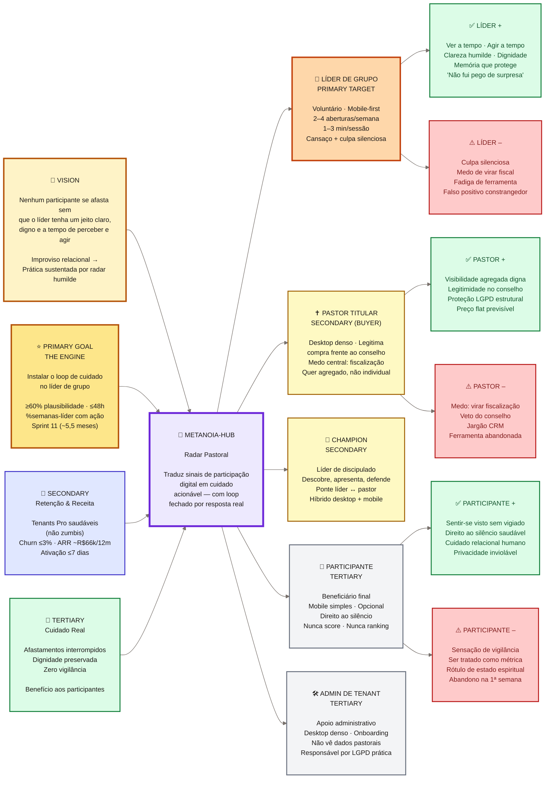

# 00 — Trigger Map (Hub)

**Projeto:** metanoia-hub · **Fase WDS:** Phase 2 — Trigger Mapping · **Última atualização:** 2026-04-11

> Documento-hub da Phase 2. Ponto de entrada único para navegar business goals, personas, driving forces, e implicações estratégicas. Baseado em Effect Mapping (Mijo Balic & Ingrid Domingues) adaptado por WDS.

---

## Diagrama: Business Goals → Platform → Target Groups → Driving Forces

---

## Summary: O que o trigger map diz

O metanoia-hub vence ou morre pela **primary persona** (líder de grupo). Se o líder age a tempo usando o radar, a engine gira: tenants renovam, pastores legitimam, participantes são cuidados, defensibilidade se institucionaliza. Se o líder não usa, nada mais acontece — mesmo com receita, o produto é zumbi.

A **tese de defensibilidade** é estrutural: **fechar o loop do cuidado pastoral a partir do líder de grupo usando um modelo conceitual próprio (C6)** que incumbentes (Planning Center, inChurch, ChMS brasileiros) não conseguem copiar sem canibalizar o próprio modelo de negócio.

O **risco existencial** não é concorrência — é a própria UX. Se qualquer tela fizer um participante se sentir vigiado, ou um líder se sentir fiscalizado, ou um pastor se sentir substituído, o princípio-raiz foi violado e o produto falhou mesmo com receita.

---

## Detailed Documentation Menu

### 📊 Business Strategy
- **[01-business-goals.md](./01-business-goals.md)** — Vision, positioning, 3 tiers de objectives, flywheel, success metrics, red flags
  - 🌟 **Primary:** Instalar loop de cuidado no líder (Sprint 11 · ≥60% plausibilidade)
  - 🚀 **Secondary:** Tenants Pro saudáveis · ativação ≤7d · defensibilidade
  - 🌱 **Tertiary:** Cuidado real a participantes · dignidade · zero vigilância
  - **Contra-métrica:** % igrejas Pro zumbis (crescente = fracasso)

### 👥 Target Users
- **[personas/02-primary-persona-lider-de-grupo.md](./personas/02-primary-persona-lider-de-grupo.md)** ⭐ — Líder voluntário, mobile-first, cenário-âncora "vencer a quarta de manhã"
- **[personas/03-secondary-persona-pastor-titular.md](./personas/03-secondary-persona-pastor-titular.md)** — Buyer, medo central de fiscalização, visão agregada
- **[personas/04-secondary-persona-champion.md](./personas/04-secondary-persona-champion.md)** — Líder de discipulado, ponte entre pastor e líderes
- **[personas/05-tertiary-persona-participante.md](./personas/05-tertiary-persona-participante.md)** — Beneficiário final, direito ao silêncio
- **[personas/06-tertiary-persona-admin-tenant.md](./personas/06-tertiary-persona-admin-tenant.md)** — Apoio administrativo, LGPD prática

### 🧠 Strategic Implications
- **[05-key-insights.md](./05-key-insights.md)** — Primary Development Focus, critical success factors, design implications por seção, emotional transformation goals
- **[06-feature-impact-analysis.md](./06-feature-impact-analysis.md)** — Features herdadas do PRD filtradas pelos princípios invioláveis

### 📋 Synthesis & Governance
- **[_synthesis-from-docs.md](./_synthesis-from-docs.md)** — Log do Step 13 (Content Init): origem, gaps, alignment check
- **Fonte canônica:** [../A-Product-Brief/project-brief.md](../A-Product-Brief/project-brief.md)
- **Design log:** [../_progress/00-design-log.md](../_progress/00-design-log.md)

---

## How to Read This Trigger Map

1. **Começa pela primary persona** (líder de grupo) — ela é o user crítico; decisões pastorais governam decisões comerciais.
2. **Cruza as driving forces negativas** contra cada proposta de feature — se uma feature aciona uma driving force negativa, ela viola um princípio inviolável e deve ser rejeitada ou redesenhada.
3. **Business goals estão hierarquizados** — Primary é engine; Secondary é driven-by-primary; Tertiary é real-world benefit.
4. **Pastor é buyer, champion é apresentador, líder é user crítico.** Os 3 papéis precisam estar alinhados para o produto vender e sobreviver.
5. **Princípios invioláveis (9)** não são preferências — são critérios de rejeição. Qualquer proposta que contradiga o princípio-raiz (*"Presença digital ≠ saúde espiritual"*) é rejeitada.

---

## Cross-Validation Check

| Check | Status |
|---|---|
| Primary persona explícita | ✅ Líder de grupo |
| Driving forces +/− para todas as personas | ✅ (líder, pastor, participante com + e −; champion com + e −; admin com + e −) |
| Business goals em 3 tiers | ✅ |
| Flywheel explica causalidade | ✅ |
| Mermaid diagram válido | ✅ |
| North stars canônicas | ✅ (produto + negócio + contra-métrica) |
| Red flags documentadas | ✅ |
| Princípios invioláveis como critério de rejeição | ✅ |
| Consistência com project-brief.md | ✅ |
| Linguagem pastoral (glossário banido respeitado) | ✅ |

---

**Próximo passo:** Phase 3 — UX Scenarios (C-UX-Scenarios/) — usando este trigger map como referência estratégica.
