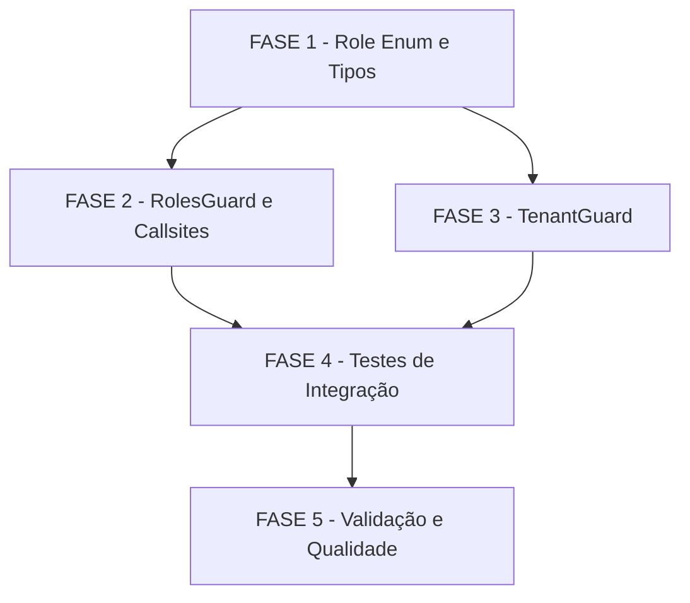

# Tarefas 2-4-tenant-guard - Autorização NestJS Residual

Escopo: Implementar o residual de autorização da Story 2-4: TenantGuard (Layer 3), Role enum canônico, Pino logging de rejeição em RolesGuard e TenantGuard, e testes de integração das 3 camadas.

**Legenda de status:**
- `[ ]` Pendente
- `[~]` Em andamento
- `[x]` Concluído
- `[!]` Bloqueado

**Legenda de criticidade:**
- `[C]` Crítico - Impacto financeiro direto ou bloqueante de segurança
- `[A]` Alto - Funcionalidade essencial
- `[M]` Médio - Necessário mas sem urgência imediata

---

## FASE 1 - Fundação: Role Enum e Tipos

### 1.1 Criar Role enum canônico `[C]`

Ref: spec.md §FR-02, plan.md §Task 1, data-model.md §Role

- [x] 1.1.1 Criar diretório `apps/api/src/auth/enums/`
- [x] 1.1.2 Criar `apps/api/src/auth/enums/role.enum.ts` com os 4 valores: `super_admin`, `admin_tenant`, `lider`, `participante`
- [x] 1.1.3 Garantir que os valores do enum correspondem exatamente às strings do claim `realm_roles` do Keycloak (case-sensitive)
- [x] 1.1.4 Escrever comentários JSDoc documentando a correspondência com Keycloak realm_roles
- [x] 1.1.5 Escrever testes unitários verificando os valores do enum (asserting `Role.SUPER_ADMIN === 'super_admin'` etc.)

### 1.2 Atualizar AuthenticatedUser para usar Role `[A]`

Ref: spec.md §FR-02, data-model.md §AuthenticatedUser, checklist CHK015

- [x] 1.2.1 Atualizar `apps/api/src/auth/interfaces/authenticated-user.interface.ts`: campo `roles` de `string[]` para `(Role | string)[]`
- [x] 1.2.2 Importar `Role` enum na interface
- [x] 1.2.3 Verificar que a mudança de tipo não quebra nenhum callsite existente que leia `user.roles` (TypeScript compile check)
- [x] 1.2.4 Confirmar backward-compatibility: string literal ainda é aceito no array (checklist CHK016)

### 1.3 Atualizar @Roles() decorator para Role | string `[A]`

Ref: spec.md §FR-02, plan.md §Task 2, research.md Decision 2, checklist CHK011

- [x] 1.3.1 Atualizar `apps/api/src/auth/decorators/roles.decorator.ts`: mudar assinatura de `(...roles: string[])` para `(...roles: (Role | string)[])`
- [x] 1.3.2 Garantir que o tipo de retorno de `SetMetadata` preserva a informação de tipo corretamente
- [x] 1.3.3 Verificar que callsites existentes com string literal ainda compilam sem erro

---

## FASE 2 - Refatoração: RolesGuard e Callsites

### 2.1 Adicionar Pino logging ao RolesGuard `[C]`

Ref: spec.md §FR-03, data-model.md §AuthRejectionLog, checklist CHK009, CHK020

- [x] 2.1.1 Adicionar `private readonly logger = new Logger(RolesGuard.name)` ao RolesGuard
- [x] 2.1.2 Emitir log estruturado no bloco de rejeição: `{ action: "auth.access.denied", user_id, endpoint, required_role }`
- [x] 2.1.3 Extrair `endpoint` do ExecutionContext: `"METHOD /path"` (HTTP method + URL)
- [x] 2.1.4 Tratar `user_id` indisponível com fallback `"unknown"` (não omitir o campo, não lançar exceção)
- [x] 2.1.5 Garantir que o log NÃO inclui JWT, request body ou email (checklist CHK009)
- [x] 2.1.6 Atualizar `apps/api/src/auth/__tests__/roles.guard.spec.ts` para assertar a chamada do logger em cada cenário de rejeição
- [x] 2.1.7 Adicionar teste para o caso `user_id` ausente → log emite `user_id: "unknown"` (checklist CHK020, Quickstart Scenario 6)

### 2.2 Migrar callsites canônicos de @Roles() para o enum `[A]`

Ref: spec.md §FR-06, plan.md §Source Code, checklist CHK011

- [x] 2.2.1 Migrar `apps/api/src/groups/groups.controller.ts`: `@Roles('admin_tenant')` → `@Roles(Role.ADMIN_TENANT)`
- [x] 2.2.2 Migrar `apps/api/src/group-members/group-members.controller.ts`: `@Roles('admin_tenant')` → `@Roles(Role.ADMIN_TENANT)`
- [x] 2.2.3 Migrar `apps/api/src/admin-invites/admin-invites.controller.ts`: `@Roles('admin_tenant')` → `@Roles(Role.ADMIN_TENANT)`
- [x] 2.2.4 Migrar `apps/api/src/admin-pastoral/admin-pastoral.controller.ts`: `@Roles('admin_tenant')` → `@Roles(Role.ADMIN_TENANT)`
- [x] 2.2.5 Migrar `apps/api/src/super-admin/super-admin-tenants.controller.ts`: `@Roles('super_admin')` → `@Roles(Role.SUPER_ADMIN)`
- [x] 2.2.6 Migrar `apps/api/src/admin-users/admin-users.controller.ts` (verificar roles presentes)
- [x] 2.2.7 Migrar `apps/api/src/meetings/reflections.controller.ts`: `@Roles('lider')` → `@Roles(Role.LIDER)`
- [x] 2.2.8 Adicionar comentário `// TODO: migrate to canonical Role enum when 'pastor'/'admin' are defined (Epic 11)` nos 5 callsites que usam `'pastor'` ou `'admin'` (meetings.controller.ts, reports/report.controller.ts, sse/attendance-live.controller.ts, telemetry/focus-heartbeat.controller.ts, pastoral/pastoral.controller.ts)
- [x] 2.2.9 Executar `tsc --noEmit` para confirmar zero erros de tipo após as migrações (checklist CHK013)

---

## FASE 3 - Implementação: TenantGuard

### 3.1 Criar TenantGuard `[C]`

Ref: spec.md §FR-01, data-model.md §TenantGuard, quickstart.md Scenarios 1-3, 9, checklist CHK007, CHK030

- [x] 3.1.1 Criar diretório `apps/api/src/auth/guards/` (se não existir)
- [x] 3.1.2 Criar `apps/api/src/auth/guards/tenant.guard.ts` implementando `CanActivate`
- [x] 3.1.3 Implementar verificação de `IS_PUBLIC_KEY` como primeira condição (bypass para endpoints @Public())
- [x] 3.1.4 Implementar fail-closed para `requestContext.getStore() === null/undefined`: lançar ForbiddenException(403), NUNCA retornar true (spec FR-01, OWASP MEDIUM-01, Quickstart Scenario 9)
- [x] 3.1.5 Implementar bypass para `user.roles.includes(Role.SUPER_ADMIN)` antes da comparação de tenantId (spec FR-01, Quickstart Scenario 2)
- [x] 3.1.6 Implementar comparação `user.tenantId === requestContext.getStore().tenantId` com ForbiddenException em caso de mismatch (spec FR-01)
- [x] 3.1.7 Implementar reject com 403 quando `request.user` está ausente (spec FR-01 edge case)
- [x] 3.1.8 Emitir log estruturado na rejeição: `{ action: "auth.access.denied", user_id, endpoint, tenant_mismatch: true }` — NÃO logar tenant UUIDs (spec FR-03, OWASP MEDIUM-02)
- [x] 3.1.9 Usar `private readonly logger = new Logger(TenantGuard.name)` seguindo o padrão do KeycloakAuthGuard

### 3.2 Registrar TenantGuard no AuthModule `[C]`

Ref: plan.md §auth.module.ts, checklist CHK030, plan.md §Task 7

- [x] 3.2.1 Adicionar `TenantGuard` ao array de `providers` do `apps/api/src/auth/auth.module.ts`
- [x] 3.2.2 Registrar `{ provide: APP_GUARD, useClass: TenantGuard }` **APÓS** os registros existentes de KeycloakAuthGuard e RolesGuard (ordem crítica: Keycloak → Roles → Tenant)
- [x] 3.2.3 Documentar a ordem dos APP_GUARDs com comentário inline: `// Order matters: KeycloakAuthGuard (JWT) → RolesGuard (roles) → TenantGuard (tenant isolation)`
- [x] 3.2.4 Verificar que `TenantGuard` está exportado do módulo se necessário para injeção em outros contextos

### 3.3 Escrever testes unitários do TenantGuard `[C]`

Ref: spec.md §FR-05, quickstart.md §Scenarios 1-3, 6, 9, checklist CHK017, CHK018, CHK021

- [x] 3.3.1 Criar `apps/api/src/auth/guards/tenant.guard.spec.ts` seguindo o padrão de `roles.guard.spec.ts`
- [x] 3.3.2 Teste: `admin_tenant` com tenant-A bloqueado ao acessar recurso de tenant-B → ForbiddenException (Scenario 1)
- [x] 3.3.3 Teste: `super_admin` com tenant-A permite acesso a recurso de tenant-B (bypass) → retorna true (Scenario 2)
- [x] 3.3.4 Teste: `lider` com tenant-A permite acesso a recurso de tenant-A → retorna true (Scenario 3)
- [x] 3.3.5 Teste: `user_id` ausente/vazio → log emite `user_id: "unknown"`, guard ainda rejeita se tenant mismatch (Scenario 6, checklist CHK020)
- [x] 3.3.6 Teste: `requestContext.getStore()` retorna `undefined` → ForbiddenException (fail-closed, Scenario 9, checklist CHK021)
- [x] 3.3.7 Teste: `request.user` ausente → ForbiddenException 403, não 500
- [x] 3.3.8 Teste: endpoint com `@Public()` → guard retorna true sem verificar tenant
- [x] 3.3.9 Teste: `roles=[]` (array vazio, nenhum role) → comportamento definido sem 500 (checklist CHK022)
- [x] 3.3.10 Assertar que tenant UUIDs NÃO aparecem na chamada do logger (checklist CHK010, OWASP MEDIUM-02)
- [x] 3.3.11 Assertar que `tenant_mismatch: true` aparece no log de rejeição

---

## FASE 4 - Testes de Integração das 3 Camadas

### 4.1 Criar auth-layers integration spec `[C]`

Ref: spec.md §FR-05, §P4, quickstart.md §Scenario 5, checklist CHK017, CHK018, CHK019

- [x] 4.1.1 Criar `apps/api/src/auth/__tests__/auth-layers.integration.spec.ts`
- [x] 4.1.2 Configurar NestJS `Test.createTestingModule` com os 3 guards na cadeia: `APP_GUARD: KeycloakAuthGuard`, `APP_GUARD: RolesGuard`, `APP_GUARD: TenantGuard`
- [x] 4.1.3 Criar controller de teste interno com endpoint protegido `@UseGuards(...)` + `@Roles(Role.ADMIN_TENANT)`
- [x] 4.1.4 Criar factory de usuário de teste que inclua `tenantId` obrigatoriamente (constitution Princípio VI)
- [x] 4.1.5 Teste (a): `super_admin` acessa endpoint de qualquer tenant → 200 (spec §FR-05-a, Quickstart Scenario 5)
- [x] 4.1.6 Teste (b): `admin_tenant` para tenant-A bloqueado em endpoint de tenant-B → 403 (spec §FR-05-b, Quickstart Scenario 5)
- [x] 4.1.7 Teste (c): `participante` bloqueado em endpoint que requer `admin_tenant` → 403 (spec §FR-05-c, Quickstart Scenario 4)
- [x] 4.1.8 Teste (d): `admin_tenant` para tenant-A aceito em endpoint de tenant-A → 200 (spec §FR-05-d)
- [x] 4.1.9 Assertar que resposta 403 tem body `{ statusCode: 403, error: "Forbidden", message: "..." }` sem campo `stack` (spec §FR-04, Quickstart Scenario 8)
- [x] 4.1.10 Assertar que JWT com `realm_roles=['super_admin']` resolve bypass de tenant (checklist CHK028, research.md Decision 5)

### 4.2 Validar testes existentes pós-refatoração `[A]`

Ref: spec.md §FR-06, §SC6, checklist CHK016

- [x] 4.2.1 Executar suite completa de `apps/api/src/auth/__tests__/roles.guard.spec.ts` e confirmar que todos os testes passam (spec SC6)
- [x] 4.2.2 Executar suite completa de `apps/api/src/auth/__tests__/keycloak.guard.spec.ts` e confirmar zero regressões
- [x] 4.2.3 Executar `pnpm --filter api test` e confirmar CI verde (spec SC7)

---

## FASE 5 - Validação e Qualidade

### 5.1 TypeScript e lint `[A]`

Ref: spec.md §SC3, §SC7, constitution Princípio II

- [x] 5.1.1 Executar `tsc --noEmit` na raiz de `apps/api/` e confirmar zero erros de tipo (spec SC3 — enum type safety)
- [x] 5.1.2 Executar `pnpm lint` e corrigir quaisquer erros de lint introduzidos
- [x] 5.1.3 Verificar que nenhum arquivo usa `@ts-ignore` ou `any` não-justificado nos arquivos novos/modificados

### 5.2 Verificação de segurança final `[C]`

Ref: spec.md §FR-01, §FR-03, checklist CHK006, OWASP MEDIUM-01, MEDIUM-02

- [x] 5.2.1 Revisar código do TenantGuard: confirmar que nenhum path retorna `true` quando `requestContext.getStore()` é `null/undefined` (OWASP MEDIUM-01)
- [x] 5.2.2 Revisar logs emitidos: confirmar que `expected_tenant` e `actual_tenant` UUIDs nunca aparecem nos logs (OWASP MEDIUM-02)
- [x] 5.2.3 Confirmar que os 5 callsites com `'pastor'`/`'admin'` têm comentário TODO com referência ao Epic 11 (checklist CHK006)
- [x] 5.2.4 Confirmar que a ordem dos APP_GUARDs no `auth.module.ts` está documentada com comentário inline (checklist CHK030)

### 5.3 Build final e commit `[A]`

Ref: spec.md §SC7, constitution Princípio VII

- [x] 5.3.1 Executar `pnpm --filter api build` e confirmar build sem erros
- [ ] 5.3.2 Confirmar que o branch segue a convenção `feat/story-2-4-tenant-guard`
- [ ] 5.3.3 Confirmar que commits seguem conventional commits em PT-BR (constitution Princípio VII)
- [ ] 5.3.4 Abrir PR com referência à Story 2-4 e à reconciliação WDS↔BMad (RECONCILIACAO-W1a1.md)

---

## Matriz de Dependências

---

## Resumo Quantitativo

| Fase | Tarefas | Subtarefas | Criticidade |
|------|---------|------------|-------------|
| 1 - Role Enum e Tipos | 3 | 14 | C, A, A |
| 2 - RolesGuard e Callsites | 2 | 18 | C, A |
| 3 - TenantGuard | 3 | 24 | C, C, C |
| 4 - Testes de Integração | 2 | 13 | C, A |
| 5 - Validação e Qualidade | 3 | 14 | A, C, A |
| **Total** | **13** | **83** | - |

---

## Escopo Coberto

| Item | Descrição | Fase |
|------|-----------|------|
| E01 | Role enum canônico (4 valores: super_admin, admin_tenant, lider, participante) | 1 |
| E02 | AuthenticatedUser.roles tipado como (Role \| string)[] | 1 |
| E03 | @Roles() decorator tipado como (Role \| string)[] | 1 |
| E04 | Pino logging estruturado de rejeição em RolesGuard | 2 |
| E05 | Migração de callsites canônicos de @Roles() para enum | 2 |
| E06 | TenantGuard com fail-closed, super_admin bypass e tenant_mismatch log | 3 |
| E07 | Registro do TenantGuard como APP_GUARD na ordem correta | 3 |
| E08 | Testes unitários do TenantGuard (9 cenários incluindo fail-closed) | 3 |
| E09 | Testes de integração das 3 camadas (4 cenários FR-05) | 4 |
| E10 | Validação de regressão dos testes existentes (RolesGuard, KeycloakAuthGuard) | 4 |

## Escopo Excluído

| Item | Descrição | Motivo |
|------|-----------|--------|
| X01 | GroupGuard (Layer 4 de groups) | Deferido para Epic 4 — Grupos (spec §Out of Scope) |
| X02 | Modificações no KeycloakAuthGuard | Layer 1 production-ready; fora de escopo (spec §Context) |
| X03 | Configuração do realm Keycloak | Infra ops, não código de aplicação (spec §Out of Scope) |
| X04 | LGPD/audit trail de rejeições no banco | Responsabilidade do bounded context `audit` (spec §Out of Scope) |
| X05 | Frontend error handling para 403 | Coberto por error boundaries existentes (spec §Out of Scope) |
| X06 | Migração dos callsites com 'pastor'/'admin' para enum | Roles fora do enum canônico; débito técnico para Epic 11 (research.md Decision 2, checklist CHK006) |
