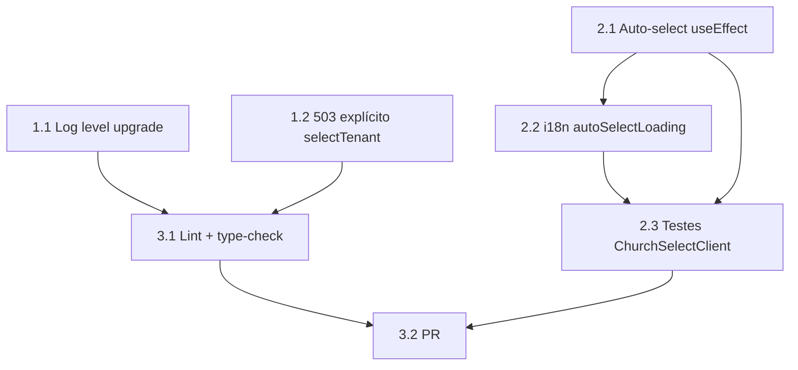

# Tarefas Tenant Selection Residual (Story 2-5)

Escopo: Fechar os 30% residuais da Story 2-5 pós-Cenário 08: (1) auto-select para usuário com um único tenant; (2) robustez Redis no guard e no service.

**Ref**: `docs/specs/2-5-tenant-select-residual/spec.md` + `plan.md`

**Legenda de status:**
- `[ ]` Pendente
- `[~]` Em andamento
- `[x]` Concluido
- `[!]` Bloqueado

**Legenda de criticidade:**
- `[C]` Critico - Impacto financeiro direto ou bloqueante
- `[A]` Alto - Funcionalidade essencial
- `[M]` Medio - Necessario mas sem urgencia imediata

---

## FASE 1 — Backend: Redis Resilience

### 1.1 Upgrade log level no guard Redis fallback `[A]`

Ref: spec.md FR-005, plan.md §Backend passo 1

- [x] 1.1.1 Em `KeycloakAuthGuard.resolveActiveTenant`, alterar `this.logger.warn(...)` para `this.logger.error(...)`
- [x] 1.1.2 Incluir `userId` e a mensagem do erro no log de fallback
- [x] 1.1.3 Adicionar comentário de política de resiliência (FR-008): JWT como fallback autoritativo, condições de ativação e trade-offs
- [x] 1.1.4 Escrever teste unitário: Redis throws → `logger.error` chamado com userId correto + guard retorna tenant do JWT
- [x] 1.1.5 Escrever teste unitário: Redis retorna `null` (chave ausente) → sem log de erro, retorna tenant do JWT (operação normal)

### 1.2 503 explícito quando Redis falha no selectTenant `[A]`

Ref: spec.md FR-007, plan.md §Backend passo 2

- [x] 1.2.1 Em `TenantSelectionService.selectTenant`, envolver `this.redis.set(...)` em try/catch
- [x] 1.2.2 No catch: `this.logger.error(...)` com userId + mensagem do erro
- [x] 1.2.3 No catch: lançar `ServiceUnavailableException('Cache unavailable; tenant selection failed')`
- [x] 1.2.4 Adicionar comentário de política: por que falha explícita (não silenciosa) é o comportamento correto
- [x] 1.2.5 Escrever teste unitário: `redis.set` throws → `selectTenant` rejeita com `ServiceUnavailableException`
- [x] 1.2.6 Escrever teste unitário: fluxo happy path inalterado (membership encontrada, Redis OK → retorna `{ tenantId }`)

---

## FASE 2 — Frontend: Auto-select para tenant único

### 2.1 Auto-select useEffect em ChurchSelectClient `[A]`

Ref: spec.md FR-001 a FR-004, plan.md §Frontend passo 3

- [x] 2.1.1 Importar `useRef` e `useEffect` em `church-select-client.tsx`
- [x] 2.1.2 Declarar `const hasFired = useRef<boolean>(false)` após os hooks existentes
- [x] 2.1.3 Adicionar `useEffect` que dispara `handleSelect(tenants[0].tenantId)` quando `myTenants.isSuccess && data.length === 1`, com guarda `hasFired.current`
- [x] 2.1.4 Garantir que `handleSelect` já reseta `setSelectingId` em `onError` (verificar comportamento de fallback — não alterar fluxo multi-tenant)
- [x] 2.1.5 Exibir indicador de loading durante auto-select em voo (`selectTenant.isPending && selectingId !== null && tenants.length === 1`)

### 2.2 i18n: chave para loading de auto-select `[M]`

Ref: plan.md §i18n

- [x] 2.2.1 Adicionar `"autoSelectLoading": "Entrando na sua igreja..."` em `apps/web/messages/pt-BR.json` sob a chave `churchSelect`
- [x] 2.2.2 Usar a nova chave no indicador de loading do auto-select (passo 2.1.5)
- [x] 2.2.3 Verificar que nenhuma outra chave existente sob `churchSelect` foi alterada

### 2.3 Testes unitários do ChurchSelectClient `[A]`

Ref: spec.md US1, quickstart.md Cenários 1–3

- [x] 2.3.1 Escrever teste: `myTenants.length === 1` → `selectTenant.mutate` chamado automaticamente + loading exibido
- [x] 2.3.2 Escrever teste: `myTenants.length > 1` → lista exibida, `selectTenant.mutate` NÃO chamado automaticamente
- [x] 2.3.3 Escrever teste: tenant único + `selectTenant` falha → tela de seleção renderizada, sem loop infinito (hasFired permanece true)
- [x] 2.3.4 Escrever teste: `useEffect` não dispara segundo `mutate` quando dependências re-renderizam (hasFired guard funciona)
- [x] 2.3.5 Verificar que testes existentes em `selecionar-igreja-page.spec.tsx` continuam verdes após as mudanças

---

## FASE 3 — Qualidade e CI

### 3.1 Lint e type-check `[M]`

Ref: constitution.md VI, CLAUDE.md §TypeScript

- [x] 3.1.1 Rodar `pnpm lint` na raiz e corrigir eventuais warnings/errors introduzidos
- [x] 3.1.2 Rodar `pnpm tsc --noEmit` nos pacotes afetados (`apps/api`, `apps/web`)
- [x] 3.1.3 Confirmar que nenhum `any` implícito foi introduzido nas mudanças

### 3.2 Revisão final e PR `[M]`

Ref: constitution.md VII

- [ ] 3.2.1 Criar branch `feat/story-2-5-tenant-select-residual` a partir de `dev`
- [ ] 3.2.2 Commit com mensagem convencional em PT-BR referenciando Story 2-5
- [ ] 3.2.3 Abrir PR apontando para `dev` com descrição dos dois entregáveis (auto-select + Redis resilience)
- [ ] 3.2.4 Verificar que CI (lint + test + build) fica verde

---

## Matriz de Dependências

---

## Resumo Quantitativo

| Fase | Tarefas | Subtarefas | Críticas | Altas | Médias |
|------|---------|------------|----------|-------|--------|
| FASE 1 — Backend Redis | 2 | 11 | 0 | 2 | 0 |
| FASE 2 — Frontend Auto-select | 3 | 14 | 0 | 2 | 1 |
| FASE 3 — Qualidade e CI | 2 | 7 | 0 | 0 | 2 |
| **Total** | **7** | **32** | **0** | **4** | **3** |

---

## Escopo Coberto

- Auto-select quando `myTenants.length === 1` no pós-login (AC#8–9)
- Upgrade do log level de `warn` para `error` no fallback Redis do guard (FR-005)
- 503 explícito quando Redis falha em `selectTenant` (FR-007)
- Comentário de política de resiliência co-localizado com o código (FR-008)
- Testes unitários para todos os caminhos alterados

## Escopo Excluído

- Indicador visual de plano expirado / acesso limitado (AC#13–15) — deferido para Epic 11
- Qualquer mudança no endpoint `my-tenants`, no modelo de memberships ou no fluxo de convites
- Token refresh / re-autenticação forçada — o fallback usa claims JWT existentes
- Novos schemas Zod — `packages/types` não sofre alterações
- Testes E2E Playwright — cobertos por futura story de estabilização
