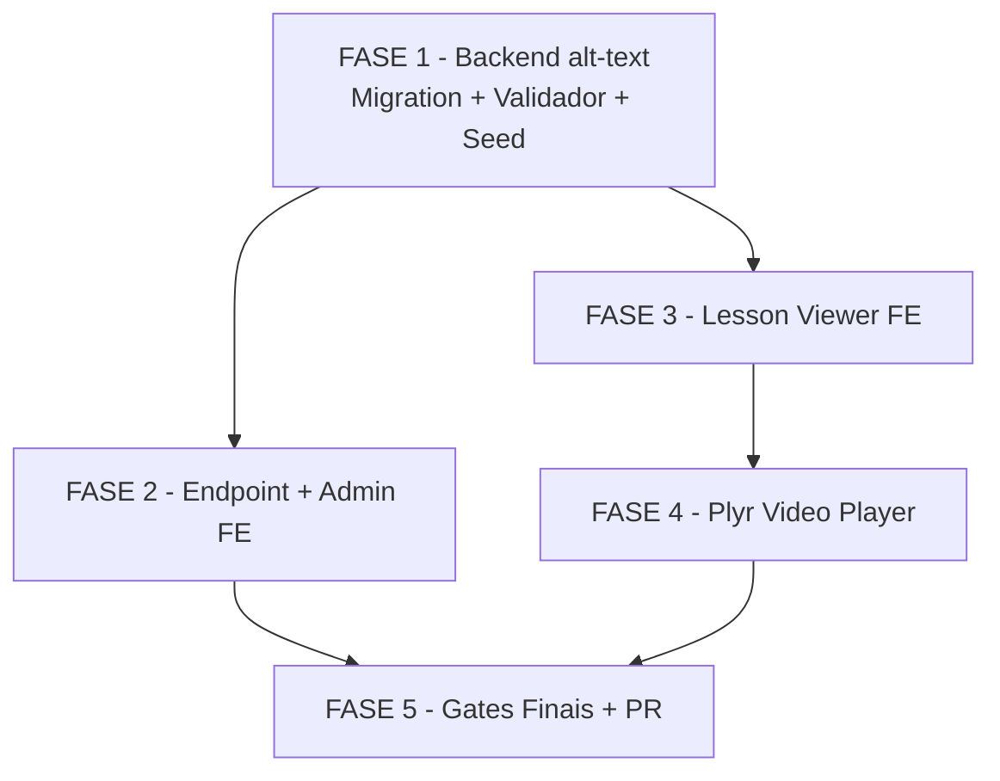

# Tasks — a11y-conteudo-multimidia (Story 15.5)

Escopo: Conteúdo Multimídia Acessível — migration alt-text + endpoint admin + lesson viewer + Plyr

**Legenda de status:**
- `[ ]` Pendente
- `[~]` Em andamento
- `[x]` Concluído
- `[!]` Bloqueado

**Legenda de criticidade:**
- `[C]` Crítico — bloqueia tudo; falha = PARE e reporte
- `[A]` Alto — funcionalidade essencial da feature
- `[M]` Médio — necessário mas sem urgência imediata

---

## FASE 1 — Backend alt-text (Migration + Validador + Seed)

> Isola o risco da migration. PARE se `db:migrate` falhar localmente.

### 1.1 Escrever migration SQL `[C]`

Ref: plan.md §3.1.1, spec FR-011, CA-006.1

- [ ] 1.1.1 Criar diretório `apps/api/prisma/migrations/20260625000000_15-5-alt-text-governance/`
- [ ] 1.1.2 Criar `migration.sql` com `ALTER TABLE "lessons" ADD COLUMN "has_missing_alt_text" BOOLEAN NOT NULL DEFAULT FALSE`
- [ ] 1.1.3 Adicionar `CREATE INDEX "lessons_tenant_id_has_missing_alt_text_idx" ON "lessons" ("tenant_id", "has_missing_alt_text")`

### 1.2 Atualizar schema Prisma — modelo Lesson `[C]`

Ref: plan.md §3.1.1, spec FR-011

- [ ] 1.2.1 Em `apps/api/prisma/schema.prisma` modelo `Lesson` (após `updatedAt`): adicionar `hasMissingAltText Boolean @default(false) @map("has_missing_alt_text")`

### 1.3 Executar migration localmente e validar Postgres `[C]`

Ref: spec CA-006.1, CA-006.2 — FRONTEIRA: apply em prod é responsabilidade manual do operador

- [ ] 1.3.1 Rodar `pnpm --filter @metanoia/api exec prisma migrate dev` (NÃO do root)
- [ ] 1.3.2 Confirmar: migration aplicada sem erro, índice criado
- [ ] 1.3.3 SE FALHAR: PARAR execução e reportar erro exato (não prosseguir com schema quebrado)

### 1.4 Criar `AltTextValidator` + spec `[A]`

Ref: plan.md §3.1.2, spec FR-012, CA-005.1-CA-005.3

- [ ] 1.4.1 Criar `apps/api/src/content/alt-text.validator.ts` com `AltTextValidator.hasInvalidImgs(html: string | null | undefined): boolean`
- [ ] 1.4.2 Criar `apps/api/src/content/alt-text.validator.spec.ts` com 3 cenários: `` → `true`; `` → `false`; `null` → `false`

### 1.5 Integrar `AltTextValidator` no `ContentService` `[A]`

Ref: spec FR-013, CA-005.1, CA-005.2

- [ ] 1.5.1 Em `apps/api/src/content/content.service.ts`, importar `AltTextValidator`
- [ ] 1.5.2 Em `createLesson`: calcular `hasMissingAltText: AltTextValidator.hasInvalidImgs(data.contentBody)` e incluir no upsert/create
- [ ] 1.5.3 Em `updateLesson`: mesma lógica no update (cobre CA-005.2: corrigir alt → flag=false)

### 1.6 Atualizar `LessonResponseSchema` em `packages/types` `[A]`

Ref: spec FR-011, CA-006.4

- [ ] 1.6.1 Em `packages/types/src/content/lesson.schema.ts`, adicionar `hasMissingAltText: z.boolean()` ao `LessonResponseSchema`
- [ ] 1.6.2 Garantir export via `packages/types/src/content/index.ts` e `packages/types/src/index.ts`

### 1.7 Adicionar seed demo `[M]`

Ref: spec FR-018, CA-004.5 — UUID v7 fixo, idempotente

- [ ] 1.7.1 Em `apps/api/prisma/seeds/demo-seed.ts`, adicionar 2 lessons com `contentBody` contendo `` (sem alt), UUID v7 fixo, `is_demo_data: true`
- [ ] 1.7.2 Usar `upsert` por `id` (idempotente); garantir `hasMissingAltText: true` setado

### 1.8 Rodar RLS test 2× `[C]`

Ref: spec FR-020, CA-006.3 — lição Epics 13/14: idempotente, rodar SEMPRE 2 vezes

- [ ] 1.8.1 Rodar `pnpm --filter @metanoia/api exec jest test/rls/lessons-rls` (1ª vez)
- [ ] 1.8.2 Rodar novamente (2ª vez — confirmar idempotência)
- [ ] 1.8.3 Ambas as execuções devem passar

### 1.9 Rodar testes API + types `[A]`

Ref: spec CA-005.4, CA-005.5, CA-006.4

- [ ] 1.9.1 `pnpm --filter @metanoia/api test` — todos os testes passam (incluindo `alt-text.validator.spec.ts` e `content.service.spec.ts`)
- [ ] 1.9.2 `pnpm --filter @metanoia/types test` — schema Zod sem quebra

---

## FASE 2 — Endpoint Admin + Admin FE

> Zero acoplamento com FASE 3/4. Boot real da API obrigatório ao final (lição Epic 14).

### 2.1 Criar schema Zod `accessibility.schema.ts` `[A]`

Ref: plan.md §3.1.3, spec FR-014, FR-015

- [ ] 2.1.1 Criar `packages/types/src/content/accessibility.schema.ts` com `LessonAccessibilityGapSchema` (lessonId, lessonName, moduleName, trailName, tenantId)
- [ ] 2.1.2 Adicionar `AccessibilityGapsResponseSchema` (data + meta: total/page/pageSize)
- [ ] 2.1.3 Exportar via `packages/types/src/content/index.ts` e `packages/types/src/index.ts`

### 2.2 Criar `AdminAccessibilityRepository` `[A]`

Ref: plan.md §3.1.3, spec NFR-S3, CA-004.3

- [ ] 2.2.1 Criar `apps/api/src/admin-accessibility/admin-accessibility.repository.ts`
- [ ] 2.2.2 Query Prisma: `lessons WHERE has_missing_alt_text = true` com JOINs para `module.name` e `trail.name`; `tenant_id` via `RequestContext` (AsyncLocalStorage — nunca como parâmetro)
- [ ] 2.2.3 Retornar `{ items: LessonAccessibilityGap[], total: number }` com paginação offset

### 2.3 Criar `AdminAccessibilityService` `[A]`

Ref: plan.md §3.1.3, spec FR-015

- [ ] 2.3.1 Criar `apps/api/src/admin-accessibility/admin-accessibility.service.ts`
- [ ] 2.3.2 Método `listGaps(page: number, pageSize: number)` → chama repository e retorna `{ data, meta: { total, page, pageSize } }`

### 2.4 Criar `AdminAccessibilityController` `[A]`

Ref: plan.md §3.1.3, spec FR-014, NFR-S1, NFR-S2, CA-004.1, CA-004.2

- [ ] 2.4.1 Criar `apps/api/src/admin-accessibility/admin-accessibility.controller.ts`
- [ ] 2.4.2 `GET /api/v1/admin/accessibility-gaps` com `@UseGuards(KeycloakAuthGuard, RolesGuard)` + `@Roles(Role.ADMIN_TENANT)`
- [ ] 2.4.3 Query params: `page` (int, default 1) + `pageSize` (int, default 20) — validados via `ZodValidationPipe`
- [ ] 2.4.4 Swagger: `@ApiTags('admin')`, `@ApiOperation({ summary: 'List lessons with missing alt-text' })`

### 2.5 Criar `AdminAccessibilityModule` + registrar em `app.module.ts` `[C]`

Ref: plan.md §3.1.3, spec FR-014 — lição Epic 14: onModuleInit quebra boot se módulo mal registrado

- [ ] 2.5.1 Criar `apps/api/src/admin-accessibility/admin-accessibility.module.ts` (imports: PrismaModule ou ContentModule)
- [ ] 2.5.2 Importar `AdminAccessibilityModule` em `apps/api/src/app.module.ts`

### 2.6 `pnpm turbo build` (api+web) — TypeScript + onModuleInit `[A]`

Ref: spec CA-001.5, CA-006.5, lição Epic 14

- [ ] 2.6.1 Rodar `pnpm turbo build --filter=@metanoia/api --filter=@metanoia/web --force`
- [ ] 2.6.2 Confirmar: zero erros TypeScript, build passa

### 2.7 Boot real da API — `start:e2e` + `/api/health` `[C]`

Ref: spec FR-019, lição Epic 14 — onModuleInit do novo controller DEVE subir sem erro

- [ ] 2.7.1 Iniciar API em modo e2e: `pnpm --filter @metanoia/api start:e2e &` (aguardar ~15s)
- [ ] 2.7.2 `curl -f http://localhost:3001/api/health` — resposta 200
- [ ] 2.7.3 Parar processo da API; SE FALHAR: PARAR e reportar

### 2.8 Criar hook `useAccessibilityGaps` `[A]`

Ref: plan.md §3.1.4, spec FR-016

- [ ] 2.8.1 Criar `apps/web/src/lib/api/hooks/use-accessibility-gaps.ts` (TanStack Query `useQuery`)
- [ ] 2.8.2 Props: `page`, `pageSize`; retorna `{ data, meta, isLoading, isError }`

### 2.9 Criar `AccessibilityGapsList` Client Component `[A]`

Ref: plan.md §3.1.4, spec FR-016, NFR-A4, NFR-A7

- [ ] 2.9.1 Criar `apps/web/app/(authenticated)/app/admin/accessibility-gaps/_components/accessibility-gaps-list.tsx`
- [ ] 2.9.2 Tabela (colunas: Aula, Módulo, Trilha) com estado de loading e empty state
- [ ] 2.9.3 `aria-label` na tabela; `scope="col"` nos `<th>`; links descritivos

### 2.10 Criar página `/app/admin/accessibility-gaps/page.tsx` `[A]`

Ref: plan.md §3.1.4, spec FR-016, CA-004.4

- [ ] 2.10.1 Criar `apps/web/app/(authenticated)/app/admin/accessibility-gaps/page.tsx` (Server Component shell)
- [ ] 2.10.2 Verificar role via session (redirect se não ADMIN_TENANT)
- [ ] 2.10.3 Renderizar `<h1>` com texto PT-BR + `<AccessibilityGapsList />`

### 2.11 Adicionar textos PT-BR `[A]`

Ref: plan.md §3.1.4, spec FR-017

- [ ] 2.11.1 Em `apps/web/messages/pt-BR.json`, adicionar `admin.accessibilityGaps.*`: title, description, empty, columns.lesson, columns.module, columns.trail, loading, error

---

## FASE 3 — Lesson Viewer FE

> Cria a rota de aula órfã. Zero dependência com FASE 4 (Plyr — stub temporário até 4.3).

### 3.1 Criar `page.tsx` (Server Component) `[A]`

Ref: plan.md §3.2, spec FR-001, FR-003, CA-001.1, CA-001.2

- [ ] 3.1.1 Criar `apps/web/app/(authenticated)/app/consumo/trilhas/[trailId]/aulas/[lessonId]/page.tsx`
- [ ] 3.1.2 Busca dados da aula via `fetch` nativo (não TanStack Query — CLAUDE.md)
- [ ] 3.1.3 Busca `nextLesson` (próxima por ordem no módulo) se existir
- [ ] 3.1.4 `<h1>` = nome da aula (único na página); passa dados como props para `<LessonViewer>`

### 3.2 Criar `lesson-viewer.tsx` (Client Component) `[A]`

Ref: plan.md §3.2, spec FR-002, FR-009, FR-010, CA-003.1–CA-003.4

- [ ] 3.2.1 Criar `apps/web/app/(authenticated)/app/consumo/trilhas/[trailId]/aulas/[lessonId]/lesson-viewer.tsx`
- [ ] 3.2.2 Switch por `contentType`: `video` → stub `<video>` (substituído na FASE 4); `rich_text` → renderiza HTML com `<h2>` para seções; `pdf_doc` → link com `aria-label="Abrir documento: {nome}"`; `external_link` → link + ícone `aria-hidden="true" focusable="false"`
- [ ] 3.2.3 Imagens em `rich_text`: fallback `alt="Imagem sem descrição"` se `alt` vazio/ausente

### 3.3 Implementar `LessonNavigationButton` `[A]`

Ref: plan.md §3.2, spec FR-004, CA-001.3, CA-001.4, NFR-A6, NFR-A7

- [ ] 3.3.1 Botão com textos: `nextLesson` no módulo → "Próxima aula"; fim do módulo → "Próximo módulo"; fim da trilha → "Concluir trilha"
- [ ] 3.3.2 `aria-label` descritivo; `focus-visible:ring-2` visível; `motion-safe:transition-*` em animações

### 3.4 Ligar `nextModuleButtonRef` entre VideoPlayer e botão `[A]`

Ref: spec FR-004, CA-001.4 — reutiliza padrão já implementado em 15.4

- [ ] 3.4.1 Criar `ref` em `lesson-viewer.tsx` e passar para stub VideoPlayer (via `nextModuleButtonRef`) e para `LessonNavigationButton`
- [ ] 3.4.2 `onVideoEnded`: mover foco para `nextModuleButtonRef.current` se presente

### 3.5 A11y check da página de aula `[A]`

Ref: spec NFR-A4, NFR-A6, NFR-A7, NFR-A8, lições 15.1–15.4

- [ ] 3.5.1 Confirmar: `<h1>` único; headings de `rich_text` começam em `<h2>`; links com `aria-label`; ícones `aria-hidden`
- [ ] 3.5.2 Confirmar: nenhum `transition-*`/`animate-*` sem `motion-safe:`
- [ ] 3.5.3 `aria-label` apenas em elementos interativos (não em `
`/`` genérico)

### 3.6 Criar `lesson-viewer.spec.tsx` `[A]`

Ref: spec NFR-T1, CA-001.1–CA-001.4, CA-003.1–CA-003.4

- [ ] 3.6.1 Testa 4 contentTypes (renderiza sem erro)
- [ ] 3.6.2 Testa botão de navegação (Próxima aula / Próximo módulo / Concluir)
- [ ] 3.6.3 Testa a11y básico: h1 presente, aria-label no link pdf/externo, ícone aria-hidden

### 3.7 Rodar `pnpm --filter @metanoia/web test` `[A]`

Ref: spec CA-001.5

- [ ] 3.7.1 `pnpm --filter @metanoia/web test` — todos os testes web passam incluindo `lesson-viewer.spec.tsx`

---

## FASE 4 — Plyr Video Player

> Substitui stub da FASE 3. Lição: importar Plyr com `dynamic import { ssr: false }`.

### 4.1 Instalar Plyr `[A]`

Ref: plan.md §3.3, spec FR-005, NFR-P1

- [ ] 4.1.1 `pnpm --filter @metanoia/web add plyr`
- [ ] 4.1.2 Confirmar: `plyr` em `apps/web/package.json` dependencies

### 4.2 Importar CSS do Plyr no layout global autenticado `[A]`

Ref: plan.md §3.3 dec-013, spec FR-007

- [ ] 4.2.1 Em `apps/web/app/(authenticated)/layout.tsx`, adicionar `import 'plyr/dist/plyr.css';`

### 4.3 Criar `plyr-video-player.tsx` + substituir stub `[A]`

Ref: plan.md §3.3, spec FR-005, FR-006, FR-008, CA-002.1–CA-002.4

- [ ] 4.3.1 Criar `apps/web/src/components/content/plyr-video-player.tsx`; props: `signedUrl`, `title?`, `onVideoEnded?`, `nextModuleButtonRef?`, `className?`
- [ ] 4.3.2 Importar Plyr via `dynamic(() => import('plyr'), { ssr: false })` (evita crash SSR — risco do plan.md §8)
- [ ] 4.3.3 i18n PT-BR via opções Plyr: play/pause/mute/unmute/volume/fullscreen/exitFullscreen/seek/forward/rewind
- [ ] 4.3.4 `role="slider"` + `aria-valuenow` fornecidos nativamente pelo Plyr — NÃO adicionar markup manual (CA-002.2)
- [ ] 4.3.5 Painel de atalhos (tecla "?"): `<dialog>` com `<table>` acessível, controlado por estado React
- [ ] 4.3.6 `onVideoEnded`: mover foco para `nextModuleButtonRef.current` se presente
- [ ] 4.3.7 Integrar `use-video-progress.ts` via `player.elements.container?.querySelector('video')` (spec FR-008)
- [ ] 4.3.8 Substituir stub em `lesson-viewer.tsx`: `video` → `<PlyrVideoPlayer ...>`

### 4.4 Criar `plyr-video-player.spec.tsx` `[A]`

Ref: spec NFR-T1, CA-002.1–CA-002.5

- [ ] 4.4.1 Mock do Plyr (vitest `vi.mock`)
- [ ] 4.4.2 Testa renderização com `signedUrl`
- [ ] 4.4.3 Testa abertura do painel de atalhos (tecla "?")
- [ ] 4.4.4 Testa que `onVideoEnded` é chamado ao fim do vídeo

### 4.5 Confirmar lições a11y no Plyr `[A]`

Ref: spec NFR-A7, NFR-A8, NFR-A6, lições 15.1–15.4

- [ ] 4.5.1 `aria-label` nos controles interativos (botões do painel), não em `
` genérico
- [ ] 4.5.2 Ícones do Plyr (quando customizados): `aria-hidden="true"`
- [ ] 4.5.3 `motion-safe:` em qualquer `transition-*` customizado no wrapper

### 4.6 Rodar `pnpm --filter @metanoia/web test` `[A]`

Ref: spec CA-002.5

- [ ] 4.6.1 Todos os testes web passam incluindo `plyr-video-player.spec.tsx`

---

## FASE 5 — Gates Finais + Commit/PR

> Todos os gates devem estar verdes antes do PR. Usar `--force` para invalidar cache Turborepo.

### 5.1 `pnpm turbo lint` — zero erros `[A]`

Ref: CLAUDE.md, spec transversal

- [ ] 5.1.1 `pnpm turbo lint --force`
- [ ] 5.1.2 Zero erros e zero warnings de lint

### 5.2 `pnpm turbo build` final (api+web) `[A]`

Ref: spec CA-001.5, CA-006.5

- [ ] 5.2.1 `pnpm turbo build --filter=@metanoia/api --filter=@metanoia/web --force`
- [ ] 5.2.2 Zero erros TypeScript; build sem regressão crítica de bundle

### 5.3 Testes completos (api + web + types) `[A]`

Ref: spec NFR-T1, CA-005.4, CA-005.5

- [ ] 5.3.1 `pnpm --filter @metanoia/api test` — todos os testes API passam
- [ ] 5.3.2 `pnpm --filter @metanoia/web test` — todos os testes web passam
- [ ] 5.3.3 `pnpm --filter @metanoia/types test` — Zod schemas sem quebra

### 5.4 3 Gates a11y hard (todos os novos componentes) `[A]`

Ref: spec NFR-A4–NFR-A8, lições 15.1–15.4 — re-rodar após CADA className adicionado

- [ ] 5.4.1 Gate focus-ring: grep por `focus-visible` em todos os novos arquivos — todo elemento interativo tem focus-ring
- [ ] 5.4.2 Gate motion-safe: grep por `transition-\|animate-` nos novos arquivos — todos prefixados com `motion-safe:`
- [ ] 5.4.3 Gate contrast: revisar visualmente as cores nos novos componentes (Tailwind padrão ≥ 4.5:1)

### 5.5 axe-core Playwright nas novas rotas `[A]`

Ref: spec CA-003.5 — gate axe permanente do CI (Epic 12/15)

- [ ] 5.5.1 `pnpm --filter @metanoia/web exec playwright test axe` (ou gate axe existente)
- [ ] 5.5.2 Zero violations `serious`/`critical` em `/app/consumo/trilhas/.../aulas/...` e `/app/admin/accessibility-gaps`

### 5.6 Criar `manual-test-checklist.md` `[M]`

Ref: spec §8 LIMITE HONESTO — gate humano para Plyr + AT

- [ ] 5.6.1 Criar `docs/specs/a11y-conteudo-multimidia/manual-test-checklist.md` com roteiro: Plyr teclado (Space/←/→/M/F), painel "?"; lesson viewer (4 contentTypes, h1, botão navegação, foco pós-vídeo); admin gaps (tabela com seed, empty state, 403 para PARTICIPANT)

### 5.7 Commit por fase + PR para dev `[A]`

Ref: CLAUDE.md git workflow, regra inegociável: NÃO commitar `next-env.d.ts`

- [ ] 5.7.1 Confirmar que `next-env.d.ts` NÃO está staged
- [ ] 5.7.2 Criar commit(s) por fase com mensagem convencional em português
- [ ] 5.7.3 Push e abrir PR para branch `dev`

---

## Matriz de Dependências

## Resumo Quantitativo

| Fase | Tarefas | Subtarefas | Criticidade máxima |
|------|---------|------------|-------------------|
| 1 — Backend alt-text | 9 | 18 | [C] |
| 2 — Endpoint + Admin FE | 11 | 21 | [C] |
| 3 — Lesson Viewer FE | 7 | 14 | [A] |
| 4 — Plyr Video Player | 6 | 11 | [A] |
| 5 — Gates Finais + PR | 7 | 10 | [A] |
| **Total** | **40** | **74** | — |

## Escopo Coberto

| Item | Descrição | Fase |
|------|-----------|------|
| migration | Campo `has_missing_alt_text` + índice em `lessons` | 1 |
| validator | `AltTextValidator.hasInvalidImgs()` + integração ContentService | 1 |
| rls-test | RLS test 2× (idempotente) | 1 |
| seed | 2 aulas demo com img sem alt (UUID v7, idempotente) | 1 |
| endpoint | `GET /api/v1/admin/accessibility-gaps` com guard ADMIN_TENANT | 2 |
| admin-fe | Página `/app/admin/accessibility-gaps` + hook TanStack Query | 2 |
| lesson-viewer | Rota Next.js + switch 4 contentTypes + botão navegação | 3 |
| plyr | Wrapper Plyr + i18n PT-BR + painel atalhos + foco pós-vídeo | 4 |
| gates | lint + build + tests + RLS 2× + boot+health + 3 gates a11y + axe-core | 5 |
| manual-checklist | Roteiro de teste manual para AT-gate humano | 5 |

## Escopo Excluído

| Item | Descrição | Motivo |
|------|-----------|--------|
| screen-reader | Screen reader testing com AT real (NVDA/VoiceOver/Orca) | Limite honesto: requer hardware/ambiente AT dedicado |
| captions | Closed captions / legendas Plyr | Sem assets .vtt; fora do escopo desta story |
| video-player-migration | Migrar `video-player.tsx` órfão para Plyr fora do lesson viewer | Arquivo está órfão; migration limitada ao lesson viewer |
| legacy-alt-fix | Retroativamente corrigir alt-text em conteúdo legado | Flag apenas sinaliza; correção é tarefa do admin/líder |
| alt-editor | Interface de edição inline de alt-text | Fora do escopo; requer UX dedicada |
| prod-apply | Apply da migration em produção | Responsabilidade manual do operador (FRONTEIRA INEGOCIÁVEL) |
