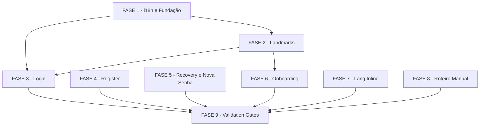

# Tarefas a11y-screen-reader-auth — Screen Reader: Autenticação, Navegação & Landmarks

Escopo: Implementar suporte a screen reader (VoiceOver/NVDA/JAWS) nos fluxos de autenticação pública e onboarding. Exclusivamente frontend — sem alterações de backend, sem novas rotas, sem novos schemas Zod. 8 lacunas ARIA/semântica + roteiro manual de teste.

**Legenda de status:**
- `[ ]` Pendente
- `[~]` Em andamento
- `[x]` Concluído
- `[!]` Bloqueado

**Legenda de criticidade:**
- `[C]` Crítico — Impacto financeiro direto ou bloqueante
- `[A]` Alto — Funcionalidade essencial
- `[M]` Médio — Necessário mas sem urgência imediata

---

## FASE 1 — i18n e Fundação

### 1.1 Corrigir typos em pt-BR.json `[A]`

Ref: Spec §3.2 LAC-06, Spec §4 AC-8, Plan §LAC-06

- [ ] 1.1.1 Corrigir linha 15: `"invalidEmail": "E-mail invalido"` → `"E-mail inválido"` (seção `register.errors`)
- [ ] 1.1.2 Corrigir linha 684: `"hidePassword": "Esconder senha"` → `"Ocultar senha"` (seção `newPassword`)
- [ ] 1.1.3 Verificar que nenhuma outra chave pt-BR.json usa "Esconder" para ações de UI (grep por "Esconder")
- [ ] 1.1.4 Rodar `pnpm --filter @metanoia/web test` para confirmar que testes de i18n continuam verdes

---

## FASE 2 — Landmarks (Layout público e onboarding)

### 2.1 Adicionar landmarks ao layout público `[A]`

Ref: Spec §3.2 LAC-01, Spec §4 AC-1, Plan §LAC-01, Research D1

- [ ] 2.1.1 Abrir `apps/web/app/(public)/layout.tsx` e envolver `<main id="conteudo">` com `<header>` e `<footer>` HTML5 semânticos no nível raiz
- [ ] 2.1.2 Verificar que `<header>` e `<footer>` não contêm role explícito desnecessário (`role="banner"` e `role="contentinfo"` são implícitos no HTML5)
- [ ] 2.1.3 Confirmar que `id="conteudo"` permanece no `<main>` para o skip-nav existente (href="#conteudo")
- [ ] 2.1.4 Inspecionar DOM renderizado das páginas `/login`, `/register`, `/recuperar-senha` com axe DevTools ou inspeção manual para confirmar landmarks presentes

### 2.2 Adicionar landmarks ao layout onboarding `[A]`

Ref: Spec §3.2 LAC-01, Spec §3.2 LAC-05, Spec §4 AC-1, Plan §LAC-01 + §LAC-05

- [ ] 2.2.1 Abrir `apps/web/app/(onboarding)/layout.tsx` e adicionar `"use client"` no topo (necessário para dynamic() + AsyncAnnouncerProvider)
- [ ] 2.2.2 Importar `AsyncAnnouncerProvider` de `@/components/a11y/async-announcer`
- [ ] 2.2.3 Importar `FocusManager` via `dynamic(() => import("@/app/(authenticated)/_components/focus-manager"), { ssr: false })`
- [ ] 2.2.4 Adicionar `<header>` e `<footer>` envolvendo o `<main id="conteudo">`, com `AsyncAnnouncerProvider` e `FocusManager` dentro do `AppQueryProvider`
- [ ] 2.2.5 Verificar que `id="conteudo"` permanece no `<main>` do onboarding
- [ ] 2.2.6 Testar localmente navegando entre `/convite/[token]`, `/convite/[token]/termos` e `/convite/[token]/criar-conta` e confirmar que o foco move para o `h1` de cada etapa

---

## FASE 3 — Login (aria-labelledby + toggle canônico)

### 3.1 Adicionar aria-labelledby ao formulário de login `[A]`

Ref: Spec §3.2 LAC-02, Spec §4 AC-2, Plan §LAC-02, Research D2

- [ ] 3.1.1 Em `apps/web/app/(public)/login/_components/login-form.tsx`, adicionar `id="login-form-heading"` ao `<h1>` existente (linha ~85)
- [ ] 3.1.2 Adicionar `aria-labelledby="login-form-heading"` ao `<form>` (linha ~87)
- [ ] 3.1.3 Verificar no DOM que o `<form>` referencia o id correto via inspeção de atributos

### 3.2 Substituir toggle inline de senha pelo componente canônico `[A]`

Ref: Spec §3.2 LAC-03, Spec §4 AC-3, Spec §SC-4, Plan §LAC-03, Research D3, Checklist CHK029

- [ ] 3.2.1 **PRÉ-CONDIÇÃO — CHK029**: Inspecionar `apps/web/app/(public)/login/__tests__/login.spec.tsx` e `__tests__/login-forgot-link.spec.tsx` para mapear todos os seletores que referenciam `data-testid="login-toggle-password"` ou o botão de toggle inline
- [ ] 3.2.2 Remover `useState<boolean>('showPassword')` do login-form.tsx (o PasswordInputWithToggle gerencia internamente)
- [ ] 3.2.3 Remover o bloco `
 <Input type={showPassword}/> <button ...>🙈/👁</button> 
` do campo senha
- [ ] 3.2.4 Importar `PasswordInputWithToggle` de `@/components/forms` e substituir o bloco removido
- [ ] 3.2.5 Passar `toggleShowLabel={messages.newPassword.showPassword}` e `toggleHideLabel={messages.newPassword.hidePassword}` (que após 1.1.2 será "Ocultar senha")
- [ ] 3.2.6 Preservar `aria-invalid`, `aria-describedby`, `id="login-password"`, `autoComplete="current-password"`, `required` como props do `PasswordInputWithToggle`
- [ ] 3.2.7 Atualizar seletores nos testes em `__tests__/login.spec.tsx` se o `data-testid="login-toggle-password"` quebrou (o componente PasswordInputWithToggle pode precisar receber o data-testid via prop ou o seletor deve ser ajustado)
- [ ] 3.2.8 Rodar `pnpm --filter @metanoia/web test` para confirmar que todos os testes de login continuam verdes

---

## FASE 4 — Register (aria-label + aria-live)

### 4.1 Melhorar acessibilidade do formulário de registro `[A]`

Ref: Spec §3.2 LAC-04, Spec §4 AC-4, Spec §SC-7, Plan §LAC-04, Research D4+D8, Clarify C3

- [ ] 4.1.1 Em `apps/web/app/(public)/register/_components/register-form.tsx`, adicionar `aria-label="Formulário de cadastro"` ao `<form>` (AC-4, SC-7)
- [ ] 4.1.2 Para cada campo com erro inline (name, email, password, confirmPassword), envolver o container de erro com `
` estático no DOM (sempre presente, vazio quando sem erro)
- [ ] 4.1.3 Mover o `
` para dentro do container `aria-live` correspondente, mantendo `role="alert"` se desejado ou removendo (o `aria-live` do container já garante o anúncio)
- [ ] 4.1.4 Repetir o padrão para os campos email-error, password-error, confirm-password-error
- [ ] 4.1.5 Confirmar que o `role="status"` no estado de sucesso já existente (register-form.tsx:90) permanece intacto
- [ ] 4.1.6 Rodar `pnpm --filter @metanoia/web test` para confirmar que `__tests__/register.spec.tsx` continua verde

---

## FASE 5 — Recovery e Nova Senha

### 5.1 Corrigir acessibilidade da recuperação de senha `[A]`

Ref: Spec §3.2 LAC-08, Spec §4 AC-5, Plan §LAC-08, Research D7

- [ ] 5.1.1 Em `apps/web/app/(public)/recuperar-senha/_components/recovery-form.tsx`, adicionar `role="status"` ao `<Card>` do estado "sent" (confirmação de envio)
- [ ] 5.1.2 Adicionar `aria-label="Formulário de recuperação de senha"` ao `<form>` no estado "idle"
- [ ] 5.1.3 Verificar que erros de servidor (`setServerError`) usam `role="alert"` (assertive) — confirmar no DOM
- [ ] 5.1.4 Rodar `pnpm --filter @metanoia/web test` para confirmar que `__tests__/recovery-form.spec.tsx` continua verde (se existir)

### 5.2 Corrigir acessibilidade da nova senha `[A]`

Ref: Spec §3.2 LAC-08, Spec §4 AC-5, Plan §LAC-08, Research D7

- [ ] 5.2.1 Em `apps/web/app/(public)/nova-senha/[token]/_components/reset-password-form.tsx`, adicionar `id="reset-form-heading"` ao `<h1>` nos estados válidos
- [ ] 5.2.2 Adicionar `aria-labelledby="reset-form-heading"` ao `<form>`
- [ ] 5.2.3 Verificar que os estados de `tokenState === 'expired'` e `tokenState === 'used'` têm `<h1>` informativo (já existe — apenas confirmar)
- [ ] 5.2.4 Verificar que erros de servidor têm `role="alert"` — adicionar se ausente
- [ ] 5.2.5 Rodar `pnpm --filter @metanoia/web test` para confirmar que `__tests__/reset-password-form.spec.tsx` continua verde

---

## FASE 6 — Onboarding (aria-live nas transições de etapa)

### 6.1 Adicionar anúncios de transição de etapa no onboarding `[M]`

Ref: Spec §3.2 LAC-05, Spec §4 AC-6, Plan §LAC-05, Research D5, Clarify C2

- [ ] 6.1.1 Confirmar que o `FocusManager` adicionado em 2.2.3 está ativo e funcional nas 3 rotas de onboarding (verificar se cada página tem `h1` para o fallback chain do hook)
- [ ] 6.1.2 Verificar que `welcome-view.tsx` tem `<h1>` acessível para o FocusManager (já existe "Bem-vindo ao metanoia-hub")
- [ ] 6.1.3 Verificar que `terms-page-content.tsx` tem `<h1>` acessível (identificar ou adicionar)
- [ ] 6.1.4 Verificar que `create-account-form.tsx` tem `<h1>` acessível no contexto da página criar-conta
- [ ] 6.1.5 Testar navegação entre etapas e confirmar que foco move corretamente via inspeção com acessibilidade de navegador (ax DevTools ou inspeção manual)

---

## FASE 7 — Lang Inline

### 7.1 Adicionar lang="en" para termos estrangeiros `[M]`

Ref: Spec §3.2 LAC-07, Spec §4 AC-7, Spec §Clarifications C1, Plan §LAC-07, Research D6

- [ ] 7.1.1 Buscar ocorrências literais de "onboarding" como texto renderizado em JSX em `apps/web/src/` e `packages/ui/` (excluir comentários e nomes de variáveis): `grep -rn '"onboarding"' --include="*.tsx" apps/web/src packages/ui/components`
- [ ] 7.1.2 Buscar ocorrências de "Dashboard" como texto JSX renderizado (não como rota ou variável)
- [ ] 7.1.3 Buscar ocorrências de "check-in" como texto JSX renderizado
- [ ] 7.1.4 Para cada ocorrência encontrada, envolver com `{termo}` ou equivalente
- [ ] 7.1.5 NÃO aplicar em: comentários, nomes de variáveis/funções, chaves de pt-BR.json, nomes de rotas
- [ ] 7.1.6 Rodar `pnpm turbo lint` para confirmar que o `` não introduz violação de linting

---

## FASE 8 — Roteiro Manual (Gate Humano)

### 8.1 Criar manual-test-checklist.md `[A]`

Ref: Spec §4 AC-9, Spec §6 Limite Honesto

- [ ] 8.1.1 Criar `docs/specs/a11y-screen-reader-auth/manual-test-checklist.md` com seção de aviso explícito "Gate humano pendente — NÃO marcar como DONE sem execução manual"
- [ ] 8.1.2 Documentar roteiro para VoiceOver (macOS/Safari): navegação por landmarks, formulário login, toggle senha, erros, register, recovery, onboarding
- [ ] 8.1.3 Documentar roteiro para NVDA (Windows/Chrome): mesmos fluxos com atalhos específicos do NVDA (H para headings, R para regions, Tab para interativos)
- [ ] 8.1.4 Documentar roteiro para JAWS (Windows/Chrome): mesmos fluxos com atalhos específicos do JAWS
- [ ] 8.1.5 Incluir seção "Resultados" com tabela de fluxo × screen reader para o humano preencher (passou/falhou/parcial)
- [ ] 8.1.6 Incluir seção de critérios de aprovação: todos os fluxos críticos devem passar em ≥2 dos 3 screen readers

---

## FASE 9 — Validation Gates

### 9.1 Executar gates de qualidade pré-done `[A]`

Ref: Spec §8 Validation Gates, Spec §5 SC-1

- [ ] 9.1.1 Executar `pnpm turbo lint` (monorepo inteiro, sem --filter) e resolver qualquer erro introduzido
- [ ] 9.1.2 Executar `pnpm --filter @metanoia/web test` e confirmar zero falhas
- [ ] 9.1.3 Executar `pnpm turbo build --filter=@metanoia/web` e confirmar build sem erros de TypeScript
- [ ] 9.1.4 Executar `bash scripts/check-focus-ring-variants.sh --ci` e confirmar saída verde
- [ ] 9.1.5 Executar `node apps/web/scripts/check-contrast-tokens.mjs` e confirmar saída verde
- [ ] 9.1.6 Executar `bash scripts/check-motion-safe.sh --ci` e confirmar saída verde
- [ ] 9.1.7 Executar `pnpm --filter @metanoia/ui test` (pacotes/ui foram tocados? Se Sidebar/BottomTabs não foram alterados, este gate é N/A)
- [ ] 9.1.8 Fazer commit local com mensagem convencional PT-BR descrevendo as mudanças da story 15.1

---

## Matriz de Dependências

---

## Resumo Quantitativo

| Fase | Tarefas | Subtarefas | Criticidade dominante |
|------|---------|------------|-----------------------|
| 1 — i18n e Fundação | 1 | 4 | [A] |
| 2 — Landmarks | 2 | 10 | [A] |
| 3 — Login | 2 | 11 | [A] |
| 4 — Register | 1 | 6 | [A] |
| 5 — Recovery e Nova Senha | 2 | 9 | [A] |
| 6 — Onboarding | 1 | 5 | [M] |
| 7 — Lang Inline | 1 | 6 | [M] |
| 8 — Roteiro Manual | 1 | 6 | [A] |
| 9 — Validation Gates | 1 | 8 | [A] |
| **Total** | **12** | **65** | — |

---

## Escopo Coberto

| Item | Descrição | Fase |
|------|-----------|------|
| LAC-01 | Landmarks (header/main/footer) em layouts público e onboarding | 2 |
| LAC-02 | aria-labelledby no formulário de login | 3 |
| LAC-03 | Toggle de senha canônico com aria-pressed em login | 3 |
| LAC-04 | aria-label + aria-live nos erros inline do register | 4 |
| LAC-05 | FocusManager + AsyncAnnouncerProvider no onboarding | 2+6 |
| LAC-06 | Typos pt-BR.json (Esconder→Ocultar, invalido→inválido) | 1 |
| LAC-07 | lang="en" inline para termos estrangeiros em texto renderizado | 7 |
| LAC-08 | role="status" no sucesso de recovery/nova-senha | 5 |
| AC-9 | Roteiro manual VoiceOver/NVDA/JAWS | 8 |
| Validation gates | Lint + testes + build + scripts a11y hard | 9 |

---

## Escopo Excluído

| Item | Descrição | Motivo |
|------|-----------|--------|
| `<title>` dinâmico por tenant | Título pré-auth com nome do tenant | SC-6: requer infra de tenant-branding; escopo da feature `branding-tenant` |
| Step indicator ARIA multi-etapa no register | AC original mencionava multi-step | SC-7: register é single-page hoje; aria-label no form é substituto |
| Breadcrumbs ARIA | Não existem na codebase | Escopo de 15.4 |
| Páginas autenticadas | aria-live por conteúdo dinâmico (Radar, grupos...) | Escopo de 15.2 |
| Promoção ratchet | Adicionar páginas ao a11y-pages.json | SC-2: escopo de 15.2/15.4 |
| Onboarding no ratchet | /convite/[token]/* no a11y-pages.json | SC-3: não adicionar nesta story |
| Teste real com screen readers | Execução manual com VoiceOver/NVDA/JAWS | SC: não executável no ambiente; entregue como roteiro humano (AC-9) |
| Mudanças em apps/api/ | Qualquer mudança de backend | SC-5: story exclusivamente frontend |
| Sidebar/BottomTabs | Componentes packages/ui de navegação | Já têm aria-label correto; sem lacunas identificadas |
