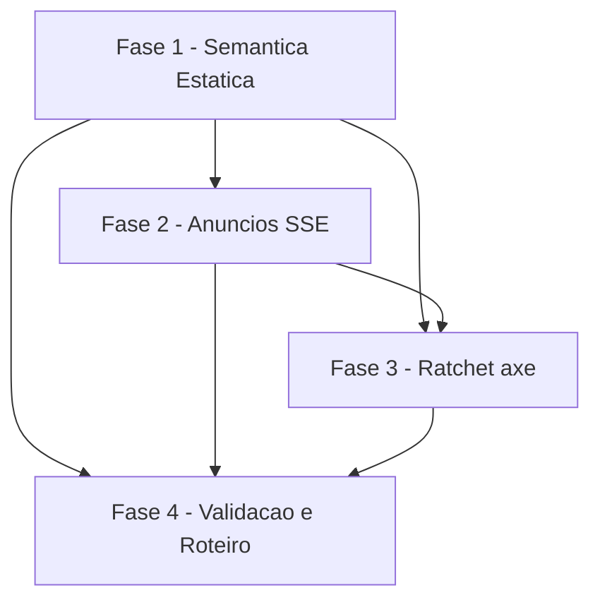

# Tarefas metanoia-hub - Screen Reader Dashboard Líder & Radar Pastoral (Story 15.2)

Escopo: Adicionar semântica de screen reader (VoiceOver/NVDA/JAWS) ao Radar Pastoral — status textual nos cards de participante, `aria-controls` em cards expansíveis, `aria-live` para mudanças SSE com debounce/silenciar, grace period de reconexão, title dinâmico — e promover o ratchet axe das páginas para hard. Story de FE/a11y pura, sem backend.

**Legenda de status:**
- `[ ]` Pendente
- `[~]` Em andamento
- `[x]` Concluido
- `[!]` Bloqueado

**Legenda de criticidade:**
- `[C]` Critico - Impacto financeiro direto ou bloqueante
- `[A]` Alto - Funcionalidade essencial
- `[M]` Medio - Necessario mas sem urgencia imediata

---

## FASE 1 - Semântica Estática do Radar (cards, title, filtro)

### 1.1 Status textual no ParticipantCard (semáforo não cor-only) `[A]`

Ref: spec AC-1, RF-01; clarify C1 (dec-009), C2 (dec-008)

- [x] 1.1.1 Criar mapa `STATUS_LABEL: Record<SignalType, string>` (care-urgent="Urgente", care-attention="Atenção necessária", care-ok="Bem") — em const local ou `pt-BR.json`
- [x] 1.1.2 Adicionar `aria-label="{name} — {status}"` no elemento raiz `
` de `ParticipantCardExpanded`
- [x] 1.1.3 Adicionar `aria-label="{name} — {status}"` no `<Link>` raiz de `ParticipantCardMedium` (garantir que nome+status+ação fiquem no label, pois aria-label oculta filhos para AT)
- [x] 1.1.4 Verificar que não há regressão de `aria-labelledby` interno (grep confirmou ausência) e que axe não acusa label duplicado

### 1.2 `aria-controls` no ParticipantCardCompact `[M]`

Ref: spec AC-2, RF-02

- [x] 1.2.1 Gerar `panelId` via `useId()` no `ParticipantCardCompact`
- [x] 1.2.2 Adicionar `aria-controls={panelId}` ao `<button>` que tem `aria-expanded`
- [x] 1.2.3 Adicionar `id={panelId}` ao `<ul>` do painel expandido

### 1.3 Title dinâmico da página do Radar `[M]`

Ref: spec AC-4, RF-08; clarify C5 (dec-012)

- [x] 1.3.1 Resolver `groupName` a partir de `selectedGroupId` + `data.groups` em `radar/page.tsx`
- [x] 1.3.2 `useEffect` que seta `document.title = groupName ? "Radar Pastoral — {groupName}" : "Radar Pastoral"` nas dependências `[selectedGroupId, data]`
- [x] 1.3.3 Garantir que não roda no SSR (page é `"use client"`); cleanup opcional ao desmontar

### 1.4 Anúncio de contagem pós-filtro `[M]`

Ref: spec AC-3, RF-03

- [x] 1.4.1 Adicionar região `aria-live="polite"` (sr-only) na `radar/page.tsx`
- [x] 1.4.2 Computar texto "{n} participantes visíveis" / "Nenhum participante nessa categoria" a partir de `counts`/`activePill`/`selectedGroupId`
- [x] 1.4.3 Suprimir anúncio no primeiro render (montagem) para não anunciar no load

---

## FASE 2 - Anúncios SSE em Tempo Real (debounce, silenciar, reconexão)

### 2.1 Hook useParticipantStatusAnnouncer `[A]`

Ref: spec AC-5, RF-04, RF-05; clarify C3 (dec-010)

- [x] 2.1.1 Criar `use-participant-status-announcer.ts` co-located no dir do radar
- [x] 2.1.2 Manter `useRef` do snapshot anterior (`Map<participantId, signalType>`)
- [x] 2.1.3 Detectar deltas de signalType; acumular dentro de janela de debounce 3s (resetar timer a cada novo delta)
- [x] 2.1.4 Ao disparar: 1 mudança → `announce("{name} — {status}")`; 2+ → `announce("{n} participantes atualizados")`
- [x] 2.1.5 Integrar `useNotificationSilence` — se `silenced`, no-op (0 announce) e `aria-live="off"` na região associada
- [x] 2.1.6 Consumir hook em `radar/page.tsx` passando `participants` + `silenced`

### 2.2 Grace period de 5s na reconexão SSE `[A]`

Ref: spec AC-6, RF-06, RF-07

- [x] 2.2.1 Em `use-notification-stream.ts`, adicionar ref `isPostReconnect` ativado por 5s ao transicionar `reconnecting → connected`
- [x] 2.2.2 Durante a janela de 5s, suprimir announces individuais do gap-fill (sem regredir o gap-fill paginado CHK021/055)
- [x] 2.2.3 Ao expirar a janela, contar deltas e emitir 1 anúncio "Conexão restaurada. {n} participantes atualizados."
- [x] 2.2.4 Confirmar que o indicador visual (`ConnectionStatus`) some ao voltar a `connected` (já existente — só validar)

---

## FASE 3 - Ratchet axe & Teste Anti-Redirect

### 3.1 Promover páginas baseline → hard `[A]`

Ref: spec AC-7, RF-09

- [!] 3.1.1 Rodar axe local nas 2 páginas e CONFIRMAR 0 violações ANTES de promover — BLOQUEADO: stack E2E não disponível neste ambiente (dec-023); executar em PR após CI verde
- [ ] 3.1.2 Em `a11y-pages.json` (raiz), trocar `"gate": "baseline"` → `"gate": "hard"` em `dashboard-lider`
- [ ] 3.1.3 Em `a11y-pages.json`, trocar `"gate": "baseline"` → `"gate": "hard"` em `radar-pastoral`

### 3.2 Asserção anti-redirect no axe spec `[A]`

Ref: spec AC-7; clarify C4 (dec-011)

- [x] 3.2.1 No bloco `[axe:hard]` de `axe-quality-gate.e2e-spec.ts`, após `goto`, antes de `analyze()`, assertar que URL não contém `/login`
- [x] 3.2.2 Assertar presença de landmark/conteúdo autenticado real (ex: h1 esperado) antes do scan
- [x] 3.2.3 Garantir que a asserção é genérica (data-driven, vale para todas as páginas autenticadas hard)

---

## FASE 4 - Validação & Roteiro Manual

### 4.1 Validation gates (project-context + lição 15.1) `[C]`

Ref: docs/project-context.md; lição Epic 15.1

- [x] 4.1.1 `pnpm turbo lint` verde (re-rodar com `--force` após mudanças de className)
- [x] 4.1.2 `pnpm --filter @metanoia/web test` verde (952 testes passados)
- [x] 4.1.3 `pnpm turbo build --filter=@metanoia/web` verde
- [x] 4.1.4 `bash scripts/check-focus-ring-variants.sh --ci` verde
- [x] 4.1.5 `node apps/web/scripts/check-contrast-tokens.mjs` verde (0 falhas HARD)
- [x] 4.1.6 `bash scripts/check-motion-safe.sh --ci` verde (0 findings)

### 4.2 Auditoria de specs E2E (anti-regressão lição 15.1) `[A]`

Ref: lição Epic 15.1 (custou 3 ciclos de CI)

- [x] 4.2.1 Auditar `apps/web/e2e/keyboard/*` e `apps/web/e2e/a11y/*` que assumem `data-testid`/touch-target/`:active` nos cards alterados — nenhum spec referencia data-testid nos participant-cards; sem risco de regressão
- [ ] 4.2.2 Rodar specs E2E relevantes localmente (SSE specs mockam EventSource — sem livekit) — pendente: requer stack E2E ativo
- [x] 4.2.3 Adicionar/ajustar testes unit para o hook de anúncio (5 mudanças em 2s → 1 anúncio; silenciar → 0 anúncios) — 5 testes em use-participant-status-announcer.spec.ts, todos verdes

### 4.3 Roteiro manual de screen reader `[A]`

Ref: spec RF-10; LIMITE HONESTO (sem VoiceOver/NVDA/JAWS no ambiente)

- [x] 4.3.1 Criar `manual-test-checklist.md` com cenários: navegação Radar, expansão de cards, filtros
- [x] 4.3.2 Incluir cenários SSE: 5 mudanças em 2s → 1 anúncio batched; desconexão→reconexão 5s; toggle silenciar → aria-live off
- [x] 4.3.3 Marcar como gate humano pendente (VoiceOver/NVDA/JAWS) antes do release

---

## Matriz de Dependencias

## Resumo Quantitativo

| Fase | Tarefas | Subtarefas | Criticidade |
|------|---------|------------|-------------|
| 1 - Semântica Estática | 4 | 13 | A/M |
| 2 - Anúncios SSE | 2 | 10 | A |
| 3 - Ratchet axe | 2 | 6 | A |
| 4 - Validação & Roteiro | 3 | 12 | C/A |
| **Total** | **11** | **41** | - |

## Escopo Coberto

| Item | Descricao | Fase |
|------|-----------|------|
| AC-1 | Status do semáforo anunciado por texto, não por cor | 1.1 |
| AC-2 | `aria-controls` funcional no card compacto | 1.2 |
| AC-3 | Filtro anuncia contagem de resultado | 1.4 |
| AC-4 | Title dinâmico "Radar Pastoral — {groupName}" | 1.3 |
| AC-5 | Mudanças SSE anunciadas com debounce 3s + silenciar | 2.1 |
| AC-6 | Reconexão SSE com grace period 5s + anúncio | 2.2 |
| AC-7 | Ratchet hard + asserção anti-redirect | 3.1, 3.2 |
| NFR | Validation gates + roteiro manual screen reader | 4.1, 4.2, 4.3 |

## Escopo Excluido

| Item | Descricao | Motivo |
|------|-----------|--------|
| EX-1 | Busca full-text de participantes | Feature não existe; só semântica no filtro existente (§8.2) |
| EX-2 | Semáforo visual ícone+texto | Trabalho da Story 15.3 (Semáforo Multimodal) |
| EX-3 | Tabelas `<caption>/<th scope>` | Sem `<table>` real no Radar; timeline usa `<ul>/<li>` (§8.3) |
| EX-4 | Dashboard admin (summary cards) | Já cobertos (role=status + aria-label); fora do fluxo líder |
| EX-5 | Teste real VoiceOver/NVDA/JAWS | Não automatizável; entregue como roteiro manual (gate humano) |
| EX-6 | Reimplementar SemaforoPill/GrupoPillFilter | Já têm role/aria-pressed/radiogroup (descoberta no clarify) |
