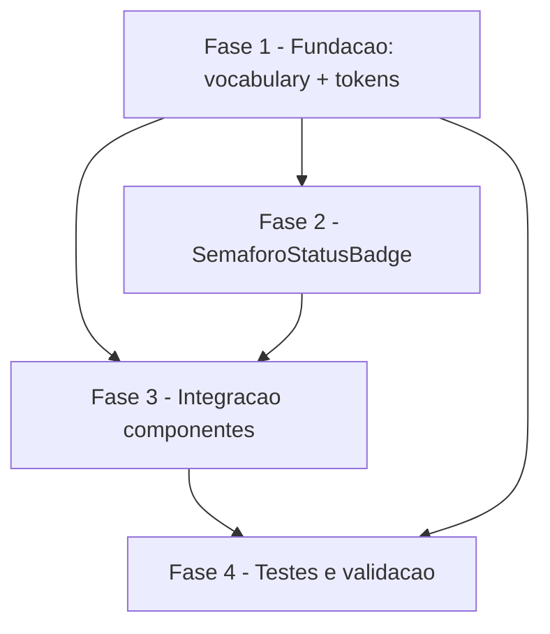

# Tarefas metanoia-hub - Semáforo Multimodal (Story 15.3)

Escopo: Tornar o semáforo de cuidado pastoral multimodal (cor + ícone Lucide + texto visível) com ARIA correto, animação de pulso respeitando prefers-reduced-motion, modo compacto e dark mode validado por color2k. Componentes em escopo: SemaforoPill, ParticipantCard (3 variantes), SemaforoBadge (relatório admin). GroupCard/status-indicator fora de escopo (follow-up).

**Legenda de status:**
- `[ ]` Pendente
- `[~]` Em andamento
- `[x]` Concluido
- `[!]` Bloqueado

**Legenda de criticidade:**
- `[C]` Critico - Impacto financeiro direto ou bloqueante
- `[A]` Alto - Funcionalidade essencial
- `[M]` Medio - Necessario mas sem urgencia imediata

---

## FASE 1 - Fundação: vocabulário e tokens

### 1.1 Centralizar SIGNAL_STATUS_LABELS em packages/types `[A]`

Ref: spec FR-014, dec-005, data-model.md

- [ ] 1.1.1 Adicionar `SIGNAL_STATUS_LABELS: Record<SignalType, string>` em `packages/types/src/vocabulary/vocabulary.ts` com valores idênticos aos atuais (care-urgent:"Urgente", care-attention:"Atenção necessária", care-ok:"Bem")
- [ ] 1.1.2 Adicionar `signalStatusLabels` ao mapa `PASTORAL_VOCABULARY` e exportar o tipo
- [ ] 1.1.3 Re-exportar via `packages/types/src/vocabulary/index.ts` e `packages/types/src/index.ts`
- [ ] 1.1.4 Atualizar snapshot Zod (`vocabulary.snapshot.spec.ts`) via `pnpm --filter @metanoia/types test -u` e validar verde
- [ ] 1.1.5 Build `packages/types` (gerar dist) para os consumers FE enxergarem o export

### 1.2 Validar tokens care-* de contraste (color2k) `[A]`

Ref: spec FR-011/FR-012, research D6, plan.md "Teste color2k"

- [ ] 1.2.1 Sondar empiricamente com `color2k` getContrast cada par status×tema vs surface correspondente (light: #fafaf8/#ffffff; dark: #1a1a1a/#2a2a2a)
- [ ] 1.2.2 Determinar o alvo correto por par (3:1 non-text); documentar quais pares passam como preenchimento e quais exigem cor só no ícone/borda + texto em token AA

---

## FASE 2 - Componente canônico SemaforoStatusBadge

### 2.1 Criar SemaforoStatusBadge `[C]`

Ref: spec FR-001/002/003/004/005/009/010, data-model.md, plan.md, modelo risk-reason-badge.tsx

- [ ] 2.1.1 Criar `apps/web/app/(authenticated)/app/gestao/radar/_components/semaforo-status-badge.tsx` (Client Component) com props signalType/participantName/compact/animatePulse
- [ ] 2.1.2 Mapear ícone Lucide por estado (AlertCircle/AlertTriangle/CheckCircle2) com `aria-hidden="true"` + `focusable="false"`
- [ ] 2.1.3 Renderizar texto visível via SIGNAL_STATUS_LABELS (cor via `text-care-*`); modo compacto abrevia texto mas mantém aria-label completo (nunca `title`)
- [ ] 2.1.4 Implementar aria-label contextual quando participantName presente, com texto interno aria-hidden (evita duplo-anúncio, dec-007)
- [ ] 2.1.5 Modo compacto: ícone com dimensão mínima 16×16px (size-4)

### 2.2 Animação de pulso multimodal `[A]`

Ref: spec FR-006/FR-007, dec-006, research D4

- [ ] 2.2.1 Definir `@keyframes pulse-border` em globals.css (ou Tailwind) com duração 1s ease-out
- [ ] 2.2.2 Aplicar classe `motion-safe:animate-[pulse-border_1s_ease-out]` quando `animatePulse=true`
- [ ] 2.2.3 Garantir `motion-reduce` → apenas `transition-opacity duration-150` (sem pulso); rodar `check-motion-safe.sh --ci`

---

## FASE 3 - Integração nos componentes em escopo

### 3.1 ParticipantCard: substituir sr-only por badge visível `[C]`

Ref: spec FR-002/FR-005/FR-008, dec-007, participant-card.tsx (3 variantes)

- [ ] 3.1.1 Substituir `{STATUS_LABEL}` por `<SemaforoStatusBadge>` visível nas 3 variantes (Expanded/Medium/Compact)
- [ ] 3.1.2 Importar label de `@metanoia/types` (SIGNAL_STATUS_LABELS), remover STATUS_LABEL local
- [ ] 3.1.3 Detectar delta de status reutilizando `useParticipantStatusAnnouncer` e setar `animatePulse` por 1s via useState+setTimeout
- [ ] 3.1.4 Validar que não há duplo-anúncio ao AT (texto visível como fonte única)

### 3.2 SemaforoPill: adicionar ícone Lucide `[A]`

Ref: spec FR-001/FR-004, semaforo-pill.tsx

- [ ] 3.2.1 Adicionar ícone Lucide (aria-hidden, focusable=false) ao lado da contagem por estado, mantendo SEMAFORO_STATUS_LABELS (rótulos de seção) e role=switch
- [ ] 3.2.2 Validar que o aria-label do botão permanece "{label}: {count}" sem duplicar com o ícone

### 3.3 SemaforoBadge admin: Unicode → Lucide `[A]`

Ref: spec FR-015, semaforo-badge.tsx (admin/igreja/relatorio)

- [ ] 3.3.1 Substituir símbolos Unicode (●▲■) por ícones Lucide (CheckCircle2/AlertTriangle/AlertCircle) com aria-hidden + focusable=false
- [ ] 3.3.2 Preservar `data-testid={semaforo-${status}}` e mapeamento verde/amarelo/vermelho; manter teste existente verde

### 3.4 Importar SIGNAL_STATUS_LABELS no announcer `[A]`

Ref: spec FR-014, use-participant-status-announcer.ts

- [ ] 3.4.1 Substituir STATUS_LABEL local por import de SIGNAL_STATUS_LABELS de `@metanoia/types`
- [ ] 3.4.2 Rodar teste 15.2 e confirmar `"João — Urgente"` ainda verde

---

## FASE 4 - Testes e validação

### 4.1 Teste color2k de contraste `[C]`

Ref: spec FR-011/SC-003, research D6

- [ ] 4.1.1 Criar teste co-localizado validando os 6 pares (3 status × 2 temas) ≥ 3:1 com `color2k` getContrast
- [ ] 4.1.2 Garantir que o teste falha se qualquer par cair abaixo do alvo; rodar sem flake

### 4.2 Specs unitários do componente `[A]`

Ref: spec SC-001/SC-004

- [ ] 4.2.1 Spec do SemaforoStatusBadge: 3 estados × ícone correto × texto visível × aria-hidden no ícone × aria-label compacto
- [ ] 4.2.2 Rodar `pnpm --filter @metanoia/web test` e `pnpm --filter @metanoia/types test`; 0 regressões na 15.2

### 4.3 Gates de a11y e build `[C]`

Ref: spec SC-005/SC-006, plan.md validation gates

- [ ] 4.3.1 Rodar `check-motion-safe.sh --ci`, `check-contrast-tokens.mjs`, `check-focus-ring-variants.sh --ci` — todos verdes após CADA mudança de className
- [ ] 4.3.2 `pnpm turbo lint --force` e `pnpm turbo build --filter=@metanoia/web` verdes
- [ ] 4.3.3 Auditar specs E2E em `e2e/keyboard/*` e `e2e/a11y/*` que assumam data-testid/touch-target nos elementos tocados; ajustar se necessário

### 4.4 manual-test-checklist.md `[A]`

Ref: spec SC-007, research D8

- [ ] 4.4.1 Criar `docs/specs/a11y-semaforo-multimodal/manual-test-checklist.md` cobrindo: daltonismo (ícone+texto distinguem sem cor), prefers-reduced-motion, dark mode, navegação por leitor de tela
- [ ] 4.4.2 Anotar gate humano pendente (screen reader real + visual regression não rodam neste ambiente)

---

## Matriz de Dependencias

## Resumo Quantitativo

| Fase | Tarefas | Subtarefas | Criticidade |
|------|---------|------------|-------------|
| 1 - Fundação | 2 | 7 | A |
| 2 - SemaforoStatusBadge | 2 | 8 | C |
| 3 - Integração | 4 | 9 | C |
| 4 - Testes e validação | 4 | 9 | C |
| **Total** | **12** | **33** | - |

## Escopo Coberto

| Item | Descricao | Fase |
|------|-----------|------|
| SIGNAL_STATUS_LABELS | Fonte única de rótulos por-participante em packages/types | 1 |
| SemaforoStatusBadge | Componente canônico cor+ícone+texto+ARIA+pulso+compacto | 2 |
| ParticipantCard | sr-only → badge visível (3 variantes) | 3 |
| SemaforoPill | + ícone Lucide | 3 |
| SemaforoBadge admin | Unicode → Lucide | 3 |
| useParticipantStatusAnnouncer | import label centralizado | 3 |
| Teste color2k | 6 pares ≥ 3:1 | 4 |
| Gates a11y + build | motion-safe, contraste, focus-ring, lint, build | 4 |
| manual-test-checklist | daltonismo, reduced-motion, dark, screen reader | 4 |

## Escopo Excluido

| Item | Descricao | Motivo |
|------|-----------|--------|
| GroupCard/status-indicator | Vista admin/igreja usa PastoralStatus (healthy/attention/call/no-signal) ≠ SignalType e tokens emerald/amber/red | Reconciliar tipo+tokens é refactor amplo, fora do escopo da 15.3; follow-up técnico documentado |
| Screen reader real (VoiceOver/NVDA) | Validação com tecnologia assistiva real | Ambiente não roda AT real; entregue como manual-test-checklist + gate humano |
| Visual regression real | Screenshot comparison 3 estados × 2 temas × 2 sizes | Ambiente não roda visual regression; gate humano pendente |
| StatusSummaryCard | Dashboard summary card | Já possui dot+texto+aria-label (role=status); não usa Unicode nem é crítico para color-only; avaliar como melhoria futura |
