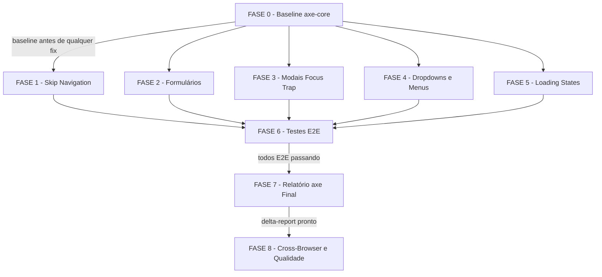

# Backlog de Tarefas: a11y-teclado-publico — Keyboard Navigation Public Flows

Escopo: Implementação de navegação por teclado nos fluxos públicos (skip-nav, login, registro,
modais, dropdowns, skeletons) + testes E2E Playwright + relatório axe-core. Story 12.1, Epic 12.

**Legenda de status:**
- `[ ]` Pendente
- `[~]` Em andamento
- `[x]` Concluído
- `[!]` Bloqueado

**Legenda de criticidade:**
- `[C]` Crítico — impacto regulatório/WCAG compliance obrigatório
- `[A]` Alto — funcionalidade core sem a qual o fluxo não opera
- `[M]` Médio — necessário mas pode ser ajustado sem impacto imediato

> **Feature**: `a11y-teclado-publico`  
> **Epic**: Epic 12 - Hardening de Acessibilidade & Qualidade UX  
> **Story**: 12.1 — Navegação por Teclado (Fluxos Públicos & Infraestrutura)  
> **NFR**: NFR-A1 (WCAG 2.1 AA - Keyboard Navigation)  
> **Spec**: docs/specs/a11y-teclado-publico/spec.md  
> **Plan**: docs/specs/a11y-teclado-publico/plan.md  
> **Data**: 2026-06-16  
>
> **Gaps do checklist incorporados ao backlog** (CHK005, CHK011, CHK013, CHK024, CHK028,
> CHK032): tratados como subtarefas documentais dentro das tasks relevantes — todos menores
> e resolvíveis inline durante execução.

---

## FASE 0 — Baseline axe-core (Pré-Implementação)

> Roda ANTES de qualquer code change. Gera o artefato de referência para SC-006.
> Ref: US7, FR-012, Plan §Sub-task 0.

### 0.1 Verificar instalação e configurar ambiente axe `[A]`

Ref: spec §FR-012, plan §Task0, CHK034 (premissa: já instalado per RECONCILIACAO-EPIC12.md)

- [ ] 0.1.1 Verificar que `@axe-core/playwright` consta no `package.json` de `apps/web/`
  (`grep "@axe-core/playwright" apps/web/package.json`) — se ausente, instalar com
  `pnpm --filter @metanoia/web add -D @axe-core/playwright`
- [ ] 0.1.2 Verificar que browsers Playwright estão instalados localmente
  (`pnpm --filter @metanoia/web exec playwright install chromium`)
- [ ] 0.1.3 Criar diretório de relatórios: `mkdir -p _bmad-output/implementation-artifacts/a11y/`
- [ ] 0.1.4 Verificar que o ambiente de dev está acessível em `localhost:3000` (ou porta configurada)

### 0.2 Criar script axe-baseline e gerar relatório `[A]`

Ref: spec §FR-012, SC-006, plan §Task0, CHK032 (violações pré-existentes aceitas como tech debt)

- [ ] 0.2.1 Criar `apps/web/e2e/a11y/axe-baseline.spec.ts` com scans Playwright/axe nos
  fluxos públicos: `/`, `/login`, `/register`
- [ ] 0.2.2 Executar baseline scan:
  `pnpm --filter @metanoia/web exec playwright test apps/web/e2e/a11y/axe-baseline.spec.ts`
- [ ] 0.2.3 Salvar output em `_bmad-output/implementation-artifacts/a11y/axe-baseline-public.json`
- [ ] 0.2.4 Registrar contagem de violações por severidade (critical/serious/moderate/minor) —
  servirá como referência do delta-report (FASE 7)
- [ ] 0.2.5 Confirmar CHK032: violações pré-existentes no baseline são aceitas como tech debt e
  documentadas no delta-report sem bloquear a story — adicionar nota no baseline JSON ou
  em arquivo companion `axe-baseline-notes.md`

---

## FASE 1 — Skip Navigation (Infraestrutura Global)

> Componente global adicionado ao layout raiz. Beneficia todas as páginas.
> Ref: US1, FR-001, SC-001, plan §Task1.

### 1.1 Criar componente SkipNav `[C]`

Ref: spec §US1/FR-001, plan §Task1, CHK008 (contraste quantificado), CHK013 (i18n)

- [ ] 1.1.1 Criar diretório `apps/web/src/components/a11y/` se não existir
- [ ] 1.1.2 Criar `apps/web/src/components/a11y/skip-nav.tsx` como Server Component
  (âncora pura, sem `useState`/`useEffect`)
- [ ] 1.1.3 Implementar CSS: `.skip-nav` oculto via `transform: translateY(-100%)`;
  visível em `:focus-visible` com `transform: translateY(0)`, `z-index: 9999`,
  `background: white` (contraste >= 4.5:1 WCAG AA), `position: absolute`
- [ ] 1.1.4 Resolver gap CHK013: adicionar chave `a11y.skipNav.label` em
  `apps/web/messages/pt-BR.json` com valor `"Ir para o conteúdo"` e usar via
  `next-intl` (ou string literal com comentário documentando decisão)
- [ ] 1.1.5 Escrever testes unitários Vitest (render, atributo `href="#conteudo"`, classe CSS)

### 1.2 Integrar SkipNav nos layouts App Router `[C]`

Ref: spec §US1/AC1-AC3, plan §Task1 (5 layout groups), CHK036 (verificar existência dos layouts)

- [ ] 1.2.1 Verificar existência dos 5 layout groups:
  `ls apps/web/app/(public)/layout.tsx apps/web/app/(marketing)/layout.tsx apps/web/app/(authenticated)/layout.tsx apps/web/app/(onboarding)/layout.tsx apps/web/app/layout.tsx`
  — documentar qualquer ausência antes de prosseguir
- [ ] 1.2.2 Adicionar `<SkipNav />` como primeiro filho de `<body>` em `apps/web/app/layout.tsx`
  (root layout — aplica globalmente a todas as páginas)
- [ ] 1.2.3 Adicionar `id="conteudo"` no `<main>` de `apps/web/app/(public)/layout.tsx`
  (ou envolver `{children}` em `<main id="conteudo">` se não existir)
- [ ] 1.2.4 Adicionar `id="conteudo"` no `<main>` de `apps/web/app/(marketing)/layout.tsx`
- [ ] 1.2.5 Adicionar `id="conteudo"` no `<main>` de `apps/web/app/(onboarding)/layout.tsx`
- [ ] 1.2.6 Adicionar `id="conteudo"` no `<main>` de `apps/web/app/(authenticated)/layout.tsx`
  (infraestrutura — SOMENTE o `id`; keyboard audit completo de área autenticada = Story 12.2)
- [ ] 1.2.7 Garantir TypeScript `strict: true` sem erros: `pnpm turbo build --filter @metanoia/web`

---

## FASE 2 — Formulários (Login & Registro)

> Auditoria e correção pontual de tab order e focus-visible nos formulários de
> autenticação. NÃO padronização global de focus-ring (Story 12.3).
> Ref: US2, US3, FR-002, FR-003, FR-004, FR-005, SC-002, SC-003, plan §Task2/Task3.

### 2.1 Login — Auditoria e correção de navegação por teclado `[A]`

Ref: spec §US2/FR-002/FR-004/FR-005, plan §Task2, CHK005 (Shift+Tab garantido por DOM order)

- [x] 2.1.1 Auditar `apps/web/app/(public)/login/_components/login-form.tsx`:
  ordem DOM (email -> password -> submit) vs. ordem visual
- [x] 2.1.2 Verificar ausência de `tabIndex` manual que interrompa ordem natural do DOM
- [x] 2.1.3 Verificar que nenhum elemento suprime `:focus-visible`
  (buscar `outline: none`, `outline: 0`, `focus:outline-none` sem `focus-visible`)
- [x] 2.1.4 Verificar password visibility toggle focável via Tab e responsivo a `Space`/`Enter`
- [x] 2.1.5 Verificar botão submit responde a `Enter` (comportamento nativo de formulário)
- [x] 2.1.6 Corrigir gaps encontrados em 2.1.1–2.1.5 com mudança mínima
- [x] 2.1.7 Resolver gap CHK005: adicionar comentário no componente confirmando que Shift+Tab
  reverso é garantido pela ordem DOM natural (sem `tabIndex` positivo) — sem FR novo
- [x] 2.1.8 Auditar `apps/web/app/(public)/login/page.tsx` para wrapping que afete tab order

### 2.2 Registro — Auditoria e correção de navegação por teclado `[A]`

Ref: spec §US3/FR-003/FR-004/FR-005, plan §Task3

- [x] 2.2.1 Auditar `apps/web/app/(public)/register/_components/register-form.tsx`:
  ordem DOM (name -> email -> password -> password-confirm -> submit)
- [x] 2.2.2 Verificar ausência de `tabIndex` manual disruptivo
- [x] 2.2.3 Verificar `:focus-visible` não suprimido (mesma verificação de 2.1.3)
- [x] 2.2.4 Verificar password visibility toggles (ambos campos) focáveis e operáveis via teclado
- [x] 2.2.5 Corrigir gaps encontrados em 2.2.1–2.2.4
- [x] 2.2.6 Auditar `apps/web/app/(public)/register/page.tsx` para wrapping que afete tab order

---

## FASE 3 — Modais (Focus Trap Validation)

> Validação do focus trap nativo do Radix Dialog. Mínimo 3 modais.
> NÃO reimplementar comportamento — apenas validar e corrigir gaps pontuais.
> Ref: US4, FR-006, FR-007, FR-008, FR-013, SC-004, plan §Task4.

### 3.1 Localizar e selecionar 3 modais para validação `[A]`

Ref: spec §FR-013, plan §Task4, CHK019 (premissa: modais existem), CHK028

- [x] 3.1.1 Executar localização:
  `grep -r "AlertDialog\|Dialog\|ConfirmDialog" apps/web/src --include="*.tsx" -l`
- [x] 3.1.2 Selecionar os 3 modais para validação (prioridade: confirmation dialog genérico,
  create group modal, settings modal ou equivalente disponível)
- [x] 3.1.3 Verificar que cada modal usa `@radix-ui/react-dialog` (shadcn Dialog) — se algum
  usar implementação custom, planejar migração para Radix (ver 3.2.4)
- [x] 3.1.4 Resolver gap CHK028: adicionar nota em `docs/specs/a11y-teclado-publico/spec.md`
  §Edge Cases esclarecendo que os edge cases listados são descritivos/informativos,
  não normativos — cobertura formal via Story 12.2 ou próxima iteração

### 3.2 Validar focus trap e atributos ARIA em cada modal `[A]`

Ref: spec §US4/AC1-AC4/FR-006/FR-007/FR-008, plan §Task4, CHK026, CHK011

- [x] 3.2.1 Para cada modal: verificar que Tab cicla apenas entre elementos interativos do modal
  (foco não escapa para elementos externos enquanto modal está aberto)
- [x] 3.2.2 Para cada modal: verificar que `Escape` fecha o modal e retorna foco ao trigger
- [x] 3.2.3 Para cada modal: verificar presença de `role="dialog"` e `aria-modal="true"` no DOM
- [x] 3.2.4 Se modal customizado em 3.1.3: migrar para Radix Dialog via shadcn Dialog component
- [x] 3.2.5 Corrigir qualquer gap Radix (ex: `onKeyDown` customizado interceptando teclado)
- [x] 3.2.6 Resolver CHK011: verificar comportamento Arrow Home/End no Radix DropdownMenu —
  se nativo, documentar como suficiente; se ausente, documentar como known gap sem bloqueio

---

## FASE 4 — Dropdowns & Menus (Keyboard Navigation)

> Validação dos componentes Radix UI (DropdownMenu, NavigationMenu, Select).
> NÃO implementação custom de comportamento de teclado.
> Ref: US5, FR-009, plan §Task5, dec-009 (Q3).

### 4.1 Localizar e auditar componentes de dropdown `[A]`

Ref: spec §US5/FR-009, plan §Task5, CHK007 (múltiplos menus simultâneos)

- [x] 4.1.1 Localizar dropdowns/menus:
  `grep -r "DropdownMenu\|NavigationMenu\|Select" apps/web/src --include="*.tsx" -l`
- [x] 4.1.2 Identificar header/navbar dropdowns, sidebar navigation e action menus
  nos fluxos públicos (/, /login, /register)
- [x] 4.1.3 Verificar que cada componente usa Radix UI via shadcn (não implementação custom)
- [x] 4.1.4 Documentar comportamento nativo Radix para Arrow Home/End e múltiplos menus
  simultâneos (CHK007, CHK011) como suficiente — sem FR novo

### 4.2 Validar e corrigir gaps de teclado nos dropdowns `[A]`

Ref: spec §US5/AC1-AC3/FR-009, plan §Task5

- [x] 4.2.1 Para cada dropdown: verificar que Arrow Down/Up navega entre itens
- [x] 4.2.2 Para cada dropdown: verificar que Enter ativa o item em foco
- [x] 4.2.3 Para cada dropdown: verificar que Escape fecha o menu e retorna foco ao trigger
- [x] 4.2.4 Verificar ausência de wrappers customizados interceptando teclado:
  `grep -r "onKeyDown" apps/web/src --include="*.tsx"` — remover overrides problemáticos
- [x] 4.2.5 Corrigir gaps pontuais (mínimo necessário — não refatorar componentes completos)

---

## FASE 5 — Loading States (Focus Stability)

> Skeletons/loading não devem receber foco Tab. Hidratação SSR não deve causar saltos.
> Ref: US6, FR-010, FR-011, SC-005, plan §Task6.

### 5.1 Auditar componentes skeleton `[A]`

Ref: spec §US6/FR-010, plan §Task6, CHK027 (skeletons parcialmente hidratados)

- [x] 5.1.1 Localizar skeleton/loading:
  `grep -r "Skeleton\|skeleton\|loading-placeholder" apps/web/src --include="*.tsx" -l`
- [x] 5.1.2 Para cada skeleton: verificar presença de `aria-hidden="true"` OU `tabIndex={-1}`
- [x] 5.1.3 Para cada skeleton: verificar ausência de filhos focáveis (buttons, links, inputs)
- [x] 5.1.4 Verificar CHK027 (skeletons parciais): containers aplicam `aria-hidden` ou
  `tabindex=-1` no nível do container (cobre sub-itens automaticamente)

### 5.2 Corrigir skeletons e validar estabilidade de hidratação `[A]`

Ref: spec §US6/FR-011, plan §Task6

- [x] 5.2.1 Adicionar `aria-hidden="true"` ou `tabIndex={-1}` em skeletons sem cobertura
- [x] 5.2.2 Remover `autoFocus` de elementos que mudam durante hidratação SSR
  (buscar `autoFocus` em componentes dos fluxos públicos)
- [x] 5.2.3 Verificar uso correto de `suppressHydrationWarning` (apenas onde semanticamente correto)
- [x] 5.2.4 Teste manual: navegar para página SSR com skeleton -> pressionar Tab imediatamente ->
  confirmar que foco não salta entre placeholders e conteúdo real

---

## FASE 6 — Testes E2E Playwright (Keyboard)

> Testes automatizados cobrindo os 6 cenários funcionais. Chromium apenas (dec-012).
> NÃO adicionar Firefox/WebKit ao playwright.config.ts.
> Ref: US1-US6, SC-007, plan §Task8.

### 6.1 Criar testes E2E de navegação por teclado `[A]`

Ref: spec §SC-007, plan §Task8

- [ ] 6.1.1 Criar diretório `apps/web/e2e/keyboard/` se não existir
- [ ] 6.1.2 Criar `apps/web/e2e/keyboard/skip-nav.spec.ts`:
  Tab -> skip-nav visível e focado -> Enter -> foco em `#conteudo`
  Ref: US1/AC1-AC3, FR-001
- [ ] 6.1.3 Criar `apps/web/e2e/keyboard/login-keyboard.spec.ts`:
  Tab order (email->password->submit), password toggle, Enter submit
  Ref: US2/AC1-AC3, FR-002/FR-004/FR-005
- [ ] 6.1.4 Criar `apps/web/e2e/keyboard/register-keyboard.spec.ts`:
  Tab order (name->email->password->confirm->submit), toggles de senha
  Ref: US3/AC1-AC3, FR-003/FR-004/FR-005
- [ ] 6.1.5 Criar `apps/web/e2e/keyboard/modal-focus-trap.spec.ts`:
  3 modais — Tab cicla no modal, Escape fecha e retorna foco ao trigger
  Ref: US4/AC1-AC4, FR-006/FR-007/FR-008/FR-013
- [ ] 6.1.6 Criar `apps/web/e2e/keyboard/dropdown-keyboard.spec.ts`:
  Arrow Down/Up navega, Enter ativa, Escape fecha
  Ref: US5/AC1-AC3, FR-009
- [ ] 6.1.7 Criar `apps/web/e2e/keyboard/skeleton-focus.spec.ts`:
  Tab durante loading não foca skeleton
  Ref: US6/AC1-AC2, FR-010/FR-011

### 6.2 Executar e validar testes E2E `[A]`

Ref: spec §SC-007

- [ ] 6.2.1 Executar suite: `pnpm --filter @metanoia/web exec playwright test apps/web/e2e/keyboard/`
- [ ] 6.2.2 Todos os 6 spec files devem passar em Chromium (zero flaky, zero falha)
- [ ] 6.2.3 Confirmar que `playwright.config.ts` NÃO foi modificado com Firefox/WebKit
  (dec-012 — cross-browser apenas manual via FASE 8)

---

## FASE 7 — Relatório axe Final & Delta

> Gera relatório axe pós-fix e compara com baseline. Documenta tech debt.
> Ref: US7, FR-012, SC-006, plan §Task7.

### 7.1 Criar script axe-final e gerar relatório `[A]`

Ref: spec §FR-012/SC-006, plan §Task7

- [ ] 7.1.1 Criar `apps/web/e2e/a11y/axe-final.spec.ts` com os mesmos fluxos do baseline
  (`/`, `/login`, `/register`)
- [ ] 7.1.2 Executar:
  `pnpm --filter @metanoia/web exec playwright test apps/web/e2e/a11y/axe-final.spec.ts`
- [ ] 7.1.3 Salvar output em `_bmad-output/implementation-artifacts/a11y/axe-final-public.json`

### 7.2 Gerar delta-report e documentar tech debt `[A]`

Ref: spec §FR-012/SC-006/Tech Debt Deferido/TD-001, plan §Task7, CHK032

- [ ] 7.2.1 Criar `_bmad-output/implementation-artifacts/a11y/axe-delta-report.md` comparando
  baseline vs. final: (a) violações resolvidas, (b) violações novas (DEVE = 0 para SC-006),
  (c) tech debt aceito (violações pré-existentes que permanecem = TD documentado)
- [ ] 7.2.2 Documentar TD-001 (foco pós-redirect) como tech debt aceito -> Story 12.2
- [ ] 7.2.3 Confirmar SC-006: zero novas violações introduzidas por esta story

---

## FASE 8 — Checklist Manual Cross-Browser & Validação Final

> Verificação manual em Chrome, Firefox, Safari. NÃO automatizada no CI.
> Ref: SC-008, plan §Task9, dec-012 (Q1).

### 8.1 Preparar template de checklist cross-browser `[M]`

Ref: spec §SC-008, plan §Task9, CHK024 (critério de aprovação)

- [ ] 8.1.1 Criar `_bmad-output/implementation-artifacts/a11y/cross-browser-checklist.md`
  com colunas: Browser x US (US1-US6) x resultado (pass/blocker/major/minor)
- [ ] 8.1.2 Resolver gap CHK024: adicionar critério de gate explícito no arquivo —
  "zero blockers = aprovado para merge; majors documentados como tech debt com ticket;
  minors aceitos com justificativa registrada"

### 8.2 Executar verificação manual e registrar resultados `[M]`

Ref: spec §SC-008

- [ ] 8.2.1 Verificar em Chrome: US1-US6 (skip-nav, login, registro, modal, dropdown, skeleton)
- [ ] 8.2.2 Verificar em Firefox: mesmos cenários (US1-US6)
- [ ] 8.2.3 Verificar em Safari: mesmos cenários (US1-US6)
- [ ] 8.2.4 Registrar cada finding com severidade (blocker/major/minor) e descrição
- [ ] 8.2.5 Documentar findings cross-browser residuais como tech debt no delta-report (FASE 7)
  ou abrir ticket para iteração seguinte

### 8.3 Validação final de qualidade e CI `[A]`

Ref: CLAUDE.md §Critical Rules, plan §Validation Before Done

- [ ] 8.3.1 Lint sem warnings: `pnpm turbo lint --filter @metanoia/web -- --max-warnings 0`
- [ ] 8.3.2 Build sem erros TypeScript: `pnpm turbo build --filter @metanoia/web`
- [ ] 8.3.3 Testes unitários passando: `pnpm turbo test --filter @metanoia/web`
- [ ] 8.3.4 Testes E2E keyboard passando (Chromium):
  `pnpm --filter @metanoia/web exec playwright test apps/web/e2e/keyboard/`
- [ ] 8.3.5 Testes axe passando:
  `pnpm --filter @metanoia/web exec playwright test apps/web/e2e/a11y/`
- [ ] 8.3.6 Confirmar zero dependências novas (plan §Tech Stack Constraints: "No new dependencies")

---

## Matriz de Dependências

---

## Resumo Quantitativo

| Fase | Nome | Tarefas | Subtarefas | Criticidade |
|------|------|---------|------------|-------------|
| 0 | Baseline axe-core | 2 | 9 | [A] |
| 1 | Skip Navigation | 2 | 12 | [C] |
| 2 | Formulários | 2 | 14 | [A] |
| 3 | Modais Focus Trap | 2 | 10 | [A] |
| 4 | Dropdowns e Menus | 2 | 9 | [A] |
| 5 | Loading States | 2 | 8 | [A] |
| 6 | Testes E2E | 2 | 9 | [A] |
| 7 | Relatório axe Final | 2 | 6 | [A] |
| 8 | Cross-Browser e Qualidade | 3 | 13 | [M]/[A] |
| **Total** | | **19** | **90** | |

---

## Escopo Coberto

- Skip navigation link (componente + integração em 5 layout groups do App Router)
- Navegação por teclado no formulário de login (`/login`)
- Navegação por teclado no formulário de registro (`/register`)
- Validação de focus trap em mínimo 3 modais Radix Dialog
- Validação de keyboard navigation em dropdowns/menus Radix UI
- Estabilidade de foco durante loading states (skeletons + hidratação SSR)
- Testes E2E automatizados Playwright/Chromium para os 6 cenários funcionais (US1-US6)
- Relatório axe-core baseline (pré-fix) e final (pós-fix) com delta-report
- Checklist manual cross-browser (Chrome, Firefox, Safari)
- Resolução inline de gaps do checklist de qualidade (CHK005, CHK011, CHK013, CHK024, CHK028, CHK032)

## Escopo Excluído

- **Focus-ring global standardization** — Story 12.3
- **Authenticated-area keyboard navigation** — Story 12.2
  (FASE 1 toca layout autenticado apenas como infraestrutura: `id="conteudo"`)
- **Focus management após redirect pós-login (TD-001)** — Story 12.2 (tech debt deferido, dec-013)
- **Screen reader announcements** (aria-live, aria-label audit) — Story 12.4
- **Color contrast audit** — Story 12.5
- **Mobile touch accessibility** — Story 12.6
- **Firefox/WebKit no CI automatizado** — cross-browser apenas manual FASE 8 (dec-012)
- **Implementação custom de focus trap/keyboard behavior** — Radix UI nativo (dec-009, Q3)
- **Mudanças de banco de dados, API ou lógica de servidor** — feature UI-only/stateless
- **Novas dependências** — todas as ferramentas necessárias já instaladas
