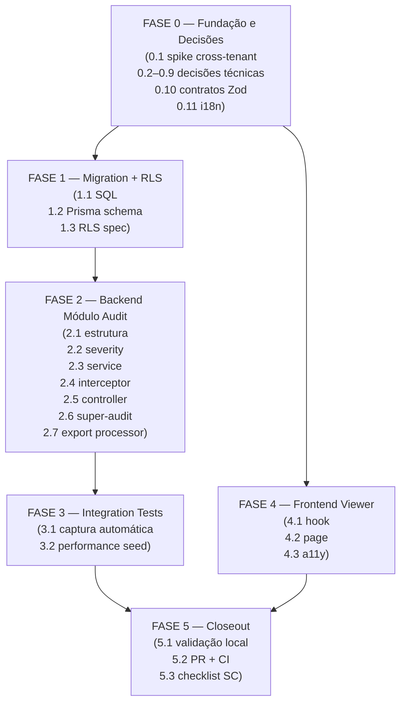

# Backlog de Tarefas: Log de Auditoria Imutável (Story 9-3)

**Feature**: `auditoria-log` | **Epic**: 9 (LGPD & Compliance) | **Story**: 9-3
**Branch**: `feat/story-9-3-auditoria-log`
**Spec**: [spec.md](./spec.md) | **Plan**: [plan.md](./plan.md)
**Gerado em**: 2026-06-11

---

**Legenda de status:**
- `[ ]` Pendente
- `[x]` Concluído
- `[~]` Em progresso
- `[!]` Bloqueado

**Legenda de criticidade:**
- `[C]` Crítico — impacto regulatório/segurança/compliance (LGPD, imutabilidade RLS)
- `[A]` Alto — funcionalidade core sem a qual o sistema não opera
- `[M]` Médio — necessário mas pode ser refinado sem impacto imediato

---

## FASE 0 — Fundação, Spikes e Decisões Técnicas

> Resolver todos os gaps e ambiguidades dos checklists ANTES de codar.
> Dependências bloqueantes para FASE 1+.

### 0.1 Spike: mecanismo cross-tenant do Super Admin `[C]`

Ref: SEC-005 (checklist/security.md), plan.md §Reuso, research.md D3

- [x] 0.1.1 Ler `apps/api/src/super-admin/super-admin-tenants.repository.ts` e confirmar uso de `this.prisma.client` (não `this.prisma` com RLS)
- [x] 0.1.2 Confirmar que `@Roles(Role.SUPER_ADMIN)` é suficiente (sem SET LOCAL tenant) via grep no módulo super-admin
- [x] 0.1.3 Verificar que nenhum middleware Prisma intercepta `prisma.client` direto (checar `apps/api/src/prisma/prisma.service.ts`)
- [ ] 0.1.4 Documentar resultado do spike em comentário no topo de `super-audit.controller.ts` (futuro — FASE 2)
- [x] 0.1.5 Registrar decisão: mecanismo confirmado → `prisma.client` direto é seguro para cross-tenant super-admin (dec-015)

### 0.2 Decisão técnica: estratégia de captura de `previousState` `[C]`

Ref: SEC-011 (checklist/security.md) — ambiguidade HIGH PRIORITY

- [x] 0.2.1 Analisar interceptor NestJS: `callHandler.handle()` via RxJS `tap()` só executa APÓS o handler; ler o estado ANTES exigiria leitura extra ao DB
- [x] 0.2.2 Decidir: `previousState` será **opcionalmente preenchido pelo service** (não pelo interceptor) via `AuditContext` no `AsyncLocalStorage` quando disponível; interceptor usa `null` se ausente (dec-016)
- [x] 0.2.3 Documentar a decisão: interceptor intercepta somente o response (after hook); `previousState` disponível apenas quando o service o injeta explicitamente no contexto
- [x] 0.2.4 Registrar no plan.md como decisão técnica de escopo (reduz complexidade do interceptor, elimina latência extra de leitura de DB)

### 0.3 Decisão técnica: tratamento de bulk operations `[A]`

Ref: REQ-004 (checklist/requirements.md) — gap arquitetural

- [x] 0.3.1 Confirmar decisão: `AuditInterceptor` global emite **1 evento por request** (não N por recurso afetado internamente) (dec-017)
- [x] 0.3.2 Documentar que `resourceId = null` e `resource = "<entity>-bulk"` para requests que afetam N recursos (raro no MVP)
- [x] 0.3.3 Adicionar item em Escopo Excluído desta tarefa: "N audit events por bulk intra-request"
- [x] 0.3.4 Registrar decisão auditável: 1 evento/request satisfaz FR-001 no MVP; revisitar em Epic 10 se necessário

### 0.4 Decisão técnica: tipo `ip_address` (text vs inet) `[A]`

Ref: SEC-006 (checklist/security.md)

- [x] 0.4.1 Verificar exemplos existentes no codebase: buscar `inet` vs `text` em outras migrations do projeto (resultado: TEXT em consents + marketing)
- [x] 0.4.2 Decidir: usar `TEXT` (não `INET`) para `ip_address` — suporta IPv6 bracket notation, proxies e valores `unknown` sem rejeição no DB (dec-018)
- [x] 0.4.3 Documentar decisão na migration SQL com comentário inline (a fazer em 1.1.3)

### 0.5 Decisão técnica: estratégia de truncamento de payload `[A]`

Ref: SEC-007 (checklist/security.md)

- [x] 0.5.1 Definir função de truncamento: serializar objeto → se `JSON.stringify(obj).length > 65536` → armazenar `{ "__truncated": true, "__originalSize": N, "__sample": primeiros 1000 chars }` (JSON sempre válido) (dec-019)
- [x] 0.5.2 Confirmar constante `AUDIT_PAYLOAD_TRUNCATE_BYTES = 65536` exportada de `packages/types` (audit/index.ts)
- [ ] 0.5.3 Documentar estratégia no `audit.interceptor.ts` com comentário (FASE 2)

### 0.6 Decisão técnica: escopo do campo `q` (busca full-text) `[M]`

Ref: API-003 (checklist/api.md)

- [x] 0.6.1 Decidir: `q` faz `ILIKE '%query%'` nos campos `resource` e `resource_id` apenas (sem busca em JSONB para MVP) (dec-020)
- [x] 0.6.2 Documentar limitação: `q` não busca em `previousState`/`newState` (custo de performance sem índice GIN)
- [x] 0.6.3 Registrar decisão: índice adicional para `q` em JSONB fica para Epic 10 com observabilidade

### 0.7 Decisão técnica: serialização de JSONB em export CSV `[M]`

Ref: API-009 (checklist/api.md)

- [x] 0.7.1 Decidir: `previousState` e `newState` são serializados como **JSON stringificado** na célula CSV (ex: `"{""action"":""create""}"`) (dec-021)
- [x] 0.7.2 Documentar no cabeçalho CSV: coluna `previousState` contém JSON serializado
- [x] 0.7.3 Registrar decisão: sem achamento (flatten) de campos JSONB para MVP

### 0.8 Decisão técnica: paginação cursor vs offset no viewer `[M]`

Ref: API-012 (checklist/api.md)

- [x] 0.8.1 Decidir: usar **offset-based pagination** com índice `(tenant_id, timestamp DESC)` — simples, suficiente para 50 itens/pág e 10k eventos/tenant no MVP (dec-022)
- [x] 0.8.2 Documentar limitação: auto-refresh pode causar duplicatas/pulos com alto throughput; mitigar exibindo "Atualizado em HH:MM:SS" no viewer
- [x] 0.8.3 Registrar decisão: cursor-based pagination é roadmap para versão futura se throughput > 100 req/s

### 0.9 Decisão técnica: lista canônica de `resource` para severity `warning` `[A]`

Ref: REQ-006 (checklist/requirements.md)

- [x] 0.9.1 Definir lista: `resource` values que disparam `warning` = `["role", "permission", "user-role", "group-role", "member-role"]` (dec-023)
- [x] 0.9.2 Exportar como constante `AUDIT_WARNING_RESOURCES` de `packages/types/src/audit/index.ts`
- [ ] 0.9.3 Usar constante no `audit.severity.ts` (FASE 2)

### 0.10 Contratos Zod em `packages/types` `[C]`

Ref: plan.md §Project Structure, API-011 (checklist/api.md), contracts/audit-events.md

- [x] 0.10.1 Criar `packages/types/src/audit/index.ts` com schemas Zod: `AuditActionSchema`, `AuditSeveritySchema`, `AuditEventSchema`, `AuditEventListResponseSchema`, `AuditExportRequestSchema`, `AuditExportJobStatusSchema`, `AuditEventsQuerySchema`
- [x] 0.10.2 Exportar constantes: `AUDIT_EVENTS_PAGE_SIZE`, `AUDIT_EXPORT_QUEUE_NAME`, `AUDIT_EXPORT_TTL_SECONDS`, `AUDIT_PAYLOAD_TRUNCATE_BYTES`, `AUDIT_ACTIONS`, `AUDIT_SEVERITIES`, `AUDIT_WARNING_RESOURCES`
- [x] 0.10.3 Adicionar export em `packages/types/src/index.ts`
- [x] 0.10.4 Criar `packages/types/src/__tests__/audit.snapshot.spec.ts` com snapshot de todos os schemas
- [x] 0.10.5 Rodar `pnpm test --filter=@metanoia/types` e confirmar snapshot gerado (18/18 pass)
- [x] 0.10.6 Verificar paridade entre `z.infer<typeof AuditEventSchema>` e campos do data-model.md (todos os 12 campos presentes)

### 0.11 Keys i18n PT-BR `[A]`

Ref: plan.md §Constitution Check (Princípio III), REQ-013 (checklist/requirements.md)

- [x] 0.11.1 Adicionar namespace `superAdmin.audit.*` em `apps/web/messages/pt-BR.json` com keys: `title`, `subtitle`, `filters.*`, `table.*` (colunas, estados vazios), `actions.*`, `export.*`, `severity.*` em vocabulário pastoral
- [x] 0.11.2 Verificar vocabulário: evitar termos corporativos ("logs", "registros"); usar linguagem de cuidado pastoral ("histórico de ações", "trilha de responsabilidade")
- [ ] 0.11.3 Confirmar que nenhuma string hardcoded em PT-BR no componente viewer (FASE 4)

---

## FASE 1 — Migration e RLS Append-Only

> Fundação de banco. Bloqueante para todas as fases de backend.

### 1.1 Migration SQL: tabela `audit_events` `[C]`

Ref: plan.md §Project Structure, data-model.md, FR-INFRA-02

- [x] 1.1.1 Criar migration `apps/api/prisma/migrations/20260617000000_9-3-audit-events/migration.sql`
- [x] 1.1.2 Definir tabela `audit_events` com todos os 12 campos (snake_case): user_id nullable (dec-016)
- [x] 1.1.3 Adicionar comentário inline: `-- ip_address: TEXT (não INET) — suporta IPv6 bracket notation e proxies (dec-018)`
- [x] 1.1.4 Criar índice `idx_audit_events_tenant_timestamp` em `(tenant_id, timestamp DESC)` + idx_user + idx_action (dec-024)
- [x] 1.1.5 Habilitar RLS: `ALTER TABLE audit_events ENABLE ROW LEVEL SECURITY; ALTER TABLE audit_events FORCE ROW LEVEL SECURITY;`
- [x] 1.1.6 Criar policy INSERT com NULLIF guard
- [x] 1.1.7 Criar policy SELECT com NULLIF guard
- [x] 1.1.8 Adicionar comentário explícito: `-- SOMENTE INSERT + SELECT. SEM UPDATE. SEM DELETE. Imutabilidade garantida pela ausência de policies UPDATE/DELETE (FR-INFRA-02, SEC-001, SEC-002).`
- [x] 1.1.9 FK para tabela `tenants`: `REFERENCES tenants(id) ON DELETE CASCADE`

### 1.2 Prisma schema: model `AuditEvent` `[C]`

Ref: data-model.md, plan.md §Project Structure

- [x] 1.2.1 Adicionar `model AuditEvent` em `apps/api/prisma/schema.prisma` com todos os 12 campos em camelCase + `@map`/`@@map` snake_case
- [x] 1.2.2 `id` sem default no schema (gerado pela app via `generateId()`)
- [x] 1.2.3 Marcado `@@map("audit_events")`
- [x] 1.2.4 Rodar `pnpm prisma generate` — gerado sem erros

### 1.3 RLS spec: isolamento e imutabilidade `[C]`

Ref: SEC-003, SEC-004 (checklist/security.md), plan.md §Testing, FR-003, FR-004, SC-002, SC-007

- [x] 1.3.1 Criar `apps/api/test/rls/audit-events.rls-spec.ts` baseado em scaffold de `group-members.rls-spec.ts`
- [x] 1.3.2 Setup: criar 2 tenants distintos (A e B) + inserir 3 eventos para tenant A e 2 para tenant B
- [x] 1.3.3 Teste de isolamento: SELECT como tenant A retorna exatamente 3 eventos (não vê os 2 do tenant B) — SC-007
- [x] 1.3.4 Teste de imutabilidade UPDATE: deve falhar com policy violation — SC-002
- [x] 1.3.5 Teste de imutabilidade DELETE: deve falhar com policy violation — SC-002
- [x] 1.3.6 Teste de SELECT sem SET LOCAL: SELECT sem `app.current_tenant_id` retorna 0 linhas
- [ ] 1.3.7 Rodar `pnpm test apps/api/test/rls/audit-events.rls-spec.ts` e confirmar todos os testes passam (requer Docker/DB)

---

## FASE 2 — Backend: Módulo Audit

> Módulo NestJS completo. Depende de FASE 1 (migration aplicada).

### 2.1 Estrutura do módulo `audit/` `[A]`

Ref: plan.md §Project Structure, REQ-009 (checklist/requirements.md)

- [x] 2.1.1 Criar diretório `apps/api/src/audit/` com os arquivos: `audit.module.ts`, `audit.service.ts`, `audit.controller.ts`, `super-audit.controller.ts`, `audit.interceptor.ts`, `audit.severity.ts`, `audit-export.processor.ts`, `audit-context.ts`
- [x] 2.1.2 Criar `audit.module.ts`: BullMqModule + PrismaModule + RedisModule + StorageModule; exportar `AuditService`; APP_INTERCEPTOR global
- [x] 2.1.3 Registrar `AuditModule` em `app.module.ts`
- [x] 2.1.4 Registrar `AuditInterceptor` como `APP_INTERCEPTOR` global em `audit.module.ts` (providers array)

### 2.2 `audit.severity.ts`: mapeamento action → severity `[A]`

Ref: data-model.md §Severity mapping, REQ-006 (checklist/requirements.md), dec-0.9

- [x] 2.2.1 Implementar função `getAuditSeverity(action: AuditAction, resource: string): AuditSeverity`
- [x] 2.2.2 Lógica: `delete | config_change | auth_failure` → `critical`; `update` com `resource` em `AUDIT_WARNING_RESOURCES` → `warning`; demais → `info`
- [x] 2.2.3 Importar `AUDIT_WARNING_RESOURCES` de `packages/types`
- [x] 2.2.4 Escrever unit tests `audit.severity.spec.ts`: 14 casos cobrindo todos os actions + warning resources vs info
- [x] 2.2.5 Rodar testes e confirmar 14/14 pass

### 2.3 `audit.service.ts`: Prisma direto (sem repository) `[C]`

Ref: plan.md §Structure Decision, REQ-009, SEC-002

- [x] 2.3.1 Implementar `createEvent(dto: CreateAuditEventDto): Promise<void>` — withTenantTx; falhas silenciadas (FR-INFRA-01)
- [x] 2.3.2 Implementar `listEvents(query, tenantId?)` — tenantId opcional para Super Admin (prisma.client direto)
- [x] 2.3.3 Filtros: action, userId, dateFrom, dateTo, severity, resource, q (ILIKE em resource + resource_id)
- [x] 2.3.4 Paginação offset + orderBy timestamp desc
- [x] 2.3.5 Sem métodos update() ou delete() expostos (SEC-002)
- [x] 2.3.6 createExportJob: BullMQ + Redis estado inicial
- [x] 2.3.7 getExportJobStatus: Redis → 404 se ausente/expirado
- [ ] 2.3.8 Escrever unit tests `audit.service.spec.ts` (pendente)
- [ ] 2.3.9 Rodar testes (pendente)

### 2.4 `audit.interceptor.ts`: interceptor global de mutativos `[C]`

Ref: plan.md §Summary, FR-001, FR-010, FR-011, SEC-008, SEC-011, dec-0.2, dec-0.3, dec-0.5

- [x] 2.4.1 Implementar `AuditInterceptor implements NestInterceptor`
- [x] 2.4.2 Filtrar métodos: somente POST/PUT/PATCH/DELETE
- [x] 2.4.3 Suporta @Public(): userId pode ser null (SEC-008)
- [x] 2.4.4 Extrai userId, ipAddress (X-Forwarded-For/X-Real-IP/socket), userAgent
- [x] 2.4.5 Deriva resource/action/resourceId da rota
- [x] 2.4.6 tap() captura newState; previousState de auditContext (dec-016)
- [x] 2.4.7 Truncamento 64KB (dec-019)
- [x] 2.4.8 Fire-and-forget: AuditService.createEvent() swallows errors
- [x] 2.4.9 GET/HEAD/OPTIONS excluídos
- [ ] 2.4.10 Escrever unit tests `audit.interceptor.spec.ts` (pendente)
- [ ] 2.4.11 Rodar testes (pendente)

### 2.5 `audit.controller.ts`: endpoint tenant-scoped `[A]`

Ref: contracts/audit-events.md §GET /api/v1/audit/events, FR-005, FR-006

- [x] 2.5.1 Implementar `GET /api/v1/audit-events` + `POST /api/v1/audit-events/exports` + `GET /api/v1/audit-events/exports/:jobId`
- [x] 2.5.2 @UseGuards(KeycloakAuthGuard, RolesGuard, TenantGuard) + @Roles(ADMIN_TENANT)
- [x] 2.5.3 Validar query params via ZodValidationPipe(AuditEventsQuerySchema)
- [x] 2.5.4 Chama auditService.listEvents(query) (RLS via withTenantTx)
- [x] 2.5.5 Retorna envelope com HTTP 200/202
- [ ] 2.5.6 Escrever integration tests `audit.controller.integration-spec.ts` (pendente)
- [ ] 2.5.7 Rodar testes (pendente)

### 2.6 `super-audit.controller.ts`: endpoints cross-tenant Super Admin `[C]`

Ref: contracts/audit-events.md §Super Admin endpoints, SEC-005, dec-0.1

- [x] 2.6.1 Implementar `@Controller('api/v1/super-admin/audit-events')` + `@Roles(SUPER_ADMIN)`
- [x] 2.6.2 `GET /api/v1/super-admin/audit-events?tenantId=<uuid>`: usa listEvents(query, tenantId) → prisma.client direto (dec-015 confirmado no spike 0.1)
- [x] 2.6.3 `POST /api/v1/super-admin/audit-events/exports`: HTTP 202 + jobId
- [x] 2.6.4 `GET /api/v1/super-admin/audit-events/exports/:jobId`: 200 ou 404
- [ ] 2.6.5 Escrever integration tests (pendente)
- [ ] 2.6.6 Rodar testes (pendente)

### 2.7 `audit-export.processor.ts`: BullMQ worker `[A]`

Ref: plan.md §Reuso (reports/ 8-7), FR-INFRA-03, data-model.md §AuditExportJob

- [x] 2.7.1 Criar `audit-export.processor.ts` baseado no scaffold de `reports/reports.processor.ts`
- [x] 2.7.2 BullMQ worker via bullMq.createWorker(AUDIT_EXPORT_QUEUE_NAME, ...)
- [x] 2.7.3 Processar job: listEvents() perPage=10000 + todos os 12 campos
- [x] 2.7.4 CSV com BOM UTF-8; previousState/newState como JSON string (dec-021)
- [x] 2.7.5 Upload para MinIO via StorageService.upload() + signedUrl
- [x] 2.7.6 Atualizar Redis: completed + signedUrl + expiresAt; failed + failureReason
- [ ] 2.7.7 Escrever unit tests `audit-export.processor.spec.ts` (pendente)
- [ ] 2.7.8 Rodar testes (pendente)

---

## FASE 3 — Integration Tests de Backend

> Cobertura de integração ponta-a-ponta no backend. Depende de FASE 1+2.

### 3.1 Integration tests: captura automática (US1) `[C]`

Ref: REQ-001 (FR-001), spec US1 Independent Test

- [ ] 3.1.1 Criar `audit.integration-spec.ts`: POST autenticado em endpoint existente (ex: grupos) → verificar que `audit_events` count +1 com campos corretos
- [ ] 3.1.2 Verificar que todos os 12 campos estão presentes e não-null (exceto nullable: resourceId, previousState, newState)
- [ ] 3.1.3 Verificar que GET no mesmo endpoint **não** gera audit event (FR-011)
- [ ] 3.1.4 Verificar que severity é atribuída corretamente (DELETE → critical, POST → info)
- [ ] 3.1.5 Rodar testes e confirmar

### 3.2 Integration tests: performance com seed de dados `[A]`

Ref: REQ-002, SC-003 (viewer < 2s com 10k eventos)

- [ ] 3.2.1 Criar seed de 10k audit events via factory em `apps/api/test/factories/audit-event.factory.ts`
- [ ] 3.2.2 Verificar via `EXPLAIN ANALYZE` que o índice `idx_audit_events_tenant_timestamp` é usado na query de listagem
- [ ] 3.2.3 Medir tempo de resposta do GET `/audit/events` com 10k eventos: registrar no log do teste (não assertar timing automaticamente — REQ-007 nota de ambiente)
- [ ] 3.2.4 Confirmar que primeira página retorna em < 5s no ambiente local (threshold conservador para CI)

---

## FASE 4 — Frontend Viewer Super Admin

> Client Component com TanStack Query. Depende de FASE 0.10 (contratos Zod) e FASE 0.11 (i18n).

### 4.1 Hook `useAuditEvents` `[A]`

Ref: plan.md §Project Structure, spec FR-005, FR-006, FR-009

- [ ] 4.1.1 Criar `apps/web/src/lib/api/hooks/use-audit-events.ts` baseado no scaffold de `use-super-admin-tenants.ts`
- [ ] 4.1.2 Implementar `useAuditEvents(query: AuditEventsQuery)` com TanStack Query `useQuery` + `refetchInterval: 30_000` (FR-009, API-012)
- [ ] 4.1.3 Implementar `useSuperAdminAuditEvents(query)` para endpoint cross-tenant Super Admin
- [ ] 4.1.4 Validar response com `AuditEventListResponseSchema` de `packages/types`
- [ ] 4.1.5 Verificar paridade de tipos: `z.infer<typeof AuditEventSchema>` no hook == campos usados no componente (sem cast `as any`)
- [ ] 4.1.6 Escrever unit tests `use-audit-events.spec.ts`: mock MSW; `refetchInterval` presente em 30000ms; filtros passados corretamente; schema parse bem-sucedido

### 4.2 Viewer page `/app/admin/super/audit` `[A]`

Ref: plan.md §Project Structure, spec US3, FR-008, FR-009, REQ-010

- [ ] 4.2.1 Criar `apps/web/app/(authenticated)/app/admin/super/audit/page.tsx` com `'use client'`
- [ ] 4.2.2 Implementar tabela com colunas: `timestamp`, `action`, `severity`, `resource`, `resourceId`, `userId`, `tenantId`, `ipAddress` — baseado no padrão de super-admin/tenants
- [ ] 4.2.3 Implementar linhas expansíveis: clicar na linha mostra painel JSON de `previousState` e `newState` formatados (FR-008, spec US3 AC#2)
- [ ] 4.2.4 Implementar filtros sticky: `action`, `severity`, `userId`, `dateFrom`, `dateTo`, `q` — persistidos em `useState` (não URL state para MVP)
- [ ] 4.2.5 Exibir "Atualizado em HH:MM:SS" após cada auto-refresh de 30s (dec-0.8 — mitigação de offset pagination)
- [ ] 4.2.6 Paginação server-side: botões Anterior/Próxima + indicador de página (meta.page / meta.totalPages)
- [ ] 4.2.7 Estado vazio: mensagem pastoral quando `data.length === 0` (i18n `superAdmin.audit.empty`)
- [ ] 4.2.8 Loading skeleton: usar shadcn/ui Skeleton durante `isLoading`
- [ ] 4.2.9 Exibir badge de severidade colorido: `critical` vermelho, `warning` amarelo, `info` cinza
- [ ] 4.2.10 Botão "Exportar CSV/JSON" → chama endpoint POST export; exibe toast "Exportação em processamento" (202)
- [ ] 4.2.11 Desktop-only: sem breakpoints mobile (REQ-010)

### 4.3 a11y: jest-axe gate `[A]`

Ref: plan.md §Project Structure, REQ-012 (checklist/requirements.md), constitution §VI

- [ ] 4.3.1 Criar `apps/web/app/(authenticated)/app/admin/super/audit/__tests__/audit-page.a11y.spec.tsx`
- [ ] 4.3.2 Renderizar viewer com mock MSW + dados de teste; rodar `axe(container)` e assertar `expect(results).toHaveNoViolations()`
- [ ] 4.3.3 Testar estado de loading skeleton (não deve ter violações a11y)
- [ ] 4.3.4 Testar linha expandida com JSON de previousState/newState (contraste e estrutura)
- [ ] 4.3.5 Rodar testes e confirmar WCAG AA gate verde

---

## FASE 5 — Testes, Validação e Closeout

> Gate final antes de abrir PR. Sem código novo — apenas validação, lint e entrega.

### 5.1 Validação local pré-PR `[C]`

Ref: REQ-011 (checklist/requirements.md), feedback_feature00c_direct_push_dev_bypasses_ci.md

- [ ] 5.1.1 Rodar `pnpm prisma generate` — confirmar sem erros de schema
- [ ] 5.1.2 Rodar `pnpm turbo build` — confirmar build verde em todos os workspaces afetados
- [ ] 5.1.3 Rodar `pnpm turbo lint` — confirmar lint verde (sem warnings TypeScript strict)
- [ ] 5.1.4 Rodar `pnpm turbo test` (filtro nos workspaces modificados) — confirmar todos os testes verdes
- [ ] 5.1.5 Confirmar que **nenhum** push direto em `dev` foi feito (REQ-011, feedback memory)

### 5.2 Criação e CI do PR `[C]`

Ref: plan.md §Constitution Check (Princípio VII), constitution §VII

- [ ] 5.2.1 Push da branch `feat/story-9-3-auditoria-log` para origin
- [ ] 5.2.2 Abrir PR para `dev` via `gh pr create` com título e body padronizados
- [ ] 5.2.3 Aguardar CI completo (lint + test + build via Turborepo) — confirmar verde antes de declarar done
- [ ] 5.2.4 Verificar no PR: checklist de validação preenchido (nenhum TODO pendente)

### 5.3 Checklist de validação da story `[A]`

Ref: spec §Success Criteria (SC-001 a SC-007)

- [ ] 5.3.1 SC-001: confirmar via integration test que 100% de POST/PUT/PATCH/DELETE autenticados geram audit event
- [ ] 5.3.2 SC-002: confirmar via RLS spec que UPDATE e DELETE são bloqueados (imutabilidade)
- [ ] 5.3.3 SC-003: confirmar via `EXPLAIN ANALYZE` que índice é usado com 10k eventos
- [ ] 5.3.4 SC-004: log de latência do interceptor documentado (não assertado automaticamente — ver dec-0.7 da REQ-007)
- [ ] 5.3.5 SC-006: export de 100k eventos rodado manualmente em local (timing registrado como observação no PR)
- [ ] 5.3.6 SC-007: confirmar via RLS spec que 0 eventos do tenant B aparecem para tenant A
- [ ] 5.3.7 Confirmar snapshot Zod em `packages/types` gerado e commitado

---

## Matriz de Dependências

---

## Resumo Quantitativo

| Fase | Tarefas | Subtarefas | Criticidade Dominante |
|------|---------|------------|-----------------------|
| FASE 0 — Fundação e Decisões | 11 | 44 | [C] (contratos Zod, spike) + [A] |
| FASE 1 — Migration + RLS | 3 | 20 | [C] |
| FASE 2 — Backend Módulo Audit | 7 | 47 | [C] + [A] |
| FASE 3 — Integration Tests | 2 | 8 | [C] + [A] |
| FASE 4 — Frontend Viewer | 3 | 21 | [A] |
| FASE 5 — Closeout | 3 | 14 | [C] + [A] |
| **Total** | **29** | **154** | — |

---

## Escopo Coberto

- Captura automática de eventos mutativos via `AuditInterceptor` global (1 evento por request)
- Tabela `audit_events` com RLS append-only (somente INSERT + SELECT; imutabilidade garantida pelo DB)
- Módulo NestJS `audit/` como supporting subdomain (Prisma direto, sem repository)
- 4 endpoints REST com prefixo `/api/v1/`: listagem tenant-scoped, listagem cross-tenant Super Admin, export assíncrono (202 + BullMQ), polling de status
- Contratos Zod compartilhados em `packages/types/src/audit/` com snapshot test
- Viewer Client Component `/app/admin/super/audit` com TanStack Query, filtros, auto-refresh 30s, linhas expansíveis JSON, paginação server-side, jest-axe gate
- Export assíncrono CSV/JSON reutilizando padrão BullMQ do módulo `reports/` (8-7)
- RLS spec com testes de isolamento cross-tenant + imutabilidade UPDATE/DELETE
- i18n PT-BR namespace `superAdmin.audit.*` com vocabulário pastoral
- Todas as 9 decisões técnicas dos gaps e ambiguidades dos checklists (SEC-005..011, API-003/009/012, REQ-004/006/011)

## Escopo Excluído

- **N eventos por bulk intra-request**: interceptor emite 1 evento por request HTTP (dec-0.3); N eventos por N recursos internos = roadmap Epic 10
- **Busca full-text em `previousState`/`newState` JSONB**: campo `q` filtra somente `resource` e `resource_id` (dec-0.6); busca GIN em JSONB = roadmap
- **Cursor-based pagination**: offset-based para MVP (dec-0.8); cursor = roadmap se throughput > 100 req/s
- **Índices adicionais** (`action`, `severity`, `userId`): somente índice `(tenant_id, timestamp DESC)` no MVP (REQ-014 nota); revisitar com observabilidade
- **Captura de `previousState` pelo interceptor via leitura DB**: `previousState` é opcional via `AuditContext` preenchido pelo service (dec-0.2); leitura automática ao DB = latência inaceitável
- **Responsividade mobile** do viewer (REQ-010): desktop-only por design
- **Resolução do conflito 9-2/9-3** (anonimização LGPD de `user_id`): escopo de Story 9-2 (plan.md §Nota cross-story)
- **Alertas/notificações em tempo real** (SSE/WebSocket): auto-refresh polling 30s é suficiente para MVP
- **Índice de busca full-text GIN** em campos JSONB
