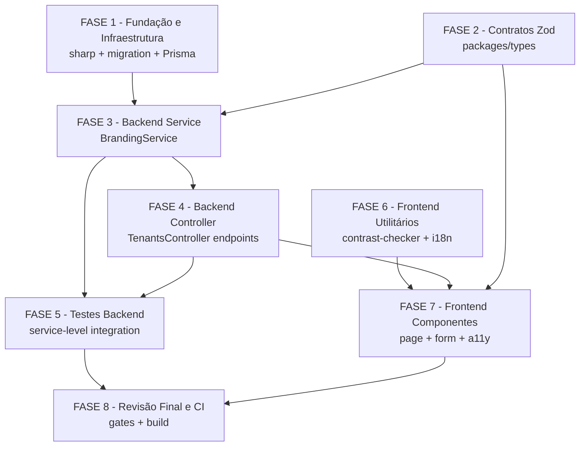

# Backlog de Tarefas — Branding Customizado do Tenant (Story 11-2)

**Feature:** `branding-tenant` · **Epic:** 11 — Planos, Limites & Feature Gating  
**Spec:** `docs/specs/branding-tenant/spec.md` · **Plan:** `docs/specs/branding-tenant/plan.md`  
**Data:** 2026-06-14

---

## Legendas

### Status
- `[ ]` — Pendente
- `[x]` — Concluído
- `[~]` — Em progresso
- `[!]` — Bloqueado

### Criticidade
- `[C]` — Crítico (impacto financeiro, regulatório ou de segurança)
- `[A]` — Alto (funcionalidade core sem a qual o sistema não opera)
- `[M]` — Médio (necessário mas pode ser adiado sem impacto imediato)

---

## FASE 1 — Fundação e Infraestrutura

> Pré-requisitos de build: dependência sharp, migration, schema Prisma. Deve ser commitado ANTES de qualquer implementação de código para evitar quebra de CI.

### 1.1 Instalar dependência sharp e commitar lock `[A]`

Ref: spec.md §7.1, plan.md §CI Guardrails, dec D3

- [x] 1.1.1 Executar `pnpm add sharp --filter @metanoia/api` no raiz do monorepo
- [x] 1.1.2 Verificar que `sharp` aparece em `apps/api/package.json` como dep direta (não só transitiva)
- [x] 1.1.3 Executar `pnpm add -D @types/sharp --filter @metanoia/api` (se types não incluídos no pacote)
- [x] 1.1.4 Rodar `pnpm install` e verificar `pnpm-lock.yaml` atualizado
- [x] 1.1.5 Confirmar com `pnpm why sharp --filter @metanoia/api` que a dep é direta
- [x] 1.1.6 Commitar `apps/api/package.json` + `pnpm-lock.yaml` ANTES de qualquer outro código

### 1.2 Migration Prisma — colunas de branding `[A]`

Ref: spec.md §6, data-model.md §Migration SQL, plan.md §CI Guardrails

- [x] 1.2.1 Adicionar 3 campos ao model `Tenant` em `apps/api/prisma/schema.prisma` (após `logoUrl`):
  ```prisma
  brandPrimaryColor   String?  @map("brand_primary_color") @db.VarChar(9)
  brandSecondaryColor String?  @map("brand_secondary_color") @db.VarChar(9)
  displayName         String?  @map("display_name") @db.VarChar(100)
  ```
- [x] 1.2.2 Criar migration handwritten em `apps/api/prisma/migrations/<timestamp>_add_branding_columns/migration.sql`:
  ```sql
  -- Additive nullable columns; RLS inherited from existing tenants policy
  -- NO trigger_set_timestamp — project uses @updatedAt (Prisma). (CI lesson 11-1)
  ALTER TABLE tenants ADD COLUMN brand_primary_color VARCHAR(9);
  ALTER TABLE tenants ADD COLUMN brand_secondary_color VARCHAR(9);
  ALTER TABLE tenants ADD COLUMN display_name VARCHAR(100);
  ```
- [x] 1.2.3 Verificar que NÃO há trigger `trigger_set_timestamp()` no SQL da migration (lição CI 11-1)
- [x] 1.2.4 Verificar que NÃO há nova RLS policy — colunas adicionadas à tabela `tenants` já protegida (spec §6.3)
- [x] 1.2.5 Executar `prisma migrate dev` localmente para validar a migration
- [x] 1.2.6 Executar `prisma generate` e confirmar que `PrismaClient` tem os 3 novos campos no tipo `Tenant`

### 1.3 Gaps de checklist — Decisões de requisito `[M]`

Ref: checklists/api.md CHK022, CHK023, CHK027, CHK033

- [x] 1.3.1 Documentar inline em `branding.service.ts` (comentário): "logo_url stores the MinIO **object key** — NOT the signed URL (resolves CHK023 conflict: spec §7.3 step 7 is obsolete; follow data-model.md)"
- [x] 1.3.2 Documentar inline em `branding.service.spec.ts`: estratégia de cleanup afterEach — flush Redis `cache:branding:*` + delete Prisma via conexão privilegiada DATABASE_URL para rows de tenant de teste (resolves CHK022)
- [x] 1.3.3 Documentar inline em `branding.service.ts` (comentário): "CHK033 — concurrent PATCH = last-write-wins intencional (único admin do tenant); sem lock otimista no MVP"
- [x] 1.3.4 Documentar em `quickstart.md` §Notes: "CHK027 — sem SLO formal de latência GET para MVP; cache Redis cobre; revisitar em escala"

---

## FASE 2 — Contratos Zod (packages/types)

> Single source of truth FE+BE. Deve existir antes de BE e FE implementarem.

### 2.1 Criar schema Zod de branding `[A]`

Ref: spec.md §5, contracts/branding-api.md §Zod, plan.md §Convencoes de Borda

- [x] 2.1.1 Criar arquivo `packages/types/src/tenants/branding.ts` com:
  - `HEX_COLOR_REGEX` constante
  - `BrandingColorSchema` (string + regex + max 9)
  - `UpdateBrandingSchema.strict()` (anti-mass-assignment: campos `primaryColor?`, `secondaryColor?`, `displayName?`)
  - `UpdateBrandingInput` (z.infer)
  - `BrandingResponseSchema` (6 campos: `primaryColor`, `secondaryColor`, `displayName`, `logoUrl`, `plan`, `canCustomizeBranding`)
  - `BrandingResponse` (z.infer)
- [x] 2.1.2 Verificar que `UpdateBrandingSchema` usa `.strict()` (rejeita chaves desconhecidas)
- [x] 2.1.3 Verificar que `BrandingResponseSchema.logoUrl` é `z.string().url().nullable()` (nunca `undefined`)
- [x] 2.1.4 Verificar que `plan` usa `z.enum(['free','pro','enterprise'])` (consistente com `TenantPlanSchema` em `super-admin-tenant.ts`)

### 2.2 Exportar e testar snapshot `[A]`

Ref: spec.md §5.2, contracts/branding-api.md §Zod, Constitution IV

- [x] 2.2.1 Adicionar re-export em `packages/types/src/index.ts`: `export * from './tenants/branding'`
- [x] 2.2.2 Criar `packages/types/src/__tests__/branding.spec.ts` com snapshot test:
  ```typescript
  it('BrandingResponseSchema snapshot', () => {
    expect(BrandingResponseSchema.shape).toMatchSnapshot();
  });
  ```
- [x] 2.2.3 Criar `packages/types/src/__tests__/branding.spec.ts` com teste de validação de hex válido (`#1E40AF` passa) e inválido (`not-a-hex` falha em `BrandingColorSchema`)
- [x] 2.2.4 Rodar `pnpm test --filter @metanoia/types` para confirmar snapshot criado e testes verdes
- [x] 2.2.5 Verificar paridade de tipos: `UpdateBrandingInput` em `packages/types` deve coincidir exatamente com o DTO esperado pelo backend (sem snake_case vazando)

---

## FASE 3 — Backend: DI e Service

> Módulo NestJS + service de branding. Depende da FASE 1 (migration + sharp) e FASE 2 (Zod).

### 3.1 Atualizar TenantsModule com novos imports `[A]`

Ref: spec.md §7.2, plan.md §DI wiring, plan.md §CI Guardrails

- [x] 3.1.1 Adicionar imports em `apps/api/src/tenants/tenants.module.ts`:
  ```typescript
  import { StorageModule } from '../storage/storage.module';
  import { PlanLimitsModule } from '../common/plan-limits/plan-limits.module';
  import { RedisModule } from '../redis/redis.module';
  ```
- [x] 3.1.2 Adicionar `StorageModule`, `PlanLimitsModule`, `RedisModule` ao array `imports` do `@Module`
- [x] 3.1.3 Verificar que `StorageModule` exporta `StorageService` (grep no `storage.module.ts`)
- [x] 3.1.4 Verificar que `PlanLimitsModule` exporta `PlanLimitsService` (grep no `plan-limits.module.ts`)
- [x] 3.1.5 Verificar que `RedisModule` é `@Global()` (confirmar — import explícito como defesa em profundidade per plan.md)

### 3.2 Implementar BrandingService — método `getBranding` `[A]`

Ref: spec.md §7.3, contracts/branding-api.md §GET, data-model.md §Cache entity, quickstart Scenario 4

- [x] 3.2.1 Criar `apps/api/src/tenants/branding.service.ts` com classe `BrandingService` injetando `PrismaService`, `StorageService`, `PlanLimitsService`, `RedisService`
- [x] 3.2.2 Implementar `getBranding()`: ler `cache:branding:{tenantId}` do Redis; se hit → retornar parsed JSON
- [x] 3.2.3 No cold path: usar `withTenantTx` + `prisma.tenant.findUniqueOrThrow({ select: { plan, logoUrl, brandPrimaryColor, brandSecondaryColor, displayName } })`
- [x] 3.2.4 Se `tenant.logoUrl` (object key) presente: chamar `StorageService.getSignedUrl(tenant.logoUrl, 14400)` → `logoUrl` na resposta
- [x] 3.2.5 Montar `BrandingResponse` explicitamente (anti-mass-assignment): `{ primaryColor: tenant.brandPrimaryColor ?? null, secondaryColor: tenant.brandSecondaryColor ?? null, displayName: tenant.displayName ?? null, logoUrl, plan: tenant.plan, canCustomizeBranding: tenant.plan !== 'free' }`
- [x] 3.2.6 Write-through Redis: `redis.set(key, JSON.stringify(response), 'EX', 3600)` após cold path
- [x] 3.2.7 Adicionar comentário: "logo_url stores the MinIO object key — NOT signed URL (CHK023; data-model.md §logoUrl)"
- [x] 3.2.8 Garantir nulls explícitos em todos os campos do response (nunca `undefined` per Constitution II)

### 3.3 Implementar BrandingService — método `updateBranding` `[A]`

Ref: spec.md §7.3, contracts/branding-api.md §PATCH, quickstart Scenarios 1-3, CHK033

- [x] 3.3.1 Implementar `updateBranding(dto: UpdateBrandingInput): Promise<BrandingResponse>`
- [x] 3.3.2 Gate tier: obter `tenant.plan` via `PlanLimitsService.getPlan(tenantId)` (D5: não `PlanLimitsGuard`)
- [x] 3.3.3 Se `plan === 'free'` e dto contém `primaryColor` ou `secondaryColor`: throw `ForbiddenException` com mensagem PT-BR acionável: `"Personalização de cores está disponível nos planos Pro e Enterprise. Faça upgrade para personalizar a identidade visual."`
- [x] 3.3.4 Persist via `withTenantTx`: `prisma.tenant.update({ data: { brandPrimaryColor: dto.primaryColor, brandSecondaryColor: dto.secondaryColor, displayName: dto.displayName } })` — mapeamento explícito (anti-mass-assignment dec-018)
- [x] 3.3.5 Write-through Redis: `redis.set('cache:branding:{tenantId}', JSON.stringify(response), 'EX', 3600)` após persist
- [x] 3.3.6 Retornar `BrandingResponse` completo (reusar `getBranding()` logic ou construir inline)
- [x] 3.3.7 Adicionar comentário inline: "CHK033 — concurrent PATCH = last-write-wins intencional; sem lock otimista no MVP"

### 3.4 Implementar BrandingService — método `uploadLogo` (segurança S6/S7) `[C]`

Ref: spec.md §7.3 §RF-03, contracts/branding-api.md §POST, plan.md §Security §S6 §S7, quickstart Scenarios 5-6

- [x] 3.4.1 Implementar `uploadLogo(file: MulterFile): Promise<{ logoUrl: string }>`
- [x] 3.4.2 Gate Free: `PlanLimitsService.getPlan()` === `'free'` → throw `ForbiddenException` com mensagem PT-BR acionável
- [x] 3.4.3 Validar presença de arquivo (se ausente → `BadRequestException('Arquivo não recebido. Envie o logo no campo "file".')`)
- [x] 3.4.4 Validar tamanho: `file.size > 2 * 1024 * 1024` → throw `UnprocessableEntityException` com mensagem PT-BR
- [x] 3.4.5 Validar mimetype: permitir apenas `image/png`, `image/jpeg`, `image/svg+xml` → throw `UnprocessableEntityException` para outros
- [x] 3.4.6 Construir sharp com limites de segurança anti pixel-bomb (S7): `sharp(file.buffer, { limitInputPixels: 512 * 512 * 4, failOn: 'error' })`
- [x] 3.4.7 Obter metadata: `await sharpInstance.metadata()` — validar `width` e `height` ∈ [64, 512] para PNG/JPG (SVG sem raster dims: pular validação de dimensão)
- [x] 3.4.8 Rasterizar para PNG (mitiga stored-XSS via SVG S6): `navBuffer = await sharp(file.buffer, { limitInputPixels: 512*512*4, failOn: 'error' }).resize(128, 128).png().toBuffer()`
- [x] 3.4.9 Gerar também `favBuffer`: `.resize(64, 64).png().toBuffer()`
- [x] 3.4.10 Upload nav: `await StorageService.upload('tenants/{tenantId}/logo-nav.png', navBuffer, 'image/png')` → retorna object key
- [x] 3.4.11 Upload fav: `await StorageService.upload('tenants/{tenantId}/logo-fav.png', favBuffer, 'image/png')`
- [x] 3.4.12 Persist object key no DB: `withTenantTx → prisma.tenant.update({ data: { logoUrl: 'tenants/{tenantId}/logo-nav.png' } })` — NUNCA persistir `signedUrl` (CHK023)
- [x] 3.4.13 Gerar signed URL para resposta: `await StorageService.getSignedUrl('tenants/{tenantId}/logo-nav.png', 14400)`
- [x] 3.4.14 Write-through Redis com `BrandingResponse` atualizado (incluindo novo `logoUrl` como signed URL)
- [x] 3.4.15 Verificar que `file.originalname` NÃO é usado na construção do object key (path traversal S2 — chave é fixa: `tenants/{tenantId}/logo-nav.png`)
- [x] 3.4.16 Usar `import sharp from 'sharp'` (default import per D7 — esModuleInterop)
- [x] 3.4.17 Registrar `BrandingService` como provider em `tenants.module.ts`

---

## FASE 4 — Backend: Controller

> Endpoints REST. Depende da FASE 3 (service implementado).

### 4.1 Adicionar endpoints de branding ao TenantsController `[A]`

Ref: spec.md §7.4, contracts/branding-api.md §GET/PATCH/POST, plan.md §Convencoes de Borda

- [x] 4.1.1 Adicionar `GET me/branding` ao `apps/api/src/tenants/tenants.controller.ts`:
  ```typescript
  @Get('me/branding')
  @UseGuards(RolesGuard)
  @Roles(Role.ADMIN_TENANT)
  async getBranding() { return { data: await this.brandingService.getBranding() }; }
  ```
- [x] 4.1.2 Adicionar `PATCH me/branding`:
  - `@HttpCode(HttpStatus.OK)`, `@UseGuards(RolesGuard)`, `@Roles(Role.ADMIN_TENANT)`
  - `@UsePipes(new ZodValidationPipe(UpdateBrandingSchema))`
  - `@UseInterceptors(ScrubPiiInterceptor)`
  - `@ApiOperation({ summary: 'Update tenant branding (colors + display name)' })`
- [x] 4.1.3 Adicionar `POST me/branding/logo`:
  - `@HttpCode(HttpStatus.OK)`, `@UseGuards(RolesGuard)`, `@Roles(Role.ADMIN_TENANT)`
  - `@UseInterceptors(FileInterceptor('file'))`
  - `@UploadedFile() file: MulterFile | undefined`
  - Guard de arquivo ausente: `if (!file) throw new BadRequestException(...)`
  - `@ApiOperation({ summary: 'Upload tenant logo (PNG/JPG/SVG ≤2MB)' })`
- [x] 4.1.4 Injetar `BrandingService` no construtor do `TenantsController`
- [x] 4.1.5 Verificar que rota base do controller é `api/v1/tenants` (prefixo existente não alterado)
- [x] 4.1.6 Verificar que `KeycloakAuthGuard` (class-level) já protege o controller — novos endpoints herdam

---

## FASE 5 — Testes de Integração (Backend Service-Level)

> Sem HTTP/supertest. Segue padrão do projeto: `withTenantTx` + Prisma/Redis reais + conexão privilegiada para seed/cleanup. Depende das FASEs 2, 3 e 4.

### 5.1 Setup do TestingModule de branding `[A]`

Ref: spec.md §8.1, plan.md §CI Guardrails, CHK022

- [x] 5.1.1 Criar `apps/api/src/tenants/__tests__/branding.service.spec.ts`
- [x] 5.1.2 Configurar `TestingModule` com `ConfigModule.forRoot({ isGlobal: true })`, `PrismaModule`, `StorageModule`, `PlanLimitsModule`, `RedisModule`, `BrandingService`
- [x] 5.1.3 Implementar `beforeEach`: seed tenant de teste via conexão privilegiada (DATABASE_URL, bypass RLS — nunca deletar users globais)
- [x] 5.1.4 Implementar `afterEach` de cleanup: flush Redis `cache:branding:{tenantId}` + delete row do tenant de teste via conexão privilegiada
- [x] 5.1.5 Verificar que `withTenantTx` é chamado com `tenantId` real do seed (não mock)
- [x] 5.1.6 Documentar inline: "CHK022 — cleanup afterEach: flush Redis cache:branding:* + Prisma delete via DATABASE_URL (privilegiada, bypass RLS)"

### 5.2 Testes de `getBranding` `[A]`

Ref: spec.md §8.2, quickstart Scenario 4, AC5

- [x] 5.2.1 Cenário: GET cache miss → DB cold path → write-through Redis (assertar `redis.get` miss antes; `redis.get` hit após)
- [x] 5.2.2 Cenário: GET cache hit → retorna sem hit no DB (spy em `prisma.tenant.findUniqueOrThrow`)
- [x] 5.2.3 Cenário (Scenario 4 MANDATORY): assertar que `logo_url` no DB é um object key (sem `X-Amz-`); resposta tem `logoUrl` como signed URL (com `X-Amz-`)
- [x] 5.2.4 Cenário: tenant sem logo → `logoUrl: null` na resposta
- [x] 5.2.5 Cenário: `canCustomizeBranding: true` para Pro/Enterprise; `false` para Free

### 5.3 Testes de `updateBranding` `[A]`

Ref: spec.md §8.2, quickstart Scenarios 1-3, AC1 AC2

- [x] 5.3.1 Cenário: Pro tenant — `{ primaryColor: '#1E40AF', secondaryColor: '#F59E0B', displayName: 'Igreja X' }` → persiste + Redis write-through + response correto
- [x] 5.3.2 Cenário: Free tenant tenta setar `primaryColor` → `ForbiddenException` (403); assertar DB NÃO mutado; assertar Redis NÃO escrito
- [x] 5.3.3 Cenário: Free tenant só `displayName` → persiste; `canCustomizeBranding: false`; 200
- [x] 5.3.4 Cenário: cor inválida (não-hex `not-a-color`) → `ValidationException`/422 via ZodValidationPipe
- [x] 5.3.5 Cenário: body vazio `{}` → no-op (retorna estado atual sem erro)

### 5.4 Testes de `uploadLogo` `[C]`

Ref: spec.md §8.2, quickstart Scenarios 5-6, AC3 AC4

- [x] 5.4.1 Cenário: Pro tenant + PNG 200×200 válido → `sharp` gera 128×128 + 64×64; `StorageService.upload` chamado 2x (nav + fav); `logo_url` no DB = object key (`tenants/{id}/logo-nav.png`); response `{ logoUrl: <signed URL> }`; Redis write-through
- [x] 5.4.2 Cenário: arquivo > 2MB → 422 `UnprocessableEntityException`
- [x] 5.4.3 Cenário: dimensões < 64×64 → 422
- [x] 5.4.4 Cenário: mimetype `application/pdf` → 422
- [x] 5.4.5 Cenário: Free tenant → 403 `ForbiddenException`
- [x] 5.4.6 Cenário: arquivo ausente (`file = undefined`) → 400 `BadRequestException`
- [x] 5.4.7 Cenário: SVG upload → rasterizado para PNG (assertar que object key termina em `.png`; raw SVG buffer NUNCA no MinIO)

### 5.5 Teste de roundtrip case-convention (OBRIGATÓRIO) `[A]`

Ref: quickstart Scenario 8, plan.md §Convencoes de Borda, CHK025

- [x] 5.5.1 Cenário: Pro tenant PATCH `{ "primaryColor": "#1E40AF" }` → capturar response; assertar chaves em camelCase (`primaryColor`, não `primary_color`)
- [x] 5.5.2 Assertar DB column via query privilegiada: `brand_primary_color = '#1E40AF'` (snake_case no DB, camelCase na API)
- [x] 5.5.3 GET após PATCH → mesmo shape camelCase; `logoUrl` é signed URL ou `null` (nunca bare object key, nunca `undefined`)

---

## FASE 6 — Frontend: Utilitários e i18n

> Utilitários puros (sem deps NestJS). Podem ser desenvolvidos em paralelo com BE.

### 6.1 Implementar contrast-checker.ts `[M]`

Ref: spec.md §9.1, quickstart Scenario 7, AC7

- [x] 6.1.1 Criar `apps/web/src/lib/contrast-checker.ts` com funções:
  - `relativeLuminance(hexColor: string): number` (fórmula WCAG 2.1)
  - `contrastRatio(hex1: string, hex2: string): number`
  - `checkBrandContrast(primaryHex: string): { surfaceBase: number; surfaceElevated: number; hasWarning: boolean }`
- [x] 6.1.2 Surface references hardcoded: `surface-base = '#FAFAF8'`, `surface-elevated = '#FFFFFF'`
- [x] 6.1.3 `hasWarning = true` se qualquer ratio < 4.5 (limiar WCAG AA)
- [x] 6.1.4 Criar `apps/web/src/lib/__tests__/contrast-checker.spec.ts`:
  - `checkBrandContrast('#FFFF00')` → `hasWarning: true` (amarelo baixo contraste)
  - `checkBrandContrast('#000080')` → `hasWarning: false` (azul escuro alto contraste)

### 6.2 Adicionar chaves i18n PT-BR `[M]`

Ref: spec.md §9.4, Constitution III (vocabulário pastoral)

- [x] 6.2.1 Adicionar seção `"settings.branding"` em `apps/web/messages/pt-BR.json`:
  - `title`, `logoLabel`, `logoHint`, `primaryColorLabel`, `secondaryColorLabel`
  - `displayNameLabel`, `saveButton`, `contrastWarning`, `upgradePlan`
  - `saveSuccess`, `saveError`
- [x] 6.2.2 Verificar vocabulário pastoral: "Identidade Visual da Igreja" (não "Company Branding"), "Cor Principal" (não "Primary Color")
- [x] 6.2.3 Verificar que todas as chaves de erro são acionáveis (descrevem o que o usuário deve fazer)

---

## FASE 7 — Frontend: Componentes e Página

> Depende de FASE 6 (i18n + contrast-checker). Consome API da FASE 4.

### 7.1 Injetar CSS custom props no layout autenticado `[A]`

Ref: spec.md §9.3 §RF-04, AC6

- [x] 7.1.1 Modificar `apps/web/src/app/(authenticated)/layout.tsx`: buscar `GET /api/v1/tenants/me/branding` via `fetch` nativo SSR
- [x] 7.1.2 Injetar CSS custom props em `<body style={...}>`:
  ```tsx
  style={{ '--color-brand-primary': branding.primaryColor ?? undefined,
           '--color-brand-secondary': branding.secondaryColor ?? undefined } as React.CSSProperties}
  ```
- [x] 7.1.3 Verificar que props são omitidas quando `null` (não injetar `--color-brand-primary: null`)
- [x] 7.1.4 Verificar em `tailwind.preset.ts` que `theme.colors.brand.primary` usa `var(--color-brand-primary, <default-fallback>)` com fallback explícito

### 7.2 Server Component — página de branding settings `[A]`

Ref: spec.md §9.2, plan.md §Project Structure, Constitution V (Server Components default)

- [x] 7.2.1 Criar `apps/web/src/app/(authenticated)/admin/settings/branding/page.tsx` como Server Component
- [x] 7.2.2 Buscar `GET /api/v1/tenants/me/branding` com `fetch` nativo + `next: { revalidate: 1800 }` (30min)
- [x] 7.2.3 Passar dados do fetch como props ao `BrandingSettingsForm` (Client Component filho)
- [x] 7.2.4 Título da página com chave i18n `settings.branding.title`

### 7.3 Client Component — BrandingSettingsForm `[A]`

Ref: spec.md §9.2 §RF-05, plan.md §Project Structure, AC8

- [x] 7.3.1 Criar `apps/web/src/app/(authenticated)/admin/settings/branding/BrandingSettingsForm.tsx` com diretiva `'use client'`
- [x] 7.3.2 Implementar upload logo: `<input type="file" accept=".png,.jpg,.jpeg,.svg">` + preview `<Image alt={t('logoLabel')}>` com `alt` descritivo
- [x] 7.3.3 Implementar color pickers: `<input type="color">` para `primaryColor` e `secondaryColor` + display hex value em `<input type="text">` associado
- [x] 7.3.4 Implementar campo `displayName`: `<input type="text">` com label associado (`htmlFor` + `id`)
- [x] 7.3.5 Implementar aviso de contraste não-bloqueante: reusar `checkBrandContrast()`; exibir `t('contrastWarning')` se `hasWarning === true`
- [x] 7.3.6 Gate FE: se `plan === 'free'` → `disabled` em logo input + color pickers + tooltip com `t('upgradePlan')`; display name SEMPRE editável
- [x] 7.3.7 Implementar `useMutation<BrandingResponse, Error, UpdateBrandingInput>` (PATCH) com `async/await` e retorno explícito; `staleTime: 30 * 60 * 1000`
- [x] 7.3.8 Implementar `useMutation<{ logoUrl: string }, Error, File>` (POST logo) com FormData
- [x] 7.3.9 Botão salvar com estado `isPending` do mutation
- [x] 7.3.10 Exibir `t('saveSuccess')` ou `t('saveError')` conforme resultado da mutation
- [x] 7.3.11 Verificar que NÃO usa TanStack Query no Server Component pai (Constitution V)
- [x] 7.3.12 Verificar que NÃO usa Zustand para estado de server (Constitution V)

### 7.4 Testes de acessibilidade (jest-axe) `[A]`

Ref: spec.md §9.5, AC8, lição 11-1 (role="article" em `<a>`)

- [x] 7.4.1 Criar teste jest-axe para `BrandingSettingsForm` montado com dados mock de Pro tenant
- [x] 7.4.2 Assertar: todos os `<input>` têm `<label>` associado via `htmlFor` + `id` correspondente
- [x] 7.4.3 Assertar: `<input type="file">` tem `aria-label` ou `aria-labelledby`
- [x] 7.4.4 Assertar: preview `<Image>` tem `alt` descritivo não-vazio
- [x] 7.4.5 Assertar: nenhum elemento `<a>` tem `role="article"` (lição 11-1)
- [x] 7.4.6 Assertar: `axe(container)` sem violations (`expect(results).toHaveNoViolations()`)
- [x] 7.4.7 Criar teste jest-axe para estado Free (campos desabilitados): verificar que `disabled` não viola a11y (labels ainda associados)

---

## FASE 8 — Revisão Final e CI

> Gate de qualidade antes de abrir PR. Sem novos artefatos — apenas validações transversais.

### 8.1 Verificação de guardrails de CI `[A]`

Ref: spec.md §10 (CI Guardrails), plan.md §CI Guardrails

- [x] 8.1.1 Confirmar `sharp` como dep direta em `apps/api/package.json` (`pnpm why sharp --filter @metanoia/api`)
- [x] 8.1.2 Confirmar `import sharp from 'sharp'` em `branding.service.ts` (nunca `import * as sharp`)
- [x] 8.1.3 Confirmar NÃO há `trigger_set_timestamp` na migration SQL
- [x] 8.1.4 Confirmar NÃO há RLS spec nova para branding (colunas entram cobertas pela policy existente)
- [x] 8.1.5 Confirmar `ConfigModule.forRoot({ isGlobal: true })` nos `TestingModule` de todos os specs
- [x] 8.1.6 Confirmar cache write-through (SET) em todos os paths — NUNCA só DEL
- [x] 8.1.7 Confirmar `logo_url` no DB = object key sem `X-Amz-` (nunca signed URL)

### 8.2 Rodar testes locais e build `[A]`

Ref: spec.md §10, AC10

- [x] 8.2.1 `pnpm test --filter @metanoia/types` verde (snapshot + Zod)
- [x] 8.2.2 `pnpm test --filter @metanoia/api` verde (service integration specs)
- [x] 8.2.3 `pnpm test --filter @metanoia/web` verde (jest-axe + contrast-checker)
- [x] 8.2.4 `pnpm build` verde no monorepo completo (gate sharp dep direta)
- [x] 8.2.5 Confirmar que NÃO há push direto em `dev` — abrir PR (CI só roda em `pull_request`)

### 8.3 Validação de critérios de aceitação `[A]`

Ref: spec.md §11 (AC1–AC10)

- [x] 8.3.1 AC1: Admin Tenant Pro pode salvar logo + cores + display name (teste service OK)
- [x] 8.3.2 AC2: Free → só display name; logo/cores retornam 403 acionável (teste service OK)
- [x] 8.3.3 AC3: Logo validado ≤2MB, dims 64-512px, formatos PNG/JPG/SVG (teste service OK)
- [x] 8.3.4 AC4: Resize 128×128 e 64×64 gerados e salvos no MinIO (teste service OK)
- [x] 8.3.5 AC5: Cache Redis write-through no GET cold e no PATCH (spy Redis OK)
- [x] 8.3.6 AC6: CSS custom props `--color-brand-primary`/`--color-brand-secondary` injetados no layout
- [x] 8.3.7 AC7: Aviso contraste não-bloqueante quando ratio < 4.5:1 (teste contrast-checker OK)
- [x] 8.3.8 AC8: Tela passa jest-axe (labels, roles, alt text)
- [x] 8.3.9 AC9: `BrandingResponseSchema` tem snapshot test verde
- [x] 8.3.10 AC10: `pnpm build` verde com `sharp` como dep direta

---

## Matriz de Dependências



---

## Resumo Quantitativo

| Fase | Tarefas | Subtarefas | Criticidade dominante |
|------|---------|------------|-----------------------|
| FASE 1 — Fundação | 3 | 16 | [A] |
| FASE 2 — Contratos Zod | 2 | 9 | [A] |
| FASE 3 — Backend Service | 4 | 35 | [C]/[A] |
| FASE 4 — Backend Controller | 1 | 6 | [A] |
| FASE 5 — Testes Backend | 5 | 25 | [C]/[A] |
| FASE 6 — Frontend Utilitários | 2 | 8 | [M] |
| FASE 7 — Frontend Componentes | 4 | 26 | [A] |
| FASE 8 — Revisão Final | 3 | 20 | [A] |
| **Total** | **24** | **145** | — |

---

## Escopo Coberto

- Migration aditiva em `tenants` (3 colunas: `brand_primary_color`, `brand_secondary_color`, `display_name`)
- Dependência `sharp` como dep direta de `@metanoia/api` + lock commitado
- Zod `BrandingSchema` + `UpdateBrandingSchema` + `BrandingResponseSchema` em `packages/types` + snapshot test
- Backend: `BrandingService` com `getBranding`, `updateBranding`, `uploadLogo` + `TenantsController` com 3 endpoints
- Gate tier (Free vs Pro/Enterprise) via `PlanLimitsService.getPlan()`
- Cache Redis `cache:branding:{tenantId}` write-through (TTL 1h)
- Segurança: rasterização SVG→PNG (anti stored-XSS S6), `limitInputPixels` (anti pixel-bomb S7), object key server-derivado (anti path-traversal S2)
- Frontend: `contrast-checker.ts`, layout SSR com CSS custom props, `page.tsx` Server Component, `BrandingSettingsForm` Client Component
- i18n PT-BR com vocabulário pastoral
- Testes service-level (10 cenários spec §8.2) + snapshot Zod + jest-axe a11y
- Resolução dos 4 gaps do checklist (CHK022, CHK023, CHK027, CHK033)

## Escopo Excluído

- Remoção de logo customizado (volta ao default) — fora de escopo desta story; `PATCH { logoUrl: null }` fica para story futura (clarify Q2)
- SLO de latência para `GET /me/branding` — sem SLO formal para MVP (CHK027 aceito)
- Lock otimista para PATCH concorrente — last-write-wins intencional (CHK033)
- Nova RLS policy para branding — colunas entram protegidas pela policy existente de `tenants`
- Novo event de domínio `tenant.branding.updated` — fora do escopo desta story
- Testes E2E Playwright para branding — testes service-level + jest-axe cobrem ACs; E2E em story de integração futura
- Endpoint `DELETE /me/branding/logo` — fora de escopo (clarify Q2)
- Dashboard de preview de branding ao vivo (além do preview inline no form) — fora de escopo
