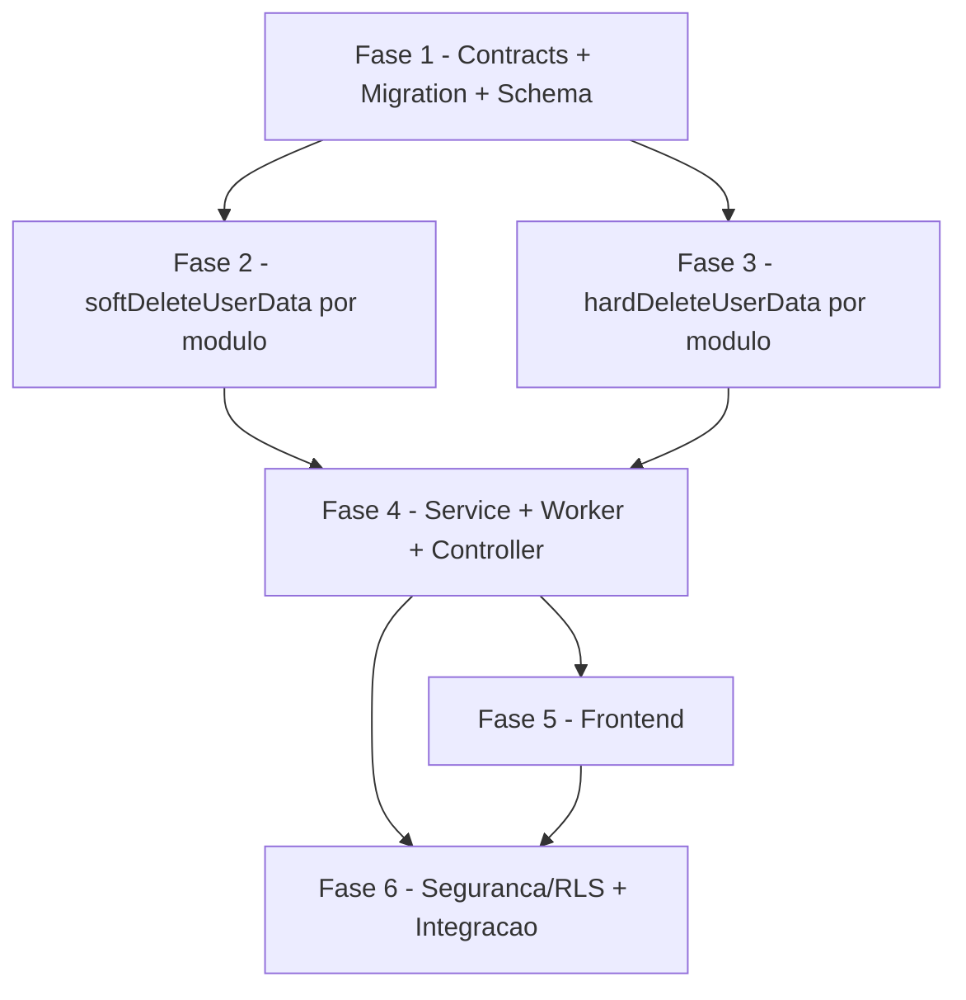

# Backlog: exclusao-dados-pessoais

Escopo: Story 9-2 (LGPD Art. 18 VI) — exclusão/eliminação de dados pessoais. Pipeline assíncrono bifásico (soft → hard delete) com grace period de 7 dias cancelável, espelhando a arquitetura da Story 9-1 (export): módulo `privacy/` estendido, processors BullMQ, método por bounded context (7 contextos), RLS multi-tenant, anonimização irreversível do audit. Fecha o Epic 9.

## Legenda de status

- `[ ]` Pendente
- `[~]` Em andamento
- `[x]` Concluido
- `[!]` Bloqueado

## Legenda de criticidade

- `[C]` Critico - Impacto financeiro direto ou bloqueante
- `[A]` Alto - Funcionalidade essencial
- `[M]` Medio - Necessario mas sem urgencia imediata

---

## FASE 1 - Fundação: Contracts, Migration e Schema

### 1.1 Schemas Zod em packages/types `[C]`

Ref: plan F1.1; spec FR-01..FR-05

- [ ] 1.1.1 Criar `packages/types/src/privacy/deletion.ts` com schemas Zod: `PrivacyDeletionRequestSchema` (`confirm: z.literal('EXCLUIR')`), `PrivacyDeletionResponseSchema` (requestId/status/cancellableUntil/deletionDeadline), `PrivacyDeletionStatusSchema` (enum status pending|soft_deleted|hard_deleted|cancelled|failed + cancelledAt/completedAt nullable), `LeaderBlockerSchema` (`error: z.literal('LEADER_ACTIVE_GROUPS')` + groups[])
- [ ] 1.1.2 Adicionar constantes no mesmo arquivo: `PRIVACY_DELETION_QUEUE_NAME = 'queue:privacy-deletion'`, `PRIVACY_DELETION_JOB_KEY_PREFIX = 'cache:privacy:deletion-job'`, `PRIVACY_DELETION_GRACE_DAYS = 7`, `PRIVACY_DELETION_DEADLINE_DAYS = 30`; e a interface `PrivacyDeletionJobPayload` (requestId, userId, allTenantIds, requestedAt, cancellableUntil, deletionDeadline)
- [ ] 1.1.3 Re-exportar tudo em `packages/types/src/privacy/index.ts` (barrel) e validar que `packages/types/src/index.ts` propaga
- [ ] 1.1.4 Escrever snapshot tests em `packages/types/src/privacy/__tests__/deletion.snapshot.spec.ts` (gate contra breaking changes silenciosos)
- [ ] 1.1.5 Verificar paridade exata de nomes de campo (camelCase) entre `packages/types` e o uso no controller/service

### 1.2 Migration e Schema Prisma `[C]`

Ref: plan F1.2/F1.3; data-model.md; AVS-01

- [ ] 1.2.1 Adicionar model `DeletionRequest` ao `apps/api/prisma/schema.prisma` (id, tenantId, userId, status default `'pending'`, allTenantIds UUID[], cancellableUntil, deletionDeadline, cancelledAt?, confirmedAt?, completedAt?, failureReason?, createdAt, updatedAt) com `@@map("deletion_requests")` + `@@index([userId])` + `@@index([tenantId, userId])`
- [ ] 1.2.2 Adicionar `deletedAt DateTime? @map("deleted_at") @db.Timestamptz` aos 14 models de soft-delete: user_tenants, group_members, meeting_attendance, meeting_telemetry, meeting_participants, meeting_events, reflections, pastoral_alerts, pastoral_actions, pastoral_notes, outreach_intents, lesson_progress, module_progress, trail_progress
- [ ] 1.2.3 Adicionar `anonymizedUserRef String? @map("anonymized_user_ref")` ao model `AuditEvent`
- [ ] 1.2.4 Gerar migration `apps/api/prisma/migrations/<ts>_9-2-deletion-requests/migration.sql`: CREATE TABLE deletion_requests + índices (incl. parcial `WHERE status IN ('pending','soft_deleted')`) + `ALTER TABLE ... ADD COLUMN deleted_at` nas 14 tabelas + índices parciais `WHERE deleted_at IS NULL` (user_tenants, group_members, lesson_progress) + `ALTER TABLE audit_events ADD COLUMN anonymized_user_ref TEXT`
- [ ] 1.2.5 Adicionar RLS na migration para deletion_requests: `ENABLE ROW LEVEL SECURITY` + `CREATE POLICY deletion_requests_tenant USING (NULLIF(current_setting('app.current_tenant_id', TRUE), '')::UUID = tenant_id)`
- [ ] 1.2.6 Verificar a invariante CASCADE FK→users e `updated_at NOT NULL` nas tabelas tocadas; confirmar que nenhuma coluna nova viola RLS spec em 0-rows
- [ ] 1.2.7 Escrever RLS isolation spec `apps/api/test/rls/deletion-requests.rls.spec.ts` (PrismaPg adapter Prisma v7, UUIDs fixos hex, users globais, cleanup só de tabelas mutáveis): tenant A não vê deletion_requests de tenant B; worker via `prisma.client` (bypass RLS) vê todos os tenants

---

## FASE 2 - Backend: softDeleteUserData por Módulo

### 2.1 Users + UserTenants: softDeleteUserData `[C]`

Ref: plan F2.3; dec-006 idempotência

- [ ] 2.1.1 Adicionar `softDeleteUserData(userId: string, tenantId: string): Promise<void>` em `apps/api/src/users/users.service.ts`: `UPDATE user_tenants SET deleted_at = NOW() WHERE user_id = userId AND tenant_id = tenantId AND deleted_at IS NULL` (status do `users` já vira `deletion_pending` no createJob)
- [ ] 2.1.2 Garantir idempotência via guard `deleted_at IS NULL` (aplicar 2x = mesmo resultado, dec-006)
- [ ] 2.1.3 Unit tests `apps/api/src/users/__tests__/users.soft-delete.spec.ts`: idempotência (2x), escopo por tenantId (não vaza), consents NÃO afetados

### 2.2 GroupMembers: softDeleteUserData `[A]`

Ref: plan F2.3; guardrail liderança (dec-009)

- [ ] 2.2.1 Adicionar `softDeleteUserData(userId, tenantId)` em `apps/api/src/group-members/group-members.service.ts`: `UPDATE group_members SET deleted_at = NOW() WHERE user_id = userId AND tenant_id = tenantId AND deleted_at IS NULL`
- [ ] 2.2.2 Unit tests `apps/api/src/group-members/__tests__/group-members.soft-delete.spec.ts`: idempotência + escopo por tenant

### 2.3 Meetings: softDeleteUserData `[A]`

Ref: plan F2.3

- [ ] 2.3.1 Adicionar `softDeleteUserData(userId, tenantId)` em `apps/api/src/meetings/meetings.service.ts`: `UPDATE meeting_attendance, meeting_telemetry, meeting_participants, meeting_events SET deleted_at = NOW() WHERE user_id = userId AND tenant_id = tenantId AND deleted_at IS NULL` (4 tabelas)
- [ ] 2.3.2 Unit tests `apps/api/src/meetings/__tests__/meetings.soft-delete.spec.ts`: idempotência + escopo por tenant nas 4 tabelas

### 2.4 Progress (Trails): softDeleteUserData `[A]`

Ref: plan F2.3

- [ ] 2.4.1 Adicionar `softDeleteUserData(userId, tenantId)` em `apps/api/src/content/progress/progress.service.ts`: `UPDATE lesson_progress, module_progress, trail_progress SET deleted_at = NOW() WHERE user_id = userId AND tenant_id = tenantId AND deleted_at IS NULL`
- [ ] 2.4.2 Unit tests `apps/api/src/content/progress/__tests__/progress.soft-delete.spec.ts`

### 2.5 Pastoral: softDeleteUserData `[C]`

Ref: plan F2.3; AVS-01 (reflections.leader_id NOT NULL); schema confirma outreach_intents.created_by_user_id NOT NULL

- [ ] 2.5.1 Adicionar `softDeleteUserData(userId, tenantId)` em `apps/api/src/pastoral/pastoral.service.ts`: `UPDATE pastoral_alerts (participant_id), pastoral_actions (participant_id), pastoral_notes (participant_id) SET deleted_at = NOW() WHERE <campo> = userId AND tenant_id = tenantId AND deleted_at IS NULL` — atenção: campo é `participant_id`, não `user_id`
- [ ] 2.5.2 outreach_intents: `UPDATE outreach_intents SET deleted_at = NOW() WHERE created_by_user_id = userId AND tenant_id = tenantId AND deleted_at IS NULL` (campo `created_by_user_id`)
- [ ] 2.5.3 reflections: `UPDATE reflections SET deleted_at = NOW() WHERE leader_id = userId AND tenant_id = tenantId AND deleted_at IS NULL` (no soft-delete usa só `deleted_at`; coluna `leader_id` permanece — não há SET NULL aqui)
- [ ] 2.5.4 Unit tests `apps/api/src/pastoral/__tests__/pastoral.soft-delete.spec.ts`: cobrir o campo `participant_id` (alerts/actions/notes), `created_by_user_id` (outreach), `leader_id` (reflections)

### 2.6 Consent + Audit: no-op no soft-delete `[C]`

Ref: plan F2.3; LGPD art. 16 (retenção); imutabilidade 9-3

- [ ] 2.6.1 `ConsentService.softDeleteUserData()` = no-op explícito documentado (RETER consents — LGPD art. 16); apenas stub com comentário e teste assertando que nenhuma linha é alterada
- [ ] 2.6.2 `AuditService.softDeleteUserData()` = no-op no soft-delete (anonimização ocorre só no hard-delete, F2.4); stub + teste
- [ ] 2.6.3 Unit tests confirmando que consents e audit_events permanecem INTACTOS após soft-delete

---

## FASE 3 - Backend: hardDeleteUserData por Módulo

### 3.1 Users: hardDeleteUserData `[C]`

Ref: plan F2.4; OWASP A04/PII (anonimização irreversível)

- [ ] 3.1.1 Adicionar `hardDeleteUserData(userId, tenantId, tx: Prisma.TransactionClient): Promise<void>` em `users.service.ts`: `DELETE FROM user_tenants WHERE user_id = userId AND tenant_id = tenantId`
- [ ] 3.1.2 Anonimizar perfil (UPDATE, não DELETE — preserva FK chain): `UPDATE users SET name = 'Usuário Removido', email = 'removed-<hash>@deleted.invalid', status = 'deleted' WHERE id = userId`, onde `<hash> = sha256(userId + ANONYMIZATION_SALT).slice(0,8)` (hash salted irreversível via `crypto` stdlib; salt de env, nunca o userId puro)
- [ ] 3.1.3 Unit tests `apps/api/src/users/__tests__/users.hard-delete.spec.ts`: name/email anonimizados, status='deleted', hash determinístico mas não-reversível, escopo por tenant no DELETE de user_tenants

### 3.2 GroupMembers + Meetings + Progress: hardDeleteUserData `[A]`

Ref: plan F2.4; schema: meeting_participants.user_id e meeting_events.user_id são nullable

- [ ] 3.2.1 `group-members.service.ts` `hardDeleteUserData(userId, tenantId, tx)`: `DELETE FROM group_members WHERE user_id = userId AND tenant_id = tenantId`
- [ ] 3.2.2 `meetings.service.ts`: `DELETE FROM meeting_attendance, meeting_telemetry WHERE user_id = userId AND tenant_id = tenantId`; `UPDATE meeting_participants SET user_id = NULL WHERE user_id = userId AND tenant_id = tenantId` (user_id nullable confirmado); `UPDATE meeting_events SET user_id = NULL WHERE user_id = userId AND tenant_id = tenantId` (user_id nullable confirmado)
- [ ] 3.2.3 `progress.service.ts`: `DELETE FROM lesson_progress, module_progress, trail_progress WHERE user_id = userId AND tenant_id = tenantId`
- [ ] 3.2.4 Unit tests para os 3 services: DELETE vs SET NULL corretos por tabela, escopo por tenant, idempotência

### 3.3 Pastoral: hardDeleteUserData `[C]`

Ref: plan F2.4; AVS-01 reflections.leader_id NOT NULL → DELETE; schema confirma outreach_intents.created_by_user_id NOT NULL → DELETE (NÃO SET NULL)

- [ ] 3.3.1 `pastoral.service.ts` `hardDeleteUserData(userId, tenantId, tx)`: `DELETE FROM pastoral_alerts, pastoral_actions, pastoral_notes WHERE participant_id = userId AND tenant_id = tenantId`
- [ ] 3.3.2 reflections (AVS-01): coluna `leader_id` é `String @db.Uuid` NOT NULL no schema real → `DELETE FROM reflections WHERE leader_id = userId AND tenant_id = tenantId` (NUNCA `UPDATE ... SET leader_id = NULL` — violaria NOT NULL; reflection é dado pessoal do líder-autor, outros participantes não expostos pela linha)
- [ ] 3.3.3 outreach_intents: schema real tem `created_by_user_id String` NOT NULL → `DELETE FROM outreach_intents WHERE created_by_user_id = userId AND tenant_id = tenantId` (NÃO SET NULL como o plan sugeria — coluna é NOT NULL, mesmo padrão da AVS-01)
- [ ] 3.3.4 Unit tests `apps/api/src/pastoral/__tests__/pastoral.hard-delete.spec.ts`: assertar DELETE em reflections e outreach_intents (não SET NULL), participant_id em alerts/actions/notes, escopo por tenant

### 3.4 Audit: anonimização hard-delete `[C]`

Ref: plan F2.4/F2.5; imutabilidade 9-3 (audit nunca DELETE); OWASP A09

- [ ] 3.4.1 `AuditService.hardDeleteUserData(userId, tenantId)`: `UPDATE audit_events SET user_id = NULL, anonymized_user_ref = 'anonymous-<hash>' WHERE user_id = userId AND tenant_id = tenantId` via `prisma.client.$executeRaw` (worker privilegiado, bypass RLS), onde `<hash>` = mesmo sha256 salted da 3.1.2 (consistência cross-módulo) — audit é RETIDO+anonimizado, nunca deletado (imutabilidade 9-3)
- [ ] 3.4.2 ConsentService: no-op no hard-delete (RETER — LGPD art. 16); stub documentado
- [ ] 3.4.3 Unit tests `apps/api/src/audit/__tests__/audit.anonymize.spec.ts`: user_id→NULL, anonymized_user_ref preenchido, contagem de linhas preservada (audit não perde registros), idempotência (re-anonimizar = mesmo ref), consents intactos

---

## FASE 4 - Backend: Service, Worker, Cleanup e Controller

### 4.1 PrivacyDeletionService `[C]`

Ref: plan F2.1; AVS-03 (backoff); OWASP A01/IDOR (ownership); dec-006/007/009

- [ ] 4.1.1 Criar `apps/api/src/privacy/privacy-deletion.service.ts` com DI espelhando `PrivacyExportService` (BullMqService, PrismaService, RedisService, StorageService + 7 services de domínio + AuditService)
- [ ] 4.1.2 `createJob(userId, tenantId)`: validar guardrail liderança (grupos ativos liderados → lançar 422 `LEADER_ACTIVE_GROUPS` com lista de grupos, dec-009); coletar `allTenantIds` via `userTenant.findMany`; verificar request ativo existente → retornar o mesmo `requestId` (idempotente, dec-006); criar `DeletionRequest` (cancellableUntil = now+7d, deletionDeadline = now+30d); `UPDATE users SET status='deletion_pending'`
- [ ] 4.1.3 AVS-03 — backoff: enfileirar via `attempts: 3, backoff: { type: 'exponential', delay: 60_000 }` (espelha 9-1, NÃO usar custom strategy — `BullMqService` só expõe createQueue/createWorker, sem registro de backoffStrategy); soft-delete enfileirado com `delay` fixo = grace period (7d), hard-delete com `delay` = deadline (ou re-enfileirado pelo worker pós-soft). 2 jobs nomeados (`soft-delete-user-data`, `hard-delete-user-data`)
- [ ] 4.1.4 `cancelRequest(requestId, userId)` — OWASP A01/IDOR: buscar request por `{ id: requestId, userId }` (ownership obrigatório no WHERE, não só por id); se não pertencer ao userId autenticado → 404 (não 403, evita enumeration); validar `now < cancellableUntil` senão 403/410; `UPDATE DeletionRequest SET status='cancelled', cancelled_at=NOW()`; restaurar `users.status='active'`; remover jobs BullMQ pendentes
- [ ] 4.1.5 `getStatus(requestId, userId)` — OWASP A01/IDOR: query SEMPRE com `{ id: requestId, userId }` (ownership check obrigatório — corrige o gap do 9-1 getExportStatus que lookupa só por id); 404 se não pertencer
- [ ] 4.1.6 `softDeleteAllTenants(payload)` e `hardDeleteAllTenants(payload)`: iterar `allTenantIds`; soft chama `softDeleteUserData` por módulo; hard executa `hardDeleteUserData` por módulo dentro de transação por tenant (`prisma.client.$transaction`), depois anonimiza audit + cleanup Redis/MinIO; guard de status `!= 'cancelled'` antes de executar (replay/idempotência, dec-007 rollback intra-tenant)
- [ ] 4.1.7 `handleJobFailure(requestId, reason)`: `UPDATE status='failed', failure_reason` + Sentry capture + alerta DPO (método explícito, espelha 9-1 CHK008)
- [ ] 4.1.8 Unit tests `apps/api/src/privacy/__tests__/privacy-deletion.service.spec.ts`: ownership em getStatus/cancelRequest (IDOR — request de outro user → 404), guardrail 422, idempotência createJob (2x=mesmo id), backoff exponential params, rollback transacional em falha intra-tenant

### 4.2 PrivacyDeletionProcessor + cleanup Redis/MinIO `[C]`

Ref: plan F2.2/F2.5; replay idempotente (dec-007)

- [ ] 4.2.1 Criar `apps/api/src/privacy/privacy-deletion.processor.ts` (skeleton de `PrivacyExportProcessor`): `createWorker(PRIVACY_DELETION_QUEUE_NAME, ...)` despachando por `job.name` (soft-delete-user-data / hard-delete-user-data); verificar `status != 'cancelled'` antes de executar (replay-safe)
- [ ] 4.2.2 Cleanup pós hard-delete (no service, chamado pelo worker): Redis SCAN+DEL por `userId` (incl. `session:{userId}:*` e `cache:*` namespaces); MinIO listar+deletar objetos sob `user/{userId}/` e `exports/global/{userId}/`; `UPDATE deletion_requests SET status='hard_deleted', completed_at=NOW()`; emitir audit event `privacy.deletion.completed`
- [ ] 4.2.3 Integration test do worker: soft então hard, verificar idempotência (executar 2x = mesmo resultado), guard de cancelamento (request cancelada → worker no-op)

### 4.3 Controller: 3 endpoints + export fix + module `[C]`

Ref: plan F2.6/F2.7/F2.8; OWASP A01/A07; Q4/dec-012

- [ ] 4.3.1 Adicionar a `PrivacyController` (todos `@UseGuards(KeycloakAuthGuard)`): `POST deletion` (@HttpCode 202, ZodValidationPipe(PrivacyDeletionRequestSchema), deriva userId/tenantId via `getRequestContext()`), `DELETE deletion/:requestId` (passa userId do contexto p/ ownership), `GET deletion/:requestId` (passa userId do contexto p/ ownership)
- [ ] 4.3.2 OWASP A01 — em DELETE e GET, SEMPRE repassar `userId = getRequestContext().userId` ao service para o ownership check; nunca confiar só no `:requestId` do path (corrige o padrão do 9-1 getExportStatus)
- [ ] 4.3.3 `PrivacyExportService.createJob`: adicionar guard `if (user.status === 'deletion_pending') throw new ConflictException(...)` antes do check de job existente (Q4/dec-012 — export bloqueado durante deleção pendente)
- [ ] 4.3.4 `PrivacyModule`: adicionar `PrivacyDeletionService` + `PrivacyDeletionProcessor` a providers; exportar `PrivacyDeletionService`
- [ ] 4.3.5 Integration test `apps/api/src/__tests__/privacy-deletion.integration.spec.ts`: cascade completo (criar user multi-tenant com dados em todos os módulos → soft → hard → verificar por tabela: users anonimizado, audit anonimizado, consents INTACTOS, soft-deleted DELETADOS no hard); IDOR (user B não cancela/lê request de user A → 404); export bloqueado durante deletion_pending → 409

---

## FASE 5 - Frontend

### 5.1 Hook + endpoint user.status para banner `[A]`

Ref: plan F3.2/F3.3; AVS-02 (useAuth não expõe status)

- [ ] 5.1.1 AVS-02 — verificação confirmada: NÃO existe `useAuth()` expondo `user.status` no projeto (padrão é hooks TanStack dedicados, ex. `/users/me/onboarding-status`); criar endpoint backend `GET /api/v1/users/me` (ou `/users/me/status`) em `users.controller.ts` retornando `{ id, email, name, status }` (status necessário para o banner `deletion_pending`)
- [ ] 5.1.2 Criar hook `apps/web/src/lib/api/hooks/use-current-user.ts` (`useCurrentUser()`) espelhando `useOnboardingStatus` (TanStack Query → `/users/me`), com schema inline validado
- [ ] 5.1.3 Criar `apps/web/src/hooks/use-privacy-deletion.ts`: `useDeletionRequest()` (POST), `useCancelDeletion()` (DELETE), `useDeletionStatus(requestId)` (GET)
- [ ] 5.1.4 Unit tests dos hooks (MSW): sucesso, 422 leader_blocked, 409 deletion_pending, 404 ownership

### 5.2 DeletionSection + DeletionPendingBanner `[A]`

Ref: plan F3.1/F3.3/F3.4

- [ ] 5.2.1 Criar `DeletionSection` (estados: idle / leader_blocked / pending / cancelled) com diálogo explicativo (o que SERÁ removido por módulo + o que SERÁ RETIDO: audit anonimizado, consents) e input de confirmação exigindo digitação literal de `EXCLUIR`
- [ ] 5.2.2 Criar `apps/web/src/components/deletion-pending-banner.tsx`: exibe quando `useCurrentUser().data.status === 'deletion_pending'`; "Sua conta será excluída em {N} dias. [Cancelar solicitação]"
- [ ] 5.2.3 Inserir banner em `apps/web/app/(authenticated)/layout.tsx` (abaixo do header, dentro de NavigationShell) e `DeletionSection` após `ExportSection` em `.../privacidade/page.tsx`
- [ ] 5.2.4 Component tests: confirmação `EXCLUIR` (botão desabilitado até match), banner visível só em deletion_pending, leader_blocked lista grupos

### 5.3 i18n + MSW `[M]`

Ref: plan F3.5/F3.6

- [ ] 5.3.1 Adicionar bloco `privacy.deletion.*` em `apps/web/messages/pt-BR.json` (title, description, confirmPlaceholder/Label/Mismatch, requestButton, cancelButton, statusPending/Cancelled/Completed, willRemove/willRetain, retainAudit/retainConsent, leaderBlocked, transferLeadership, dissolveGroup, gracePeriodDays, deadlineDays) — vocabulário pastoral, PT-BR
- [ ] 5.3.2 Adicionar handlers MSW em `apps/web/mocks/handlers/privacy.ts`: `POST deletion` (202 | 422 leader_blocked | 409 deletion_pending), `DELETE deletion/:id` (200 | 404), `GET deletion/:id` (status), `GET /users/me` (status)
- [ ] 5.3.3 Verificar gate MSW `NEXT_PUBLIC_API_MOCKING` e que os testes FE passam com os handlers

---

## FASE 6 - Testes de Segurança/RLS e Integração Final

### 6.1 RLS isolation + guardrail `[C]`

Ref: plan F4.3/F4.4; OWASP A01; armadilhas RLS do projeto

- [ ] 6.1.1 RLS spec `apps/api/test/rls/deletion-requests.rls.spec.ts` (PrismaPg adapter, UUIDs fixos hex, users globais, cleanup só mutável): tenant A não vê deletion_requests de tenant B; UPDATE de soft-delete respeita tenant_id (não afeta outros tenants); worker `prisma.client` vê todos os tenants
- [ ] 6.1.2 RLS spec para anonimização de audit em 0-rows (imutabilidade 9-3): UPDATE de anonimização não quebra com 0 linhas afetadas
- [ ] 6.1.3 Teste de guardrail liderança: líder com grupo ativo → 422 + lista; líder de grupo único → 422 + opção dissolver; não-líder → 202
- [ ] 6.1.4 Teste IDOR end-to-end: token de user B em GET/DELETE deletion/:id de user A → 404 (sem enumeration)

### 6.2 Integração final + smoke `[C]`

Ref: plan F5.1/F5.2; GUARDRAIL feature-00c (push direto em dev bypassa CI)

- [ ] 6.2.1 Subir `docker-compose.test.yml` e rodar a suíte RLS completa (apps/api/test/rls) contra Postgres real; confirmar isolamento + imutabilidade audit
- [ ] 6.2.2 Smoke manual: `POST /privacy/deletion {confirm:'EXCLUIR'}` → 202 + DeletionRequest criada + users.status=deletion_pending; `GET /:id` → pending; invocar worker soft-delete → `deleted_at` preenchido; `DELETE /:id` fora do grace simulado → 403
- [ ] 6.2.3 GUARDRAIL: antes de declarar done — auditar `git status`/`git log` reais; `pnpm lint` + `pnpm build` + `pnpm test` verdes localmente; nunca declarar concluído com base só no sumário; confirmar migration aplicada e RLS specs verdes

---

## Matriz de Dependencias

## Resumo Quantitativo

| Fase | Tarefas | Subtarefas | Criticidade |
|------|---------|------------|-------------|
| 1 - Contracts + Migration + Schema | 2 | 13 | C |
| 2 - softDeleteUserData por modulo | 6 | 16 | C/A |
| 3 - hardDeleteUserData por modulo | 4 | 14 | C/A |
| 4 - Service + Worker + Controller | 3 | 16 | C |
| 5 - Frontend | 3 | 12 | A/M |
| 6 - Seguranca/RLS + Integracao | 2 | 7 | C |
| **Total** | **20** | **78** | - |

## Escopo Coberto

| Item | Descricao | Fase |
|------|-----------|------|
| DEL-01 | Contracts Zod + migration (deletion_requests + deleted_at em 14 tabelas + anonymized_user_ref) + RLS | 1 |
| DEL-02 | softDeleteUserData() nos 7 bounded contexts (idempotente via deleted_at) | 2 |
| DEL-03 | hardDeleteUserData() nos 7 contexts: DELETE/SET NULL conforme nullability real; anonimizacao users + audit (sha256 salted) | 3 |
| DEL-04 | PrivacyDeletionService + Processor + cleanup Redis/MinIO + 3 endpoints + ownership/IDOR + export 409 | 4 |
| DEL-05 | Frontend: endpoint /users/me + useCurrentUser + DeletionSection + banner + i18n + MSW | 5 |
| DEL-06 | RLS isolation, IDOR e guardrail tests + integracao + smoke contra Postgres real | 6 |
| AVS-01 | reflections.leader_id NOT NULL e outreach_intents.created_by_user_id NOT NULL → hard-delete usa DELETE (nao SET NULL) | 3 |
| AVS-02 | useAuth() nao expoe status → novo GET /users/me + useCurrentUser para o banner | 5 |
| AVS-03 | backoff exponential (attempts:3, delay 60_000) espelhando 9-1; NAO custom strategy (BullMqService sem backoffStrategy) | 4 |

## Escopo Excluido

| Item | Descricao | Motivo |
|------|-----------|--------|
| EXC-01 | Exclusao de consents/ConsentRecord | LGPD art. 16 — base legal exige retencao; no-op explicito |
| EXC-02 | Hard-delete (DELETE) de linhas de audit_events | Imutabilidade 9-3 — audit e retido+anonimizado, nunca deletado |
| EXC-03 | Cron/scheduler do hard-delete em 30d | Coberto pelo delay do job BullMQ; agendador dedicado fora do escopo desta story |
| EXC-04 | Fluxo de transferencia de lideranca | Guardrail apenas BLOQUEIA (422) e oferece dissolver; transferencia e feature de grupos preexistente |
