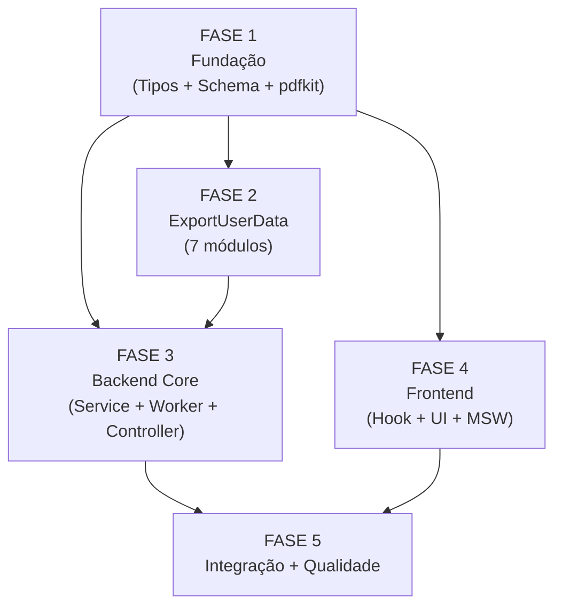

# Backlog: exportacao-dados-pessoais

**Feature:** Story 9-1 — Exportação de Dados Pessoais / Portabilidade LGPD
**Epic:** 9 (LGPD/Privacidade)
**Gerado em:** 2026-06-12
**Spec:** [spec.md](./spec.md) | **Plano:** [plan.md](./plan.md)

---

## Legenda de status

`- [ ]` pendente · `- [x]` concluído

## Legenda de criticidade

`[C]` crítico (regulatório/segurança) · `[A]` alto (core funcional) · `[M]` médio (qualidade/observabilidade)

---

## FASE 1 - Fundação: Tipos, Schema e Infraestrutura

> Pré-requisito de todas as fases. Resolve CHK018 (prefixo MinIO = `exports/global/`), CHK021 (backoff = exponential crescente 1m/5m/30m) e gaps CHK008/CHK028 documentados. Sem runtime dependencies além de Prisma e packages/types.

### 1.1 Schemas Zod em packages/types `[C]`

Ref: spec §6.4, data-model.md §Schemas Zod, contracts/api.md

- [x] 1.1.1 Criar `packages/types/src/privacy/export.ts` com todos os schemas Zod: `PrivacyExportRequestSchema`, `PrivacyExportJobResponseSchema`, `PrivacyExportStatusSchema`, `UserProfileExportSchema`, `UserExportDataSchema`, `GroupsExportDataSchema`, `MeetingsExportDataSchema`, `TrailsExportDataSchema`, `PastoralExportDataSchema`, `ConsentExportDataSchema`, `AuditExportDataSchema`, `FullExportPayloadSchema`
- [x] 1.1.2 Adicionar constantes ao mesmo arquivo: `PRIVACY_EXPORT_QUEUE_NAME = 'queue:privacy-export'`, `PRIVACY_EXPORT_JOB_KEY_PREFIX = 'cache:privacy:export-job'`, `PRIVACY_EXPORT_JOB_TTL_SECONDS = 172800`, `PRIVACY_EXPORT_SIGNED_URL_SECONDS = 172800`, `PRIVACY_EXPORT_ESTIMATED_HOURS = 24`
- [x] 1.1.3 Re-exportar todos os schemas e constantes em `packages/types/src/index.ts` (ou `packages/types/src/privacy/index.ts` + barrel)
- [x] 1.1.4 Escrever snapshot tests para todos os schemas Zod em `packages/types/src/privacy/__tests__/export.snapshot.spec.ts` (gate contra breaking changes silenciosos)
- [x] 1.1.5 Verificar paridade exata de nomes de campo entre `packages/types` e `contracts/api.md` (camelCase em todos)

### 1.2 Migration e Schema Prisma `[C]`

Ref: data-model.md §Entity PrivacyExportJob, spec §AC9

- [x] 1.2.1 Adicionar model `PrivacyExportJob` ao `apps/api/prisma/schema.prisma` com todos os campos: `id`, `tenantId`, `userId`, `format`, `status` (default `'accepted'`), `allTenantIds` (UUID[]), `objectKey` (nullable), `signedUrl` (nullable), `expiresAt` (nullable), `failureReason` (nullable), `requestedAt`, `completedAt` (nullable), `createdAt` (default `NOW()`)
- [x] 1.2.2 Adicionar `@@map("privacy_export_jobs")` e todos os `@map()` para snake_case no model
- [x] 1.2.3 Gerar migration `apps/api/prisma/migrations/<ts>_add_privacy_export_jobs/migration.sql` com DDL completo (tabela + índices)
- [x] 1.2.4 Adicionar índices na migration: `idx_privacy_export_jobs_user_id (user_id)`, `idx_privacy_export_jobs_tenant_user (tenant_id, user_id)`, `idx_privacy_export_jobs_status (status) WHERE status IN ('accepted', 'processing')`
- [x] 1.2.5 Adicionar RLS policy na migration: `ENABLE ROW LEVEL SECURITY` + `CREATE POLICY privacy_export_jobs_tenant USING (NULLIF(current_setting('app.current_tenant_id', TRUE), '')::UUID = tenant_id)`
- [x] 1.2.6 Escrever RLS isolation spec em `apps/api/test/rls/privacy-export-jobs.rls.spec.ts` — garantir que tenant A não vê jobs do tenant B (AC9)

### 1.3 Instalar pdfkit `[A]`

Ref: spec §CL-03, plan.md §Riscos

- [x] 1.3.1 Adicionar `pdfkit@0.15.x` em dependencies de `apps/api/package.json`
- [x] 1.3.2 Adicionar `@types/pdfkit` em devDependencies de `apps/api/package.json`
- [x] 1.3.3 Executar `pnpm install` e verificar que build `pnpm build` em `apps/api` continua verde
- [x] 1.3.4 Verificar que pdfkit não exige fontes nativas no ambiente Docker/CI (usar embedding de fonte padrão se necessário)

---

## FASE 2 - Backend: exportUserData por Módulo

> Adicionar `exportUserData(userId: string, tenantId: string)` em 7 serviços existentes. Cada método NUNCA lança — retorna arrays/objetos vazios se sem dados. Usar `prisma.client` diretamente (sem `withTenantTx`) por ser contexto de worker privilegiado.

### 2.1 Users: exportUserData `[C]`

Ref: spec §2.5, data-model.md §UserExportDataSchema, plan.md §Fase 2 passo 5

- [x] 2.1.1 Adicionar método `exportUserData(userId: string, tenantId: string): Promise<UserExportData>` em `apps/api/src/users/users.service.ts`
- [x] 2.1.2 Implementar query de profile: `prisma.client.user.findUnique({ where: { id: userId }, select: { id, email, name, status, onboardingCompletedAt, createdAt, updatedAt } })` — EXCLUIR `tenantId` (metadado interno, dec-019/CL-02)
- [x] 2.1.3 Implementar query de tenants do usuário: `prisma.client.userTenant.findMany({ where: { userId }, select: { tenantId, role, createdAt } })` — mapear `createdAt` como `joinedAt`
- [x] 2.1.4 Mapear datas com `.toISOString()` e retornar `{ profile: UserProfileExport | null, tenants: [...] }`
- [x] 2.1.5 Escrever unit tests em `apps/api/src/users/__tests__/users.export.spec.ts` — cobrir: usuário sem dados, dados completos, data mapping ISO 8601

### 2.2 Groups: exportUserData `[A]`

Ref: spec §2.5, data-model.md §GroupsExportDataSchema; path real: `apps/api/src/group-members/group-members.service.ts`

- [x] 2.2.1 Adicionar método `exportUserData(userId: string, tenantId: string): Promise<GroupsExportData>` em `apps/api/src/group-members/group-members.service.ts`
- [x] 2.2.2 Implementar query: `prisma.client.groupMember.findMany({ where: { userId, tenantId }, include: { group: { select: { name: true } } } })` — mapear `groupName` do join
- [x] 2.2.3 Retornar `{ memberships: Array<{ groupId, groupName, role, joinedAt }> }` com datas ISO 8601
- [x] 2.2.4 Escrever unit tests em `apps/api/src/group-members/__tests__/group-members.export.spec.ts`

### 2.3 Meetings: exportUserData `[A]`

Ref: spec §2.5, data-model.md §MeetingsExportDataSchema; modelos: `MeetingAttendance` + `MeetingParticipantRecord` (userId nullable — filtrar `userId: { equals: userId }`)

- [x] 2.3.1 Adicionar método `exportUserData(userId: string, tenantId: string): Promise<MeetingsExportData>` em `apps/api/src/meetings/meetings.service.ts`
- [x] 2.3.2 Implementar query de attendance: `prisma.client.meetingAttendance.findMany({ where: { userId, tenantId } })` — busca títulos em bulk via meetingMap
- [x] 2.3.3 Implementar query de participantRecords: `prisma.client.meetingParticipantRecord.findMany({ where: { userId: { equals: userId }, tenantId } })` — `userId` é nullable no model, usar `{ equals: userId }`
- [x] 2.3.4 Retornar `{ attendance: [...], participantRecords: [...] }` com datas ISO 8601
- [x] 2.3.5 Escrever unit tests em `apps/api/src/meetings/__tests__/meetings.export.spec.ts` — cobrir o caso `userId` nullable em `participantRecords`

### 2.4 Trails: exportUserData `[A]`

Ref: spec §2.5, data-model.md §TrailsExportDataSchema; paths reais: `TrailProgress` + `LessonProgress` (ambos têm `userId`, `tenantId`). Service owner: `apps/api/src/content/progress/progress.service.ts`

- [x] 2.4.1 Adicionar método `exportUserData(userId: string, tenantId: string): Promise<TrailsExportData>` em `apps/api/src/content/progress/progress.service.ts`
- [x] 2.4.2 Implementar query de trailProgress: `prisma.client.trailProgress.findMany({ where: { userId, tenantId } })` — busca trail names em bulk via trailMap
- [x] 2.4.3 Implementar query de lessonProgress: `prisma.client.lessonProgress.findMany({ where: { userId, tenantId }, include: { lesson: { select: { title: true } } } })` — mapear `lessonName` (campo `title`), `status.toString()`, `completedAt`
- [x] 2.4.4 Retornar `{ trailProgress: [...], lessonProgress: [...] }` com datas ISO 8601 nullable
- [x] 2.4.5 Escrever unit tests em `apps/api/src/content/progress/__tests__/progress.export.spec.ts`

### 2.5 Pastoral: exportUserData `[C]`

Ref: spec §2.5 + §CL-04, data-model.md §PastoralExportDataSchema; campo-chave: `participantId` (não `userId`) em `PastoralAlert` e `PastoralNote`

- [x] 2.5.1 Adicionar método `exportUserData(userId: string, tenantId: string): Promise<PastoralExportData>` em `apps/api/src/pastoral/pastoral.service.ts`
- [x] 2.5.2 Implementar query de alertsAboutMe: `prisma.client.pastoralAlert.findMany({ where: { participantId: userId, tenantId }, select: { id, signalType, createdAt } })` — atenção: campo é `participantId`, não `userId`
- [x] 2.5.3 Implementar query de notesAboutMe: `prisma.client.pastoralNote.findMany({ where: { participantId: userId, tenantId }, select: { id, noteType, occurredAt, content } })`
- [x] 2.5.4 PastoralAction EXCLUÍDA do export (dec-021/CL-04 — fora do escopo especificado)
- [x] 2.5.5 Retornar `{ alertsAboutMe: [...], notesAboutMe: [...] }` com datas ISO 8601
- [x] 2.5.6 Escrever unit tests em `apps/api/src/pastoral/__tests__/pastoral.export.spec.ts` — testar campo `participantId`

### 2.6 Consent: exportConsentData `[C]`

Ref: spec §2.2, data-model.md §ConsentExportDataSchema; usa `ConsentRepository` existente em `apps/api/src/consent/`

- [x] 2.6.1 Adicionar método `exportConsentData(userId: string, tenantId: string): Promise<ConsentExportData>` em `apps/api/src/consent/consent.service.ts`
- [x] 2.6.2 Usar `ConsentRepository` existente: chamar `findAllAcceptancesByUser(userId)` — mapear `documentType`, `acceptedAt` como ISO 8601
- [x] 2.6.3 Chamar `findWithdrawalsByUser(userId, tenantId)` — mapear `consentType`, `timestamp` como ISO 8601
- [x] 2.6.4 Retornar `{ acceptances: [...], withdrawals: [...] }`
- [x] 2.6.5 Escrever unit tests em `apps/api/src/consent/__tests__/consent.export.spec.ts`

### 2.7 Audit: exportUserData `[C]`

Ref: spec §2.5, data-model.md §AuditExportDataSchema; AuditEvent.userId pode ser nullable — usar `{ equals: userId }`

- [x] 2.7.1 Adicionar método `exportUserData(userId: string, tenantId: string): Promise<AuditExportData>` em `apps/api/src/audit/audit.service.ts`
- [x] 2.7.2 Implementar query: `prisma.client.auditEvent.findMany({ where: { userId: { equals: userId }, tenantId }, select: { action, resource, resourceId, timestamp } })` — mapear `timestamp` como ISO 8601
- [x] 2.7.3 Retornar `{ events: Array<{ action, resource, resourceId: string | null, timestamp }> }`
- [x] 2.7.4 Escrever unit tests em `apps/api/src/audit/__tests__/audit.export.spec.ts` — cobrir `userId` nullable

---

## FASE 3 - Backend Core: PrivacyExportService e Worker

> Núcleo do export assíncrono. Depende de FASE 1 (schema Prisma + tipos) e FASE 2 (todos os exportUserData). Prefixo MinIO: `exports/global/` (dec-019/CHK018). Backoff: exponential crescente 1m/5m/30m (dec-020/CHK021).

### 3.1 PrivacyExportService `[C]`

Ref: spec §FR-01, §FR-02, §FR-04, plan.md §Fase 3, contracts/api.md

- [x] 3.1.1 Criar `apps/api/src/privacy/privacy-export.service.ts` com `@Injectable() PrivacyExportService`
- [x] 3.1.2 Implementar `createJob(userId: string, format: 'json'|'pdf', tenantId: string): Promise<PrivacyExportJobResponse>`:
  - Query `allTenantIds` via `prisma.client.userTenant.findMany({ where: { userId } })` (modo privilegiado, sem RLS)
  - Verificar job ativo: `findFirst({ where: { userId, tenantId, status: { in: ['accepted', 'processing'] } } })` — retornar 409 via `ConflictException` se existe
  - INSERT `privacy_export_jobs` com status `accepted`, `requestedAt = new Date()`
  - `queue.add('export-personal-data', payload, { attempts: 3, backoff: { type: 'exponential', delay: 60_000 } })` — delay: 60s/5min/30min crescente (dec-020)
  - Gravar Redis `cache:privacy:export-job:<jobId>` = `{ jobId, status: 'accepted', signedUrl: null, expiresAt: null, failureReason: null }` com TTL 172800s
  - Retornar `{ jobId, status: 'accepted', estimatedCompletionHours: 24 }`
- [x] 3.1.3 Implementar `getJobStatus(jobId: string): Promise<PrivacyExportStatus>`:
  - Ler Redis `cache:privacy:export-job:<jobId>` — retornar 404 via `NotFoundException` se ausente (TTL expirado)
  - Retornar objeto `{ jobId, status, signedUrl, expiresAt, failureReason }` — `signedUrl: null` quando não completo
- [x] 3.1.4 Implementar `processExportJob(payload: PrivacyExportJobPayload): Promise<void>`:
  - UPDATE DB `status = 'processing'` + Redis `status = 'processing'`
  - Para cada `tenantId` em `payload.allTenantIds`: chamar todos os 7 `exportUserData`/`exportConsentData`
  - Gerar `FullExportPayload` e serializar (JSON.stringify ou PDF via pdfkit)
  - Upload MinIO: `storageService.upload(objectKey, buffer, mimeType)` — key: `exports/global/{userId}/{YYYY-MM-DD}-{jobId}.{format}` (dec-019)
  - Obter `signedUrl` + UPDATE DB/Redis completed — `signedUrl` só em `Logger.debug`
  - Enfileirar notificação stub em `queue:notifications`
- [x] 3.1.5 Implementar `handleJobFailure(jobId: string, reason: string): Promise<void>` — UPDATE DB + Redis (CHK008)
- [x] 3.1.6 Implementar `generatePdf(payload: FullExportPayload): Promise<Buffer>` — usar pdfkit dinâmico + seções por tenant

### 3.2 PrivacyExportProcessor (BullMQ Worker) `[C]`

Ref: spec §2.4, plan.md §Worker — Modo Privilegiado, reports.processor.ts como template

- [x] 3.2.1 Criar `apps/api/src/privacy/privacy-export.processor.ts` implementando `OnModuleInit`
- [x] 3.2.2 Em `onModuleInit()`: chamar `bullMqService.createWorker(PRIVACY_EXPORT_QUEUE_NAME, handler)` — mesmo padrão de `reports.processor.ts`
- [x] 3.2.3 Handler: verificar `job.name === 'export-personal-data'` → chamar `privacyExportService.processExportJob(job.data)`
- [x] 3.2.4 Tratar erro do handler: chamar `privacyExportService.handleJobFailure(job.data.jobId, error.message)` em caso de exceção
- [x] 3.2.5 Verificar que o processor NÃO usa `RequestContext` (job privilegiado — sem HTTP request)

### 3.3 privacy.controller.ts — novos endpoints `[C]`

Ref: contracts/api.md §POST + §GET, spec §FR-01 + §FR-04

- [x] 3.3.1 Adicionar endpoint `POST /api/v1/privacy/export` no `apps/api/src/privacy/privacy.controller.ts`: 202 + KeycloakAuthGuard + ZodValidationPipe + retorna `{ data: { jobId, status, estimatedCompletionHours } }`
- [x] 3.3.2 Adicionar endpoint `GET /api/v1/privacy/export/:jobId` no controller: retorna `{ data: { jobId, status, signedUrl, expiresAt, failureReason } }`
- [x] 3.3.3 Erros 404 e 409 via AllExceptionsFilter existente (NotFoundException e ConflictException já mapeados)

### 3.4 privacy.module.ts — atualizar imports `[A]`

Ref: plan.md §Fase 3 passo 14

- [x] 3.4.1 `BullMqModule` é @Global — disponível sem import explícito
- [x] 3.4.2 Importar `StorageModule` em `privacy.module.ts`
- [x] 3.4.3 Importar `ConsentModule` em `privacy.module.ts`
- [x] 3.4.4 Importar UsersModule, GroupMembersModule, MeetingsModule, ContentModule, PastoralModule, AuditModule, AuthModule em `privacy.module.ts`
- [x] 3.4.5 Declarar `PrivacyExportService` e `PrivacyExportProcessor` em `providers` do módulo

---

## FASE 4 - Frontend: Seção "Meus Exports"

> Estende a página de privacidade existente (`/app/consumo/perfil/privacidade`). Depende de FASE 1 (tipos Zod). Polling a cada 5s via TanStack Query.

### 4.1 i18n PT-BR `[M]`

Ref: spec §FR-06 (implícito), plan.md §Fase 4 passo 16; arquivo: `apps/web/messages/pt-BR.json`

- [x] 4.1.1 Adicionar chaves `privacy.export.title`, `privacy.export.requestButton`, `privacy.export.formatJson`, `privacy.export.formatPdf`, `privacy.export.statusAccepted`, `privacy.export.statusProcessing`, `privacy.export.statusCompleted`, `privacy.export.statusFailed`, `privacy.export.downloadLink`, `privacy.export.toastCompleted`, `privacy.export.toastFailed`, `privacy.export.duplicateWarning`, `privacy.export.estimatedHours` em `apps/web/messages/pt-BR.json`
- [x] 4.1.2 Usar vocabulário pastoral/pessoal: "Meus dados", "Exportar meus dados", "Seu arquivo está pronto" (não termos corporativos)

### 4.2 Hook usePrivacyExport `[A]`

Ref: spec §FR-04 + §FR-05, plan.md §Fase 4 passo 17, AC6 + AC7

- [x] 4.2.1 Criar `apps/web/app/(authenticated)/app/consumo/perfil/privacidade/hooks/use-privacy-export.ts` como Client Component hook
- [x] 4.2.2 Implementar `useRequestExport(format: 'json'|'pdf')`: mutation TanStack Query para `POST /api/v1/privacy/export` — retornar `jobId`
- [x] 4.2.3 Implementar `useExportStatus(jobId: string | null)`: query TanStack Query com `refetchInterval: 5_000` quando `status !== 'completed' && status !== 'failed'` e `jobId !== null`
- [x] 4.2.4 Parar polling quando status for `completed` ou `failed` (`refetchInterval: false`)
- [x] 4.2.5 Expor `{ requestExport, status, signedUrl, isPolling, error }` ao componente pai
- [x] 4.2.6 Escrever testes do hook em `hooks/__tests__/use-privacy-export.spec.ts` usando MSW

### 4.3 Componentes de Export na página de privacidade `[A]`

Ref: spec §FR-05, §FR-06 (UI), plan.md §Fase 4 passo 18, AC6 + AC7

- [x] 4.3.1 Modificar `apps/web/app/(authenticated)/app/consumo/perfil/privacidade/page.tsx` para adicionar seção "Meus Exports"
- [x] 4.3.2 Adicionar botão "Exportar meus dados" com seletor de formato (JSON ou PDF) — dispara `useRequestExport`
- [x] 4.3.3 Exibir estado do export em andamento (status `accepted`/`processing`) com indicador de progresso
- [x] 4.3.4 Exibir toast quando `status === 'completed'` via shadcn/ui Toast — mensagem PT-BR do i18n
- [x] 4.3.5 Exibir link de download quando `status === 'completed'` com `signedUrl` — abrir em nova aba
- [x] 4.3.6 Exibir aviso de export duplicado se POST retornar 409 (mensagem PT-BR)
- [x] 4.3.7 Escrever testes de componente em `__tests__/privacy-export.spec.tsx` — cobrir AC6 (botão exportar) e AC7 (toast completed)

### 4.4 MSW Handlers `[M]`

Ref: plan.md §Fase 4 passo 19

- [x] 4.4.1 Adicionar handler `POST /api/v1/privacy/export` em `apps/web/mocks/handlers/privacy.ts` — retornar 202 com jobId mock
- [x] 4.4.2 Adicionar handler `GET /api/v1/privacy/export/:jobId` — retornar sequência de status: `accepted` → `processing` → `completed` com `signedUrl` mock
- [x] 4.4.3 Adicionar handler de 409 para testar duplicate detection no componente

---

## FASE 5 - Testes de Integração e Qualidade

> Testes cross-módulo que não cabem nos unit tests de cada fase. Depende de FASE 1-4 completas. Inclui benchmark NFR-P1 e RLS isolation.

### 5.1 Integration Test — Completude do Export `[C]`

Ref: spec §AC2, plan.md §Fase 5 passo 20

- [x] 5.1.1 Criar `apps/api/src/privacy/__tests__/privacy-export.integration-spec.ts`
- [x] 5.1.2 Criar fixtures para todos os 7 módulos (1 registro por módulo para o userId de teste)
- [x] 5.1.3 Testar que `processExportJob` chama todos os 7 `exportUserData`/`exportConsentData` e produz `FullExportPayload` com seções não-nulas (AC2)
- [x] 5.1.4 Testar comportamento "usuário sem dados": todos os `exportUserData` retornam arrays vazios → export gerado com seções vazias, sem erro (AC8)
- [x] 5.1.5 Testar cenário multi-tenant: 2 tenants → export contém seção `tenants[]` com 2 entradas (spec §FR-03)
- [x] 5.1.6 Benchmark NFR-P1: medir tempo de `processExportJob` com dados mock de 5 tenants × 10 registros/módulo — deve ser < 30s (gap CHK042 tratado como volume de referência para MVP)

### 5.2 Integration Test — Fluxo completo POST→polling `[C]`

Ref: spec §AC1 + §AC3 + §AC4 + §AC5

- [x] 5.2.1 Criar `apps/api/src/privacy/__tests__/privacy-export.e2e-spec.ts` (ou adicionar à suite existente)
- [x] 5.2.2 Testar `POST /api/v1/privacy/export` → 202 com `jobId` (AC1)
- [x] 5.2.3 Testar `GET /api/v1/privacy/export/:jobId` → retorna status do Redis (AC3)
- [x] 5.2.4 Testar 409 para segundo POST com job ativo (AC4)
- [x] 5.2.5 Testar mock de falha após 3 tentativas → `handleJobFailure` atualiza DB e Redis com `status: 'failed'` (AC5 + CHK008)
- [x] 5.2.6 Testar 404 quando jobId não existe no Redis

### 5.3 RLS Isolation Spec `[C]`

Ref: spec §NFR-T1, §AC9, data-model.md §RLS

- [x] 5.3.1 Implementar `apps/api/test/rls/privacy-export-jobs.rls.spec.ts` seguindo padrão das outras RLS specs do projeto
- [x] 5.3.2 Criar jobs para tenant A e tenant B com `userId` distinto
- [x] 5.3.3 Verificar que SELECT com `app.current_tenant_id = tenant_A` retorna apenas jobs do tenant A
- [x] 5.3.4 Verificar que SELECT com `app.current_tenant_id = tenant_B` retorna apenas jobs do tenant B
- [x] 5.3.5 Usar UUIDs fixos hex (padrão das specs RLS do projeto) — sem `uuidv7()` nos fixtures de teste

### 5.4 Observabilidade e Qualidade `[M]`

Ref: plan.md §Riscos (signed URL nos logs), spec §NFR-S3

- [x] 5.4.1 Verificar (grep) que `signedUrl` não aparece em nenhum `Logger.log` — apenas `Logger.debug` permitido
- [x] 5.4.2 Verificar (grep) que `allTenantIds` não aparece em nenhuma resposta de API (DTO de resposta não inclui o campo)
- [x] 5.4.3 Adicionar `Logger.log('PrivacyExportJob created', { jobId, format })` no `createJob` — sem dados pessoais sensíveis
- [x] 5.4.4 Verificar que `FullExportPayload` gerado é válido contra `FullExportPayloadSchema.parse()` antes do upload (gate de qualidade do dado)

---

## Matriz de Dependências

---

## Resumo Quantitativo

| Fase | Tarefas | Subtarefas | Criticidade dominante |
|------|---------|------------|----------------------|
| FASE 1 — Fundação | 3 | 18 | C/A |
| FASE 2 — ExportUserData (7 módulos) | 7 | 35 | C/A |
| FASE 3 — Backend Core | 4 | 23 | C/A |
| FASE 4 — Frontend | 4 | 18 | A/M |
| FASE 5 — Integração e Qualidade | 4 | 19 | C/M |
| **Total** | **22** | **113** | — |

---

## Escopo Coberto

- Schema Prisma + migration + RLS para `privacy_export_jobs`
- Schemas Zod compartilhados em `packages/types` com snapshot tests
- `exportUserData(userId, tenantId)` nos 7 módulos especificados (Users, Groups/GroupMembers, Meetings, Trails/Progress, Pastoral, Consent, Audit)
- `PrivacyExportService` com fluxo completo: createJob → polling → processamento worker
- `PrivacyExportProcessor` (BullMQ worker privilegiado, sem RLS)
- Endpoints `POST /api/v1/privacy/export` e `GET /api/v1/privacy/export/:jobId`
- Geração de arquivo JSON e PDF (pdfkit)
- Upload MinIO com prefixo `exports/global/` e signed URL 48h
- Status no Redis com TTL 48h
- Notificação por e-mail (stub em `queue:notifications`)
- Frontend: hook TanStack Query com polling 5s + seção "Meus Exports" na página de privacidade existente
- Tratamento de falha após 3 tentativas (UPDATE DB + Redis com `status: 'failed'`)
- Resolução CHK018: prefixo MinIO = `exports/global/` (fonte: spec FR-02)
- Resolução CHK021: backoff BullMQ = exponential crescente 1m/5m/30m (fonte: spec FR-02)

## Escopo Excluído

- Renovação de signed URL expirada (CHK029 — sem endpoint de renovação nesta story)
- Ownership check de `jobId` no GET polling (CHK031/CHK041 — aceito para MVP via UUID v7 como token implícito, dec-021)
- ACL explícita no bucket MinIO (CHK028 — implícito via signed URL; formalização em outra story)
- Mecanismo de escalação para fila prioritária após 48h (CHK010/CHK043 — deferido)
- `PastoralAction` no export (CL-04/dec-021 — fora do escopo especificado)
- Renovação automática de exports expirados
- Interface de admin para visualizar todos os exports de um tenant
- Benchmark com volume > 10 registros/módulo/tenant (CHK042 — volume de referência MVP definido como 10 registros)
