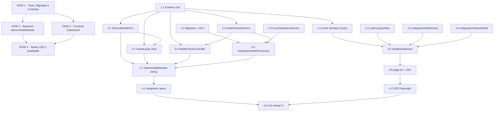

# Tarefas Story 14-4 — Health Check de Integrações & Dashboard Super Admin

Escopo: Implementar visibilidade operacional sobre as cinco integrações externas
(Resend, Keycloak, MinIO, Redis, PostgreSQL) com: probes periódicas via BullMQ,
endpoint REST restrito a Super Admin, histórico em `integration_health_log`,
dashboard Next.js com sparkline e auto-refresh, e substituição de
`StubEmailHealthPort` por `ResendHealthPort` (circuit breaker closure).

**Legenda de status:**
- `[ ]` Pendente
- `[~]` Em andamento
- `[x]` Concluído
- `[!]` Bloqueado

**Legenda de criticidade:**
- `[C]` Crítico - Impacto financeiro direto ou bloqueante
- `[A]` Alto - Funcionalidade essencial
- `[M]` Médio - Necessário mas sem urgência imediata

---

## FASE 1 - Fundação: Tipos, Migração e Contratos

### 1.1 Schema Zod em `packages/types` `[A]`

Ref: spec §FR-009, plan §Project Structure, contracts/admin-health-api.md

- [ ] 1.1.1 Criar `packages/types/src/integration-health.ts` com `IntegrationHealthStatusSchema` (`z.enum(['healthy','degraded','unhealthy'])`), `IntegrationHealthItemSchema`, `IntegrationHealthSummarySchema`, `IntegrationHealthResponseSchema`, `IntegrationHealthHistoryPointSchema` — exatamente conforme spec §FR-009
- [ ] 1.1.2 Exportar todos os schemas e tipos inferidos (`IntegrationHealthStatus`, `IntegrationHealthItem`, `IntegrationHealthResponse`, `IntegrationHealthHistoryPoint`) no `packages/types/src/index.ts`
- [ ] 1.1.3 Escrever snapshot test em `packages/types/src/__tests__/integration-health.spec.ts` verificando que cada `z.enum().options` não muda silenciosamente (gate contra breaking changes)
- [ ] 1.1.4 Verificar paridade exata com contratos REST em `contracts/admin-health-api.md` — rodar `tsc --noEmit` sobre o pacote de tipos para garantir `strict: true`

### 1.2 Migração Prisma `integration_health_log` `[A]`

Ref: spec §FR-001, §D-001, data-model.md

- [ ] 1.2.1 Criar migration `apps/api/prisma/migrations/YYYYMMDD_14-4-integration-health-log/migration.sql` com: CREATE TYPE `integration_health_status` AS ENUM('healthy','degraded','unhealthy'); CREATE TABLE `integration_health_log` (id UUID PK, integration_name VARCHAR(64), status integration_health_status, latency_ms INT, message TEXT nullable, checked_at TIMESTAMPTZ DEFAULT NOW()); CREATE INDEX `integration_health_log_name_checked_idx` ON `integration_health_log`(integration_name, checked_at DESC)
- [ ] 1.2.2 Adicionar modelo Prisma `IntegrationHealthLog` e enum `IntegrationHealthStatus` ao `apps/api/prisma/schema.prisma` com `@map`/`@@map` corretos (snake_case no banco ↔ camelCase no client)
- [ ] 1.2.3 Adicionar RLS à migration: `ALTER TABLE integration_health_log ENABLE ROW LEVEL SECURITY; CREATE POLICY platform_read ON integration_health_log FOR SELECT USING (true);` — sem WITH CHECK (escrita via cliente privilegiado BYPASSRLS conforme §D-001)
- [ ] 1.2.4 Rodar `prisma migrate dev` em ambiente local e confirmar que `prisma generate` reconhece o novo modelo sem erros TypeScript
- [ ] 1.2.5 Escrever RLS isolation spec em `apps/api/prisma/rls/integration-health-log.rls-spec.ts`: (a) worker escreve via `createPrivilegedClient()` → registro criado; (b) leitura via cliente normal com `platform_read USING(true)` retorna dados; (c) cliente de tenant normal não obtém dados inesperadamente (tabela sem RLS por tenant — validar que SELECT retorna todos os registros conforme política)

---

## FASE 2 - Backend: Módulo `AdminHealthModule`

### 2.1 `ResendHealthPort` — implementação real de `EmailHealthPort` `[A]`

Ref: spec §FR-008, §D-002, notifications/ports/email-health.port.ts (interface existente)

- [ ] 2.1.1 Criar `apps/api/src/admin/health/resend-health.port.ts` implementando `EmailHealthPort.isHealthy()`: `GET https://api.resend.com/domains` com `Authorization: Bearer {RESEND_API_KEY}` e `AbortSignal.timeout(5000)`; retorna `true` para 2xx ou 4xx (conectividade OK, auth issue); `false` para 5xx ou timeout (conforme §D-002)
- [ ] 2.1.2 Consumir `RESEND_API_KEY` via `this.configService.get('RESEND_API_KEY')` — NUNCA hardcodar; NUNCA logar o valor da chave em nenhum nível
- [ ] 2.1.3 Escrever testes unitários em `apps/api/src/admin/health/__tests__/resend-health.port.spec.ts`: (a) resposta 200 → `true`; (b) resposta 401 → `true` (conectividade confirmada); (c) resposta 500 → `false`; (d) timeout (AbortError) → `false`; (e) assertiva de que `RESEND_API_KEY` não aparece em nenhuma string de log ou resposta (NFR-TEST-001: mock o `fetch` com `vi.mock`)

### 2.2 Substituição de `StubEmailHealthPort` por `ResendHealthPort` no `NotificationsModule` `[A]`

Ref: spec §FR-008, notifications.module.ts L47-50 (ponto de integração documentado em código)

- [ ] 2.2.1 Em `apps/api/src/notifications/notifications.module.ts` L49-50: substituir `useClass: StubEmailHealthPort` por `useClass: ResendHealthPort`; atualizar imports (remover `StubEmailHealthPort`; importar `ResendHealthPort` de `../admin/health/resend-health.port`)
- [ ] 2.2.2 Importar `AdminHealthModule` em `NotificationsModule` (ou fornecer `ResendHealthPort` diretamente como provider exportado) para resolver a dependência de injeção circular
- [ ] 2.2.3 Verificar que `EmailCircuitBreakerService` (Story 14-3) agora recebe a implementação real — rodar testes do `EmailCircuitBreakerService` para confirmar integração sem regressão

### 2.3 `KeycloakAdminService` — adicionar `getUsersByRealmRole` `[A]`

Ref: spec §FR-007 (§Clarifications Q2), keycloak-admin.service.ts (métodos existentes: getAdminToken, getUsers, createUser, etc.)

- [ ] 2.3.1 Adicionar método `getUsersByRealmRole(roleName: string): Promise<KeycloakUser[]>` ao `apps/api/src/auth/keycloak-admin.service.ts`: chamar `GET ${this.baseUrl}/roles/{roleName}/users` com token de `getAdminToken()`; retornar array de `KeycloakUser` (usar tipo já existente no serviço)
- [ ] 2.3.2 Garantir que o `roleName` passado seja o valor literal do enum (ex: `Role.SUPER_ADMIN` = `'super_admin'`) — documentar no JSDoc que o parâmetro espera o valor do enum, não o nome
- [ ] 2.3.3 Escrever testes unitários em `apps/api/src/auth/keycloak-admin.service.spec.ts` (arquivo existente — adicionar caso): mock do `fetch` para `GET /roles/super_admin/users` retornando array de keycloakUsers; testar resposta 200 com 2 users; testar resposta 404 (role inexistente) → array vazio ou erro tratado

### 2.4 `HealthCheckService` — cinco probes com classificação `[A]`

Ref: spec §FR-002, §NFR-I5, §D-002 (ResendHealthPort), contracts/admin-health-api.md

- [ ] 2.4.1 Criar `apps/api/src/admin/health/health-check.service.ts` com método `runAllProbes(): Promise<IntegrationHealthItem[]>` executando as 5 probes via `Promise.allSettled()` (não `Promise.all` — garante que falha de uma não cancela as demais)
- [ ] 2.4.2 Implementar probe Resend: `GET https://api.resend.com/domains` com `AbortSignal.timeout(5000)`; allowlist canônica de `message`: `'timeout'`, `'connection refused'`, `'api key invalid — connectivity confirmed'` — NUNCA incluir o valor da `RESEND_API_KEY` nem hosts internos (CHK028/CHK030)
- [ ] 2.4.3 Implementar probe Keycloak: `GET ${KEYCLOAK_URL}/realms/${KEYCLOAK_REALM}/.well-known/openid-configuration` com `AbortSignal.timeout(5000)`; mensagem de erro usa apenas `'timeout'` ou `'connection refused'` — NUNCA expor o valor de `KEYCLOAK_URL` ou hostname no campo `message` (CHK030)
- [ ] 2.4.4 Implementar probe MinIO: `HEAD ${MINIO_ENDPOINT}/minio/health/live` com `AbortSignal.timeout(5000)`; allowlist de `message`: `'timeout'`, `'connection refused'` — NUNCA expor `MINIO_ENDPOINT` no campo `message` (CHK030)
- [ ] 2.4.5 Implementar probe Redis: `this.redisService.ping()` com timeout 3s; mensagem: `'timeout'` ou `'connection refused'`
- [ ] 2.4.6 Implementar probe PostgreSQL: `this.prisma.$queryRaw\`SELECT 1\`` com timeout 3s; mensagem: `'timeout'` ou `'connection refused'`
- [ ] 2.4.7 Implementar classificação de latência: `healthy` (<1000ms), `degraded` (1000-5000ms), `unhealthy` (>5000ms ou qualquer erro/timeout); medir com `performance.now()` (início → fim de cada probe individual)
- [ ] 2.4.8 Escrever testes unitários em `apps/api/src/admin/health/__tests__/health-check.service.spec.ts`: (a) todas probes healthy → summary correto; (b) probe Keycloak degraded (latência 1001ms simulada); (c) probe Resend unhealthy (timeout simulado); (d) boundary de latência: 999ms → healthy, 1001ms → degraded, 5001ms → unhealthy; (e) erro de rede em qualquer probe → status unhealthy, `message` da allowlist, sem stack trace; (f) assertiva de que `KEYCLOAK_URL`, `MINIO_ENDPOINT`, `RESEND_API_KEY` não aparecem em nenhum campo `message` da resposta (CHK031)

### 2.5 `HealthCheckController` — endpoints REST com segurança `[A]`

Ref: spec §FR-003, §FR-004, §NFR-SEC-002, contracts/admin-health-api.md, auth/enums/role.enum.ts

- [ ] 2.5.1 Criar `apps/api/src/admin/health/health-check.controller.ts` com `@Controller('admin/health')` + `@UseGuards(KeycloakAuthGuard, RolesGuard)` aplicado a nível de controller
- [ ] 2.5.2 Implementar `GET /api/v1/admin/health/integrations` com decorator `@Roles(Role.SUPER_ADMIN)` — usar obrigatoriamente o enum `Role.SUPER_ADMIN` de `apps/api/src/auth/enums/role.enum.ts`, NUNCA a string literal `'super_admin'` (CHK025/CHK013)
- [ ] 2.5.3 No handler `GET /integrations`: (a) gerar `correlationId = uuidv7()`; (b) executar `healthCheckService.runAllProbes()`; (c) computar summary; (d) chamar `auditService.create({ userId: req.user.sub, action: 'ADMIN_HEALTH_INTEGRATIONS_READ', resource: 'integration_health', resourceId: 'all', correlationId, ipAddress, userAgent, newState: null })` — audit do acesso HTTP (CHK027/CHK015); (e) retornar envelope `{ data: { integrations, summary } }`
- [ ] 2.5.4 Implementar `GET /api/v1/admin/health/integrations/history` com `@Roles(Role.SUPER_ADMIN)` e DTO validado por `ZodValidationPipe`: query params `integration` (string, obrigatório, enum de 5 valores) e `hours` (integer, opcional, default=24, max=72); retornar 400/422 para params inválidos (CHK009)
- [ ] 2.5.5 Implementar micro-cache in-memory server-side de 5-10s para o handler `GET /integrations` on-demand: ao receber request, verificar se existe resultado em cache com timestamp < 10s; se sim, retornar cached sem executar probes novamente; se não, executar probes + atualizar cache — coalescer múltiplas chamadas simultâneas (CHK035/CHK049, OWASP F4)
- [ ] 2.5.6 Criar DTOs: `apps/api/src/admin/health/dto/integration-health-response.dto.ts` e `apps/api/src/admin/health/dto/integration-history-query.dto.ts` (com `ZodValidationPipe`)
- [ ] 2.5.7 Escrever testes unitários em `apps/api/src/admin/health/__tests__/health-check.controller.spec.ts`: (a) GET /integrations com token super_admin → 200 com summary correto; (b) GET /integrations com token admin_tenant → 403; (c) GET /integrations com token lider → 403; (d) GET /integrations/history com super_admin → 200 com points e meta; (e) GET /integrations/history com token não-super_admin → 403; (f) GET /integrations/history com `integration` inválido → 400; (g) GET /integrations/history com `hours=73` → 400; (h) verificar que audit-log foi chamado com `correlationId` no handler /integrations; (i) verificar que micro-cache retorna resultado cacheado na segunda chamada sem executar probes novamente

### 2.6 `IntegrationHealthProcessor` — BullMQ worker periódico `[A]`

Ref: spec §FR-005, §FR-006, §FR-007, §D-003, §D-004, padrão detect-evasion-risk.processor.ts

- [ ] 2.6.1 Criar `apps/api/src/admin/health/health-check.processor.ts` implementando `Processor` via `BullMqService.createWorker('queue:integration-health-check', handler)`; registrar worker em `onModuleInit`
- [ ] 2.6.2 Registrar job repeatable em `onModuleInit`: `this.queue.add('integration-health-check', {}, { repeat: { every: 300000 } })` — idêntico ao padrão `refresh-platform-views.processor.ts` (BullMQ cron via `every` em ms)
- [ ] 2.6.3 Implementar Redis lock de single-execution: `const lock = await this.redisService.set('rt:health-check:lock:integration', '1', 'NX', 'EX', 270)` — TTL 270s (4.5 min, margem antes do próximo ciclo); se lock retornar null (outra instância), fazer ack silencioso (return)
- [ ] 2.6.4 Implementar INSERT em `integration_health_log` via `createPrivilegedClient()` + `$executeRawUnsafe` com bind params posicionais: `INSERT INTO integration_health_log (id, integration_name, status, latency_ms, message, checked_at) VALUES ($1::uuid, $2, $3::integration_health_status, $4, $5, $6)` — NUNCA concatenar SQL (CHK033, OWASP F3); padrão idêntico ao `insertJobLog` do `detect-evasion-risk.processor.ts` L268-282
- [ ] 2.6.5 Implementar lógica de debounce anti-flapping (§D-004, §FR-006): recuperar estado do Redis `rt:health-check:debounce:{name}` → comparar status novo com baseline → se mudou: `consecutiveCount=1`, TTL 30min, sem notificar; se igual e `consecutiveCount>=2`: notificar → emitir evento → audit; TTL 30min na chave; resetar ao voltar ao baseline
- [ ] 2.6.6 Implementar emissão de evento de domínio `system.integration.status-changed` via Redis pub/sub ao acionar notificação (§FR-007): `eventId=uuidv7()`, `tenantId=null`, `correlationId=uuidv7()`, campos conforme contrato `contracts/integration-status-changed-event.md`
- [ ] 2.6.7 Implementar resolução de Super Admins e despacho de notificação: `keycloakAdminService.getUsersByRealmRole(Role.SUPER_ADMIN)` → mapear keycloakId para userId local via `prisma.client.user.findMany({ where: { keycloakId: { in: keycloakIds } } })` → para cada super admin, chamar `notificationsService.dispatch(...)` dentro de `requestContext.run({ tenantId: superAdminTenantId, userId: 'system', requestId: uuidv7(), correlationId }, cb)` — padrão idêntico ao `notifications.worker.ts` L112
- [ ] 2.6.8 Chamar `auditService.create({ userId: null, action: 'INTEGRATION_STATUS_CHANGED', resource: 'integration_health', resourceId: integrationName, ipAddress: 'system', userAgent: 'health-check-worker', newState: { integrationName, previousStatus, newStatus, latencyMs } })` ao emitir a notificação
- [ ] 2.6.9 Escrever testes unitários em `apps/api/src/admin/health/__tests__/health-check.processor.spec.ts`: (a) single-execution: 2 instâncias simuladas, lock adquirido pela 1ª, 2ª faz ack silencioso sem chamar probes; (b) flapping: 5 alternâncias de status → no máximo 2-3 notificações (debounce funcionando); (c) INSERT via `$executeRawUnsafe` com bind params verificados (não concatenação); (d) requestContext.run com tenantId do super admin ao despachar notificação; (e) job repeatable registrado em `onModuleInit`; (f) ao notificar: evento emitido + audit criado com correlationId; (g) mock de todas as dependências externas (RedisService, PrismaService, NotificationsService, KeycloakAdminService) — NUNCA bater em produção (NFR-TEST-001)

### 2.7 `AdminHealthModule` — wiring completo `[A]`

Ref: spec §FR-005, plan §Project Structure

- [ ] 2.7.1 Criar `apps/api/src/admin/health/admin-health.module.ts` declarando: imports (`BullMqModule`, `AuthModule`, `AuditModule`, `NotificationsModule`), providers (`HealthCheckService`, `IntegrationHealthProcessor`, `ResendHealthPort`), controllers (`HealthCheckController`); exports (`ResendHealthPort`) para injeção no `NotificationsModule`
- [ ] 2.7.2 Registrar `AdminHealthModule` no módulo raiz do NestJS (`apps/api/src/app.module.ts`)
- [ ] 2.7.3 Verificar que o módulo compila sem erros: `pnpm --filter api build` (sem `npm install` nem `pnpm install` global)

---

## FASE 3 - Frontend: Dashboard Super Admin

### 3.1 Hook TanStack Query `use-integration-health.ts` `[A]`

Ref: spec §FR-010, contracts/admin-health-api.md, packages/types/src/integration-health.ts

- [ ] 3.1.1 Criar `apps/web/app/(authenticated)/admin/health/_hooks/use-integration-health.ts` com `useQuery` para `GET /api/v1/admin/health/integrations`: `staleTime: 55000`, `refetchInterval: 60000`; parsear resposta com `IntegrationHealthResponseSchema.parse()` (validação Zod no frontend)
- [ ] 3.1.2 Criar hook `useIntegrationHistory(integrationName: string, hours?: number)` com `useQuery` para `GET /api/v1/admin/health/integrations/history`; disparado por `enabled: !!integrationName`
- [ ] 3.1.3 Escrever testes unitários dos hooks com MSW interceptando a API (NFR-TEST-001): (a) retorna dados válidos parseados por Zod; (b) estado de loading; (c) estado de erro de rede; (d) refetch após `staleTime` expirado

### 3.2 `<LatencySparkline>` — SVG acessível `[A]`

Ref: spec §FR-010, §D-006, checklists/ux.md CHK076/CHK077/CHK088

- [ ] 3.2.1 Criar `apps/web/app/(authenticated)/admin/health/_components/latency-sparkline.tsx` como Client Component (`'use client'`) com SVG gerado em React puro (sem `@nivo` — §D-006); 288 pontos máximos, normalização de coordenadas Y pelo valor máximo do array
- [ ] 3.2.2 Adicionar atributos de acessibilidade no SVG: `role="img"` + `aria-label="Latência de {integrationName} nas últimas 24h"` + elemento `<title>{integrationName}: histórico de latência 24h</title>` como primeiro filho do SVG (CHK076 — crítico para leitores de tela)
- [ ] 3.2.3 Implementar hover tooltip: ao passar o mouse sobre um ponto, exibir popover com valor exato de latência e timestamp; implementar também a alternativa de foco via teclado — o tooltip deve ser acionável com Tab/focus no SVG ou em pontos individuais via `tabIndex` e `onKeyDown` (CHK077)
- [ ] 3.2.4 Definir empty state: quando `data.length === 0`, renderizar mensagem acessível em lugar do SVG: `
Sem histórico de latência disponível
` (CHK088)
- [ ] 3.2.5 Aplicar `motion-safe` via Tailwind (`motion-safe:transition-all`) em animações do SVG — sem animar se `prefers-reduced-motion: reduce` (CHK075); usar `focus-ring` do design system (`ring-brand-teal/30`) em elementos focáveis

### 3.3 `<IntegrationHealthCard>` e badges `[A]`

Ref: spec §FR-010, checklists/ux.md CHK062/CHK063/CHK074

- [ ] 3.3.1 Criar `apps/web/app/(authenticated)/admin/health/_components/integration-health-card.tsx` com: badge colorido (`bg-green-500` healthy / `bg-yellow-500` degraded / `bg-red-500` unhealthy) combinando cor E texto PT-BR ("Saudável/Degradado/Indisponível") — WCAG 1.4.1 (CHK062b)
- [ ] 3.3.2 Implementar navegação por teclado: card deve ser focável (`tabIndex={0}`), acionável com `Enter`/`Space` para abrir modal, `aria-label` descritivo com nome da integração e status atual (CHK074)
- [ ] 3.3.3 Exibir latência em ms e "Verificado há X min" usando textos de `pt-BR.json` via `useTranslations('health.integrations')` (i18n PT-BR)

### 3.4 `<IntegrationHistoryModal>` `[A]`

Ref: spec §FR-010, checklists/ux.md CHK085/CHK074

- [ ] 3.4.1 Criar `apps/web/app/(authenticated)/admin/health/_components/integration-history-modal.tsx` com tabela de logs: colunas "Status", "Latência (ms)", "Mensagem", "Verificado em" (CHK085 — strings i18n do modal)
- [ ] 3.4.2 Fechar modal com tecla `Escape` e garantir que foco retorna ao card que o abriu após fechar (CHK074 — navegação por teclado no fluxo card → modal → fechar)
- [ ] 3.4.3 Adicionar as chaves i18n do modal em `apps/web/messages/pt-BR.json` sob `health.integrations.modal.*`: `status`, `latencyMs`, `message`, `checkedAt`, `noHistory`

### 3.5 `<HealthDashboard>` — container principal `[A]`

Ref: spec §FR-010, checklists/ux.md CHK067/CHK069/CHK071/CHK087

- [ ] 3.5.1 Criar `apps/web/app/(authenticated)/admin/health/_components/health-dashboard.tsx` com: grid de 5 cards (uma por integração), `aria-live="polite"` no container de status, `role="status"` no indicador de refresh (CHK071/CHK072)
- [ ] 3.5.2 Implementar indicador stale: se `Date.now() - lastRefreshed > 120000`, exibir banner `"Dados podem estar desatualizados"` (i18n `health.integrations.staleWarning`) — CHK067
- [ ] 3.5.3 Implementar estado de erro persistente de fetch (após retries do TanStack Query esgotados): exibir mensagem "Não foi possível carregar os dados de saúde" com botão de retry manual (CHK069)
- [ ] 3.5.4 Estado de carregamento inicial: renderizar skeleton cards (5 placeholders) enquanto `isLoading === true` (CHK066 — padrão coerente com design system)
- [ ] 3.5.5 Quando TODAS as 5 integrações estão `unhealthy`: exibir alerta de sistema crítico destacado acima do grid (CHK087 — diferente do stale banner)

### 3.6 Página `page.tsx` e i18n completo `[A]`

Ref: spec §FR-010, plan §Project Structure

- [ ] 3.6.1 Criar `apps/web/app/(authenticated)/admin/health/page.tsx` como Client Component (`'use client'`): importar `<HealthDashboard>` com hooks injetados, sem Zustand (estado local via `useState`)
- [ ] 3.6.2 Adicionar todas as chaves i18n em `apps/web/messages/pt-BR.json` sob `health.integrations.*`: `title`, `subtitle`, `status.healthy/degraded/unhealthy`, `lastUpdated`, `staleWarning`, `integrationNames.*` (5 integrações), `modal.*` (cabeçalhos de tabela), `allUnhealthy`, `fetchError`, `retry`
- [ ] 3.6.3 Escrever testes unitários dos componentes em `apps/web/app/(authenticated)/admin/health/_components/__tests__/`: (a) `<IntegrationHealthCard>` renderiza badge com texto correto para cada status; (b) `<LatencySparkline>` renderiza SVG com `role="img"` e `aria-label`; (c) `<LatencySparkline data={[]}/>` renderiza empty state; (d) `<HealthDashboard>` mostra stale banner quando dados > 2min; (e) `<HealthDashboard>` mostra alerta crítico quando todas unhealthy

---

## FASE 4 - Testes de Integração, E2E e Qualidade

### 4.1 Testes de integração backend `[A]`

Ref: spec §Testes, §NFR-TEST-001, rls/integration-health-log.rls-spec.ts

- [ ] 4.1.1 Garantir que `apps/api/prisma/rls/integration-health-log.rls-spec.ts` cobre: (a) INSERT via `createPrivilegedClient()` persiste registro; (b) SELECT via cliente normal com `platform_read USING(true)` retorna o registro; (c) DELETE bloqueado para qualquer cliente não-privilegiado
- [ ] 4.1.2 Escrever integration spec para `NotificationsModule` pós-substituição: confirmar que `EmailCircuitBreakerService` injeta `ResendHealthPort` real (não Stub) e que `isHealthy()` retorna valor baseado em mock do `fetch`
- [ ] 4.1.3 Escrever integration spec para `KeycloakAdminService.getUsersByRealmRole`: mock do HTTP do Keycloak, validar que retorna `KeycloakUser[]` corretamente parseado

### 4.2 E2E do dashboard `[A]`

Ref: spec §Testes, apps/web/e2e/, NFR-TEST-001 (MSW intercepta API)

- [ ] 4.2.1 Criar `apps/web/e2e/admin-health.e2e-spec.ts` com Playwright; MSW interceptando `GET /api/v1/admin/health/integrations` e `GET /api/v1/admin/health/integrations/history`
- [ ] 4.2.2 Cenário happy path: (a) dashboard renderiza 5 cards com badges de status; (b) SVG do sparkline presente no DOM com `role="img"` e `aria-label`; (c) indicador "Atualizado há X segundos" visível; (d) clicar na card abre modal com histórico
- [ ] 4.2.3 Cenário auto-refresh: avançar o relógio com Playwright clock para simular 60s → verificar que TanStack Query dispara refetch; avançar para 121s → verificar que stale banner aparece
- [ ] 4.2.4 Cenário empty state sparkline: MSW retorna `history.points = []` → verificar que `<LatencySparkline>` exibe mensagem "Sem histórico" (CHK088)
- [ ] 4.2.5 Cenário 403: usuário não-super_admin acessa `/admin/health` → redirecionar ou exibir tela de acesso negado

### 4.3 Lint sweep completo CI `[M]`

Ref: CLAUDE.md (CI scripts), checklists/ux.md CHK073-CHK075-CHK078, Epic 12 lições

- [ ] 4.3.1 Rodar `pnpm turbo lint` no monorepo completo e corrigir todos os warnings/errors antes de abrir PR
- [ ] 4.3.2 Executar scripts de a11y do CI localmente: `check-focus-ring-variants`, `check-motion-safe`, `check-contrast-tokens`, `check-contrast`, `check-i18n-scf` — confirmar que todos passam sem erros
- [ ] 4.3.3 Confirmar que `turbo build` (sem `npm install` nem `pnpm install` global) completa sem erros TypeScript em todos os pacotes afetados (`packages/types`, `apps/api`, `apps/web`)
- [ ] 4.3.4 Executar `validate-tasks-template.sh` sobre este `tasks.md` para confirmar fidelidade ao template (gate deterministico) — sem findings `critical`

---

## Matriz de Dependências

## Resumo Quantitativo

| Fase | Tarefas | Subtarefas | Criticidade Predominante |
|------|---------|------------|--------------------------|
| 1 - Tipos, Migração e Contratos | 2 | 9 | A |
| 2 - Backend AdminHealthModule | 7 | 35 | A |
| 3 - Frontend Dashboard | 6 | 21 | A |
| 4 - Testes, E2E e Qualidade | 3 | 12 | A/M |
| **Total** | **18** | **77** | **A** |

## Escopo Coberto

| Item | Descrição | Fase |
|------|-----------|------|
| ZOD-001 | Schema Zod compartilhado `packages/types` com snapshot test | 1 |
| DB-001 | Migration `integration_health_log` + RLS platform-level | 1 |
| RLS-001 | RLS isolation spec (worker escreve, super_admin lê) | 1 |
| RESEND-001 | `ResendHealthPort` implementando `EmailHealthPort` real (fecha circuit breaker) | 2 |
| STUB-001 | Substituição de `StubEmailHealthPort` em `NotificationsModule` | 2 |
| KC-001 | `getUsersByRealmRole` adicionado ao `KeycloakAdminService` | 2 |
| PROBE-001 | Cinco probes paralelas com `Promise.allSettled` e allowlist de `message` | 2 |
| SEC-001 | Enum `Role.SUPER_ADMIN` (não string literal) nos guards | 2 |
| AUDIT-001 | Audit-log do acesso HTTP GET /integrations com `correlation_id` | 2 |
| CACHE-001 | Micro-cache in-memory 5-10s para endpoint on-demand | 2 |
| SQL-001 | INSERT via bind params posicionais `$1::uuid, $2, ...` (OWASP F3) | 2 |
| WORKER-001 | BullMQ repeatable job 5min + Redis lock single-execution | 2 |
| DEBOUNCE-001 | Anti-flapping: 2 checks consecutivos antes de notificar | 2 |
| NOTIF-001 | Notificação Super Admins com `requestContext.run` por tenantId | 2 |
| FE-001 | Dashboard Client Component com TanStack Query + sparkline SVG | 3 |
| A11Y-001 | SVG com `role="img"` + `aria-label` (CHK076) | 3 |
| A11Y-002 | Tooltip acessível por foco/teclado (CHK077) | 3 |
| A11Y-003 | Navegação por teclado card→modal→fechar (CHK074) | 3 |
| A11Y-004 | Empty state sparkline quando `data.length === 0` (CHK088) | 3 |
| I18N-001 | Textos do modal (cabeçalhos tabela) em PT-BR (CHK085) | 3 |
| E2E-001 | Playwright + MSW: dashboard, sparkline, auto-refresh, stale, modal | 4 |
| LINT-001 | Lint sweep CI completo (focus-ring, motion-safe, contrast, i18n-scf) | 4 |

## Escopo Excluído

| Item | Descrição | Motivo |
|------|-----------|--------|
| LIVENESS-001 | `GET /api/health` (liveness probe pública existente) | Escopo distinto — sem auth, sem histórico; NÃO tocar |
| METRIC-001 | Coleta de métricas de latência p50/p95 (SLO formal) | CHK045/CHK017 — decisão de produto adiada; fora desta story |
| RETENTION-001 | Política de retenção/cleanup de `integration_health_log` | CHK054 — fora do MVP; tech debt documentado |
| MOBILE-001 | Layout responsivo com breakpoints específicos para mobile | CHK082 — decisão de produto adiada; fora desta story |
| TOUCH-001 | Touch targets 44px para mobile (WCAG 2.5.5 AAA) | CHK083 — AAA não é requisito do MVP |
| SSE-001 | Atualização em tempo real via SSE (push do servidor) | Story 14-2 já cobre SSE; health usa pull TanStack Query |
| ANALYTICS-001 | Métricas de disponibilidade acumulada (uptime %) | Fora do escopo da story 14-4 |
