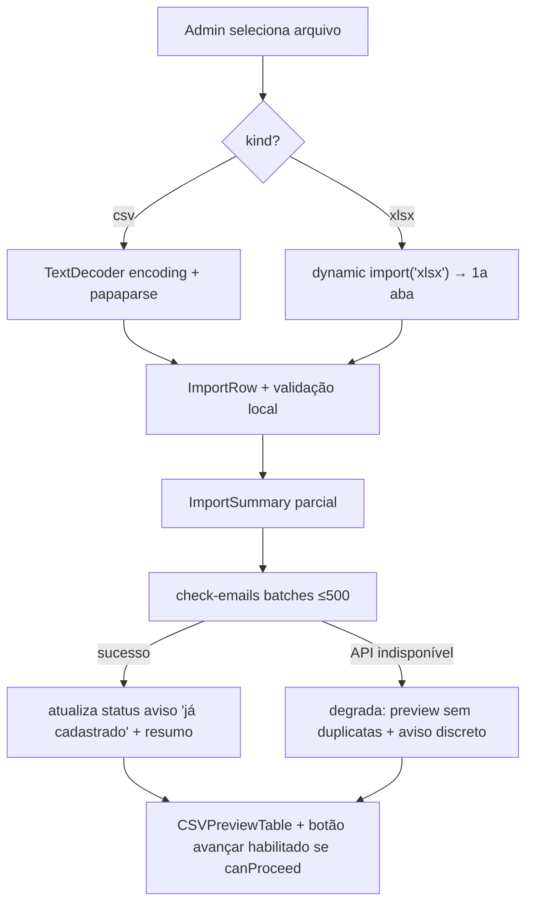

# Phase 1 — Data Model: import-csv-preview

> Feature **stateless no servidor**: nenhuma entidade persiste em DB. As
> entidades abaixo são estruturas **client-side** (TypeScript/Zod) + o shape
> de resposta da API de leitura. **Sem migration, sem tabela nova.**

---

## Entity: ImportFile (Arquivo de Importação)

Unidade de trabalho temporária, apenas client-side. Nunca enviada ao servidor.

| Campo | Tipo | Obrigatório | Notas |
|-------|------|-------------|-------|
| `fileName` | string | sim | nome original |
| `sizeBytes` | number | sim | ≤ 5 MB (FR-02) |
| `kind` | `'csv' \| 'xlsx'` | sim | derivado da extensão (FR-01/03) |
| `encoding` | `'utf-8' \| 'iso-8859-1' \| 'windows-1252'` | sim | auto-detectado (FR-05) |
| `rawRows` | `ImportRow[]` | sim | linhas parseadas |
| `totalRows` | number | sim | total de linhas de dados (pode exceder amostra) |
| `multiSheetWarning` | boolean | não | true se XLSX tinha >1 aba (FR-07) |

**State transitions**: `selecionado` → `parseando` → `parseado` →
(`verificando-emails` → `verificado`) | `erro`.

---

## Entity: ImportRow (Linha de Importação)

Representação de um participante a importar.

| Campo | Tipo | Obrigatório | Validação |
|-------|------|-------------|-----------|
| `nome` | string | sim | min 2 chars → senão `critico` (FR-12) |
| `email` | string | sim | formato e-mail válido → senão `critico` (FR-12) |
| `telefone` | string \| null | não | opcional |
| `papel` | `'participante' \| 'lider'` | não | default `participante`; valor não reconhecido → `aviso` (FR-13) |
| `status` | `'critico' \| 'aviso' \| 'ok'` | sim | classificação (FR-11) |
| `messages` | string[] | não | descrições PT-BR dos problemas (FR-14) |
| `rowIndex` | number | sim | índice 0-based na planilha (para "linha N") |

**Regras de classificação** (csv-validator):
- `critico`: e-mail ausente, e-mail inválido, OU nome < 2 chars (FR-12).
- `aviso`: e-mail já cadastrado no tenant (via check-emails), OU papel não
  reconhecido (usa default) (FR-13).
- `ok`: nenhuma das condições acima.

> A condição "e-mail já cadastrado" só é aplicada **após** o retorno do
> `check-emails`. Antes/sem ele (degradação), a linha mantém o status derivado
> apenas da validação local (FR-21).

---

## Entity: ImportSummary (Resumo)

Totais exibidos acima da tabela (FR-16/17).

| Campo | Tipo | Notas |
|-------|------|-------|
| `totalRows` | number | total de linhas de dados |
| `criticalCount` | number | linhas `critico` |
| `warningCount` | number | linhas `aviso` |
| `okCount` | number | linhas `ok` |
| `sampleSize` | number | linhas exibidas (≤10) |
| `canProceed` | boolean | `criticalCount === 0` (FR-15) |

---

## Entity: ImportTemplate (Template de Importação)

Arquivo CSV modelo gerado no cliente (FR-04).

- Header: `nome,email,telefone,papel`
- 1-2 linhas de exemplo com valores pastorais (ex: `João Silva,joao@igreja.org,11999998888,participante`).
- Gerado como `Blob` text/csv; baixado via `URL.createObjectURL` — sem rede.

---

## API Read Shape: CheckEmails

Não é entidade persistida — é o contrato de leitura tenant-scoped.

**Request** (query): `emails` = lista CSV de e-mails (≤500).

**Response** (`{ data, meta? }`, camelCase):

| Campo (em `data.results[]`) | Tipo | Notas |
|-----------------------------|------|-------|
| `email` | string | e-mail consultado (normalizado lowercase) |
| `exists` | boolean | true se já cadastrado **no tenant corrente** (FR-19) |

`meta`: `{ checkedCount: number, tenantScoped: true }`.

> A consulta usa Prisma `user.findMany` dentro de `withTenantTx` (RLS confina
> ao tenant). `users.email` é `@unique` global no schema, mas o filtro RLS
> garante que apenas e-mails do tenant corrente retornem `exists: true`. Sem
> verificação cross-tenant (FR-19; cross-tenant é Story 10-4).

---

## Diagrama de fluxo (client-side)

