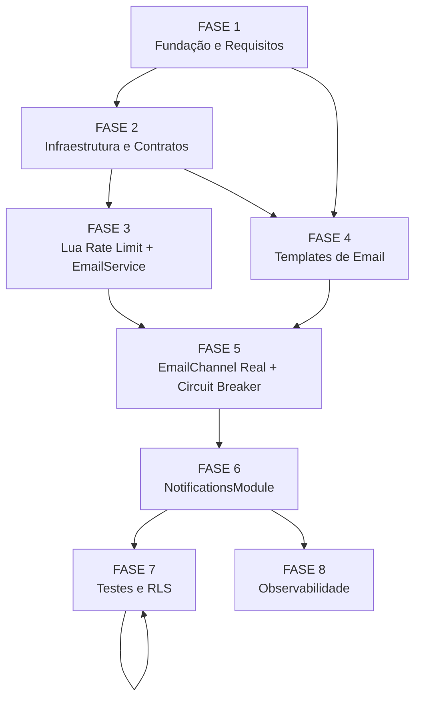

# Tasks: Notificações por Email via Resend

**Feature**: `notificacoes-email` | **Story**: 14-3 (FR77)
**Spec**: [spec.md](./spec.md) | **Plan**: [plan.md](./plan.md)
**Data**: 2026-06-21

---

## Legendas

### Legenda de status

| Símbolo | Significado |
|---------|-------------|
| `[ ]` | Pendente |
| `[x]` | Concluído |

### Legenda de criticidade

| Tag | Nível | Critério |
|-----|-------|----------|
| `[C]` | Crítico | Impacto direto em segurança, compliance LGPD, RLS multi-tenant ou SLA (SC-01 ≤ 1 min para alertas) |
| `[A]` | Alto | Funcionalidade core sem a qual o canal de email não opera |
| `[M]` | Médio | Qualidade, observabilidade, UX; pode ser refinado pós-entrega inicial |

---

## FASE 1 — Fundação e Requisitos de Pré-implementação

> Resolve todos os gaps `[Gap]`/`[Conflict]`/`{humano}` dos checklists **antes** de escrever código.
> Outputs: decisões registradas em code comments, spec amendments e glossário PT-BR nos artefatos.

### 1.1 Resolver gaps de segurança e PII dos checklists `[C]`

Ref: checklists/security.md CHK023, CHK025, CHK029, CHK032, CHK033, CHK036

- [x] 1.1.1 Criar inventário de campos dinâmicos por template (pastoral_alert, meeting_reminder, export_ready, content_new) com classificação "requer escapeHtml" (fecha CHK025)
- [x] 1.1.2 Definir critério de aceite explícito de teste XSS: payloads `` e `">` em nome do participante devem produzir entidades HTML escapadas (fecha CHK023)
- [x] 1.1.3 Documentar política de non-logging: `EmailService.send()` NUNCA loga campo `html`; `EmailRateLimiter` NUNCA loga `signedUrl`; adicionar comentário no código (fecha CHK029)
- [x] 1.1.4 Decidir minimização de dados LGPD no `pastoral_alert`: nome do participante incluído somente se estritamente necessário para o líder agir; registrar decisão como comentário no template (fecha CHK032)
- [x] 1.1.5 Definir onde ocorre a sanitização de PII: `scrub-pii.interceptor.ts` na borda da fila vs. exclusivamente no template; registrar decisão (fecha CHK033)
- [x] 1.1.6 Definir estratégia de teste do circuit breaker com `EmailService` mockado retornando falhas (não o `StubEmailHealthPort`), garantindo abertura por `firstFailureAt > 5min` sem depender de `isHealthy()` (fecha CHK036)

### 1.2 Resolver gaps de UX/i18n e conteúdo dos templates `[A]`

Ref: checklists/ux_i18n.md CHK058, CHK061, CHK065, CHK068, CHK070, CHK071, CHK073

- [x] 1.2.1 Criar glossário pastoral PT-BR para os templates: definir termos para "alerta de risco" (ex: "Sinal de cuidado"), "reunião" vs "encontro", "trilha de formação", CTA para cada tipo (fecha CHK058)
- [x] 1.2.2 Especificar conteúdo mínimo obrigatório de cada template: campos obrigatórios, estrutura de seções, CTA para pastoral_alert / meeting_reminder / export_ready / content_new (fecha CHK061)
- [x] 1.2.3 Documentar ativos de identidade visual padrão (logo default URL/path, cor primária e secundária default) usados quando tenant não tem branding configurado (fecha CHK065)
- [x] 1.2.4 Definir se fallback in-app usa o mesmo título/corpo do email ou texto adaptado ao canal in-app; registrar como requisito no código do worker (fecha CHK068)
- [x] 1.2.5 Definir requisitos de acessibilidade mínimos dos templates: atributo `alt` obrigatório em `` do logo, contraste mínimo 4.5:1, estrutura semântica HTML (fecha CHK070)
- [x] 1.2.6 Definir convenção de subject por tipo: `[Metanoia] Sinal de cuidado: <grupo>` (pastoral_alert), `[Metanoia] Lembrete: <data>` (meeting_reminder), `[Metanoia] Arquivo pronto` (export_ready), `[Metanoia] Nova trilha disponível` (content_new) (fecha CHK071)
- [x] 1.2.7 Definir texto e CTA da notificação in-app de limite ao admin: ex. "80 de 100 emails diários enviados. Considere fazer upgrade." (fecha CHK073)

### 1.3 Resolver gaps de performance e retry dos checklists `[A]`

Ref: checklists/performance.md CHK050, CHK043, CHK054, CHK055

- [x] 1.3.1 Resolver conflito CHK050: definir config de retry separada para `pastoral_alert` com backoff menor (ex: delay 5s × 3 = máx 15s), garantindo entrega em ≤ 1 min (SC-01); registrar como constante `EMAIL_CRITICAL_BACKOFF_MS=5000` no `DigestService` (fecha CHK050)
- [x] 1.3.2 Definir target de latência de renderização de template: "renderização < 500ms no p95; cache-hit de branding esperado em > 99% dos casos" (fecha CHK054)
- [x] 1.3.3 Definir requisitos mínimos de métricas de observabilidade: `email.send.success` counter, `email.send.failure` counter, `email.rate_limit.deferred` counter, `email.send.duration` histogram por tipo (fecha CHK055)
- [x] 1.3.4 Definir logging estruturado por evento do EmailChannel: `send_attempt` (INFO), `send_success` (INFO), `send_failure` (WARN), `fallback_created` (INFO), `rate_limited` (INFO), `circuit_open` (WARN) — nunca logar campo `html` nem `signedUrl` (fecha CHK020)

---

## FASE 2 — Infraestrutura e Contratos de Domínio

> Extensões de enum, variáveis de ambiente, interfaces TypeScript — base que todo o resto consome.

### 2.1 Estender env.validation.ts com variáveis de email `[A]`

Ref: plan.md §Project Structure, spec.md §FR-09/FR-10, checklists/api.md CHK019

- [x] 2.1.1 Adicionar ao `envSchema` em `apps/api/src/config/env.validation.ts`: `RESEND_API_KEY` (string, obrigatório), `EMAIL_DEFAULT_FROM` (string, ex: `"Metanoia <notifications@metanoia.app>"`), `EMAIL_DAILY_LIMIT` (coerce.number, default 100), `EMAIL_RATE_THRESHOLD` (coerce.number, default 80)
- [x] 2.1.2 Garantir que `RESEND_API_KEY` seja validado como string não-vazia (sem `.default()`) — falha explícita em startup se ausente em produção
- [x] 2.1.3 Adicionar `EMAIL_CRITICAL_BACKOFF_MS` (coerce.number, default 5000) à envSchema (backoff diferenciado para tipos críticos — CHK050)
- [x] 2.1.4 Escrever teste unitário: `env.validation.spec.ts` verifica que `RESEND_API_KEY` ausente lança erro de validação e que defaults de `EMAIL_DAILY_LIMIT`/`EMAIL_RATE_THRESHOLD` são corretos

### 2.2 Estender NotificationTypeSchema em packages/types `[C]`

Ref: spec.md §Key Entities, research.md Decision 6, checklists/api.md CHK007/CHK008

- [x] 2.2.1 Adicionar `export_ready` e `content_new` ao `NotificationTypeSchema` em `packages/types/src/notification.ts`; preservar todos os valores existentes (`pastoral_alert`, `group_message`, `content_update`, `meeting_reminder`, `system`)
- [x] 2.2.2 Atualizar snapshot test do `NotificationTypeSchema` intencionalmente: confirmar que snapshot antigo falha, gerar novo snapshot com os 7 valores
- [x] 2.2.3 Verificar paridade do enum no `NotificationPayloadSchema` e `NotificationDispatchSchema` — ambos dependem de `NotificationTypeSchema` por referência (sem duplicação)
- [x] 2.2.4 Exportar constante `CRITICAL_NOTIFICATION_TYPES = ['pastoral_alert', 'export_ready', 'system'] as const` em `packages/types/src/notification.ts` para uso pelo rate limiter

### 2.3 Criar migration de extensão do enum PostgreSQL `[C]`

Ref: plan.md §Project Structure, data-model.md §Enum notification_type

- [x] 2.3.1 Criar migration `apps/api/prisma/migrations/<ts>_14-3-email-notification-types/migration.sql` com `ALTER TYPE "notification_type" ADD VALUE IF NOT EXISTS 'export_ready'` e `ALTER TYPE "notification_type" ADD VALUE IF NOT EXISTS 'content_new'` (fora de bloco transacional)
- [x] 2.3.2 Verificar que a migration usa `IF NOT EXISTS` (idempotência) e está fora de `BEGIN/COMMIT` (restrição PostgreSQL para `ADD VALUE`)
- [x] 2.3.3 Testar migration em ambiente local: `pnpm --filter api migrate dev` e confirmar que o enum tem os 7 valores esperados via `\dT+ notification_type`
- [x] 2.3.4 Verificar que `removeOnFail:false` e `ChannelRouter` existentes continuam funcionando com os novos tipos (smoke test de enqueue com `content_new`)

### 2.4 Criar EmailHealthPort e StubEmailHealthPort `[A]`

Ref: spec.md §FR-16, contracts/email-channel.contract.md §EmailHealthPort, research.md Decision 5

- [x] 2.4.1 Criar `apps/api/src/notifications/ports/email-health.port.ts` com interface `EmailHealthPort { isHealthy(): Promise<boolean> }` e `StubEmailHealthPort` (sempre retorna `true`); adicionar comentário `// INTEGRATION POINT (Story 14-4)`
- [x] 2.4.2 Definir token de injeção: `export const EMAIL_HEALTH_PORT = 'EMAIL_HEALTH_PORT'`
- [x] 2.4.3 Escrever teste unitário para `StubEmailHealthPort`: confirma que `isHealthy()` retorna `true` e que trocar o provider por outro impl não altera a interface (SC-07)

---

## FASE 3 — Lua Script de Rate Limit e EmailService

> Atomicidade Redis e abstração do SDK Resend — núcleo de infraestrutura de entrega.

### 3.1 Implementar rate-limit.lua e EmailRateLimiterService `[C]`

Ref: spec.md §FR-09/FR-10/FR-11, research.md Decision 4, contracts/email-channel.contract.md §Rate-limit, checklists/performance.md CHK044/CHK045/CHK046/CHK047

- [x] 3.1.1 Criar `apps/api/src/notifications/scripts/rate-limit.lua`: lógica atômica (KEYS[1] = `rate:email:{tenantId}:{YYYYMMDD}`; ARGV: limit, threshold, ttlSeconds, critical, alertedKey) — INCR condicional + EXPIREAT + SET NX para flag `:alerted`; retornar array `[decision, count, crossedThreshold]`
- [x] 3.1.2 Criar `apps/api/src/notifications/email-rate-limiter.service.ts` com `EmailRateLimiterService`; registrar Lua via `RedisService.defineCommand('emailRateLimit', {numberOfKeys:1, lua})` no `onModuleInit`; método `check(tenantId, type): Promise<RateLimitResult>`
- [x] 3.1.3 Calcular `ttlSeconds` como segundos até meia-noite UTC: `Math.floor((endOfDayUtc - now) / 1000)` — garantir que é positivo (mín 1 segundo)
- [x] 3.1.4 Implementar lógica de deferral por tipo: críticos (`pastoral_alert`, `export_ready`, `system`) ignoram threshold; `meeting_reminder` diferido → flag `shouldFallbackInApp = true`; `content_new`/`content_update`/`group_message` diferidos → `decision: 'defer'` sem fallback imediato
- [x] 3.1.5 Escrever teste de integração `email-rate-limiter.integration-spec.ts` — Redis real via `docker-compose.test.yml`: (a) atomicidade: 2 jobs concorrentes em contador=79, exatamente 1 passa, 1 difere (C4); (b) threshold crossedThreshold = true apenas na primeira vez que atinge 80; (c) crítico sempre envia independente do contador

### 3.2 Implementar EmailService (abstração Resend SDK) `[A]`

Ref: plan.md §Project Structure, research.md Decision 1, contracts/email-channel.contract.md §EmailService, spec.md §FR-03

- [x] 3.2.1 Instalar dependência `resend` via `pnpm --filter api add resend`
- [x] 3.2.2 Criar `apps/api/src/notifications/channels/email.service.ts` com `EmailService`; injetar `ConfigService` para `RESEND_API_KEY` e `EMAIL_DEFAULT_FROM`; método `send(input: SendEmailInput): Promise<SendEmailResult>`
- [x] 3.2.3 Implementar timeouts NFR-I3 via `undici` Agent com `connectTimeout: 3000`, `bodyTimeout: 10000` (ou `AbortController` com `signal` passado ao `fetch` do SDK)
- [x] 3.2.4 Mapear erros Resend: 4xx → `{success:false, retryable:false}`; 5xx/timeout → `{success:false, retryable:true}`; sucesso → `{success:true, providerId}`
- [x] 3.2.5 Garantir que `EmailService.send()` NUNCA loga campo `html` ou `signedUrl` (política CHK029/L1); logar apenas `to`, `subject` e `providerId`/`error` (sem PII do destinatário)
- [x] 3.2.6 Validar `subject` e `from` via remoção de `\r` e `\n` antes de passar ao SDK (CHK026/M2 CRLF)
- [x] 3.2.7 Escrever testes unitários `email.service.spec.ts`: (a) integração Resend com sandbox/mock: sucesso retorna `providerId`; (b) 500 → retryable; (c) 422 → not retryable; (d) timeout → retryable; (e) campo `html` não aparece nos logs (spy em `logger.log`)

---

## FASE 4 — Templates de Email com Branding

> 4 templates por tipo + layout base com branding do tenant (BrandingService).

### 4.1 Criar base.layout.ts com branding do tenant `[A]`

Ref: plan.md §Project Structure, research.md Decision 3, spec.md §FR-02, checklists/ux_i18n.md CHK064/CHK065

- [x] 4.1.1 Criar `apps/api/src/notifications/templates/base.layout.ts` com função `renderBaseLayout(opts: {content: string, branding: BrandingData, subject: string}): string` retornando HTML completo com `charset=utf-8`, header com logo do tenant (ou logo default quando `logoUrl: null`), rodapé, estilos inline com `brandPrimaryColor`/`brandSecondaryColor` (ou cores default)
- [x] 4.1.2 Criar helper `escapeHtml(value: string): string` (substituição de `&`, `<`, `>`, `"`, `'` por entidades HTML) e aplicar em TODOS os campos dinâmicos interpolados no layout (CHK022/M1)
- [x] 4.1.3 Adicionar atributo `alt` obrigatório no `` do logo; contraste verificável nas cores de texto vs. fundo (CHK070)
- [x] 4.1.4 Escrever snapshot test `base.layout.spec.ts`: variações (a) com logo e cores do tenant; (b) sem logo (null) → usa identidade visual padrão; (c) com cores default; confirmar charset UTF-8 presente no HTML

### 4.2 Criar template pastoral-alert `[A]`

Ref: spec.md §P1, quickstart.md C3, checklists/ux_i18n.md CHK058/CHK061, task 1.2.1

- [x] 4.2.1 Criar `apps/api/src/notifications/templates/pastoral-alert.template.ts`; função `renderPastoralAlert(opts: {participantName: string, riskReason: string, groupName: string, radarUrl: string, branding: BrandingData}): {subject: string, html: string}`
- [x] 4.2.2 Subject seguir convenção definida em 1.2.6; todos os campos dinâmicos (`participantName`, `riskReason`, `groupName`) passam por `escapeHtml()` (CHK023/M1); `radarUrl` validada como URL antes de inserir no `href`
- [x] 4.2.3 Vocabulário pastoral PT-BR conforme glossário da task 1.2.1; conteúdo mínimo conforme 1.2.2
- [x] 4.2.4 Escrever snapshot test: (a) nome com acento `João Conceição`; (b) payload XSS `` no nome → saída tem entidades HTML, não tags; (c) sem branding → identidade padrão

### 4.3 Criar template meeting-reminder `[A]`

Ref: spec.md §P2, quickstart.md C3/C5, checklists/ux_i18n.md CHK061

- [x] 4.3.1 Criar `apps/api/src/notifications/templates/meeting-reminder.template.ts`; função `renderMeetingReminder(opts: {date: string, time: string, groupName: string, meetingUrl: string, branding: BrandingData}): {subject: string, html: string}`
- [x] 4.3.2 Subject conforme 1.2.6; campos dinâmicos passam por `escapeHtml()`; data/hora em PT-BR formatados (pt-BR locale)
- [x] 4.3.3 Escrever snapshot test: nome do grupo com acentos; variação sem branding

### 4.4 Criar template export-ready `[A]`

Ref: spec.md §P3, quickstart.md C3, checklists/ux_i18n.md CHK062/CHK063

- [x] 4.4.1 Criar `apps/api/src/notifications/templates/export-ready.template.ts`; função `renderExportReady(opts: {reportTitle: string, downloadUrl: string, expiresAt: string, branding: BrandingData}): {subject: string, html: string}`
- [x] 4.4.2 Template NUNCA inclui arquivo em anexo — apenas o link assinado (spec.md §P3 AC); `downloadUrl` escapada corretamente no `href`
- [x] 4.4.3 URL assinada (800+ chars) não é truncada no HTML; validade de 1h indicada no corpo do email
- [x] 4.4.4 Escrever snapshot test: URL longa (800+ chars) preservada; variação sem branding

### 4.5 Criar template content-new `[A]`

Ref: spec.md §P4, quickstart.md C3, checklists/ux_i18n.md CHK061

- [x] 4.5.1 Criar `apps/api/src/notifications/templates/content-new.template.ts`; função `renderContentNew(opts: {trailTitle: string, trailDescription: string, trailUrl: string, branding: BrandingData}): {subject: string, html: string}`
- [x] 4.5.2 Subject conforme 1.2.6; campos dinâmicos passam por `escapeHtml()`
- [x] 4.5.3 Escrever snapshot test: título com acentos; variação sem branding

---

## FASE 5 — EmailChannel Real e Circuit Breaker

> Substituir stub do EmailChannel + implementar EmailCircuitBreakerService.

### 5.1 Substituir stub do EmailChannel por implementação real `[A]`

Ref: plan.md §Project Structure, spec.md §FR-01/FR-04/FR-06/FR-07, contracts/email-channel.contract.md §NotificationChannelInterface

- [x] 5.1.1 Reescrever `apps/api/src/notifications/channels/email.channel.ts` com `EmailChannel` injetando `EmailService`, `EmailRateLimiterService`, `EmailCircuitBreakerService`, `BrandingService`, `NotificationsService`, `ConfigService`
- [x] 5.1.2 Fluxo `send()`: (1) checar circuit breaker; se `open` → criar fallback in-app + retornar `{success:true}`; (2) checar rate limit via `EmailRateLimiterService.check()`; se `defer` + tipo crítico → forçar envio; se `defer` + `meeting_reminder` → criar fallback in-app imediato + retornar `{success:true}`; se `defer` + outros → marcar `metadata.deferredUntil` + retornar `{success:true}`; (3) resolver branding via `BrandingService.getBranding()` (cache TTL 1h); (4) renderizar template por tipo; (5) chamar `EmailService.send()`
- [x] 5.1.3 Em sucesso: retornar `{success:true}`; `NotificationsService.updateStatus(notificationId, 'sent')` com `metadata.providerId`
- [x] 5.1.4 Em falha retornável (`retryable:true`): retornar `{success:false, error}` — worker re-lança para BullMQ backoff; NÃO criar fallback aqui (fallback é criado pelo worker.on('failed') após esgotar tentativas)
- [x] 5.1.5 Em falha não-retornável (`retryable:false`, erro 4xx): registrar `metadata.failureReason` (sem PII) + retornar `{success:false, error}` com `retryable:false` sinalizado (CHK006)
- [x] 5.1.6 Garantir que `send()` NUNCA lança exceção — todo erro retorna `{success:false, error}` (CHK001)

### 5.2 Estender NotificationsWorker para criar fallback in-app pós-falha permanente `[A]`

Ref: research.md Decision 2, spec.md §FR-06/FR-07/FR-08, quickstart.md C2

- [x] 5.2.1 No handler `worker.on('failed')` de `notifications.worker.ts`: após marcar `status=failed`, verificar se `job.data.channel === 'email'`; se sim, chamar `NotificationsService.dispatch({...payload, channels:['in_app'], metadata:{...metadata, fallbackOf: notificationId}})` (FR-06)
- [x] 5.2.2 Atualizar `metadata.failureReason` com código/mensagem sanitizada (sem PII); ex: `"Resend 503 after 3 retries"` (FR-07/FR-18)
- [x] 5.2.3 Quando `crossedThreshold = true` no resultado do rate limiter, disparar notificação in-app ao admin do tenant: `type: 'system'`, body com contagem e limite (spec.md §P5/FR-10)
- [x] 5.2.4 Escrever teste de integração `notifications-worker.integration-spec.ts`: mock `EmailService.send()` retornando 3x `{success:false, retryable:true}`; confirmar que após 3 tentativas `status=failed`, `fallbackOf` presente, `failureReason` sem PII (C2)

### 5.3 Implementar EmailCircuitBreakerService `[A]`

Ref: spec.md §FR-12..FR-16, research.md Decision 5, data-model.md §CircuitBreakerState, quickstart.md C7

- [x] 5.3.1 Criar `apps/api/src/notifications/email-circuit-breaker.service.ts` com `EmailCircuitBreakerService`; estado `CircuitBreakerState` em Redis hash `rate:email:circuit:{tenantId}` (campos: `state`, `firstFailureAt`, `consecutiveHealthy`, `openedAt`)
- [x] 5.3.2 Método `onSendFailure(tenantId)`: registrar `firstFailureAt` se primeira falha; se `Date.now() - firstFailureAt > 5min`, abrir breaker (`state='open'`, `openedAt=now`), emitir evento de domínio `notifications.email.circuit-open` (FR-12/FR-13)
- [x] 5.3.3 Método `onSendSuccess(tenantId)`: resetar `firstFailureAt` e `consecutiveHealthy` se estado `closed`
- [x] 5.3.4 Método `checkHealth(tenantId)`: se estado `open`, chamar `EmailHealthPort.isHealthy()`; 3 checks saudáveis consecutivos → fechar (`state='closed'`), retomar envios para NOVAS notificações (FR-14); diferidos durante outage NÃO são reenviados (FR-15)
- [x] 5.3.5 Método `isOpen(tenantId): Promise<boolean>` para consulta pelo `EmailChannel`
- [x] 5.3.6 Emitir evento de domínio `notifications.email.circuit-open` no formato canônico (data-model.md §Domain Event): `{eventId: uuidv7(), eventType:'notifications.email.circuit-open', version:1, tenantId, timestamp, data:{openedAt, reason}, metadata:{correlationId}}`
- [x] 5.3.7 Escrever teste de integração `email-circuit-breaker.integration-spec.ts` com `EmailService` mockado: (a) falhas contínuas por > 5min → breaker abre + evento emitido; (b) estado `open` → fallback in-app imediato sem tentar Resend; (c) 3 health-checks OK → fecha; (d) diferidos durante outage NÃO reenviados (C7/CHK036)

---

## FASE 6 — Registro no NotificationsModule

> Plugar todos os novos providers ao módulo NestJS.

### 6.1 Atualizar NotificationsModule com novos providers `[A]`

Ref: plan.md §Project Structure, spec.md §FR-16 (token EMAIL_HEALTH_PORT)

- [x] 6.1.1 Atualizar `apps/api/src/notifications/notifications.module.ts`: adicionar imports e providers de `EmailService`, `EmailRateLimiterService`, `EmailCircuitBreakerService`, `StubEmailHealthPort` via token `{provide: EMAIL_HEALTH_PORT, useClass: StubEmailHealthPort}`
- [x] 6.1.2 Importar `BrandingModule` (ou garantir que `BrandingService` seja acessível via exports do `TenantsModule`)
- [x] 6.1.3 Garantir que `RedisModule` (global) seja usado via `RedisService` injetado; sem redefinir no módulo
- [x] 6.1.4 Verificar que `ChannelRouter` não foi modificado (OCP) — apenas os novos providers são adicionados ao módulo
- [x] 6.1.5 Executar `pnpm --filter api build` sem erros de compilação TypeScript (smoke test de integração do módulo)

### 6.2 Atualizar DigestService com retry diferenciado por criticidade `[A]`

Ref: spec.md §FR-05, checklists/performance.md CHK050, task 1.3.1

- [x] 6.2.1 Em `DigestService.enqueue()`, diferenciar config de retry: para `type in CRITICAL_NOTIFICATION_TYPES` usar `backoff:{exponential, delay: EMAIL_CRITICAL_BACKOFF_MS}` (5s default); para tipos não-críticos manter `delay:30000` existente
- [x] 6.2.2 Ler `EMAIL_CRITICAL_BACKOFF_MS` via `ConfigService` (default 5000 ms)
- [x] 6.2.3 Escrever teste unitário `digest.service.spec.ts` confirmando que `pastoral_alert` usa backoff 5s e `content_new` usa 30s

---

## FASE 7 — Testes de Integração, RLS e CI

> Cobertura completa dos 10 cenários do quickstart.md + RLS isolation + gate CI.

### 7.1 Testes de integração do fluxo ponta a ponta `[A]`

Ref: quickstart.md C1-C6/C9/C10, spec.md §SC-01..SC-07

- [x] 7.1.1 `email.channel.integration-spec.ts`: C1 happy path — `EmailChannel.send()` com mock `EmailService` retornando sucesso; confirmar `status=sent` e `providerId` no metadata
- [x] 7.1.2 `email.channel.integration-spec.ts`: C5 deferral de `meeting_reminder` com contador ≥ 80 — confirmar fallback in-app criado imediatamente com data/horário/link (SC-02)
- [x] 7.1.3 `email.channel.integration-spec.ts`: C6 deferral de `content_new` — confirmar `metadata.deferredUntil` preenchido; sem fallback imediato; idempotência: re-enqueue com mesmo jobId não cria nova notificação
- [x] 7.1.4 `email.channel.integration-spec.ts`: C9 schema snapshot — estender `NotificationTypeSchema`, confirmar snapshot falha e atualizar; gate contra breaking change silencioso
- [x] 7.1.5 `email.channel.integration-spec.ts`: C10 `StubEmailHealthPort` trocável — registrar fake impl, confirmar que `EmailChannel` não requer modificação (SC-07)

### 7.2 Teste de isolamento RLS (roda 2× no CI) `[C]`

Ref: spec.md §SC-RLS (Constitution I/VI), quickstart.md C8, data-model.md §RLS, memória do projeto (RLS idempotente 2× CI)

- [x] 7.2.1 Criar `apps/api/test/rls/notifications-email.rls-spec.ts`: setup 2 tenants com notificações de email; verificar que em contexto do Tenant A: SELECT/UPDATE/DELETE NÃO retorna registros do Tenant B; contadores Redis de rate-limit namespaced (Tenant A: `rate:email:{tenantA}:{hoje}` ≠ Tenant B)
- [x] 7.2.2 Garantir que o teste é idempotente: pode rodar 2× consecutivas no CI sem falhar (limpeza explícita no `afterEach`/`afterAll`); sem estado Redis compartilhado entre rodadas
- [x] 7.2.3 Adicionar ao script de CI (`ci-rls.yml` ou similar) execução do novo spec RLS 2× conforme padrão existente

### 7.3 Validar lint e CI local antes do PR `[M]`

Ref: CLAUDE.md §Git Workflow, memória do projeto

- [x] 7.3.1 Rodar `pnpm --filter api lint` e confirmar zero erros
- [x] 7.3.2 Rodar `pnpm --filter api test` (Vitest) e confirmar todos os specs passam, incluindo snapshot tests atualizados
- [x] 7.3.3 Rodar `pnpm --filter api build` e confirmar zero erros de TypeScript (`strict: true`)
- [x] 7.3.4 Rodar testes RLS com Postgres local: `pnpm --filter api test:rls` e confirmar isolamento multi-tenant
- [x] 7.3.5 Criar PR com branch `feat/14-3-notificacoes-email`, conventional commits PT-BR, descrição referenciando FR77/Story 14-3

---

## FASE 8 — Observabilidade e Logging Estruturado

> Logging estruturado por evento do EmailChannel; sem vazar PII nem secrets.

### 8.1 Implementar logging estruturado no EmailChannel e EmailService `[A]`

Ref: spec.md §FR-17, checklists/api.md CHK020/CHK021, task 1.3.4

- [x] 8.1.1 Adicionar Logger do NestJS ao `EmailChannel`; emitir log estruturado em cada evento: `send_attempt` (INFO com `notificationId`, `type`, `tenantId` — sem `html`/`signedUrl`), `send_success` (INFO com `providerId`), `send_failure` (WARN com `error`, `retryable`), `fallback_created` (INFO com `fallbackOf`), `rate_limited` (INFO com `decision`, `count`), `circuit_open` (WARN com `openedAt`)
- [x] 8.1.2 Confirmar que nenhum dos logs emite campo `html`, `signedUrl`, `RESEND_API_KEY` ou `EMAIL_DEFAULT_FROM` (política L1/CHK029)
- [x] 8.1.3 Escrever teste `email-logging.spec.ts`: spy em `logger.log`/`logger.warn`; confirmar que campos proibidos ausentes em todos os eventos de log; confirmar campos obrigatórios presentes

### 8.2 Definir contadores de métricas (instrumentação futura) `[M]`

Ref: checklists/performance.md CHK055, task 1.3.3

- [x] 8.2.1 Criar arquivo `apps/api/src/notifications/email-metrics.constants.ts` com constantes dos nomes de métricas: `EMAIL_SEND_SUCCESS`, `EMAIL_SEND_FAILURE`, `EMAIL_RATE_LIMIT_DEFERRED`, `EMAIL_CIRCUIT_OPEN`, `EMAIL_SEND_DURATION` — definindo o contrato sem acoplamento a lib de métricas específica (permite integração futura com Prometheus/OpenTelemetry)
- [x] 8.2.2 Adicionar comentário `// TODO: instrumentar com Prometheus counters/histograms quando feature de métricas for implementada` nos pontos de chamada no `EmailChannel`

---

## Matriz de Dependências

Dependências críticas por tarefa:
- `5.1` (EmailChannel real) depende de `3.1` (rate limiter), `3.2` (EmailService), `4.1-4.5` (templates), `5.3` (circuit breaker)
- `5.2` (worker fallback) depende de `5.1` (EmailChannel)
- `6.1` (módulo) depende de `2.4` (porta), `3.1` (rate limiter), `3.2` (EmailService), `5.3` (circuit breaker)
- `7.2` (RLS test) depende de `5.1` e `6.1` (implementação completa)
- `2.3` (migration) pode rodar em paralelo com FASE 3/4 mas antes de FASE 5

---

## Resumo Quantitativo

| Fase | Tarefas | Subtarefas | Criticidade Dominante |
|------|---------|------------|----------------------|
| FASE 1 — Fundação e Requisitos | 3 | 17 | [C]/[A] |
| FASE 2 — Infraestrutura e Contratos | 4 | 16 | [C]/[A] |
| FASE 3 — Lua Rate Limit + EmailService | 2 | 12 | [C]/[A] |
| FASE 4 — Templates de Email | 5 | 17 | [A] |
| FASE 5 — EmailChannel Real + Circuit Breaker | 3 | 20 | [A] |
| FASE 6 — NotificationsModule | 2 | 8 | [A] |
| FASE 7 — Testes e RLS | 3 | 15 | [C]/[A]/[M] |
| FASE 8 — Observabilidade | 2 | 5 | [A]/[M] |
| **TOTAL** | **24** | **110** | |

---

## Escopo Coberto

- Substituição do stub `EmailChannel` (Story 14-1) por implementação real com Resend SDK
- Extensão do enum `notification_type` (`export_ready`, `content_new`) — migration + Zod
- Rate limiting diário atômico via Lua script Redis com threshold de alerta ao admin
- Retry diferenciado por criticidade (backoff 5s para `pastoral_alert`; 30s para não-críticos)
- Templates HTML por tipo (pastoral_alert, meeting_reminder, export_ready, content_new) com branding do tenant
- Helper `escapeHtml()` em todos os campos dinâmicos (proteção XSS/M1)
- Fallback in-app após 3 retries esgotados; fallback imediato para `meeting_reminder` diferido
- Circuit breaker com abstração `EmailHealthPort` + `StubEmailHealthPort` (ponto de integração Story 14-4)
- Logging estruturado sem PII, signed URLs ou corpo de email nos logs
- Testes de integração cobrindo todos os 10 cenários do quickstart.md (C1-C10)
- RLS isolation test (roda 2× no CI) com isolamento de contadores Redis por tenant
- Variáveis de ambiente no `env.validation.ts` (`RESEND_API_KEY`, `EMAIL_DEFAULT_FROM`, `EMAIL_DAILY_LIMIT`, `EMAIL_RATE_THRESHOLD`, `EMAIL_CRITICAL_BACKOFF_MS`)
- Snapshot tests dos 4 templates (acentos, URL longa, tenant sem logo)
- Gate de CI: lint + testes + build antes do PR

## Escopo Excluído

- Interface de configuração de remetente por tenant via UI (Post-MVP)
- Unsubscribe / gestão de preferências de email por usuário (Post-MVP)
- Templates de email configuráveis pelo admin via UI (Post-MVP)
- Envio em lote (bulk) ou campanhas (fora do escopo do produto)
- Monitoramento de bounce / hard bounce handling (Post-MVP)
- Suporte a múltiplos provedores de email além do Resend (Post-MVP)
- Canal WhatsApp (Post-MVP separado)
- Implementação real do `EmailHealthPort` (Story 14-4, NÃO done — apenas o stub)
- Instrumentação com Prometheus/OpenTelemetry (definido em 8.2 como contrato de interface; implementação futura)
- Métricas de deliverability do Resend (bounce rate, open rate) — fora de escopo desta feature
