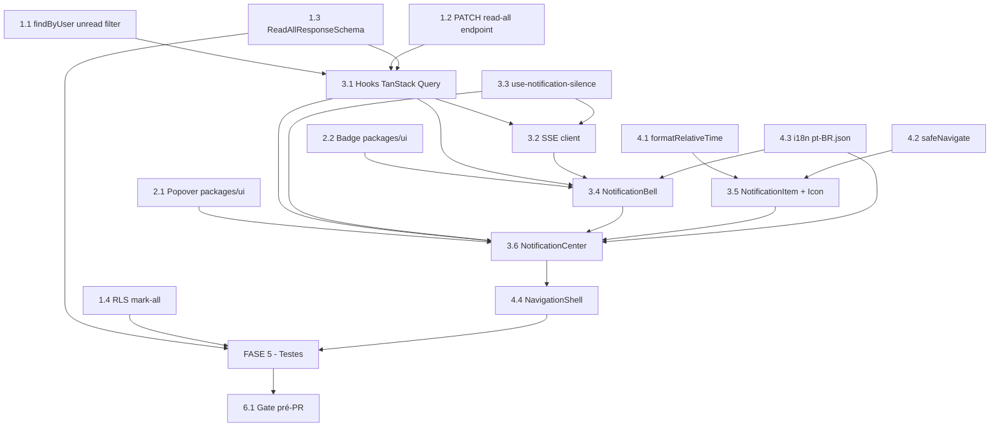

# Tasks: Notification Center UI — Story 14-2b

Escopo: Backlog executável para a Story 14-2b (Epic 14 — Notificações): backend endpoint read-all + filtro unread; shared UI Popover/Badge; frontend Bell + Center + hooks + SSE + silence; utilitários relativos + safeNavigate; i18n pastoral; testes unit/snapshot/RLS/E2E/a11y; validação local pré-PR.

**Legenda de status:**
- `[ ]` Pendente
- `[~]` Em andamento
- `[x]` Concluído
- `[!]` Bloqueado

**Legenda de criticidade:**
- `[C]` Crítico — Caminho crítico: bloqueia outras tasks ou entrega de P1/P2
- `[A]` Alto — Funcionalidade essencial da story
- `[M]` Médio — Necessário mas sem urgência imediata (utilitários, docs)

---

## FASE 1 — Backend

### 1.1 Ampliar `findByUser` para filtro `unread=true` (`status <> 'read'`) `[C]`

Ref: Research D2 (open item create-tasks); data-model.md §2; plan §6.1

- [ ] 1.1.1 Em `apps/api/src/notifications/notifications.service.ts`: ajustar `findByUser` para aceitar `unread?: boolean` na interface `NotificationsQuery`. Quando `unread=true`, gerar `statusFilter = "AND status <> 'read'::\"notification_status\""` (SQL de desigualdade). Preservar retrocompatibilidade: `status=X` (igualdade) continua funcionando; `unread=true` tem prioridade se ambos presentes.
- [ ] 1.1.2 Em `apps/api/src/notifications/notifications.controller.ts`: adicionar `@Query('unread') unread?: string` ao handler `findAll` e passar `unread: unread === 'true'` ao `findByUser`.
- [ ] 1.1.3 Em `packages/types/src/notification.ts`: adicionar `unread: z.coerce.boolean().optional()` ao `NotificationsQuerySchema` (preserva contrato existente — não é breaking change).
- [ ] 1.1.4 Em `apps/api/src/notifications/notifications.service.spec.ts`: cobertura de `findByUser({ unread: true })` confirmando que o `statusFilter` gerado usa `<>` (desigualdade, não `=`), e que o resultado nunca inclui notificações com `status = 'read'`.

---

### 1.2 Endpoint `PATCH /api/v1/notifications/read-all` + `markAllAsRead` `[C]`

Ref: spec FR-008; plan §5; contracts.md §Endpoint NOVO

- [ ] 1.2.1 Em `apps/api/src/notifications/notifications.controller.ts`: adicionar `@Patch('read-all')` com `@HttpCode(HttpStatus.OK)` **ANTES** do `@Patch(':id/read')` existente (defesa de roteamento: segmento estático resolvido antes do dinâmico). Body: sem parâmetros. Implementação: `const ctx = getRequestContext(); const updatedCount = await this.notificationsService.markAllAsRead(ctx.userId ?? '', new Date()); return { data: { updatedCount } };`
- [ ] 1.2.2 Em `apps/api/src/notifications/notifications.service.ts`: implementar `markAllAsRead(userId: string, readAt: Date): Promise<number>` via `withTenantTx` + `$queryRawUnsafe` com `UPDATE notifications SET status = 'read'::"notification_status", read_at = $1, updated_at = now() WHERE user_id = $2::uuid AND status <> 'read'::"notification_status" RETURNING id`. Retorna `rows.length`. Idempotente: não reescreve linhas já lidas; conta só as efetivamente alteradas.
- [ ] 1.2.3 Adicionar `@ApiOperation({ summary: 'Mark all unread notifications as read for the authenticated user' })` e `@ApiResponse({ status: 200, description: 'Returns count of updated notifications' })` no controller (Swagger).

---

### 1.3 `ReadAllResponseSchema` + snapshot Zod em `packages/types` `[C]`

Ref: spec FR-009; plan §5 "Contrato Zod compartilhado"; data-model.md §2

- [ ] 1.3.1 Em `packages/types/src/notification.ts`: adicionar `export const ReadAllResponseSchema = z.object({ updatedCount: z.number().int().nonnegative() }); export type ReadAllResponse = z.infer<typeof ReadAllResponseSchema>;`
- [ ] 1.3.2 Em `packages/types/src/__tests__/notification.snapshot.spec.ts`: adicionar `it('ReadAllResponseSchema matches snapshot', () => { expect(ReadAllResponseSchema.shape).toMatchSnapshot(); })` e rodar `pnpm --filter @metanoia/types vitest run` para gerar o snapshot inicial. Commitar o `.snap` gerado.

---

### 1.4 Caso RLS — `mark-all` não cruza tenant (idempotente, roda 2x no CI) `[A]`

Ref: plan §5 "Decisão sobre RLS test"; lições Epic 13

- [ ] 1.4.1 Em `apps/api/test/rls/notifications.rls-spec.ts`: adicionar caso `'mark-all does not cross tenant boundary'`. Setup: inserir 2 notificações `pending` para `TENANT_A_ID`/`userId_A` e 2 para `TENANT_B_ID`/`userId_B`. Executar `markAllAsRead` no contexto do Tenant A (cliente `app` NOSUPERUSER + SET LOCAL `app.current_tenant_id` = TENANT_A). Asserção: notificações de A ficam `read`; notificações de B permanecem `pending`.
- [ ] 1.4.2 Se `apps/api/test/factories/notification.factory.ts` não existir, criar com `createNotification({ tenantId, userId, type?, status? })` seguindo o padrão dos outros factories (sempre incluir `tenantId`).
- [ ] 1.4.3 Garantir idempotência: `afterEach` deve fazer `DELETE FROM notifications WHERE tenant_id IN ($TENANT_A_ID, $TENANT_B_ID)` via cliente NOSUPERUSER (lição Epic 13: CI roda spec 2x, idempotência obrigatória).
- [ ] 1.4.4 Confirmar que o spec usa Postgres de teste (porta 5433) via `DATABASE_URL` do `docker-compose.test.yml`.

---

## FASE 2 — Shared UI (`packages/ui`)

### 2.1 Primitivo Popover acessível (`packages/ui`) `[C]`

Ref: Research D6; plan §4 "packages/ui"; spec SC-004/SC-005

- [ ] 2.1.1 Em `packages/ui/package.json`: adicionar `"@radix-ui/react-popover"` com mesma range de versão do `@radix-ui/react-dialog` já instalado (conferir `package.json` atual e espelhar a range `^X.Y.Z`).
- [ ] 2.1.2 Executar `pnpm --filter @metanoia/ui add @radix-ui/react-popover` para instalar e atualizar `pnpm-lock.yaml`.
- [ ] 2.1.3 Criar `packages/ui/src/components/popover.tsx`: wrapper acessível espelhando `dialog.tsx`. Exportar `Popover`, `PopoverTrigger`, `PopoverContent`, `PopoverAnchor` do Radix. Manter `'use client'` (primitivo Radix requer CSR).
- [ ] 2.1.4 Em `packages/ui/src/index.ts`: adicionar `export * from './components/popover'`.

---

### 2.2 Primitivo Badge (`packages/ui`) `[A]`

Ref: plan §4 "packages/ui"; spec FR-001 (badge 99+)

- [ ] 2.2.1 Criar `packages/ui/src/components/badge.tsx`: componente `Badge` reutilizável com variantes (default, destructive, outline) via `class-variance-authority` (padrão do repo). O cap "99+" é responsabilidade do `NotificationBell` — o `Badge` apenas renderiza o valor recebido.
- [ ] 2.2.2 Em `packages/ui/src/index.ts`: adicionar `export * from './components/badge'`.

---

## FASE 3 — Frontend Core

### 3.1 Hooks TanStack Query (`src/lib/api/hooks/use-notifications.ts`) `[C]`

Ref: plan §6.1; spec FR-003/FR-008; CLAUDE.md (TanStack só em Client Components)

- [ ] 3.1.1 Criar `apps/web/src/lib/api/hooks/use-notifications.ts` (`'use client'`):
  - `notificationKeys = { all: ['notifications'] as const, unread: () => [...notificationKeys.all, 'unread'] as const }` (query keys hierárquicos, padrão do repo).
  - `useUnreadNotifications()`: `useQuery` com `GET /notifications?unread=true&perPage=20` (usando filtro da Task 1.1). Derivar `unreadCount = data?.meta?.total ?? 0`.
  - `useMarkRead(id: string)`: `useMutation` via `PATCH /notifications/${id}/read`. `onSuccess: queryClient.invalidateQueries({ queryKey: notificationKeys.unread() })`.
  - `useMarkAllRead()`: `useMutation` via `PATCH /notifications/read-all`. `onSuccess: invalidateQueries(notificationKeys.unread())`. `onError`: NÃO alterar estado otimista — sem marcação parcial persistida (rollback spec US3-2).
- [ ] 3.1.2 Validar respostas com schemas Zod existentes (`NotificationsListSchema`) e novo `ReadAllResponseSchema` via `apiClient.getEnvelope`/`patch`.

---

### 3.2 SSE client: `use-notification-stream.ts` `[C]`

Ref: plan §6.2; Research D3; spec FR-003/FR-011; contracts.md §SSE

- [ ] 3.2.1 Criar `apps/web/src/hooks/use-notification-stream.ts` (`'use client'`), espelhando `use-attendance-live.ts`. Obter token de `sessionStorage.getItem('accessToken')`. URL: `${API_BASE_URL}/sse/notifications${token ? '?token=' + encodeURIComponent(token) : ''}`. Instanciar `new EventSource(url)`.
- [ ] 3.2.2 `addEventListener('notification', handler)`: parse via `NotificationRealtimeEventSchema.safeParse(JSON.parse(e.data))` — falha silenciosa (sem crash). Se parse OK: `queryClient.invalidateQueries({ queryKey: notificationKeys.unread() })` (badge atualiza SEMPRE, independente de silenciar). Se `!silenced`: chamar `announce('Nova notificação: ' + parsed.data.title, { politeness: 'polite' })` via `useAsyncAnnouncer()`.
- [ ] 3.2.3 `addEventListener('heartbeat', () => {})` keep-alive. `source.onerror`: manter último valor conhecido — NÃO resetar badge para zero (edge case SSE perdido, spec §Edge Cases).
- [ ] 3.2.4 Cleanup no `useEffect`: `return () => source.close()`.
- [ ] 3.2.5 **Segurança (OWASP hardening dec-015)**: NÃO logar a URL completa (que contém `?token=`) em nenhum `console.log` ou logger. Adicionar comentário explícito no código: `// SECURITY: URL contains ?token= — do not log`.

---

### 3.3 Toggle Silenciar: `use-notification-silence.ts` `[A]`

Ref: plan §6.6; spec FR-010; Research D3

- [ ] 3.3.1 Criar `apps/web/src/hooks/use-notification-silence.ts` (`'use client'`), espelhando `use-active-tenant-id.ts`. Chave: `metanoia:notificationSilence`. SSR-safe: verificar `typeof window !== 'undefined'` antes de acessar `localStorage`. Retorna `{ silenced: boolean, setSilenced: (v: boolean) => void }`.
- [ ] 3.3.2 Adicionar `storage` event listener para sync cross-tab (mesmo padrão do hook existente). Cleanup no retorno do `useEffect`.

---

### 3.4 `NotificationBell` (`src/components/notifications/notification-bell.tsx`) `[C]`

Ref: plan §6.3; spec FR-001/FR-002; SC-004/SC-005

- [ ] 3.4.1 Criar `apps/web/src/components/notifications/notification-bell.tsx` (`'use client'`). Consumir `useUnreadNotifications()` para `unreadCount`. Montar `useNotificationStream` no efeito de mount.
- [ ] 3.4.2 Badge (via `<Badge>` de `@metanoia/ui`): oculto se `unreadCount === 0`. Valor: `unreadCount > 99 ? '99+' : String(unreadCount)` (derivação pura sem estado intermediário — anti-flicker spec §Edge Cases).
- [ ] 3.4.3 `aria-label` dinâmico PT-BR via `pt-BR.json`: `labelNone` (0), `labelCountOne` (1), `labelCount` (>1, <99), `labelOverflow` (>99). `aria-expanded` e `aria-haspopup="dialog"` no botão trigger do Popover.
- [ ] 3.4.4 Badge deve usar ícone + contador (não só cor) — contraste WCAG AA garantido por tokens do `packages/ui`.

---

### 3.5 `NotificationItem` + `NotificationIcon` `[A]`

Ref: plan §6.4; spec FR-005/FR-006; Research D5 (render texto-only)

- [ ] 3.5.1 Criar `apps/web/src/components/notifications/notification-icon.tsx`: mapeamento `NotificationType → ReactNode` usando ícones Lucide já importados no projeto. Tipos: `pastoral_alert` → ícone alerta/sino, `group_message` → ícone grupo, `content_update` → ícone documento, `meeting_reminder` → ícone calendário, `system` → ícone info.
- [ ] 3.5.2 Criar `apps/web/src/components/notifications/notification-item.tsx`. Props: `notification: NotificationRow`, `onMarkRead: (id: string) => void`. Render: `<NotificationIcon type={notification.type} />` + título completo + `notification.body.slice(0, 100)` + `formatRelativeTime(notification.created_at)`. **Renderizar como TEXTO JSX (`{notification.title}`), NUNCA `dangerouslySetInnerHTML`** (anti-XSS, Research D5).
- [ ] 3.5.3 Click handler: chamar `onMarkRead(id)` e `safeNavigate(notification.metadata?.actionUrl)` (gracioso se actionUrl ausente/inválido). Teclado: `role="button"`, `tabIndex={0}`, `onKeyDown` com Enter/Space.

---

### 3.6 `NotificationCenter` dropdown (`src/components/notifications/notification-center.tsx`) `[C]`

Ref: plan §6.4; spec FR-004/FR-007/FR-008/FR-010/FR-012

- [ ] 3.6.1 Criar `apps/web/src/components/notifications/notification-center.tsx` (`'use client'`). Usar `Popover`/`PopoverTrigger`/`PopoverContent` de `@metanoia/ui`. Trigger: `<NotificationBell />` (delegar sino + badge).
- [ ] 3.6.2 Conteúdo: lista de até 20 `<NotificationItem>` de `useUnreadNotifications()`. Ao receber evento SSE (via `use-notification-stream`), `invalidateQueries` re-renderiza a lista **sem fechar o painel** (edge case spec §Edge Cases — painel aberto + nova notificação).
- [ ] 3.6.3 Empty state quando `data?.data?.length === 0`: exibir ilustração contextual + mensagem pastoral via `pt-BR.json` (`notificationCenter.empty.title` + `.body`). Sem erros técnicos expostos.
- [ ] 3.6.4 Ação "Marcar todas como lidas": botão que chama `useMarkAllRead()`. Desabilitado quando `unreadCount === 0`. Label via `pt-BR.json` (`notificationCenter.panel.markAll`).
- [ ] 3.6.5 Toggle "Silenciar": usar `use-notification-silence` — label via `pt-BR.json` (`notificationCenter.panel.silence`). Checkbox ou switch acessível com `aria-pressed`/`aria-checked`.
- [ ] 3.6.6 Navegação por teclado (Arrow, Escape, Tab, Enter) entregue nativamente pelo Radix Popover — não reimplementar foco-trap.

---

## FASE 4 — Navegação, Utilitários e i18n

### 4.1 `formatRelativeTime` (`src/lib/notifications/relative-time.ts`) `[A]`

Ref: plan §6.5; Research D1; spec FR-005

- [ ] 4.1.1 Criar `apps/web/src/lib/notifications/relative-time.ts`. `const rtf = new Intl.RelativeTimeFormat('pt-BR', { numeric: 'auto' })`. `export function formatRelativeTime(iso: string, now = Date.now()): string`: calcular diferença em ms → selecionar unidade (minutos < 60, horas < 24, dias ≥ 1). Retornar string localizada ("há 5 min", "há 2h", "ontem"). Função pura (sem side-effects), testável isoladamente.

---

### 4.2 `safeNavigate` (`src/lib/notifications/safe-navigate.ts`) `[A]`

Ref: Research D4; plan §9; spec FR-006; OWASP hardening dec-015

- [ ] 4.2.1 Criar `apps/web/src/lib/notifications/safe-navigate.ts`. Aceitar somente paths relativos same-origin: `url.startsWith('/') && !url.startsWith('//')`. Rejeitar: `javascript:`, `//evil`, URLs absolutas externas, `data:`, ausente, malformado, `undefined` → no-op gracioso (item marcado lido mesmo sem navegação). Usar `next/navigation` `router.push(path)` para o path validado.
- [ ] 4.2.2 **Corpus hostil explícito no unit test** (OWASP hardening dec-015): incluir casos `javascript:alert(1)`, `//evil.com`, `https://evil.com`, `data:text/html,...`, `""`, `undefined`, `null` — todos → no-op. Path relativo válido `/app/radar` → `router.push` chamado exatamente 1 vez.

---

### 4.3 i18n PT-BR pastoral (`messages/pt-BR.json`) `[A]`

Ref: plan §7; spec FR-007/FR-012; CLAUDE.md (vocabulário pastoral obrigatório)

- [ ] 4.3.1 Em `apps/web/messages/pt-BR.json`: adicionar chave `"notificationCenter"` com subchaves `bell` (labelCount, labelCountOne, labelOverflow, labelNone, newAnnouncement), `panel` (title, markAll, silence) e `empty` (title, body). Textos pastorais conforme plan §7.
- [ ] 4.3.2 Verificar que o JSON resultante é válido: `node -e "JSON.parse(require('fs').readFileSync('apps/web/messages/pt-BR.json','utf8'))"` — deve retornar sem erro.

---

### 4.4 Integração no `NavigationShell` `[C]`

Ref: spec FR-001; clarify Q1; plan §4 "Frontend"

- [ ] 4.4.1 Em `apps/web/app/(authenticated)/_components/navigation-shell.tsx`: inserir `<NotificationCenter />` no header mobile ao lado do `TenantSwitcher` (~L53-58). Inserir `<NotificationCenter />` no topo da Sidebar desktop via prop `header` (~L63).
- [ ] 4.4.2 Importar `NotificationCenter` de `@/components/notifications/notification-center`. Se `NavigationShell` for Server Component, importar dinamicamente com `dynamic(() => import(...), { ssr: false })` — confirmar e ajustar conforme necessário.

---

## FASE 5 — Testes

### 5.1 Unit tests — backend `[A]`

Ref: plan §8 "Unit (Vitest)"; spec FR-008/FR-013

- [ ] 5.1.1 Em `apps/api/src/notifications/notifications.service.spec.ts`: testar `markAllAsRead(userId, readAt)` com mock de `withTenantTx` + `$queryRawUnsafe`. Confirmar que retorna `rows.length`; confirmar que NUNCA passa `tenantId` como parâmetro (somente `userId` e `readAt`).
- [ ] 5.1.2 Testar `findByUser({ unread: true })`: confirmar que o `statusFilter` gerado usa `<>` (desigualdade) e que a query SQL resultante filtra corretamente.
- [ ] 5.1.3 Em `apps/api/src/notifications/notifications.controller.spec.ts`: testar `PATCH /notifications/read-all` com mock do service. Confirmar status 200 e envelope `{ data: { updatedCount } }`. Confirmar que o roteamento resolve `read-all` antes de `:id/read` (passando `'read-all'` como `:id` não deve acionar o handler errado).

---

### 5.2 Snapshot Zod — `ReadAllResponseSchema` `[A]`

Ref: spec FR-009; plan §5

- [ ] 5.2.1 Em `packages/types/src/__tests__/notification.snapshot.spec.ts`: adicionar teste de snapshot para `ReadAllResponseSchema.shape`. Rodar `pnpm --filter @metanoia/types vitest run -u` para gerar/atualizar. Commitar o `.snap` gerado no repositório.

---

### 5.3 Unit tests — frontend `[A]`

Ref: plan §8; spec FR-005/FR-006/FR-010/FR-012

- [ ] 5.3.1 `formatRelativeTime` (Vitest): testar minutos (1, 5, 59), horas (1, 2, 23), dias (1, 2+). Incluir boundary conditions. Confirmar formato PT-BR ("há 5 min", "há 2h", "ontem").
- [ ] 5.3.2 `safeNavigate` (Vitest): corpus hostil completo (Task 4.2.2) + path válido. Mock de `router.push`.
- [ ] 5.3.3 `use-notification-silence` (Vitest): mock de `localStorage` — toggle true/false, persistência após mount, sync cross-tab via `storage` event simulado.
- [ ] 5.3.4 `NotificationBell` (Vitest + RTL): badge visível/oculto para 0/3/99/100 notificações; `aria-label` correto em cada caso; badge exibe "99+" quando `count > 99`.
- [ ] 5.3.5 `NotificationItem` (Vitest + RTL): render como texto (não HTML inner), preview truncado em 100 chars, click dispara `onMarkRead` com o id correto e chama `safeNavigate`.

---

### 5.4 RLS spec — `mark-all` não cruza tenant (idempotente, CI 2x) `[A]`

Ref: Task 1.4; lições Epic 13

- [ ] 5.4.1 Implementar conforme Task 1.4 (já descrito com todo o setup/assert/afterEach).
- [ ] 5.4.2 Executar localmente 2x seguidas contra Postgres de teste (porta 5433) e confirmar verde nas duas execuções (prova de idempotência antes do PR).

---

### 5.5 E2E Playwright — fluxo completo (P1–P4) `[A]`

Ref: spec FR-013; SC-009; plan §8 "E2E"; lições Epic 12

- [ ] 5.5.1 Criar `apps/web/e2e/notifications/notification-center.spec.ts`. **P1 — Badge**: login com conta com 3 não lidas → badge exibe "3" com `aria-label` correto. Simular 100+ → badge exibe "99+".
- [ ] 5.5.2 **P2 — Painel**: clicar sino → painel abre → lista exibe ícone/título/preview/tempo relativo → clicar item → some da lista → navegação ocorre. Estado vazio pastoral quando lista esvazia.
- [ ] 5.5.3 **P3 — Marcar todas**: com 5 não lidas → clicar "Marcar todas como lidas" → badge vai a 0 → lista fica vazia → sem erros expostos.
- [ ] 5.5.4 **P4 — Silenciar**: habilitar "Silenciar" → receber notificação (SSE mock ou API direta) → badge atualiza → nenhum `aria-live` announcement disparado. Desabilitar → announcement volta.
- [ ] 5.5.5 Zero `.skip` em qualquer `it` (SC-009). Usar fixture de auth existente em `e2e/fixtures/` (seletor exato `'Entrar'` — lição Epic 12).

---

### 5.6 Testes a11y (axe + contraste + teclado) `[A]`

Ref: spec FR-012/SC-004/SC-005; lição Epic 12 (gate a11y permanente no CI)

- [ ] 5.6.1 Em `apps/web/e2e/a11y/axe-baseline-authenticated.spec.ts` (ou `axe-final.spec.ts`): incluir rota autenticada com `NotificationCenter` montado e sino visível no scan. Zero violações axe novas.
- [ ] 5.6.2 Em `apps/web/e2e/a11y/contrast-focus.e2e-spec.ts`: incluir badge do sino e itens do dropdown no scan de contraste (tokens do badge em `packages/ui/styles/globals.css`).
- [ ] 5.6.3 Teste de navegação por teclado (junto ao spec E2E ou em `e2e/keyboard/`): Tab até sino → Enter abre → Arrow navega itens → Escape fecha → Tab em "Marcar todas" → Tab em toggle "Silenciar" → foco visível em todos os elementos.

---

## FASE 6 — Validação local antes do PR

### 6.1 Gate de validação completa antes do PR (obrigatório) `[C]`

Ref: lições Epic 13 (lint completo, Postgres local, idempotência RLS); lições Epic 12 (E2E sem skip)

- [ ] 6.1.1 `pnpm turbo lint` completo (TODOS os packages — não filtrar): zero erros TypeScript strict, zero erros ESLint. **Lição Epic 13**: erros de tipo em `packages/types` quebram o build de `apps/web` silenciosamente se só o `api` for testado.
- [ ] 6.1.2 `pnpm turbo build` completo: confirmar que `apps/web` e `apps/api` compilam sem erro. Atenção: erros de build em `packages/ui` (novo Popover/Badge) propagam para `apps/web`.
- [ ] 6.1.3 `pnpm --filter @metanoia/types vitest run`: snapshot `ReadAllResponseSchema.snap` presente e verde.
- [ ] 6.1.4 `pnpm --filter apps/api vitest run -- --testPathPattern=notifications`: unit tests backend verdes.
- [ ] 6.1.5 Rodar specs RLS no Postgres de teste (porta 5433): `DATABASE_URL=<test-db-url> pnpm --filter apps/api test:e2e -- --testPathPattern=notifications.rls`. Confirmar verde **2x** seguidas (idempotência — lição Epic 13).
- [ ] 6.1.6 `pnpm --filter apps/web vitest run`: todos os unit tests frontend verdes (incluindo snapshots).
- [ ] 6.1.7 Playwright E2E: `pnpm --filter apps/web playwright test e2e/notifications/` (obrigatório se CI não tiver SSE mock configurado; ao menos P1-P3 sem SSE real).

---

## Matriz de Dependências

## Resumo Quantitativo

| Fase | Tarefas | Subtarefas | Criticidade |
|------|---------|------------|-------------|
| FASE 1 — Backend | 4 | 14 | 3C + 1A |
| FASE 2 — Shared UI | 2 | 4 | 1C + 1A |
| FASE 3 — Frontend Core | 6 | 22 | 4C + 2A |
| FASE 4 — Navegação e i18n | 4 | 7 | 2C + 2A |
| FASE 5 — Testes | 6 | 21 | 6A |
| FASE 6 — Validação pré-PR | 1 | 7 | 1C |
| **Total** | **23** | **75** | **11C + 12A** |

## Escopo Coberto

| Item | Descrição | Fase |
|------|-----------|------|
| BE-1 | Filtro `unread=true` (`status <> 'read'`) em `findByUser` + `NotificationsQuerySchema` | FASE 1 |
| BE-2 | Endpoint `PATCH /api/v1/notifications/read-all` + `markAllAsRead` (tenant via RLS, user via RequestContext) | FASE 1 |
| BE-3 | `ReadAllResponseSchema` Zod compartilhado FE↔BE + snapshot test | FASE 1 |
| BE-4 | Caso RLS mark-all isolamento cross-tenant + factory + idempotência CI | FASE 1 |
| UI-1 | Primitivo `Popover` acessível em `packages/ui` (Radix, foco-trap, teclado) | FASE 2 |
| UI-2 | Primitivo `Badge` em `packages/ui` (variantes, 99+ no Bell) | FASE 2 |
| FE-1 | Hooks TanStack Query (unread, markRead, markAllRead) + invalidação | FASE 3 |
| FE-2 | SSE client EventSource (invalidação badge, silence-aware, `?token=`, segurança dec-015) | FASE 3 |
| FE-3 | Toggle Silenciar localStorage (SSR-safe, cross-tab sync) | FASE 3 |
| FE-4 | `NotificationBell` (badge 99+, aria-label dinâmico, aria-live, WCAG AA) | FASE 3 |
| FE-5 | `NotificationItem` + `NotificationIcon` (texto-only anti-XSS, ícone por tipo, click a11y) | FASE 3 |
| FE-6 | `NotificationCenter` dropdown Radix (lista, empty state pastoral, mark-all, silence toggle) | FASE 3 |
| NAV-1 | `formatRelativeTime` via `Intl.RelativeTimeFormat('pt-BR')` — zero dep nova | FASE 4 |
| NAV-2 | `safeNavigate` same-origin (anti open-redirect/XSS, corpus hostil no test) | FASE 4 |
| NAV-3 | i18n `notificationCenter` em `pt-BR.json` (vocabulário pastoral, todas as strings) | FASE 4 |
| NAV-4 | Integração `NotificationBell` no `NavigationShell` (mobile header + desktop sidebar) | FASE 4 |
| TST-1 | Unit tests backend (markAllAsRead, findByUser unread, roteamento read-all vs :id) | FASE 5 |
| TST-2 | Snapshot Zod `ReadAllResponseSchema` | FASE 5 |
| TST-3 | Unit tests frontend (formatRelativeTime, safeNavigate, silence, Bell, Item) | FASE 5 |
| TST-4 | RLS spec mark-all isolamento (idempotente, CI 2x) | FASE 5 |
| TST-5 | E2E Playwright P1–P4 (badge, painel, mark-all, silence) — zero `.skip` | FASE 5 |
| TST-6 | Testes a11y (axe, contraste, navegação teclado 100%) | FASE 5 |
| GATE | Validação local completa antes do PR (lint+build+vitest+RLS+E2E) | FASE 6 |

## Escopo Excluído

| Item | Descrição | Motivo |
|------|-----------|--------|
| POST-1 | Sincronização de preferência de silenciar entre dispositivos | FR78 — Post-MVP explícito na spec |
| POST-2 | Notificações por e-mail ou outros canais | Stories 14-3+ (outro bounded context) |
| POST-3 | Centro de notificações com histórico de lidas | Post-MVP — esta story foca em não lidas |
| POST-4 | Configurações de notificação por tipo de evento | Granularidade Post-MVP |
| POST-5 | Push notifications / PWA | Fora do escopo da story 14-2b |
| POST-6 | Marcação otimista client-side (rollback parcial) | SC-003 + ≤200 notifs: latência ok sem otimismo; Post-MVP se necessário |
