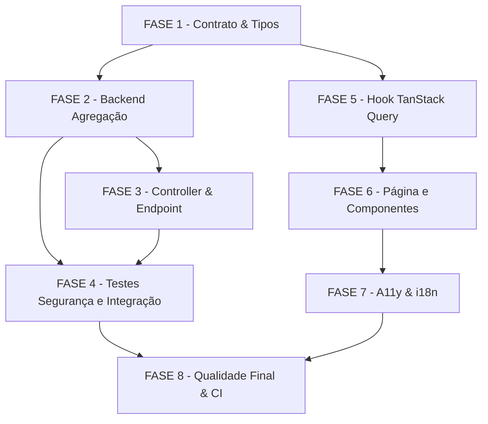

# Tarefas — Relatório Consolidado por Líder (FR79 / Story 13.2a)

Escopo: Endpoint `GET /api/v1/reports/leader-summary` + schemas Zod + UI Client
Component + testes (unit, integração, RLS, snapshot, a11y, performance).
Estende o módulo `apps/api/src/reports/` entregue na Story 13.1 (sem migration).

**Legenda de status:**
- `[ ]` Pendente
- `[~]` Em andamento
- `[x]` Concluído
- `[!]` Bloqueado

**Legenda de criticidade:**
- `[C]` Crítico — Impacto de segurança/compliance (multi-tenant, BOLA, RLS)
- `[A]` Alto — Funcionalidade core sem a qual o sistema não opera
- `[M]` Médio — Necessário mas sem urgência imediata

---

## FASE 1 - Contrato & Tipos Compartilhados

> Cria os schemas Zod em `packages/types` antes de qualquer código de serviço
> ou UI. Garante que FE e BE compartilham o mesmo contrato tipado e que
> snapshots bloqueiam breaking changes silenciosos.

### 1.1 Schemas Zod — `packages/types/src/reports/leader-summary.ts` `[A]`

Ref: FR-07, data-model.md, contracts/leader-summary.md

- [x] 1.1.1 Criar `packages/types/src/reports/leader-summary.ts` com `LeaderSummaryPeriodSchema` (`z.enum(['7d','30d','90d','custom'])`)
- [x] 1.1.2 Implementar `LeaderSummaryQuerySchema`: `period` + `startDate?` + `endDate?` + `groupId?` com refinement Zod (`period='custom'` exige ambas datas; `startDate < endDate`)
- [x] 1.1.3 Implementar `LeaderGroupMetricsSchema`: `groupId` (uuid), `groupName`, `avgAttendancePercent` (number|null), `avgTrailProgressPercent` (number), `atRiskCount` (int), `activeParticipantsCount` (int)
- [x] 1.1.4 Implementar `LeaderSummaryOverallSchema` (`summary`): `totalGroups`, `totalParticipants`, `overallAttendancePercent` (number|null), `overallTrailCompletionPercent`
- [x] 1.1.5 Implementar `LeaderSummaryMetaSchema`: `{ period, startDate (ISO), endDate (ISO) }`
- [x] 1.1.6 Implementar `LeaderSummaryResponseSchema` (envelope): `{ data: { groups: LeaderGroupMetrics[], summary: LeaderSummaryOverall }, meta: LeaderSummaryMeta }`
- [x] 1.1.7 Exportar todos os schemas e tipos inferidos via `packages/types/src/reports/index.ts` (não sobrescrever exports existentes de trail/meeting reports)
- [x] 1.1.8 Garantir que todos os campos opcionais usam `.nullable()` + `.default(null)` conforme FR-06 (sem `undefined` em JSON responses)

### 1.2 Snapshot Tests de Schema `[A]`

Ref: FR-07, SC-05, P12, DEC-INF princípio IV

- [x] 1.2.1 Criar `packages/types/src/__tests__/leader-summary.snapshot.spec.ts`
- [x] 1.2.2 Snapshot de `LeaderSummaryQuerySchema` (shape + refinements Zod serialized)
- [x] 1.2.3 Snapshot de `LeaderGroupMetricsSchema` (todos os campos; incluir `avgAttendancePercent: null` como valor válido)
- [x] 1.2.4 Snapshot de `LeaderSummaryResponseSchema` (envelope completo com `data.groups[]` + `data.summary` + `meta`)
- [x] 1.2.5 Teste de parse feliz: payload conforme → `.parse()` sem erro
- [x] 1.2.6 Teste de parse de falha: `period=custom` sem `startDate` → erro Zod com mensagem legível
- [x] 1.2.7 Executar `pnpm --filter @metanoia/types test` e confirmar green antes de avançar para FASE 2

---

## FASE 2 - Backend: Método de Agregação

> Implementa `ReportsService.getLeaderSummary()` com authz horizontal (lição
> BOLA da Story 13.1), RLS via `withTenantTx`, e agregação on-demand eficiente
> (sem N+1). Esta é a fase de maior risco de segurança — ver garantias AC-SEC-01
> e AC-SEC-02.

### 2.1 Authz Horizontal — Universo de Grupos `[C]`

Ref: FR-05, FR-01, AC-SEC-01, AC-SEC-02, research.md Decision 5, OWASP S1/S2/S3

- [x] 2.1.1 Adicionar método privado `resolveLeaderGroupUniverse(tx: TenantTx, userId: string, role: Role, groupId?: string): Promise<Group[]>` em `reports.service.ts`
- [x] 2.1.2 Para `Role.LIDER`: query `tx.groupMember.findMany({ where: { userId, role: 'lider', deletedAt: null } })` para derivar IDs de grupos — **NUNCA** usar `groupId` do request como seletor principal
- [x] 2.1.3 Para `Role.ADMIN_TENANT`: query `tx.group.findMany({ where: { tenantId } })` (todos os grupos do tenant via RequestContext)
- [x] 2.1.4 Aplicar `groupId` (opcional) como FILTRO sobre o universo já derivado: `groups.filter(g => g.id === groupId)` — se alheio ao universo, resultado é `[]` (não 403, não lança exceção)
- [x] 2.1.5 Retornar `[]` se lider sem grupos (sem 403 neste ponto — 403 é emitido somente se sem role adequada pelo RolesGuard)
- [x] 2.1.6 Escrever unit test: líder A pede `groupId` de líder B (mesmo tenant) → retorna `[]` (AC-SEC-01, P6)
- [x] 2.1.7 Escrever unit test: `admin_tenant` recebe todos os grupos do tenant (P7)

### 2.2 Cálculo de Métricas por Grupo — Agregação Eficiente `[A]`

Ref: FR-02, research.md Decision 2 e Decision 3, data-model.md, SC-03

- [x] 2.2.1 Implementar `computeGroupMetrics(tx: TenantTx, group: Group, dateRange: DateRange): Promise<LeaderGroupMetrics>` como método privado
- [x] 2.2.2 `activeParticipantsCount`: `tx.groupMember.count({ where: { groupId, deletedAt: null } })`
- [x] 2.2.3 `avgAttendancePercent`: buscar reuniões do período (`meeting.scheduledFor` in range); para cada reunião contar `meeting_attendance` linhas / membros ativos; média sobre reuniões; retornar `null` se nenhuma reunião (dec-008)
- [x] 2.2.4 `atRiskCount`: `tx.participantRadarStatus.count({ where: { groupId, status: { in: ['amarelo','vermelho'] } } })` — usar `participantId` (não `userId`) conforme data-model
- [x] 2.2.5 `avgTrailProgressPercent`: buscar `group_trails` do grupo; `tx.trailProgress.aggregate({ _avg: { progressPercent: true }, where: { trailId: { in: trailIds }, userId: { in: activeMemberIds } } })`; retornar `0` se sem trilha
- [x] 2.2.6 Usar `Promise.all([computeGroupMetrics(g1), computeGroupMetrics(g2), ...])` para grupos em paralelo (evitar N+1 sequencial por grupo — DEC-INF-03)
- [x] 2.2.7 Confirmar que todas as queries rodam dentro de `withTenantTx` (RLS ativo) — tenant via `getRequestContext()`, nunca como parâmetro
- [x] 2.2.8 Escrever unit test: grupo com reuniões no período → `avgAttendancePercent` calculado corretamente (P1)
- [x] 2.2.9 Escrever unit test: grupo sem reuniões no período → `avgAttendancePercent: null` (P2, dec-008)

### 2.3 Sumário Geral — Ponderação e Deduplicação `[A]`

Ref: FR-03, data-model.md LeaderSummaryOverallSchema, dec-009, DEC-INF-04

- [x] 2.3.1 Implementar `computeSummary(groups: LeaderGroupMetrics[], tx: TenantTx): LeaderSummaryOverall`
- [x] 2.3.2 `totalGroups`: `groups.length`
- [x] 2.3.3 `totalParticipants`: query de deduplica por `userId` — `tx.groupMember.findMany({ where: { groupId: { in: groupIds }, deletedAt: null }, select: { userId: true }, distinct: ['userId'] })` + `.length`
- [x] 2.3.4 `overallAttendancePercent`: média ponderada de `avgAttendancePercent` pelos `activeParticipantsCount` de cada grupo; excluir grupos com `avgAttendancePercent=null`; retornar `null` se todos os grupos sem reuniões (dec-009)
- [x] 2.3.5 `overallTrailCompletionPercent`: `count(completedAt IS NOT NULL)` / membros ativos com trilha vinculada via `group_trails` (deduplica por `userId`)
- [x] 2.3.6 Unit test: 3 grupos com pesos diferentes → `overallAttendancePercent` ponderado correto (P1)
- [x] 2.3.7 Unit test: todos os grupos com `avgAttendancePercent=null` → `overallAttendancePercent: null`

### 2.4 Método Principal `getLeaderSummary()` e Logging `[A]`

Ref: FR-01, FR-04, FR-05, FR-06, dec-012, quickstart P3, P9

- [x] 2.4.1 Adicionar método público `async getLeaderSummary(query: LeaderSummaryQuery, user: AuthenticatedUser): Promise<LeaderSummaryResponse>` em `reports.service.ts`
- [x] 2.4.2 Resolver `dateRange` a partir de `period`: `7d` → `now - 7d`; `30d` → `now - 30d`; `90d` → `now - 90d`; `custom` → `startDate`/`endDate` da query
- [x] 2.4.3 Abrir `withTenantTx` e chamar `resolveLeaderGroupUniverse` + `Promise.all(computeGroupMetrics)` + `computeSummary` em sequência dentro da mesma transação
- [x] 2.4.4 Chamar `LeaderSummaryResponseSchema.parse(result)` antes de retornar (valida contratos e garante ausência de `undefined`)
- [x] 2.4.5 Log estruturado ao final: `this.logger.log({ duration_ms, groupCount, totalParticipants })` — SEM nome/email/UUID de tenant/usuário (dec-012, S5)
- [x] 2.4.6 Unit test: `period=custom` com datas válidas → `meta.startDate`/`meta.endDate` refletem a janela (P3)
- [x] 2.4.7 Unit test: líder sem grupos → `groups: []`, `summary.totalGroups=0`, `overallAttendancePercent: null` (P5)

---

## FASE 3 - Backend: Controller & Endpoint

> Expõe o endpoint com guards corretos e `ZodValidationPipe`. Validação ocorre
> na borda de entrada (query params); authz horizontal ocorre no service.

### 3.1 Endpoint `GET /api/v1/reports/leader-summary` `[A]`

Ref: FR-01, contracts/leader-summary.md, DEC-INF-01

- [x] 3.1.1 Adicionar handler em `apps/api/src/reports/reports.controller.ts`: `@Get('leader-summary') @Roles(Role.LIDER, Role.ADMIN_TENANT) @UseGuards(KeycloakAuthGuard, RolesGuard, TenantGuard)`
- [x] 3.1.2 Decorar com `@ApiOperation`, `@ApiQuery` (period, startDate, endDate, groupId), `@ApiResponse(200)`, `@ApiResponse(400)`, `@ApiResponse(403)` conforme contrato
- [x] 3.1.3 Aplicar `@UsePipes(new ZodValidationPipe(LeaderSummaryQuerySchema))` no handler para validar query params na borda (erro 400 antes de chegar ao service)
- [x] 3.1.4 Injetar `AuthenticatedUser` via `@CurrentUser()` decorator (padrão existente no controller — não passar `tenantId` como parâmetro)
- [x] 3.1.5 Delegar para `this.reportsService.getLeaderSummary(query, user)` e retornar response diretamente
- [x] 3.1.6 Unit test do controller: mock do service retorna payload válido → status 200 com body correto
- [x] 3.1.7 Unit test: query inválida (`period=custom` sem `startDate`) → ZodValidationPipe lança 400

---

## FASE 4 - Testes de Segurança e Isolamento

> Testes determinísticos de segurança obrigatórios. Cobre BOLA cross-líder
> (AC-SEC-01), RLS cross-tenant (AC-SEC-02), role negado (P9) e roundtrip
> anti-drift (P10). Estes testes são CRITÉRIOS DE ACEITE — feature não pode
> ser mergeada sem eles.

### 4.1 Authz Horizontal — Teste BOLA Cross-Líder `[C]`

Ref: FR-05, AC-SEC-01, research.md Decision 5, OWASP S1, P6

- [x] 4.1.1 Criar (ou adicionar em) `apps/api/src/reports/__tests__/leader-summary.service.spec.ts`
- [x] 4.1.2 Setup de fixture: tenant T; líder L1 com grupo G1; líder L2 com grupo G2 (mesmo tenant)
- [x] 4.1.3 Teste: L1 chama `getLeaderSummary` com `groupId=G2.id` → resposta `groups: []`, `summary.totalGroups=0` — NÃO retorna dados de G2, NÃO lança exceção (AC-SEC-01)
- [x] 4.1.4 Teste: L1 chama sem `groupId` → recebe apenas G1, G2 NÃO aparece (universo derivado de `ctx.userId`)
- [x] 4.1.5 Teste: L1 chama com `groupId=G1.id` → recebe exatamente G1 com métricas corretas

### 4.2 Isolamento RLS Cross-Tenant `[C]`

Ref: FR-05, AC-SEC-02, SC-04, P8 — arquivo `apps/api/test/rls/leader-summary.rls-spec.ts`

- [x] 4.2.1 Criar `apps/api/test/rls/leader-summary.rls-spec.ts` (padrão RLS specs existentes em `apps/api/test/rls/`)
- [x] 4.2.2 Seed: tenant A com líder L_A e grupos G_A1..G_A3 com dados ricos (attendance, radar, trail); tenant B com líder L_B e grupos G_B1..G_B2
- [x] 4.2.3 Teste RLS: L_A chama endpoint → `data.groups` contém apenas G_A1..G_A3; nenhum grupo de tenant B aparece; contagens batem com dados de A (AC-SEC-02)
- [x] 4.2.4 Teste RLS invertido: L_B chama endpoint → apenas grupos de tenant B; sem vazamento de dados do tenant A
- [x] 4.2.5 Verificar que `withTenantTx` SET LOCAL + RLS policy bloqueia cross-tenant mesmo sem filtro explícito no código

### 4.3 Role Negado e Roundtrip E2E `[A]`

Ref: P9, P10, quickstart.md

- [x] 4.3.1 Teste: usuário com role `participante` chama endpoint → 403 (RolesGuard bloqueia antes do service)
- [x] 4.3.2 Teste: usuário não autenticado → 401 (KeycloakAuthGuard)
- [x] 4.3.3 Teste E2E roundtrip (P10): autenticar como líder real, chamar `GET /api/v1/reports/leader-summary?period=30d` contra backend REAL (sem mock), capturar payload bruto
- [x] 4.3.4 `LeaderSummaryResponseSchema.parse(payloadReal)` → deve passar sem erro (valida camelCase, sem undefined, null explícito quando aplicável)
- [x] 4.3.5 Verificar que todas as chaves estão em camelCase (não snake_case) — detecta drift ORM↔DTO

### 4.4 Testes de Integração Completos `[A]`

Ref: P1, P2, P3, P4, P5, P7, P13, quickstart.md

- [x] 4.4.1 P1 — happy path 3 grupos: seed + `period=30d` → `groups.length=3`, `avgAttendancePercent` correto, `summary.totalGroups=3`
- [x] 4.4.2 P2 — grupo sem reuniões no período → `avgAttendancePercent: null` (dec-008); NÃO entra na ponderação
- [x] 4.4.3 P3 — `period=custom` com datas → `meta` reflete a janela; só reuniões no intervalo computadas
- [x] 4.4.4 P4 — drill-down `groupId` → `data.groups` com 1 item; `summary` calculado para esse grupo
- [x] 4.4.5 P5 — líder sem grupos → `groups: []`, summary zerado, `overallAttendancePercent: null`
- [x] 4.4.6 P7 — `admin_tenant` → recebe TODOS os grupos do tenant (não filtrado por liderança)
- [x] 4.4.7 P13 — performance: seed 5 grupos × 20 membros ativos × 5 reuniões + RadarStatus; `Date.now()` before/after → response < 1000ms (SC-03); detecta N+1 ou query ineficiente

---

## FASE 5 - Frontend: Hook TanStack Query

> Hook centralizado de dados segue padrão `use-trail-reports` existente em
> `apps/web/src/lib/api/hooks/`. Encapsula fetch + re-parse Zod + gestão de
> estado de loading/error.

### 5.1 Hook `useLeaderSummary` `[A]`

Ref: FR-09, plan.md Decision 6, research.md Decision 7

- [x] 5.1.1 Criar `apps/web/src/lib/api/hooks/use-leader-summary.ts`
- [x] 5.1.2 Implementar `useLeaderSummary(params: LeaderSummaryQuery)` com TanStack Query: `useQuery({ queryKey: ['leader-summary', params.period, params.groupId, params.startDate, params.endDate], queryFn: fetchLeaderSummary })`
- [x] 5.1.3 `fetchLeaderSummary`: `fetch('/api/v1/reports/leader-summary?' + new URLSearchParams(params))` + `LeaderSummaryResponseSchema.parse(await res.json())` (re-parse Zod no FE — detecta drift)
- [x] 5.1.4 Configurar `staleTime: 60_000` (1 min) — dados de relatório não são realtime
- [x] 5.1.5 Retornar `{ data, isLoading, isError, error }` conforme padrão do projeto
- [x] 5.1.6 Importar tipos de `@metanoia/types` (não redefinir localmente — garantia de paridade)
- [x] 5.1.7 Teste unit do hook (React Testing Library + MSW): mock do endpoint → parse correto do payload; `avgAttendancePercent: null` preservado (não convertido a `undefined`)

---

## FASE 6 - Frontend: Página e Componentes

> Client Component com filtros (período server-side, grupo/semáforo client-side),
> cards por grupo e todos os requisitos de acessibilidade WCAG AA. Rota real:
> `apps/web/app/(authenticated)/app/gestao/relatorios/lider/`.

### 6.1 Componente de Filtros `[M]`

Ref: FR-09, FR-08, SC-06, dec-010

- [x] 6.1.1 Criar `apps/web/app/(authenticated)/app/gestao/relatorios/lider/_components/leader-summary-filters.tsx` (Client Component)
- [x] 6.1.2 Filtro de período (7d/30d/90d/custom): usar `FormField` (Epic 12, Story 12.5) com `label` associado via `htmlFor` — mudança de período dispara nova query TanStack
- [x] 6.1.3 Filtro custom: exibir date pickers `startDate`/`endDate` quando `period='custom'` selecionado; validação client-side (`startDate < endDate`)
- [x] 6.1.4 Filtro de grupo específico (dropdown): filtro **client-side** sobre dados já carregados (não nova query)
- [x] 6.1.5 Filtro de semáforo (multi-select verde/amarelo/vermelho): filtro **client-side**; "vermelho/amarelo" → cards com `atRiskCount > 0`; "verde" → cards com `atRiskCount = 0` (dec-010)
- [x] 6.1.6 Usar token `text-secondary` em todos os labels/valores de cor (nunca `text-muted` — tech debt R2 Epic 12)
- [x] 6.1.7 Todas as strings PT-BR em `apps/web/messages/pt-BR.json` (chaves `reports.leader.filters.*`)

### 6.2 Card de Grupo — Métricas e Acessibilidade `[A]`

Ref: FR-08, FR-09, SC-06, P5, P11

- [x] 6.2.1 Criar `apps/web/app/(authenticated)/app/gestao/relatorios/lider/_components/group-summary-card.tsx`
- [x] 6.2.2 Exibir: `groupName`, `avgAttendancePercent` (ou "—" se null), `avgTrailProgressPercent`, `atRiskCount`, `activeParticipantsCount`
- [x] 6.2.3 Badge de semáforo: **ícone + texto** (ex: `🟢 Verde`, `🟡 Atenção`, `🔴 Risco`) — nunca representação apenas por cor (FR-08, SC-06)
- [x] 6.2.4 Contraste WCAG AA: usar tokens de cor do design system com ratio ≥ 4.5:1; não hardcodar hex
- [x] 6.2.5 `aria-label` descritivo no card: `"Grupo Alpha: 12 participantes, 72% presença"` (FR-08)
- [x] 6.2.6 Navegação por teclado: card focável via `tabIndex={0}`, link drill-down `href="/app/gestao/groups/{groupId}"` com `aria-label`
- [x] 6.2.7 Estado: `avgAttendancePercent: null` → exibir "Sem reuniões no período" (não "0%")
- [x] 6.2.8 Todas as strings visíveis em `apps/web/messages/pt-BR.json` (chaves `reports.leader.card.*`)

### 6.3 Página Principal — Layout e Estados `[A]`

Ref: FR-09, research.md Decision 6, plan.md (rota corrigida)

- [x] 6.3.1 Criar `apps/web/app/(authenticated)/app/gestao/relatorios/lider/page.tsx` como Client Component (`'use client'`)
- [x] 6.3.2 Compor `LeaderSummaryFilters` + `useLeaderSummary` + grid de `GroupSummaryCard` (responsivo: 1 col mobile, 2 col tablet, 3 col desktop)
- [x] 6.3.3 Estado loading: skeleton card por grupo (número de cards = grupos do período anterior ou 3 por padrão)
- [x] 6.3.4 Estado empty: mensagem pastoral "Nenhum grupo encontrado neste período" com sugestão de ajustar o filtro
- [x] 6.3.5 Estado error: mensagem de erro com opção de retry
- [x] 6.3.6 Sumário geral: seção acima dos cards com `totalGroups`, `totalParticipants`, `overallAttendancePercent` (ou "—" se null), `overallTrailCompletionPercent`
- [x] 6.3.7 Heading semântico: `<h1>` com título da página; cards em `<ul>`/`<li>` ou `role="list"` para leitores de tela
- [x] 6.3.8 Todas as strings em `apps/web/messages/pt-BR.json` (chaves `reports.leader.*`)

---

## FASE 7 - Testes de Frontend, A11y e i18n

> Gate a11y permanente (Epic 12): axe-core sem violações. Roundtrip a11y
> executável via Playwright. Cobertura de i18n: todas as chaves PT-BR presentes.

### 7.1 Testes de Componente `[M]`

Ref: P5, P11, SC-06

- [x] 7.1.1 Teste `group-summary-card.spec.tsx`: renderiza métricas; badge com `ícone+texto`; `aria-label` correto; `atRiskCount=0` → badge verde; `atRiskCount>0` → badge amarelo/vermelho
- [x] 7.1.2 Teste: `avgAttendancePercent: null` → exibe "Sem reuniões no período" (não "0%" nem "null")
- [x] 7.1.3 Teste `leader-summary-filters.spec.tsx`: `FormField` com label associado; filtro de semáforo filtra cards client-side
- [x] 7.1.4 Teste de snapshot de página: render com dados mockados → snapshot HTML estável

### 7.2 Gate A11y Permanente — axe-core `[A]`

Ref: FR-08, SC-06, P11, gate a11y permanente Epic 12

- [x] 7.2.1 Criar teste Playwright E2E: `apps/web/e2e/gestao/relatorios-lider-a11y.spec.ts`
- [x] 7.2.2 Autenticar como líder, navegar para `/app/gestao/relatorios/lider`
- [x] 7.2.3 Executar `axe()` na página completa → `violations` deve ser `[]` (0 violações)
- [x] 7.2.4 Verificar: badges de semáforo têm texto visível (não só cor); ratio de contraste ≥ 4.5:1
- [x] 7.2.5 Verificar: filtros de período têm `label` associado; cards navegáveis por Tab
- [x] 7.2.6 Incluir o teste no workflow `a11y-checks.yml` (gate a11y do CI — padrão Epic 12)
- [x] 7.2.7 Confirmar que `text-secondary` é usado (não `text-muted`) — grep no componente

### 7.3 i18n PT-BR `[M]`

Ref: FR-09, FR-08, CLAUDE.md (PT-BR user-facing)

- [x] 7.3.1 Adicionar todas as chaves `reports.leader.*` em `apps/web/messages/pt-BR.json`: títulos, labels de filtro, estados (loading/empty/error), labels de métricas, texto de badges de semáforo
- [x] 7.3.2 Verificar que nenhuma string hardcoded em inglês aparece na UI (grep por string em inglês nos componentes da FASE 6)
- [x] 7.3.3 Teste: renderizar página com `locale='pt-BR'` → todas as strings no idioma correto

---

## FASE 8 - Qualidade Final e CI

> Integração final, lint, CI verde, PR. Sem esta fase a feature não é done.

### 8.1 Qualidade de Código `[M]`

Ref: CLAUDE.md (strict TypeScript, conventional commits PT-BR)

- [x] 8.1.1 Executar `pnpm --filter @metanoia/types build` e `pnpm --filter @metanoia/api build` — zero erros TypeScript `strict`
- [x] 8.1.2 Executar `pnpm lint` no monorepo — zero warnings/errors
- [x] 8.1.3 Executar `pnpm --filter @metanoia/types test` (inclui snapshots) — green
- [x] 8.1.4 Executar `pnpm --filter @metanoia/api test` (inclui unit + integration + RLS) — green
- [x] 8.1.5 Verificar que nenhuma query Prisma faz lookup de `tenant_id` como parâmetro de função (grep por `tenantId:` em calls de service) — usar apenas RequestContext

### 8.2 Revisão de Segurança Final `[C]`

Ref: OWASP S1..S6, AC-SEC-01, AC-SEC-02, FR-05

- [x] 8.2.1 Code review checklist de segurança: `resolveLeaderGroupUniverse` nunca usa `groupId` como seletor de universo — apenas como filtro pós-derivação
- [x] 8.2.2 Verificar que P6 (AC-SEC-01) e P8 (AC-SEC-02) estão nos reports de CI (RLS spec rodando)
- [x] 8.2.3 Confirmar que log não emite `tenantId`, `userId`, `groupName` ou email — apenas `{duration_ms, groupCount, totalParticipants}` (dec-012)
- [x] 8.2.4 Confirmar que `groupId` alheio ao universo resulta em `groups: []` e não em 403 ou exceção (AC-SEC-01)

### 8.3 PR e Done `[M]`

Ref: CLAUDE.md (git workflow), plan.md (1 story = 1 branch = 1 PR)

- [x] 8.3.1 Branch `feat/story-13-2a-relatorio-lider` (kebab-case, intent prefix `feat/`)
- [x] 8.3.2 Commits em português convencional: `feat(reports): adiciona endpoint leader-summary (FR79)`, `test(reports): RLS isolation leader-summary`, etc.
- [x] 8.3.3 PR: título `feat(reports): relatório consolidado por líder — FR79 (Story 13.2a)`; body com link para spec.md + checklist de ACs
- [x] 8.3.4 CI verde: lint + build + unit + integration + RLS + snapshot + a11y (axe-core) — TODOS devem passar antes do merge
- [x] 8.3.5 Checar que não há arquivos de estado ou secrets na PR (`.env`, `state.json`, `backups/`)

---

## Matriz de Dependências

## Resumo Quantitativo

| Fase | Tarefas | Subtarefas | Criticidade máx |
|------|---------|------------|-----------------|
| 1 - Contrato & Tipos | 2 | 15 | A |
| 2 - Backend Agregação | 4 | 25 | C |
| 3 - Controller & Endpoint | 1 | 7 | A |
| 4 - Testes Segurança e Integração | 4 | 22 | C |
| 5 - Hook TanStack Query | 1 | 7 | A |
| 6 - Página e Componentes | 3 | 22 | A |
| 7 - A11y & i18n | 3 | 17 | A |
| 8 - Qualidade Final & CI | 3 | 15 | C |
| **Total** | **21** | **130** | — |

## Escopo Coberto

| Item | Descrição | Fase |
|------|-----------|------|
| FR-01 | Endpoint `GET /api/v1/reports/leader-summary` | 2, 3 |
| FR-02 | Agregação por grupo (presença, trilha, risco, ativos) | 2 |
| FR-03 | Sumário geral com ponderação e deduplicação | 2 |
| FR-04 | Filtros de período (7d/30d/90d/custom) | 2, 3 |
| FR-05 / AC-SEC-01 | Authz horizontal: `groupId` alheio → `groups:[]` (não 403) | 2, 4 |
| FR-05 / AC-SEC-02 | RLS cross-tenant: líder A não vê dados de tenant B | 4 |
| FR-06 | Contrato de resposta `{ data, meta }` com Zod | 1, 2 |
| FR-07 | Schemas Zod + snapshot em `packages/types` | 1 |
| FR-08 | A11y: badges ícone+texto, aria-label, FormField, text-secondary | 6, 7 |
| FR-09 | UI Client Component + TanStack Query + filtros | 5, 6 |
| SC-03 / P13 | Performance: 5 grupos × 20 membros < 1s | 4 |
| SC-06 | Gate axe-core 0 violações em CI | 7 |
| P6 | Teste determinístico BOLA cross-líder | 4 |
| P8 | Teste determinístico RLS A↔B | 4 |
| P10 | Roundtrip E2E anti-drift snake↔camelCase | 4 |
| P12 | Snapshot de schema (gate breaking change) | 1 |

## Escopo Excluído

| Item | Descrição | Motivo |
|------|-----------|--------|
| Story 13.2b | Materialized view / refresh periódico de agregação | Story separada; fora do MVP desta story |
| Export CSV | Export do relatório de líder em CSV | Não solicitado nesta story (FR fora do escopo) |
| Tendência histórica | Gráfico de evolução de presença ao longo do tempo | Nice-to-have; fora do MVP da 13.2a |
| Tabela de participantes em risco | Listagem individual de participantes (em risco) | Escopo da story 13.2a entrega apenas cards de grupo (FR-08) |
| Gate axe em páginas autenticadas (CI automático) | Integração do axe nas páginas de área autenticada no CI geral | Tech debt R2 do Epic 12; escopo futuro |
| Repository pattern para analytics | Abstrair acesso a dados do `ReportsService` em repositório | Violação de arquitetura: supporting subdomain usa service direto |
| Notificações push baseadas em risco | Alertas automáticos baseados em `atRiskCount` | Escopo Epic 13.3 (Story 13.3) |
