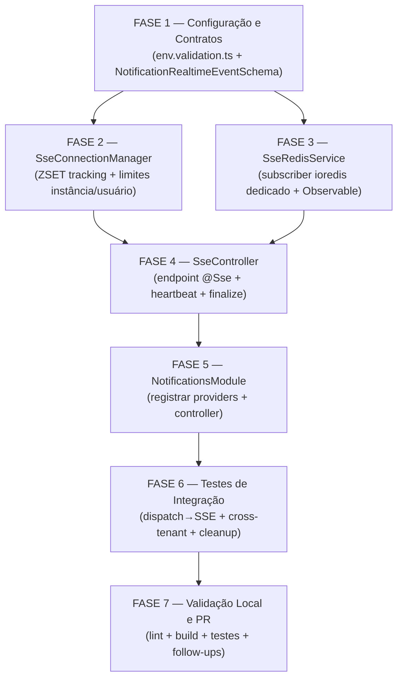

# Backlog de Tarefas: SSE Endpoint & Redis Pub/Sub Backend (FR77)

**Feature**: sse-notificacoes · **Story**: 14-2a (Epic 14 — Notificações em Tempo Real)
**Spec**: `docs/specs/sse-notificacoes/spec.md`
**Plan**: `docs/specs/sse-notificacoes/plan.md`
**Versão do backlog**: 1.0.0
**Data**: 2026-06-20

---

**Legenda de status:**
- `[ ]` Pendente
- `[~]` Em andamento
- `[x]` Concluído
- `[!]` Bloqueado

**Legenda de criticidade:**
- `[C]` Crítico — impacto de segurança, isolamento multi-tenant ou SLA direto
- `[A]` Alto — funcionalidade core sem a qual o sistema não opera
- `[M]` Médio — necessário mas pode ser adiado sem impacto imediato

---

## FASE 1 — Configuração e Contratos

> Adição das variáveis de ambiente SSE ao schema Zod e verificação do
> contrato Zod existente em `packages/types`. Sem alteração de lógica de
> negócio. Dependência de todas as fases seguintes.

### 1.1 Adicionar envs SSE ao `env.validation.ts` `[A]`

Ref: spec §FR-04, FR-05, FR-03; contracts §Envs; CHK007

- [ ] 1.1.1 Editar `apps/api/src/config/env.validation.ts`: adicionar `SSE_MAX_CONNECTIONS` como `z.coerce.number().int().min(1).default(1000)` (EC-07: 0/inválido → 1000 + warning; usar `.transform` ou `.superRefine` para logar no startup)
- [ ] 1.1.2 Adicionar `SSE_MAX_PER_USER` como `z.coerce.number().int().min(1).default(5)`
- [ ] 1.1.3 Adicionar `SSE_HEARTBEAT_INTERVAL_MS` como `z.coerce.number().int().min(1000).default(30000)`
- [ ] 1.1.4 Verificar que `validateEnv()` existente em `env.validation.ts` já testa a função `safeParse` — confirmar via `grep -n validateEnv apps/api/src/config/env.validation.ts`
- [ ] 1.1.5 Escrever testes unitários em `apps/api/src/config/env.validation.spec.ts` (criar se não existir): validar defaults, aceitar valores inteiros, rejeitar `SSE_MAX_CONNECTIONS=0` com fallback 1000 + warning, rejeitar valor não-numérico

### 1.2 Verificar e documentar contrato Zod `NotificationRealtimeEventSchema` `[A]`

Ref: data-model.md §NotificationRealtimeEvent; spec §FR-08; contracts §Mapeamento de campo; CHK003, CHK005

- [ ] 1.2.1 Executar `grep -rn "NotificationRealtimeEventSchema" packages/types/src/` e confirmar que o campo se chama `notificationId` (não `id`) no schema — fonte da verdade para o mapper
- [ ] 1.2.2 Confirmar que o schema Zod inclui os campos `notificationId`, `type`, `title`, `body`, `createdAt` conforme `data-model.md §NotificationRealtimeEvent`
- [ ] 1.2.3 Escrever snapshot test em `packages/types/src/notification.spec.ts` (criar se não existir) que valida o shape exato do schema e gera snapshot — gate contra alterações silenciosas
- [ ] 1.2.4 Documentar inline no schema (via comentário JSDoc) que `notificationId` é renomeado para `id` na borda SSE wire — rastreabilidade para leitores futuros

---

## FASE 2 — SseConnectionManager

> Serviço de tracking de conexões com Redis ZSET. Gerencia limites por
> instância (em memória) e por usuário (Redis global). Não tem dependência
> de FASE 1 no build, mas precisa dos envs definidos em 1.1.

### 2.1 Implementar `SseConnectionManager` `[C]`

Ref: spec §FR-04, FR-05, FR-06, FR-09, FR-12; data-model.md §ConnectionRegistry, §InstanceConnectionCounter; EC-04, EC-05, EC-07; CHK022, CHK033

> **CHK022**: assert de formato UUID para `tenantId`/`userId` antes de construir
> chaves Redis é MUST (hardening barato — dec-021/SR-5).
>
> **CHK033 (tech debt MVP)**: race condition no ZSET em multi-instance (instâncias
> A e B leem ZCARD=4 simultaneamente e ambas aceitam → usuário tem 6 conexões)
> não é mitigada no MVP. Documentar como limitação em comentário inline na
> implementação do `checkAndRegister`. Criar issue de follow-up antes de fechar Epic 14.

- [ ] 2.1.1 Criar `apps/api/src/notifications/sse/sse-connection.manager.ts` com `@Injectable() SseConnectionManager implements OnModuleInit`
- [ ] 2.1.2 Injetar `ConfigService<EnvConfig, true>` e `RedisService` via construtor; ler `SSE_MAX_CONNECTIONS`, `SSE_MAX_PER_USER` no `onModuleInit` com fallback 1000/5 e log de warning se valor ≤ 0
- [ ] 2.1.3 Implementar contador em memória `private instanceCount = 0` e método `checkInstanceLimit(): void` que lança `HttpException(503)` com header `Retry-After: 30` se `instanceCount >= max`
- [ ] 2.1.4 Implementar `assertValidUuid(value: string, field: string): void` que valida formato UUID v4/v7 e lança `InternalServerErrorException` se inválido — aplicar a `tenantId` e `userId` antes de qualquer operação Redis (CHK022, dec-021/SR-5)
- [ ] 2.1.5 Implementar `buildZsetKey(tenantId: string, userId: string): string` que retorna `sse:connections:${tenantId}:${userId}` (após assert UUID)
- [ ] 2.1.6 Implementar `register(tenantId, userId, connectionId, timestamp): Promise<void>` que executa `ZADD key timestamp connectionId` via `RedisService`
- [ ] 2.1.7 Implementar `remove(tenantId, userId, connectionId): Promise<void>` que executa `ZREM key connectionId` (retorno 0 = silencioso — EC-04)
- [ ] 2.1.8 Implementar `countConnections(tenantId, userId): Promise<number>` que executa `ZCARD key`
- [ ] 2.1.9 Implementar `getOldestConnection(tenantId, userId): Promise<string | null>` que executa `ZRANGE key 0 0` e retorna o connectionId ou null
- [ ] 2.1.10 Implementar `checkAndRegister(tenantId, userId, connectionId): Promise<{ evicted: string | null }>`: (1) `checkInstanceLimit()`; (2) `ZCARD` — se ≥ `SSE_MAX_PER_USER`, `ZRANGE` p/ mais antiga, `ZREM` (EC-04: loop até ZREM retornar 1 ou ZCARD < max); retornar `{ evicted: connectionId | null }`; (3) `ZADD`; (4) incrementar `instanceCount`
- [ ] 2.1.11 Implementar `release(tenantId, userId, connectionId): Promise<void>` que executa `ZREM` + decrementa `instanceCount` (tear down determinístico)
- [ ] 2.1.12 Documentar limitação MVP do CHK033 em comentário inline no método `checkAndRegister` (race ZSET multi-instance)

### 2.2 Testes unitários do `SseConnectionManager` `[C]`

Ref: spec §SC-03, SC-04, SC-07; EC-04, EC-05; NFR-05

- [ ] 2.2.1 Criar `apps/api/src/notifications/sse/sse-connection.manager.spec.ts`
- [ ] 2.2.2 Mockar `RedisService` com `jest.fn()` para todos os métodos Redis usados
- [ ] 2.2.3 Testar SC-03: ao atingir `SSE_MAX_CONNECTIONS`, `checkInstanceLimit()` lança 503 com `Retry-After: 30` antes de qualquer operação Redis
- [ ] 2.2.4 Testar SC-04: ao atingir `SSE_MAX_PER_USER`, `checkAndRegister()` retorna `{ evicted: oldestId }` e executa ZREM antes de ZADD
- [ ] 2.2.5 Testar EC-04: quando `ZREM` retorna 0 (conexão mais antiga já sumiu), método tenta a próxima via novo `ZRANGE`; nunca recusa nova conexão
- [ ] 2.2.6 Testar SC-07: `release()` executa `ZREM` e decrementa `instanceCount`
- [ ] 2.2.7 Testar `assertValidUuid`: rejeitar string não-UUID; aceitar UUID v7 válido
- [ ] 2.2.8 Testar EC-07: `onModuleInit` com `SSE_MAX_CONNECTIONS=0` aplica default 1000 e loga warning

---

## FASE 3 — SseRedisService

> Conexão ioredis **dedicada** para subscriber mode (separada do `RedisService`
> de comandos). Subscribe/unsubscribe ao canal `rt:notifications:{tenantId}:{userId}`
> com refcount por canal. Sem dependência de FASE 2.

### 3.1 Implementar `SseRedisService` `[A]`

Ref: plan.md §Technical Context; research.md §D2; spec §FR-07, FR-08, FR-09; EC-02, EC-06; CHK037

- [ ] 3.1.1 Criar `apps/api/src/notifications/sse/sse-redis.service.ts` com `@Injectable() SseRedisService implements OnModuleDestroy` — seguindo exatamente o padrão de `meeting-sse.service.ts` (conexão dedicada + Subject + channelSubscriberCount Map)
- [ ] 3.1.2 No construtor, instanciar `new Redis({ host, port })` dedicado para subscriber mode (injetar `ConfigService<EnvConfig, true>`)
- [ ] 3.1.3 Criar `private readonly eventSubject = new Subject<{ tenantId: string; userId: string; raw: string }>()`
- [ ] 3.1.4 Registrar `this.subscriber.on('message', (channel, message) => { ... })`: parsear canal `rt:notifications:{tenantId}:{userId}` extraindo `tenantId` e `userId` (split por `:`, segmentos 2 e 3); emitir no `eventSubject` com `raw=message`
- [ ] 3.1.5 Implementar `subscribe(tenantId, userId): Observable<MessageEvent>`: (1) construir canal; (2) verificar refcount — se 0, `this.subscriber.subscribe(channel)`; (3) incrementar refcount; (4) retornar `Observable` com `filter` por `tenantId+userId`, `map` de `raw` para frame SSE (mapeamento `notificationId → id`); (5) teardown: decrementar refcount, `unsubscribe` se 0
- [ ] 3.1.6 Implementar o **mapeamento `notificationId → id`** no `map()` do Observable: `safeParse` o `raw` com `NotificationRealtimeEventSchema`; em sucesso, retornar `{ data: JSON.stringify({ id: parsed.notificationId, type, title, body, createdAt }) } as MessageEvent`; em falha (EC-06): `logger.error({ raw }, 'sse payload malformed — discarding')` + `null` (filtrar nulos no pipe)
- [ ] 3.1.7 Implementar EC-02 (blast radius mínimo — dec-012): no handler `subscriber.on('error', ...)`, fechar apenas as conexões cujo subscriber específico foi perdido via `Subject.error()` controlado por canal; não fechar conexões de outros canais ativos
- [ ] 3.1.8 Implementar `onModuleDestroy()`: `eventSubject.complete(); await subscriber.quit()`
- [ ] 3.1.9 **NUNCA logar** `req.url`, `req.query.token`, `Referer` ou qualquer campo que contenha o token JWT (SR-1, C7) — garantir que os logs do serviço usem apenas campos estruturados sem URL raw

### 3.2 Testes unitários do `SseRedisService` `[A]`

Ref: spec §SC-05, SC-06; EC-02, EC-06; plan.md §SR-1

- [ ] 3.2.1 Criar `apps/api/src/notifications/sse/sse-redis.service.spec.ts`
- [ ] 3.2.2 Mockar `ioredis` Redis com EventEmitter ou factory mock
- [ ] 3.2.3 Testar SC-05: publicar mensagem válida no canal mockado → Observable emite `MessageEvent` com campos corretos
- [ ] 3.2.4 Testar o mapeamento `notificationId → id`: payload emitido contém `id` (não `notificationId`)
- [ ] 3.2.5 Testar SC-06 (isolamento cross-tenant): Observable de `tenantId=A` NÃO emite eventos publicados para `tenantId=B`
- [ ] 3.2.6 Testar EC-06: payload JSON mal-formado → logar erro + não emitir evento + Observer permanece ativo
- [ ] 3.2.7 Testar refcount: subscribe/subscribe/unsubscribe NÃO chama `redis.unsubscribe`; segundo unsubscribe chama
- [ ] 3.2.8 Testar EC-02: erro no subscriber Redis fecha apenas o canal afetado (Subject com error() controlado)

---

## FASE 4 — SseController

> Endpoint `GET /api/v1/sse/notifications` com guard Keycloak, heartbeat RxJS
> e integração com `SseConnectionManager` + `SseRedisService`. Depende de FASE 2 e FASE 3.

### 4.1 Implementar `SseController` `[A]`

Ref: spec §FR-01, FR-02, FR-03, FR-07, FR-08, FR-09, FR-11; contracts §Endpoint; plan.md §SR-1; CHK018, CHK019

- [ ] 4.1.1 Criar `apps/api/src/notifications/sse/sse.controller.ts` com `@Controller('api/v1/sse') SseController`
- [ ] 4.1.2 Injetar `SseConnectionManager`, `SseRedisService`, `ConfigService<EnvConfig, true>` via construtor
- [ ] 4.1.3 Implementar `@Sse('notifications') stream(): Observable<MessageEvent>` — método sem parâmetros (tenant/user vêm de `getRequestContext()`)
- [ ] 4.1.4 No início do método `stream()`: chamar `getRequestContext()` para extrair `tenantId` e `userId`; gerar `connectionId = uuidv7()` (proibido `crypto.randomUUID()`)
- [ ] 4.1.5 Chamar `await connectionManager.checkAndRegister(tenantId, userId, connectionId)`: se `evicted` não-nulo, enviar `event:close` à conexão mais antiga via mecanismo de notificação (Subject por connectionId ou referência ao Subject da FASE 3)
- [ ] 4.1.6 Construir Observable principal: `merge(sseRedisService.subscribe(tenantId, userId), heartbeat$)` onde `heartbeat$ = interval(heartbeatMs).pipe(map(() => ({ type: 'heartbeat', data: '' } as MessageEvent)))` — emitindo o frame `: heartbeat`
- [ ] 4.1.7 Adicionar operador `finalize()` no Observable para chamar `connectionManager.release(tenantId, userId, connectionId)` na desconexão (teardown determinístico — SC-07, NFR-05)
- [ ] 4.1.8 **Filtro de log SR-1**: garantir que nenhum interceptor/log registre `req.url`, `req.query.token` nem header `Referer` na rota SSE — verificar com `grep -rn "req.url\|query.token\|Referer" apps/api/src/` e documentar resultado
- [ ] 4.1.9 Verificar que o `APP_GUARD` Keycloak global já protege a rota (token via `Authorization: Bearer` OU `?token=` fallback via `extractToken` em `keycloak.guard.ts` L143-156) — sem adicionar guard duplicado

### 4.2 Testes unitários do `SseController` `[A]`

Ref: spec §SC-01, SC-02, SC-03; US1, US2, US3; contracts §Response

- [ ] 4.2.1 Criar `apps/api/src/notifications/sse/sse.controller.spec.ts`
- [ ] 4.2.2 Mockar `SseConnectionManager`, `SseRedisService`, `ConfigService`, `getRequestContext`
- [ ] 4.2.3 Testar SC-01: `stream()` retorna Observable (o decorator `@Sse()` garante `Content-Type: text/event-stream`)
- [ ] 4.2.4 Testar SC-02: heartbeat emitido a cada `SSE_HEARTBEAT_INTERVAL_MS` (usar `TestScheduler` RxJS ou jest fake timers)
- [ ] 4.2.5 Testar SC-03: quando `checkAndRegister` lança 503, Observable não é criado
- [ ] 4.2.6 Testar SC-04: quando `checkAndRegister` retorna `{ evicted: 'conn-old' }`, close event é enviado à conexão eviccionada antes de aceitar a nova
- [ ] 4.2.7 Testar `finalize()`: ao completar/cancelar Observable, `connectionManager.release()` é chamado com `tenantId`, `userId`, `connectionId` corretos

---

## FASE 5 — Registro no NotificationsModule

> Registrar os três novos providers e o controller no módulo existente.
> Depende das FASEs 2, 3 e 4.

### 5.1 Atualizar `notifications.module.ts` `[A]`

Ref: spec §Q3 (dec-008); plan.md §Project Structure

- [ ] 5.1.1 Editar `apps/api/src/notifications/notifications.module.ts`: adicionar imports de `SseController`, `SseConnectionManager`, `SseRedisService`
- [ ] 5.1.2 Adicionar `SseController` ao array `controllers`
- [ ] 5.1.3 Adicionar `SseConnectionManager` e `SseRedisService` ao array `providers`
- [ ] 5.1.4 Verificar que `RedisModule` (global) e `ConfigModule` (global) já estão disponíveis sem import local — confirmar via `grep -rn "isGlobal: true" apps/api/src/` que ambos são globais
- [ ] 5.1.5 Executar `pnpm --filter api build` (apenas build TypeScript) após edição para detectar erros de type antes dos testes

---

## FASE 6 — Testes de Integração

> Testes de integração cobrindo o fluxo dispatch→SSE, isolamento cross-tenant
> (SC-06), heartbeat (SC-02) e cleanup (SC-07). Requer Redis real ou MockRedis.
> Depende de todas as fases anteriores.

### 6.1 Implementar `sse.integration-spec.ts` `[C]`

Ref: spec §SC-01 a SC-08; NFR-04 (zero cross-tenant leakage); plan.md §Constitution Check

> **Nota SC-06 (isolamento cross-tenant)**: este é o teste determinístico
> OBRIGATÓRIO exigido pelo constitution check. Deve usar dois tenants distintos
> e publicar Redis apenas no canal do tenant A, assertando que o Observable
> do tenant B não emite nenhum evento.

- [ ] 6.1.1 Criar `apps/api/src/notifications/sse/sse.integration-spec.ts` com `describe('SSE integration', ...)` usando NestJS `Test.createTestingModule`
- [ ] 6.1.2 Configurar módulo de teste com `SseController`, `SseConnectionManager`, `SseRedisService`, mocks de `ConfigService` e `RedisService` (ioredis-mock ou jest.fn())
- [ ] 6.1.3 Implementar SC-05: publicar mensagem no canal `rt:notifications:{tenantId}:{userId}` via mock do subscriber, capturar evento `notification` no Observable, assertar shape `{ id, type, title, body, createdAt }` (sem `notificationId`)
- [ ] 6.1.4 Implementar SC-06 (cross-tenant — OBRIGATÓRIO): criar dois contextos (tenantA/userX, tenantB/userX); publicar mensagem apenas para tenantA; assertar que Observable de tenantB permanece sem emissão em 500ms
- [ ] 6.1.5 Implementar SC-02 (heartbeat): subscribir ao Observable, avançar timers 35s (fake timers), assertar ≥ 1 heartbeat emitido
- [ ] 6.1.6 Implementar SC-07 (cleanup): registrar conexão, completar Observable, assertar que `connectionManager.release()` foi chamado e `ZCARD` mockado retornaria 0
- [ ] 6.1.7 Implementar SC-03 (503 MAX_CONNECTIONS): simular `instanceCount >= max`, assertar que nova conexão resulta em exceção 503 com `Retry-After: 30`
- [ ] 6.1.8 Implementar SC-04 (evicção mais antiga): abrir N conexões até `SSE_MAX_PER_USER`, assertar que próxima conexão evicta a mais antiga (ZRANGE), que close event é enviado à mais antiga, e que nova conexão é aceita
- [ ] 6.1.9 Implementar EC-06 (payload malformado): injetar mensagem JSON inválida no canal, assertar que Observable NÃO emite e permanece ativo
- [ ] 6.1.10 Implementar mapeamento `notificationId → id` end-to-end: payload no Redis contém `notificationId`, evento SSE recebido contém `id` (não `notificationId`) — previne o drift documentado em `plan.md §Convenções de Borda`

---

## FASE 7 — Validação Local e PR

> Todos os gates locais antes de abrir PR para `dev`. Sem Postgres (não há
> migration). Redis necessário apenas se rodar integration-spec com Redis real;
> mock é suficiente para CI.
>
> **Lição epic-13/14-1 (obrigatória)**: rodar `pnpm turbo lint` COMPLETO do
> monorepo (não apenas `apps/api`) para detectar erros de TypeScript em
> `packages/types` ou `apps/web` causados por mudanças de contrato.

### 7.1 Validação local completa antes do PR `[A]`

Ref: CLAUDE.md §Development Commands; lição epic-13/14-1

- [ ] 7.1.1 Executar `pnpm turbo lint` na raiz do monorepo — validar zero erros em TODOS os pacotes (não apenas `apps/api`)
- [ ] 7.1.2 Executar `pnpm --filter api test run` para rodar todos os unit + integration specs da API
- [ ] 7.1.3 Confirmar que os novos spec files (`sse.controller.spec.ts`, `sse-connection.manager.spec.ts`, `sse-redis.service.spec.ts`, `sse.integration-spec.ts`) aparecem na saída de cobertura sem falhas
- [ ] 7.1.4 Executar `pnpm --filter api build` para compilação TypeScript completa — zero erros de tipo
- [ ] 7.1.5 Executar `pnpm --filter types build` para confirmar que mudanças em `packages/types` (snapshot tests) não quebraram o pacote
- [ ] 7.1.6 Revisar que `git diff --stat` inclui apenas arquivos de escopo (`apps/api/src/notifications/sse/`, `apps/api/src/config/env.validation.ts`, `apps/api/src/notifications/notifications.module.ts`, `packages/types/src/notification.spec.ts`) e nada fora do blast radius

### 7.2 Checklist de segurança pré-PR `[C]`

Ref: plan.md §SR-1 (dec-017), SR-2 (dec-018), SR-5 (dec-021); CHK018, CHK019, CHK022

- [ ] 7.2.1 Executar `grep -rn "req.url\|query\.token\|Referer" apps/api/src/notifications/sse/` — resultado DEVE ser vazio (nenhum log contendo token)
- [ ] 7.2.2 Executar `grep -rn "crypto\.randomUUID\|uuid()" apps/api/src/notifications/sse/` — resultado DEVE ser vazio (só `uuidv7()` permitido)
- [ ] 7.2.3 Verificar que `assertValidUuid` é chamado em `SseConnectionManager` antes de qualquer operação Redis com `tenantId` ou `userId`
- [ ] 7.2.4 Confirmar que `data-model.md §NotificationRealtimeEvent` documenta `title`/`body` como UNTRUSTED (C8) — sem escape no backend SSE; responsabilidade do frontend (14-2b)

### 7.3 Abrir PR e registrar follow-ups `[M]`

Ref: CLAUDE.md §Git Workflow; CHK025, CHK033, CHK039

> **CHK025 (tech debt — risco médio)**: rate-limit de abertura de conexão por
> usuário/IP (SR-3/dec-019) NÃO implementado no MVP. Deve ser registrado como
> issue/story de follow-up ANTES de fechar o Epic 14.
>
> **CHK033 (tech debt — risco médio)**: race condition de ZSET em multi-instance
> (dois pods aceitam simultaneamente → usuário excede limite) NÃO mitigada no MVP.
> Registrar como issue de follow-up antes de fechar o Epic 14.

- [ ] 7.3.1 Criar branch `feat/sse-notificacoes-14-2a` a partir de `dev`
- [ ] 7.3.2 Commits em português seguindo Conventional Commits: `feat(notifications): adicionar SseConnectionManager com rastreamento ZSET`, `feat(notifications): adicionar SseRedisService com subscriber dedicado`, `feat(notifications): adicionar SseController GET /api/v1/sse/notifications`, `feat(notifications): registrar providers SSE em NotificationsModule`, `feat(config): adicionar envs SSE_MAX_CONNECTIONS/SSE_MAX_PER_USER/SSE_HEARTBEAT_INTERVAL_MS`
- [ ] 7.3.3 Abrir PR para `dev` com descrição incluindo: link para `docs/specs/sse-notificacoes/spec.md`, mapeamento SC-01→SC-08, decisões dec-008/dec-011/dec-012 referenciadas, tech debts CHK025/CHK033 listados explicitamente
- [ ] 7.3.4 Criar issue de follow-up para CHK025 (rate-limit de abertura SSE por usuário/IP, namespace `rate:*`) — referenciar dec-019/SR-3
- [ ] 7.3.5 Criar issue de follow-up para CHK033 (race condition ZSET multi-instance) — referenciar EC-05 + limitação MVP documentada em `SseConnectionManager`

---

## Matriz de Dependências

---

## Resumo Quantitativo

| Fase | Tarefas | Subtarefas | Criticidade |
|------|---------|-----------|------------|
| FASE 1 — Configuração e Contratos | 2 | 9 | [A] |
| FASE 2 — SseConnectionManager | 2 | 16 | [C] |
| FASE 3 — SseRedisService | 2 | 16 | [A]/[A] |
| FASE 4 — SseController | 2 | 14 | [A]/[A] |
| FASE 5 — NotificationsModule | 1 | 5 | [A] |
| FASE 6 — Testes de Integração | 1 | 10 | [C] |
| FASE 7 — Validação Local e PR | 3 | 16 | [A]/[C]/[M] |
| **Total** | **13** | **86** | — |

---

## Escopo Coberto

- Endpoint SSE `GET /api/v1/sse/notifications` (backend-only — 14-2a)
- Guard Keycloak via mecanismo existente (`?token=` fallback + `Authorization: Bearer`)
- Heartbeat RxJS configurável (`SSE_HEARTBEAT_INTERVAL_MS`)
- `SseConnectionManager`: tracking ZSET Redis, limites por instância e por usuário, evicção da conexão mais antiga
- `SseRedisService`: conexão ioredis dedicada para subscriber mode, refcount por canal, mapeamento `notificationId → id`, blast radius mínimo (EC-02)
- Envs SSE em `env.validation.ts` com defaults e validação Zod
- Testes unitários para os 3 novos serviços/controller
- Teste de integração com isolamento cross-tenant determinístico (SC-06 — OBRIGATÓRIO por constitution check)
- Issues de follow-up para CHK025 (rate-limit) e CHK033 (race ZSET multi-instance)

## Escopo Excluído

- Frontend/consumo SSE no browser — escopo da Story 14-2b
- Migration Prisma ou RLS de banco — não aplicável (feature stateless)
- Rate-limit de abertura de conexão por usuário/IP (CHK025/SR-3) — tech debt MVP; issue de follow-up em 7.3.4
- Re-validação de token mid-stream (EC-03/SR-4) — aceito como trade-off (stream read-only)
- Métricas Prometheus em produção (CHK039) — escopo de epic posterior de observabilidade
- Load test `autocannon` (SC-08/NFR-01) — executado manualmente antes de fechar epic; não bloqueante para o PR
- Multi-instance hardening do ZSET race (CHK033) — tech debt MVP; issue de follow-up em 7.3.5
