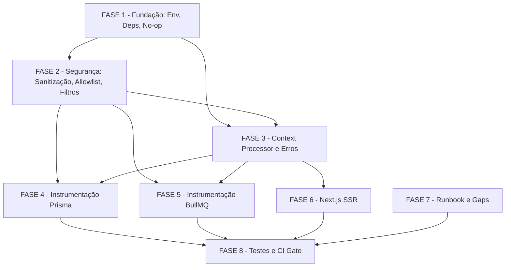

# Tarefas tracing-distribuido-opentelemetry — Tracing Distribuído com OpenTelemetry (NFR-O5)

Escopo: Instrumentação end-to-end com OpenTelemetry no metanoia-hub: API NestJS (coexistência Sentry v10), Next.js SSR, BullMQ, Prisma/PrismaPg, Redis — exportação OTLP com no-op seguro, sanitização anti-PII e enforcement OWASP M1–M4.

**Legenda de status:**
- `[ ]` Pendente
- `[~]` Em andamento
- `[x]` Concluído
- `[!]` Bloqueado

**Legenda de criticidade:**
- `[C]` Crítico — Impacto de segurança/PII ou bloqueante de CI
- `[A]` Alto — Funcionalidade essencial sem a qual o tracing não opera
- `[M]` Médio — Necessário mas pode ser sequenciado após core funcionar

---

## FASE 1 — Fundação: Env, Deps e No-op Seguro

> Garante que a API sobe sem nenhuma variável OTEL_* definida e que o Sentry continua funcionando normalmente. Pré-requisito para toda FASE seguinte.

### 1.1 Schema Zod das env OTEL_* `[A]`

Ref: spec §FR-09, plan §2 (schema Zod), checklist CHK009, lição 14-3 (env sem default travou E2E/Axe)

- [x] 1.1.1 Ler `apps/api/src/config/env.validation.ts` e identificar o ponto de inserção (após vars existentes)
- [x] 1.1.2 Adicionar `OTEL_EXPORTER_OTLP_ENDPOINT` como `z.preprocess((v) => (v === '' ? undefined : v), z.string().url().optional())` — aceita string vazia de docker-compose como undefined
- [x] 1.1.3 Adicionar `OTEL_SERVICE_NAME` como `z.string().min(1).default('metanoia-api')`
- [x] 1.1.4 Adicionar `OTEL_TRACES_EXPORTER` como `z.enum(['otlp', 'console', 'none']).default('otlp')`
- [x] 1.1.5 Adicionar `OTEL_TRACES_SAMPLER_ARG` como `z.coerce.number().min(0).max(1).optional()`
- [x] 1.1.6 Escrever testes unitários: env ausente → schema válida; `OTEL_EXPORTER_OTLP_ENDPOINT=''` → undefined; enum inválido → erro Zod; `OTEL_TRACES_SAMPLER_ARG=1.5` → erro de range

### 1.2 Instalação de dependências npm `[A]`

Ref: plan §0 D-01, plan §0 (deps ausentes confirmadas: `@opentelemetry/exporter-trace-otlp-http` NÃO no store)

- [x] 1.2.1 Confirmar deps ausentes: `ls apps/api/node_modules/@opentelemetry/exporter-trace-otlp-http 2>/dev/null || echo ausente`
- [x] 1.2.2 Instalar `@opentelemetry/exporter-trace-otlp-http` em `apps/api/package.json` via `pnpm --filter @metanoia/api add`
- [x] 1.2.3 Verificar se `@opentelemetry/sdk-trace-base` já está declarado como dep direta (está transitivamente via Sentry); declarar explicitamente para estabilidade de import se ausente
- [x] 1.2.4 Verificar disponibilidade de `@vercel/otel` no store (`ls apps/web/node_modules/@vercel/otel`); se ausente, avaliar instalar em `apps/web` (D-02: preferido) ou usar `@opentelemetry/sdk-trace-node` mínimo como fallback
- [x] 1.2.5 Rodar `pnpm install` e confirmar que `pnpm turbo build` (api + web) continua verde após adição de deps

### 1.3 Módulos auxiliares OTel puros (`otel-config.ts`, `otel-resource.ts`, `otel-sampler.ts`) `[A]`

Ref: plan §2, plan §8 D-06, checklist CHK020

- [x] 1.3.1 Criar `apps/api/src/common/sentry/otel-config.ts`: lê env validada e retorna `{ mode: 'otlp' | 'console' | 'noop', endpoint?: string }` com tabela de decisão exata do plan §2
- [x] 1.3.2 Criar `apps/api/src/common/sentry/otel-resource.ts`: retorna `resourceFromAttributes({ 'service.name': env.OTEL_SERVICE_NAME, 'service.version': pkg.version, 'deployment.environment': NODE_ENV })` — import estático do `apps/api/package.json`
- [x] 1.3.3 Criar `apps/api/src/common/sentry/otel-sampler.ts`: `ParentBasedSampler(new TraceIdRatioBasedSampler(rate))` onde `rate = OTEL_TRACES_SAMPLER_ARG ?? (prod ? 0.1 : 1.0)` (plan §2 defaults exatos)
- [x] 1.3.4 Escrever testes unitários para `otel-config.ts`: cada célula da tabela de decisão (4 combinações); para `otel-sampler.ts`: `NODE_ENV=production` → rate 0.1, `development` → 1.0, `OTEL_TRACES_SAMPLER_ARG=0.5` → override

### 1.4 No-op no `instrument.ts` (boot seguro) `[A]`

Ref: spec §FR-01, FR-02, plan §0 D-01, checklist CHK014, SC #2

- [x] 1.4.1 Ler `apps/api/src/common/sentry/instrument.ts` completo e mapear onde `Sentry.init()` é chamado
- [x] 1.4.2 Modificar `instrument.ts` para: quando `otel-config` retorna `mode=noop`, chamar `Sentry.init()` **sem** `openTelemetrySpanProcessors` adicionais (comportamento idêntico ao pré-tracing)
- [x] 1.4.3 Quando `mode=console`, criar `SimpleSpanProcessor(new ConsoleSpanExporter())` e passar em `openTelemetrySpanProcessors`
- [x] 1.4.4 Quando `mode=otlp`, criar `BatchSpanProcessor(new OTLPTraceExporter({ url: endpoint }), { maxExportBatchSize: 512, scheduledDelayMillis: 5000 })` e passar em `openTelemetrySpanProcessors` (plan §2 defaults)
- [x] 1.4.5 Passar `resource` (de `otel-resource.ts`) e `tracesSampler` (de `otel-sampler.ts`) no `Sentry.init()` (confirmar opções aceitas pelo Sentry v10 — consultar `@sentry/node/build/cjs/sdk/index.js`)
- [x] 1.4.6 Escrever teste de integração T1 (plan §7): sem nenhuma env OTEL_*, `NestFactory.create()` completa sem lançar exceção + `GET /api/health` retorna 200 em ≤5s

---

## FASE 2 — Segurança: Sanitização, Allowlist e Filtros Anti-PII

> Implementa os controles de segurança OWASP M1–M4 como requisitos obrigatórios antes da instrumentação funcional. A ordem é deliberada: código seguro antes de código que exporta dados.

### 2.1 Sanitização de `db.statement` — `sanitize-sql.ts` (OWASP M1) `[C]`

Ref: spec §FR-05, plan §3 regras 1-4, checklist CHK041, CHK042, OWASP M1 binding

- [x] 2.1.1 Criar `apps/api/src/common/sentry/sanitize-sql.ts` com função `sanitizeStatement(model: string | undefined, operation: string, isRaw: boolean): string | undefined`
- [x] 2.1.2 Para operações de modelo: retornar `"${model}.${operation}"` sem qualquer dado de `args` — allowlist fail-closed (nunca serializar args)
- [x] 2.1.3 Para raw queries (`isRaw=true`): aplicar regex conservadora substituindo literais `'...'`, `$N`, numéricos por `?`; se incerto, retornar `undefined` (omitir atributo — fail-closed)
- [x] 2.1.4 Escrever testes unitários T4 (plan §7): payload com email, UUID, nome pastoral → nenhum literal sobrevive; `E'...'`/dollar-quoted/array-literal → todos eliminados ou atributo omitido; `user.findMany` → retorna `"user.findMany"` exato

### 2.2 SpanProcessor de allowlist deny-by-default (OWASP M2) `[C]`

Ref: checklist CHK043, OWASP M2 binding — allowlist enforced em código, não apenas prosa

- [x] 2.2.1 Criar `apps/api/src/common/sentry/otel-allowlist-processor.ts` implementando `SpanProcessor` com `onEnd(span)` que itera `span.attributes` e remove qualquer chave **fora** da allowlist antes de delegar ao próximo processor
- [x] 2.2.2 Definir a allowlist como constante exportada: `SPAN_ATTRIBUTE_ALLOWLIST = new Set(['http.method', 'http.url', 'http.status_code', 'http.target', 'db.system', 'db.operation', 'db.statement', 'user.id', 'tenant.id', 'correlation_id', 'job.name', 'job.id', 'job.attemptsMade', 'queue.name', 'next.route', 'next.rsc', 'span.kind', 'exception.type', 'exception.message', 'exception.stacktrace', 'otel.status_code', 'otel.status_description', 'service.name', 'service.version', 'deployment.environment'])` — deny-by-default para qualquer chave fora deste conjunto
- [x] 2.2.3 Registrar `OtelAllowlistProcessor` em `instrument.ts` na lista `openTelemetrySpanProcessors` **antes** do `BatchSpanProcessor` (garante scrub antes de exportar)
- [x] 2.2.4 Escrever teste unitário: criar span com atributo `url.query=?token=secret&email=user@x.com` e atributo não-allowlisted `custom.internal.field=secret` → após `onEnd`, nenhum dos dois sobrevive no exporter; `http.method=GET` → sobrevive

### 2.3 Validação de `traceparent` inbound (OWASP M3) `[C]`

Ref: checklist CHK044, CHK037, OWASP M3 binding — BullMQ + SSR→API

- [x] 2.3.1 Criar `apps/api/src/common/sentry/validate-traceparent.ts` com função `validateTraceparent(value: unknown): value is string` usando regex `^00-[0-9a-f]{32}-[0-9a-f]{16}-[0-9a-f]{2}$`
- [x] 2.3.2 Em `bullmq-tracing.ts` (FASE 4): chamar `validateTraceparent(tc.traceparent)` ANTES de `propagation.extract()`; em mismatch ou ausência, iniciar root span fresco (não linkar ao trace inválido)
- [x] 2.3.3 No handler HTTP da API (ou middleware): validar `traceparent` inbound do header W3C antes de propagar contexto SSR→API; em mismatch, iniciar root span fresco
- [x] 2.3.4 Escrever testes: traceparent válido → extração bem-sucedida; traceparent malformado (comprimento errado, chars inválidos, versão ≠ `00`) → root span fresco sem `parentSpanId`; `tc` ausente → root span fresco

### 2.4 Filtro de spans de ruído/PII (OWASP M1 + FR-07) `[C]`

Ref: spec §FR-07, plan §3 regra 4, checklist CHK042, OWASP M1 — `SET LOCAL`/`SELECT 1`/health drops

- [x] 2.4.1 Criar `apps/api/src/common/sentry/otel-span-filter.ts` implementando `SpanProcessor` com `onStart(span)` que marca para drop (via `isRecording=false` ou flag interna) spans cujo `http.url`/`http.target` casa `/api/health` ou `/api/v1/admin/health` (e subpaths)
- [x] 2.4.2 No filtro `onStart`: dropar spans com `db.statement` igual a `SELECT 1`, `SELECT version()`, ou iniciando com `SET LOCAL app.current_tenant_id` (comparação normalizada, case-insensitive)
- [x] 2.4.3 Registrar `OtelSpanFilter` em `instrument.ts` como primeiro SpanProcessor da cadeia (antes do allowlist e batch) — mais barato: evita criar/enriquecer span que vai ser descartado
- [x] 2.4.4 Escrever testes T5 e T6 (plan §7): `SELECT 1` → span não exportado; `/api/health` → trace não gerado; `SET LOCAL app.current_tenant_id = 'abc-uuid'` → não exportado; query Prisma normal → exportada

---

## FASE 3 — Instrumentação Central: Context Processor e Erros

### 3.1 SpanProcessor de contexto de request (FR-03, FR-06, FR-13) `[A]`

Ref: spec §FR-03, FR-06, FR-13, plan §4, checklist CHK006, CHK016, OWASP M4 pré-requisito

- [x] 3.1.1 Criar `apps/api/src/common/sentry/context-span-processor.ts` implementando `SpanProcessor` com `onStart(span, parentContext)` que lê `getRequestContext()` em try/catch defensivo (fora de request → no-op silencioso, nunca lança)
- [x] 3.1.2 Aplicar no `onStart`: `span.setAttribute('tenant.id', ctx.tenantId)` (FR-06: 100% dos spans), `span.setAttribute('user.id', ctx.userId)` (quando autenticado; FR-03), `span.setAttribute('correlation_id', ctx.correlationId)` (FR-03/FR-13)
- [x] 3.1.3 Adicionar nota inline verificando que `userId` vem do campo `sub` do token Keycloak (nunca email/nome — OWASP LOW / CHK046): ler `RequestContext` existente e confirmar a origem do campo
- [x] 3.1.4 Registrar `ContextSpanProcessor` em `instrument.ts` na cadeia `openTelemetrySpanProcessors` (após filtro, antes de allowlist e batch)
- [x] 3.1.5 Escrever testes T3 e T7 (plan §7): request autenticada → span raiz tem `tenant.id`, `user.id`, `correlation_id`; spans filhos Prisma/Redis/BullMQ herdam via context processor; 2 tenants distintos → spans separados sem cross-contamination

### 3.2 Registro de erros em spans via `AllExceptionsFilter` (FR-13) `[A]`

Ref: spec §FR-13, plan §4 ("Erros em spans"), checklist CHK012

- [x] 3.2.1 Ler `apps/api/src/common/filters/http-exception.filter.ts` e identificar ponto de captura de exceção
- [x] 3.2.2 No catch do filter: obter `trace.getActiveSpan()` (pode retornar undefined — defensivo); se span existir, chamar `span.setStatus({ code: SpanStatusCode.ERROR })`
- [x] 3.2.3 Chamar `span.recordException(err)` — gera eventos OTel com `exception.type`, `exception.message`, `exception.stacktrace` automaticamente
- [x] 3.2.4 Adicionar `span.setAttribute('correlation_id', ctx.correlationId)` como redundância defensiva (context processor já aplica no `onStart`, mas o filter roda em contexto potencialmente diferente)
- [x] 3.2.5 Escrever teste T9 (plan §7): trigger controlado de 500 → span com `status=ERROR`, eventos `exception.*` presentes, `correlation_id` definido

### 3.3 Guardrail: console exporter em production (OWASP LOW / CHK047) `[M]`

Ref: checklist CHK047, OWASP LOW — console em prod vaza dados no stdout

- [x] 3.3.1 Em `otel-config.ts`: quando `OTEL_TRACES_EXPORTER=console` E `NODE_ENV=production`, emitir `logger.warn('OTel: console exporter ativo em production — risco de vazamento de dados no stdout. Defina OTEL_TRACES_EXPORTER=otlp ou none.')` e ignorar o console exporter (retornar mode `noop` ou `otlp` conforme endpoint)
- [x] 3.3.2 Escrever teste: `NODE_ENV=production` + `OTEL_TRACES_EXPORTER=console` → warning logado + mode não retorna `console`

---

## FASE 4 — Instrumentação Prisma (PrismaPg)

### 4.1 Extensão de client Prisma para tracing `[A]`

Ref: spec §FR-04, FR-05, plan §3 D-03, checklist CHK004, CHK005

- [x] 4.1.1 Ler `apps/api/src/prisma/prisma.service.ts` e confirmar uso de `PrismaClient({ adapter: new PrismaPg(...) })` (adapter que limita cobertura da auto-instrumentação `instrumentation-pg`)
- [x] 4.1.2 Criar `apps/api/src/prisma/prisma-tracing.extension.ts` com `Prisma.defineExtension({ query: { async $allOperations({ model, operation, args, query }) { ... } } })`
- [x] 4.1.3 No body do `$allOperations`: checar se é keep-alive (`operation === 'queryRaw'` com statement `SELECT 1`) → retornar `query(args)` sem criar span (FR-07)
- [x] 4.1.4 Para demais operações: `tracer.startActiveSpan(`prisma.${model ?? 'raw'}.${operation}`)` com atributos `db.system='postgresql'`, `db.operation=operation`, `db.statement=sanitizeStatement(model, operation, isRaw)` (da FASE 2.1)
- [x] 4.1.5 No `finally`: `span.end()` garantido; no `catch`: `span.recordException(e)` + `span.setStatus(ERROR)` + `throw e`
- [x] 4.1.6 Aplicar em `prisma.service.ts`: `this.prisma = new PrismaClient(...).‌$extends(prismaTracingExtension)` — verificar tipagem TypeScript gerada pelo `$extends`

### 4.2 Testes da instrumentação Prisma `[A]`

Ref: plan §7 T4, T5, checklist CHK005, CHK042

- [x] 4.2.1 Configurar `InMemorySpanExporter` (já no store via `@opentelemetry/sdk-trace-base`) no setup de teste Vitest para capturar spans sem rede
- [x] 4.2.2 Escrever teste T4: executar `prisma.user.findMany({ where: { email: 'test@example.com' } })` → span `db.statement = 'user.findMany'` (sem email), `db.system = 'postgresql'`
- [x] 4.2.3 Escrever teste T5: executar query keep-alive interna → `InMemorySpanExporter.getFinishedSpans()` não contém span com `db.statement` contendo `SELECT 1`

---

## FASE 5 — Instrumentação BullMQ (Propagação de Trace)

### 5.1 Helper de propagação de contexto BullMQ `[A]`

Ref: spec §FR-12, plan §6, checklist CHK037, CHK038, OWASP M3/M4

- [x] 5.1.1 Criar `apps/api/src/bullmq/bullmq-tracing.ts` com função `injectTraceContext<T extends object>(data: T): T & { _traceContext: { traceparent?: string; tracestate?: string; tenantId?: string } }`
- [x] 5.1.2 Em `injectTraceContext`: chamar `propagation.inject(context.active(), carrier)` para `traceparent`/`tracestate`; extrair `tenantId` do `RequestContext` atual e incluir em `_traceContext` (OWASP M4: **obrigatório**, não opcional)
- [x] 5.1.3 Criar `runWithExtractedContext<R>(jobData: any, jobMeta: { queueName: string; jobName: string; jobId: string; attemptsMade: number }, fn: () => Promise<R>): Promise<R>`
- [x] 5.1.4 Em `runWithExtractedContext`: chamar `validateTraceparent(tc?.traceparent)` (FASE 2.3) ANTES de `propagation.extract()`; em mismatch → `parentCtx = context.active()` (root span fresco)
- [x] 5.1.5 Re-estabelecer `RequestContext` mínimo com `tenantId` extraído do `_traceContext` **antes** de criar spans filhos — garante que `ContextSpanProcessor.onStart` encontre `tenant.id` nos spans do worker (OWASP M4 binding)
- [x] 5.1.6 Criar span `bullmq.process ${queueName}` com `SpanKind.CONSUMER` e atributos `job.name`, `job.id`, `job.attemptsMade`, `queue.name`, `tenant.id` (FR-12)

### 5.2 Wrap em `bullmq.service.ts` `[A]`

Ref: plan §6 "Wrap em bullmq.service.ts", spec §FR-12

- [x] 5.2.1 Ler `apps/api/src/bullmq/bullmq.service.ts` e mapear onde `Queue.add()` e `createWorker()` são chamados
- [x] 5.2.2 Envolver `Queue.add(name, data, opts)` para chamar `injectTraceContext(data)` antes de delegar — preservar tipagem; usar wrapper de método (não Proxy — mais simples e tipado)
- [x] 5.2.3 Envolver o `processor` recebido em `createWorker(name, processor)` para chamar `runWithExtractedContext(job.data, { queueName: name, jobName: job.name, jobId: job.id, attemptsMade: job.attemptsMade }, () => processor(job))`
- [x] 5.2.4 Escrever testes T7 e T8 (plan §7): dispatch HTTP → job contém `_traceContext.traceparent` e `_traceContext.tenantId`; worker processa → span com `traceId` igual ao da requisição HTTP origem e `parentSpanId != null`; `tenant.id` presente no span worker

---

## FASE 6 — Instrumentação Next.js SSR

### 6.1 `apps/web/instrumentation.ts` (Next.js 16 nativo) `[A]`

Ref: spec §FR-10, FR-11, plan §5 D-02, checklist CHK050 (verificar flag Next 16)

- [x] 6.1.1 Verificar se `instrumentation.ts` é suportado automaticamente no Next 16.2.3: `grep -r "instrumentationHook\|experimental" apps/web/next.config.ts` — se flag ausente, é nativo (confirmar)
- [x] 6.1.2 Criar `apps/web/instrumentation.ts` com `export async function register() { if (process.env.NEXT_RUNTIME !== 'nodejs') return; ... }`
- [x] 6.1.3 Implementar no-op seguro: quando `OTEL_EXPORTER_OTLP_ENDPOINT` ausente E `OTEL_TRACES_EXPORTER !== 'console'`, retornar cedo sem criar TracerProvider (lição 14-3: não travar build/E2E)
- [x] 6.1.4 Quando habilitado: usar `@vercel/otel` (`registerOTel({ serviceName: 'metanoia-web' })`) se disponível (D-02); fallback para setup mínimo com `@opentelemetry/sdk-trace-node` se `@vercel/otel` ausente
- [x] 6.1.5 Confirmar que `@vercel/otel` propaga `traceparent` W3C automaticamente nos `fetch` do SSR → API (FR-10) — testar com trace console
- [x] 6.1.6 Escrever testes T12 (plan §7): `register()` sem env → no-op (sem exceção, sem TracerProvider global criado); com `OTEL_TRACES_EXPORTER=console` → traceparent presente no header de `fetch` para API

### 6.2 Atributos de span SSR (FR-11) `[M]`

Ref: spec §FR-11, plan §5, checklist CHK024 (tenant.id opcional em SSR público — comportamento intencional)

- [x] 6.2.1 Confirmar que `@vercel/otel`/SDK web inclui automaticamente `http.url`, `http.method`, `next.route`, `next.rsc` (instrumentações nativas do Next) — não duplicar manualmente
- [x] 6.2.2 Implementar `tenant.id` best-effort no SSR: se disponível no contexto de sessão (cookie/auth), adicionar via SpanProcessor leve no web; **não lançar** se indisponível (FR-11: "quando disponível")
- [x] 6.2.3 Documentar em comentário inline: "spans SSR de páginas públicas (sem sessão) são isentos de tenant.id — FR-06 aplica-se apenas a spans da API" (resolve CHK024)

---

## FASE 7 — Runbook Operacional e Documentação

### 7.1 Runbook operacional `[M]`

Ref: spec §FR-14, plan §8 D-07, checklist CHK013

- [x] 7.1.1 Verificar `docs/specs/tracing-distribuido-opentelemetry/runbook.md` existente e complementar com seções faltantes
- [x] 7.1.2 Seção "Variáveis de ambiente": tabela com todas as 4 `OTEL_*` vars, tipo, default, efeito quando ausente
- [x] 7.1.3 Seção "Verificação de conectividade OTLP": como confirmar que traces chegam ao backend (Jaeger/Tempo/qualquer OTLP-compatível) com `curl` de healthcheck
- [x] 7.1.4 Seção "Diagnóstico Sentry/OTel": como verificar que spans não estão duplicados (comparar `spanId` únicos no Sentry Dashboard)
- [x] 7.1.5 Seção "Reversão para no-op": remover/zerar `OTEL_EXPORTER_OTLP_ENDPOINT` → SDK passa a no-op sem restart de infra; nenhuma rede OTLP é tentada
- [x] 7.1.6 Seção "Comportamento de falha do exporter OTLP em runtime" (CHK036 gap): documentar que `BatchSpanProcessor` descarta silenciosamente quando fila atinge `maxQueueSize` (2048 default OTel); spans perdidos não geram erro na API; recomendação: monitorar métrica `otel.exporter.otlp.dropped_spans` no backend

### 7.2 Resolução de gaps de requisito remanescentes (CHK019, CHK038, CHK040) `[M]`

Ref: checklist CHK019 (CHILD_OF vs LINK), CHK038 (fallback `_traceContext` ausente), CHK040 (`user.id` sem autenticação)

- [x] 7.2.1 Adicionar nota em `bullmq-tracing.ts` e em spec §FR-12: esclarecer que a propagação usa `CHILD_OF` semântico (span filho no mesmo trace), não `SpanLink` formal OTel — T8 passa com ambos; escolha é `CHILD_OF` para simplicidade de visualização
- [x] 7.2.2 Adicionar fallback documentado em `runWithExtractedContext`: quando `_traceContext` ausente (job enfileirado pré-instrumentação ou fonte externa), criar root span fresco — comportamento já implementado na FASE 5.1 mas deve estar comentado no código
- [x] 7.2.3 Definir comportamento explícito para `user.id` ausente em `context-span-processor.ts`: omitir o atributo (não setar `""` nem `"anonymous"`) — comportamento consistente com filtros OTLP que tratam ausência diferente de string vazia

---

## FASE 8 — Testes Completos e Gate de CI

### 8.1 Suite de testes de integração com `InMemorySpanExporter` `[A]`

Ref: plan §7 (T1–T12 completo), spec §SC #1–#7, checklist CHK023

- [x] 8.1.1 Criar setup compartilhado de teste: `apps/api/test/otel-setup.ts` que inicializa SDK OTel em modo test com `InMemorySpanExporter` e reseta entre testes (`exporter.reset()`)
- [x] 8.1.2 Teste T2 (console exporter): `OTEL_TRACES_EXPORTER=console` → spy no `console.log` confirma JSON de span no stdout com `service.name`
- [x] 8.1.3 Teste T3 (root span HTTP): request HTTP autenticada → span com `http.method`, `http.url`, `http.status_code`, `tenant.id`, `user.id`, `correlation_id` todos presentes
- [x] 8.1.4 Teste T6 (health exclusion): `GET /api/health` + `GET /api/v1/admin/health` → `InMemorySpanExporter.getFinishedSpans()` vazio para essas URLs
- [x] 8.1.5 Teste T7 (tenant isolation): 10 requests com 2 tenants distintos → 100% dos spans (raiz + Prisma + Redis + BullMQ) têm `tenant.id` correto para cada tenant
- [x] 8.1.6 Teste T9 (erro): request que dispara 500 → span `status=ERROR`, `exception.type`, `exception.message`, `exception.stacktrace` nos eventos do span, `correlation_id` presente
- [x] 8.1.7 Teste T10 (sampling): `OTEL_TRACES_SAMPLER_ARG=0.5` + 100 requests → entre 40-60 traces (±10%), `ParentBasedSampler` garante coerência
- [x] 8.1.8 Teste T11 (Sentry não duplica): com DSN mock e OTLP configurado, spans HTTP têm `spanId` únicos (sem duplicatas vindas de dupla instrumentação)

### 8.2 Gate de CI — build, lint, testes, boot `[A]`

Ref: spec §SC #7, plan §7 CI gate, lição 14-3 e 14-FECHADO (features backend escapam de `--filter api`)

- [x] 8.2.1 Rodar `pnpm turbo lint` e garantir zero warnings/errors nos arquivos novos (TypeScript strict, imports corretos)
- [x] 8.2.2 Rodar `pnpm --filter @metanoia/api test` — todos os testes T1–T11 passando
- [x] 8.2.3 Rodar `pnpm --filter @metanoia/web test` — teste T12 passando
- [x] 8.2.4 Rodar `pnpm turbo build` (api + web) — build completo sem erro de TypeScript ou de módulo
- [x] 8.2.5 Rodar boot de integração: `start:e2e` + `curl GET /api/health → 200` em ≤5s sem nenhuma env OTEL_* definida (validação SC #2 no CI real — lição 14-3)
- [x] 8.2.6 Validar SC #1 manualmente com `OTEL_TRACES_EXPORTER=console`: uma request a endpoint de grupos → stdout mostra ≥3 spans JSON com `traceId` compartilhado (SSR → API → Prisma)

---

## Matriz de Dependências

---

## Resumo Quantitativo

| Fase | Tarefas | Subtarefas | Criticidade dominante |
|------|---------|------------|-----------------------|
| 1 - Fundação: Env, Deps, No-op | 4 | 22 | [A] |
| 2 - Segurança: Sanitização, Allowlist, Filtros | 4 | 16 | [C] |
| 3 - Context Processor e Erros | 3 | 12 | [A]/[M] |
| 4 - Instrumentação Prisma | 2 | 9 | [A] |
| 5 - Instrumentação BullMQ | 2 | 10 | [A] |
| 6 - Next.js SSR | 2 | 9 | [A]/[M] |
| 7 - Runbook e Gaps | 2 | 9 | [M] |
| 8 - Testes e CI Gate | 2 | 11 | [A] |
| **Total** | **21** | **98** | — |

---

## Escopo Coberto

| Item | Descrição | Fase |
|------|-----------|------|
| ENV-001 | Schema Zod das 4 env OTEL_* opcionais com no-op garantido | 1 |
| DEP-001 | `@opentelemetry/exporter-trace-otlp-http` + `@vercel/otel` (web) | 1 |
| NOOP-001 | Boot API sem nenhuma env OTEL_* — sem exceção, ≤5s | 1 |
| M1-001 | `sanitize-sql.ts` — allowlist fail-closed para `db.statement` (OWASP M1) | 2 |
| M2-001 | `otel-allowlist-processor.ts` — deny-by-default de atributos (OWASP M2) | 2 |
| M3-001 | `validate-traceparent.ts` — validação W3C regex antes de `propagation.extract` (OWASP M3) | 2 |
| M1-002 | Drop de `SELECT 1`, `SET LOCAL app.current_tenant_id`, `/api/health` (OWASP M1 + FR-07) | 2 |
| CTX-001 | `context-span-processor.ts` — tenant.id/user.id/correlation_id em 100% dos spans (FR-06) | 3 |
| ERR-001 | `AllExceptionsFilter` — status ERROR + exception.* events em spans (FR-13) | 3 |
| M4-001 | tenantId obrigatório em `_traceContext` BullMQ + re-estabelecimento RequestContext worker (OWASP M4) | 5 |
| PRISMA-001 | `prisma-tracing.extension.ts` via `$extends` — cobertura PrismaPg adapter (FR-04, D-03) | 4 |
| BULLMQ-001 | `bullmq-tracing.ts` — injeção/extração de trace context em jobs (FR-12) | 5 |
| SSR-001 | `apps/web/instrumentation.ts` — `@vercel/otel` + no-op seguro (FR-10) | 6 |
| RNB-001 | Runbook completo incluindo comportamento de falha OTLP em runtime (CHK036) | 7 |
| TEST-001 | T1–T12 completos com `InMemorySpanExporter` + CI gate turbo (SC #7) | 8 |

---

## Escopo Excluído

| Item | Descrição | Motivo |
|------|-----------|--------|
| INFRA-001 | Jaeger/Tempo/collector no `docker-compose.yml` | Guardrail explícito: "ZERO produção"; backend OTLP é responsabilidade de infraestrutura — documentado no runbook |
| INFRA-002 | Modificar `docker-compose.prod.yml` ou containers `metanoia-prod-*` | Guardrail: escopo "código + validar local" |
| MIG-001 | Migrations de banco de dados | Tracing é stateless; nenhuma tabela nova |
| KC-001 | Modificações em Keycloak | Fora do escopo; auth existente já expõe `sub` via JWT |
| SENTRY-001 | Alterações no comportamento de captura de erros do Sentry DSN | Sentry continua funcionando normalmente; apenas adicionamos SpanProcessors via `openTelemetrySpanProcessors` |
| OTEL-AUTO | `@opentelemetry/auto-instrumentations-node` | Rejeitado (D-01): cria segundo provider, duplica spans HTTP/Express que Sentry já instrumenta |
| SDK-NODE | `@opentelemetry/sdk-node` standalone | Rejeitado (D-01): conflito com provider do Sentry v10 |
| SAMPLING-ADV | Sampling adaptativo / head-based complexo | FR-08 define `TraceIdRatioBased` simples; sampling avançado é evolução futura |
| DASHBOARD | Dashboards/alertas no backend OTLP | Responsabilidade de infra; runbook documenta como verificar conectividade |
