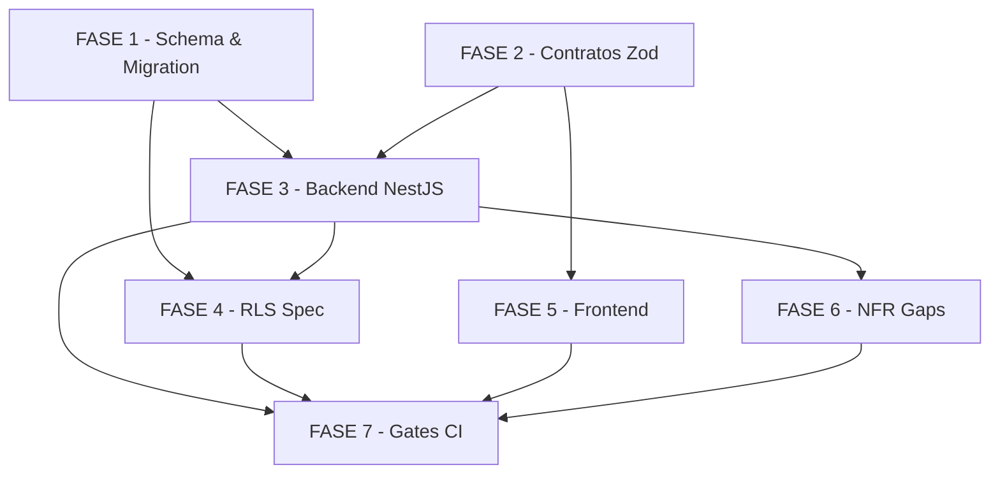

# Tarefas: Busca Full-Text de Trilhas e Aulas (Story 8-8)

Escopo: Implementação completa da busca full-text de aulas por nome/tags, isolada por tenant, com migration RAW SQL, módulo NestJS, RLS spec, contratos Zod e campo de busca no FE.

**Legenda de status:**
- `[ ]` Pendente
- `[~]` Em andamento
- `[x]` Concluido
- `[!]` Bloqueado

**Legenda de criticidade:**
- `[C]` Critico - Impacto financeiro direto ou bloqueante
- `[A]` Alto - Funcionalidade essencial
- `[M]` Medio - Necessario mas sem urgencia imediata

---

## FASE 1 - Schema e Migration

### 1.1 Adicionar `searchVector` ao Prisma schema `[A]`

Ref: data-model.md §1.1, plan.md §Phase 0 D2

- [ ] 1.1.1 Abrir `apps/api/prisma/schema.prisma`, localizar model `Lesson`
- [ ] 1.1.2 Adicionar campo `searchVector Unsupported("tsvector")? @map("search_vector")`
- [ ] 1.1.3 Adicionar index GIN: `@@index([searchVector], type: Gin)` no model `Lesson`
- [ ] 1.1.4 Confirmar que `@@index` existentes (`[tenantId]`, `[moduleId]`) são preservados
- [ ] 1.1.5 Executar `prisma generate` — zero erros; campo NÃO aparece em selects tipados

### 1.2 Gerar migration stub e editar SQL raw `[A]`

Ref: data-model.md §5, research.md D2/D3, plan.md §Phase 2 item 1–2

- [ ] 1.2.1 Executar `prisma migrate dev --create-only --name "8-8-lessons-search-vector"` (gera stub)
- [ ] 1.2.2 Adicionar ao `migration.sql`: `CREATE EXTENSION IF NOT EXISTS unaccent;`
- [ ] 1.2.3 Adicionar: `ALTER TABLE "lessons" ADD COLUMN IF NOT EXISTS "search_vector" tsvector;`
- [ ] 1.2.4 Criar função trigger `lessons_search_vector_update()` soft-delete aware: `to_tsvector('portuguese', unaccent(name || ' ' || tags))` quando `deleted_at IS NULL`; `NULL` quando soft-deleted
- [ ] 1.2.5 Criar trigger BEFORE INSERT OR UPDATE: `trg_lessons_search_vector`
- [ ] 1.2.6 Backfill de dados existentes: UPDATE todas as lessons com `deleted_at IS NULL`
- [ ] 1.2.7 Criar índice GIN: `CREATE INDEX IF NOT EXISTS "lessons_search_vector_idx" ON "lessons" USING GIN ("search_vector");`
- [ ] 1.2.8 Verificar que a migration NÃO toca em policies RLS existentes de `lessons`
- [ ] 1.2.9 Documentar rollback em comentário: DROP INDEX → DROP TRIGGER → DROP FUNCTION → DROP COLUMN (NÃO dropar `unaccent`)

### 1.3 Validar migration aplicada e prisma generate limpo `[A]`

Ref: plan.md guardrails (Prisma v7 + tsvector), research.md D2

- [ ] 1.3.1 Aplicar migration: `prisma migrate dev`
- [ ] 1.3.2 Confirmar `prisma migrate status` sem drift (coluna `Unsupported` não gera nova migration)
- [ ] 1.3.3 Verificar manualmente: INSERT de lesson → `SELECT search_vector FROM lessons WHERE id=...` valor não-nulo
- [ ] 1.3.4 Verificar: UPDATE lesson com `deleted_at IS NOT NULL` → `search_vector IS NULL`
- [ ] 1.3.5 Confirmar `prisma generate` zero erros (campo Unsupported esconde do client tipado)

---

## FASE 2 - Contratos Zod

### 2.1 Criar contratos Zod `searchResultItem` + `searchResponse` `[A]`

Ref: contracts/search-api.md §Shape canônico, plan.md §Phase 2 item 3

- [ ] 2.1.1 Criar diretório `packages/types/src/search/`
- [ ] 2.1.2 Criar `packages/types/src/search/search-result.schema.ts` com `searchResultItemSchema` (lessonId, lessonName, moduleId, moduleName, trailId, trailName, contentType, snippet, rank, isDraft) e `searchResponseSchema` (data max 20, meta total+query)
- [ ] 2.1.3 Importar `LessonContentType` de `content/content-type.enum` — NÃO redefinir
- [ ] 2.1.4 Registrar exports em `packages/types/src/index.ts`
- [ ] 2.1.5 Executar `pnpm build` em `packages/types` — zero erros

### 2.2 Snapshot test Zod (gate breaking change) `[A]`

Ref: contracts/search-api.md §Snapshot test, spec.md §Princípio IV

- [ ] 2.2.1 Criar `packages/types/src/__tests__/search.snapshot.spec.ts` — asseverar shapes `searchResultItemSchema` e `searchResponseSchema`
- [ ] 2.2.2 Executar `pnpm test` em `packages/types` — gerar snapshot inicial verde
- [ ] 2.2.3 Commitar snapshot junto com implementação

---

## FASE 3 - Backend NestJS

### 3.1 Implementar `search.service.ts` ($queryRaw + map + visibilidade) `[A]`

Ref: plan.md §Project Structure, contracts/search-api.md §Notas de implementação, spec.md FR-007/FR-008/dec-014

- [ ] 3.1.1 Criar `apps/api/src/search/search.service.ts` com injeção de `PrismaService`
- [ ] 3.1.2 Implementar método `search(q: string, userRole: string)` dentro de `withTenantTx`
- [ ] 3.1.3 Query `$queryRaw`: JOIN `lessons → modules → trails` com `deleted_at IS NULL` em cada nível; LIMIT 20
- [ ] 3.1.4 Binding do termo como `$1` (NUNCA concatenação — anti tsquery/SQL injection)
- [ ] 3.1.5 `ts_rank` para relevância; `ts_headline` com `StartSel=\x02, StopSel=\x03` (sentinelas não-HTML)
- [ ] 3.1.6 **Higiene de delimitador (dec-014)**: remover `\x02`/`\x03` pré-existentes do texto-fonte antes do `ts_headline`
- [ ] 3.1.7 Visibilidade por papel: participante → excluir `trails.status = 'draft'`; líder/admin → incluir com `isDraft: true`; `archived` = `published` (sem filtro)
- [ ] 3.1.8 Mapeamento explícito snake_case → camelCase (sem spread cego); `null` explícito, sem `undefined` no DTO
- [ ] 3.1.9 Sanitização do termo: caracteres que causam erro no `tsquery` → retornar `[]` sem 500

### 3.2 Implementar `search.controller.ts` + `search.module.ts` `[A]`

Ref: contracts/search-api.md §GET /api/v1/search, spec.md Princípio IV

- [ ] 3.2.1 Criar `apps/api/src/search/search.controller.ts`: `GET /search` com `@UseGuards(KeycloakAuthGuard)`, `ZodValidationPipe` custom, extração do papel do token
- [ ] 3.2.2 Schema Zod de query: `searchQuerySchema = z.object({ q: z.string().min(1).trim() })`
- [ ] 3.2.3 Resposta: envelope `{ data, meta }` — 200 sempre (lista vazia sem resultados — FR-010)
- [ ] 3.2.4 Swagger: `@ApiTags('search')`, `@ApiOperation`, `@ApiQuery({ name: 'q' })`, `@ApiResponse({ status: 200 })` — descrição em inglês
- [ ] 3.2.5 Criar `apps/api/src/search/search.module.ts` com imports, controllers, providers

### 3.3 Unit tests `search.service.spec.ts` (incl. XSS sentinela dec-014) `[A]`

Ref: spec.md §Princípio VI, contracts/search-api.md §Contrato de segurança do snippet, plan.md §Phase 2 item 3

- [ ] 3.3.1 Criar `apps/api/src/search/search.service.spec.ts` com mock de `PrismaService.$queryRaw`
- [ ] 3.3.2 Test: busca básica retorna `SearchResultItem[]` com campos camelCase corretos
- [ ] 3.3.3 Test: busca sem resultado → `{ data: [], meta: { total: 0, query: 'q' } }`
- [ ] 3.3.4 **Test XSS sentinela (dec-014)**: `name=''` → snippet é texto plano; contém `<` e `>` literalmente; usa sentinelas `\x02`/`\x03` (NÃO `<b>`)
- [ ] 3.3.5 Test: participante não recebe aulas de trilha draft
- [ ] 3.3.6 Test: líder recebe aulas de trilha draft com `isDraft: true`
- [ ] 3.3.7 Test: caracteres especiais (aspas, parênteses) → resultado vazio, nunca erro 500
- [ ] 3.3.8 Test: mapeamento snake_case → camelCase correto (sem campos undefined)

### 3.4 Wire `SearchModule` no `AppModule` `[A]`

Ref: plan.md §Phase 2 item 5, spec.md §Princípio IV

- [ ] 3.4.1 Abrir `apps/api/src/app.module.ts`, adicionar `SearchModule` nos imports
- [ ] 3.4.2 Confirmar prefixo `/api/v1` aplicado via `app.setGlobalPrefix` no `main.ts` (não duplicar)
- [ ] 3.4.3 Executar `turbo build` + `turbo lint` — zero erros

---

## FASE 4 - RLS Spec

### 4.1 RLS spec `lessons-search.rls-spec.ts` (2 tenants) `[A]`

Ref: spec.md §US3, plan.md §Phase 2 item 6, RECONCILIACAO-EPIC8-W1b3 §5 (Prisma v7 pattern)

- [ ] 4.1.1 Criar `apps/api/test/rls/lessons-search.rls-spec.ts`
- [ ] 4.1.2 `beforeAll`: criar 2 tenants com UUIDs hex fixos; chain FK `tenant → trail → module → lesson` para cada; 1 aula draft e 1 soft-deleted por tenant; users globais
- [ ] 4.1.3 `beforeEach`: limpar apenas dados mutáveis; `afterAll`: derrubar chain FK completa
- [ ] 4.1.4 Teste 1 — isolamento cross-tenant: busca tenant A retorna APENAS lessons do tenant A
- [ ] 4.1.5 Teste 2 — isolamento reverso: busca tenant B retorna APENAS lessons do tenant B
- [ ] 4.1.6 Teste 3 — soft-deleted nunca aparece em nenhum tenant
- [ ] 4.1.7 Teste 4 — draft: participante não vê; admin/líder vê com `isDraft: true`
- [ ] 4.1.8 Confirmar pattern `NULLIF(current_setting('app.current_tenant_id', true), '')::uuid` em toda setagem de RLS
- [ ] 4.1.9 Executar RLS spec — verde; rerun se flaky FK P2003 (`gh run rerun --failed`)

---

## FASE 5 - Frontend

### 5.1 Hook TanStack Query `use-search.ts` `[A]`

Ref: plan.md §Project Structure FE, spec.md §Princípio V

- [ ] 5.1.1 Criar `apps/web/src/lib/api/hooks/use-search.ts` com `useQuery` (key `['search', q]`), habilitado apenas quando `q.trim().length >= 1`
- [ ] 5.1.2 Tipagem via `SearchResponse` de `packages/types`
- [ ] 5.1.3 Tratar explicitamente: `isLoading`, `error`, `data`

### 5.2 Campo de busca Client Component + i18n PT-BR pastoral `[A]`

Ref: spec.md §US4, contracts/search-api.md §Contrato de segurança, plan.md §Project Structure FE

- [ ] 5.2.1 Criar Client Component (`'use client'`) em `apps/web/app/(authenticated)/app/consumo/trilhas/`
- [ ] 5.2.2 Input de busca com debounce (300ms); integrar `useSearch` hook
- [ ] 5.2.3 **Render de snippet via JSX (dec-014)**: `split` pelas sentinelas `\x02`/`\x03` → `<b>{trecho}</b>` em JSX; React escapa conteúdo do autor; PROIBIDO `dangerouslySetInnerHTML`
- [ ] 5.2.4 Badge "Rascunho" para `isDraft: true`
- [ ] 5.2.5 Empty state com mensagem pastoral PT-BR (sem termos técnicos)
- [ ] 5.2.6 Adicionar chaves em `apps/web/messages/pt-BR.json`: `search.placeholder`, `search.emptyState`, `search.draftBadge`, `search.resultsCount`

### 5.3 Unit/a11y do componente de busca (jest-axe) `[M]`

Ref: spec.md §Princípio VI, contracts/search-api.md §Contrato de segurança snippet

- [ ] 5.3.1 **Test XSS FE (dec-014)**: renderizar snippet com `name=''` — `<script>` aparece como texto (JSX); elemento `<script>` não existe no DOM
- [ ] 5.3.2 Test: term vazio → sem resultados exibidos
- [ ] 5.3.3 Test: resultados com `isDraft: true` → badge "Rascunho" visível
- [ ] 5.3.4 Test: empty state renderizado quando `data = []`
- [ ] 5.3.5 `jest-axe`: nenhuma violação WCAG AA
- [ ] 5.3.6 Navegação por teclado: Tab navega pelos resultados; Enter ativa

---

## FASE 6 - NFR Gaps

### 6.1 Rate limiting no endpoint de busca (CHK021) `[M]`

Ref: checklists/security.md CHK021 (Gap), plan.md §Guardrails

- [ ] 6.1.1 Verificar se existe `ThrottlerModule` ou similar em `apps/api/src/`
- [ ] 6.1.2 Se existir: adicionar `@Throttle` no `SearchController` com limite mais restrito (sugestão: 30 req/min por usuário)
- [ ] 6.1.3 Se não existir: adicionar comentário `// TODO(CHK021): throttle específico pós-MVP — risco aceitável para MVP com escala atual`
- [ ] 6.1.4 Registrar decisão auditável sobre a escolha (score 2)

### 6.2 Observabilidade: log estruturado + métrica de latência (CHK058) `[M]`

Ref: checklists/api.md CHK058 (Gap)

- [ ] 6.2.1 Adicionar `NestLogger` ao `SearchService`
- [ ] 6.2.2 Log estruturado a cada chamada: `event='search.executed'`, `resultCount`, `hasResults`, `durationMs` — SEM logar o termo `q` (evitar PII pastoral)
- [ ] 6.2.3 Comentário TODO para métricas p95: `// TODO(CHK058): expor durationMs via Prometheus/Datadog quando observabilidade for implementada`

---

## FASE 7 - Gates CI

### 7.1 Gates CI: prisma generate + turbo build + turbo lint `[A]`

Ref: plan.md §Guardrails, spec.md §Princípio VI

- [ ] 7.1.1 Executar `prisma generate` — zero erros/warnings
- [ ] 7.1.2 Executar `turbo build` — zero erros
- [ ] 7.1.3 Executar `turbo lint` — zero warnings/errors
- [ ] 7.1.4 Executar `pnpm test` em `packages/types` — snapshot Zod verde
- [ ] 7.1.5 Executar `pnpm test` em `apps/api` — unit tests `search.service.spec.ts` verdes
- [ ] 7.1.6 Executar `pnpm test` em `apps/api` — RLS spec `lessons-search.rls-spec.ts` verde
- [ ] 7.1.7 Confirmar `prisma migrate status` limpo (sem drift)
- [ ] 7.1.8 Confirmar `pnpm-lock.yaml` commitado se deps novas foram adicionadas

---

## Matriz de Dependencias

## Resumo Quantitativo

| Fase | Tarefas | Subtarefas | Criticidade |
|------|---------|------------|-------------|
| 1 - Schema & Migration | 3 | 19 | A |
| 2 - Contratos Zod | 2 | 8 | A |
| 3 - Backend NestJS | 4 | 24 | A |
| 4 - RLS Spec | 1 | 9 | A |
| 5 - Frontend | 3 | 16 | A/M |
| 6 - NFR Gaps | 2 | 7 | M |
| 7 - Gates CI | 1 | 8 | A |
| **Total** | **16** | **91** | - |

## Escopo Coberto

| Item | Descricao | Fase |
|------|-----------|------|
| migration-raw-sql | Extension unaccent + coluna tsvector + trigger soft-delete aware + backfill + GIN | 1 |
| prisma-unsupported | Coluna Unsupported("tsvector") sem drift no schema Prisma | 1 |
| zod-contracts | searchResultItemSchema + searchResponseSchema + snapshot test | 2 |
| search-service | $queryRaw dentro de withTenantTx + mapeamento snake→camel + visibilidade por papel | 3 |
| xss-mitigation-dec014 | Sentinelas não-HTML no backend + JSX highlight no FE + unit tests | 3/5 |
| search-controller | GET /api/v1/search + ZodValidationPipe + Swagger | 3 |
| rls-spec | 2 tenants isolados + soft-delete + visibilidade draft na busca | 4 |
| fe-hook | useSearch TanStack Query (Client Component) | 5 |
| fe-component | Campo de busca + empty state pastoral + badge Rascunho | 5 |
| a11y | jest-axe WCAG AA + navegação teclado | 5 |
| rate-limit-chk021 | Avaliação e implementação de throttle específico (gap NFR) | 6 |
| observability-chk058 | Log estruturado sem PII + TODO p95 (gap NFR) | 6 |

## Escopo Excluido

| Item | Descricao | Motivo |
|------|-----------|--------|
| paginacao | Cursor/page no endpoint de busca | Fora do escopo FR-012 (top-20 fixo nesta versão) |
| cache-redis | Cache de resultados de busca | Não especificado nesta versão |
| content-body-indexing | Indexar `content_body` das aulas | D0: confirmado não indexado; custo/complexidade |
| rls-policy-lessons | Nova RLS policy em lessons | Já existe da migration 8-1; reutilizada |
| domparser-sanitizer | DOMPurify ou escape HTML manual | Revogados — dec-014 (secure by construction) |
