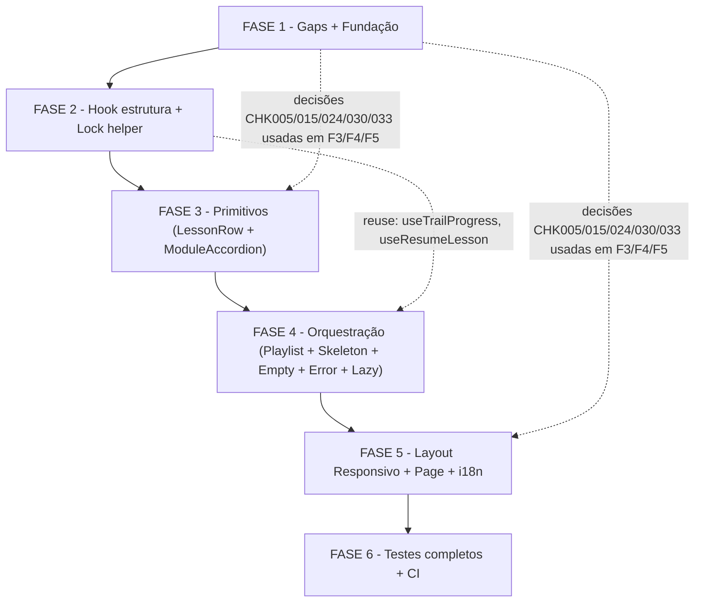

# Backlog de Tarefas: TrailPlaylist — Navegação de Conteúdo em Trilha

**Feature**: `trilhas-playlist` (Story 8-9, Epic 8 — FE puro)
**Spec**: [`docs/specs/trilhas-playlist/spec.md`](spec.md)
**Plan**: [`docs/specs/trilhas-playlist/plan.md`](plan.md)
**Checklist**: [`docs/specs/trilhas-playlist/checklists/ux.md`](checklists/ux.md)
**Criado**: 2026-06-11
**Status**: Concluída

---

**Legenda de status:**
- `[ ]` Pendente
- `[x]` Concluída
- `[~]` Em andamento
- `[-]` Cancelada / N/A

**Legenda de criticidade:**
- `[C]` Crítico — impacto direto na navegação de discipulado (funcionalidade core da Story)
- `[A]` Alto — funcionalidade necessária; sem ela o componente não opera conforme spec
- `[M]` Médio — qualidade, polish, testes complementares

---

## FASE 1 - Resolução de Gaps e Fundação

> Fecha os 5 gaps `{humano}` do checklist e prepara o terreno de implementação (verificações de reuse, i18n skeleton, estrutura de pastas).

### 1.1 Resolver gaps de produto (checklist humano) `[A]`

Ref: checklists/ux.md CHK005, CHK015, CHK024, CHK030, CHK033 | spec §FR-004, §FR-002, §FR-011, §SC-005

- [x] 1.1.1 Decidir animação do accordion: `transition-all duration-200 ease-out` (padrão projeto) ou instantânea — documentar decisão como comentário em `module-accordion-item.tsx` e atualizar CHK005 com `[x]`
- [x] 1.1.2 Decidir estado inicial do bottom-sheet: fechado com handle visível por padrão — `defaultOpen={false}` no Dialog, handle `h-1 w-10 rounded-full bg-muted mx-auto mt-2` — atualizar CHK015
- [x] 1.1.3 Definir "navegação completa por teclado" (SC-005/CHK024): aulas bloqueadas são focáveis mas Enter não navega; `tabIndex={0}` em locked rows com `aria-disabled="true"` — atualizar CHK024
- [x] 1.1.4 Adicionar `touch-action: pan-y` e `overflow-y: auto` no wrapper interno do bottom-sheet para isolar scroll interno do scroll da página (CHK030 — iOS Safari) — atualizar CHK030
- [x] 1.1.5 Definir comportamento de módulo com zero aulas (CHK033): accordion item renderiza módulo colapsado com `0%` e estado vazio expandido exibindo texto pastoral "Nenhuma aula disponível neste módulo" — atualizar CHK033

### 1.2 Verificação empírica de reuse e setup de pastas `[A]`

Ref: plan.md §10 Reuse Inventory | plan.md §2 Component Architecture

- [x] 1.2.1 Confirmar que `TrailProgressBar`, `LessonStatusIcon` existem e exportam os props esperados em `apps/web/src/components/content/trail-progress-bar.tsx`
- [x] 1.2.2 Confirmar que `LockIndicator` existe com prop `reason: string` em `apps/web/src/components/content/lock-indicator.tsx`
- [x] 1.2.3 Confirmar que `useTrailProgress(trailId)` e `useResumeLesson(trailId)` exportam de `apps/web/src/lib/api/hooks/use-progress.ts` com os campos `progressPercent` e `lessonId` respectivamente
- [x] 1.2.4 Confirmar que `Dialog` (radix) exporta de `packages/ui/src/index.ts`
- [x] 1.2.5 Confirmar que `apps/web/app/(authenticated)/app/consumo/trilhas/[trailId]/` existe (apenas `progresso/` dentro — `page.tsx` ainda ausente, será criado na FASE 4)
- [x] 1.2.6 Confirmar que `apps/web/src/lib/query/retry-policy.ts` existe e exporta o `QueryClient` com retry 3x + backoff

---

## FASE 2 - Hook de Estrutura e Helper de Lock

> Toda a lógica de dados e regras de negócio FE — sem UI ainda.

### 2.1 Hook `use-trail-structure.ts` `[A]`

Ref: plan.md §3 Data Fetch / Cache Strategy | spec §FR-010 | dec-006 (parallel fetch, no aggregator)

- [x] 2.1.1 Criar `apps/web/src/lib/api/hooks/use-trail-structure.ts` com `'use client'` e 3 hooks: `useTrail(trailId)`, `useTrailModules(trailId)`, `useModuleLessons(trailId, moduleId)`
- [x] 2.1.2 Definir `trailStructureKeys` com query keys canônicas: `['trail-structure','trail',trailId]`, `['trail-structure','modules',trailId]`, `['trail-structure','lessons',trailId,moduleId]`
- [x] 2.1.3 Implementar `useTrail` com `staleTime: 300_000` validando resposta contra `TrailResponseSchema` de `packages/types`
- [x] 2.1.4 Implementar `useTrailModules` com `staleTime: 300_000` validando contra `ModuleResponse` list schema
- [x] 2.1.5 Implementar `useModuleLessons` com `staleTime: 300_000` validando contra `LessonResponse` list schema; usar mesmo padrão `envelopeClient`/`apiClient.get` de `use-search.ts`
- [x] 2.1.6 Exportar hooks de `apps/web/src/lib/api/hooks/index.ts`
- [x] 2.1.7 Escrever teste `use-trail-structure.test.ts` (MSW + Vitest): T12 — verificar `staleTime` 300_000 na config do hook; verificar que 2 chamadas dentro de 5min produzem 1 fetch (dedup via MSW call count)

### 2.2 Helper `use-locked-lessons.ts` `[A]`

Ref: plan.md §4 Derived Lock State | spec §FR-005 | dec-009 (derivar lock no FE)

- [x] 2.2.1 Criar `apps/web/app/(authenticated)/app/consumo/trilhas/[trailId]/use-locked-lessons.ts` — módulo puro sem React hooks
- [x] 2.2.2 Implementar `deriveLockedLessons(module, progressByLessonId)`: `free` → todos desbloqueados; `sequential` → lição[0] nunca bloqueada; lição[i] bloqueada se lição[i-1].status !== `'completed'`
- [x] 2.2.3 Tipar input/output estritamente: `module: ModuleResponse`, `progressByLessonId: Record<string, LessonStatus>`, retornar `Record<lessonId, { locked: boolean; reason: string | null }>`
- [x] 2.2.4 Escrever `use-locked-lessons.test.ts` (Vitest, T1): testar caso `free` (todos unlocked), `sequential` primeiro unlocked, `sequential` lição[i] locked quando lição[i-1] not completed, `sequential` lição[i] unlocked quando lição[i-1] completed

---

## FASE 3 - Componentes Primitivos (Linha de Aula e Accordion de Módulo)

> Átomos visuais que compõem o painel. Sem orquestração ainda.

### 3.1 Componente `lesson-row.tsx` `[A]`

Ref: plan.md §2 | spec §FR-001, §FR-003, §FR-005, §FR-011, §FR-012, §FR-013 | SC-003, SC-007

- [x] 3.1.1 Criar `apps/web/app/(authenticated)/app/consumo/trilhas/[trailId]/lesson-row.tsx` com `'use client'`
- [x] 3.1.2 Props: `lesson: LessonResponse`, `isActive: boolean`, `isLocked: boolean`, `lockReason: string | null`, `onSelect: (id: string) => void`
- [x] 3.1.3 Renderizar ícone de tipo via `LessonStatusIcon` (reuse `trail-progress-bar.tsx`) com `contentType: lesson.contentType`
- [x] 3.1.4 Renderizar `lesson.name` (não `title` — DRIFT correction plan §1)
- [x] 3.1.5 Renderizar duração: `{lesson.estimatedDurationMinutes} min` SOMENTE quando `estimatedDurationMinutes !== null` (FR-013)
- [x] 3.1.6 Aplicar destaque ativo: `bg-brand-teal/10 border-l-2 border-brand-teal` quando `isActive` (FR-003)
- [x] 3.1.7 Renderizar `LockIndicator` com `reason={lockReason}` quando `isLocked`; no click, NÃO chamar `onSelect` (FR-005)
- [x] 3.1.8 `aria-label` na locked row: `"${lesson.name} — ${lockReason ?? t('locked.reason')}"` (spec US2-AC3)
- [x] 3.1.9 `aria-disabled="true"` quando `isLocked`, `tabIndex={0}` (focável mas não navegável — resolução CHK024/1.1.3)
- [x] 3.1.10 Aplicar densidade: `min-h-11 min-w-11` em toda área interativa; padding `p-5` a `p-6`; `rounded-xl` (SC-003, SC-007)
- [x] 3.1.11 Escrever `lesson-row.test.tsx` (Vitest + Testing Library + jest-axe): T4 (null duration), T5 (locked: LockIndicator visível, onSelect não chamado, aria-label correto), T8 (touch target 44px via class assertion), T7-parcial (axe no estado locked)

### 3.2 Componente `module-accordion-item.tsx` `[A]`

Ref: plan.md §2 | spec §FR-001, §FR-004, §FR-011 | SC-007 | resolução CHK005 (1.1.1)

- [x] 3.2.1 Criar `apps/web/app/(authenticated)/app/consumo/trilhas/[trailId]/module-accordion-item.tsx` com `'use client'`
- [x] 3.2.2 Props: `module: ModuleResponse`, `trailId: string`, `progressByLessonId: Record<string, LessonStatus>`, `activeLesson: string | null`, `onLessonSelect: (id: string) => void`, `isExpanded: boolean`, `onToggle: () => void`
- [x] 3.2.3 Header como `<button aria-expanded={isExpanded} aria-controls={regionId}>`: nome do módulo + percentual de conclusão visível mesmo colapsado (FR-004)
- [x] 3.2.4 Região de aulas: `
` com `useModuleLessons(trailId, moduleId)` para fan-out de queries por módulo
- [x] 3.2.5 Aplicar animação de accordion conforme resolução CHK005 (1.1.1): `transition-all duration-200 ease-out` ou instantânea — conforme decisão registrada
- [x] 3.2.6 Calcular e exibir `completionPercent` do módulo a partir do progresso das aulas (conta completed / total)
- [x] 3.2.7 Renderizar `<LessonRow>` para cada aula com `isLocked` derivado de `deriveLockedLessons`
- [x] 3.2.8 Renderizar estado vazio intra-módulo quando `lessons.length === 0` (resolução CHK033/1.1.5): mensagem pastoral via i18n `trailPlaylist.module.empty`
- [x] 3.2.9 Suportar navegação por teclado: `onKeyDown` em header — Enter/Space toggle; Arrow keys geridos pelo container pai (FR-011)
- [x] 3.2.10 Escrever `module-accordion-item.test.tsx`: T2-parcial (módulo colapsado mostra %, expandido mostra aulas), T6-parcial (Enter toggle), T7-parcial (axe no estado expandido/colapsado), T8 (touch target header)

---

## FASE 4 - Componentes de Orquestração (Header, Playlist, Skeleton, Empty, Error, Lazy)

> Montagem do painel completo. Todos os sub-componentes, incluindo skeleton, empty state e error boundary inline.

### 4.1 Componente `trail-playlist-header.tsx` `[A]`

Ref: plan.md §2 §overall progress | spec §FR-006

- [x] 4.1.1 Criar `apps/web/app/(authenticated)/app/consumo/trilhas/[trailId]/trail-playlist-header.tsx` com `'use client'`
- [x] 4.1.2 Props: `trailId: string`; consumir `useTrailProgress(trailId)` para `progressPercent`
- [x] 4.1.3 Renderizar `<TrailProgressBar progressPercent={...}>` (reuse existente) + label i18n `trailPlaylist.overallProgress` acima da barra
- [x] 4.1.4 Esqueleton do header: altura fixa igual ao real para CLS=0 (FR-007)

### 4.2 Componente `trail-playlist-skeleton.tsx` `[A]`

Ref: plan.md §5 | spec §FR-007, §FR-008, §SC-002 | T9

- [x] 4.2.1 Criar `apps/web/app/(authenticated)/app/consumo/trilhas/[trailId]/trail-playlist-skeleton.tsx`
- [x] 4.2.2 Renderizar `N=3` blocos de módulo skeleton com dimensões fixas idênticas ao real: altura do header + `min-h-11` por linha de aula (CLS=0)
- [x] 4.2.3 Aplicar `motion-safe:animate-pulse bg-muted rounded-xl` em cada bloco (FR-008: sem pulso com `prefers-reduced-motion`)
- [x] 4.2.4 Escrever `trail-playlist-skeleton.test.tsx` (T9): snapshot das dimensões skeleton vs. dimensões reais do módulo; verificar que classe `animate-pulse` está dentro de `motion-safe:`

### 4.3 Componente `trail-playlist-empty.tsx` `[A]`

Ref: spec §FR-014, §Edge Cases (trilha sem módulos) | plan.md §7 i18n

- [x] 4.3.1 Criar `apps/web/app/(authenticated)/app/consumo/trilhas/[trailId]/trail-playlist-empty.tsx`
- [x] 4.3.2 Renderizar mensagem pastoral PT-BR via `t('trailPlaylist.empty.title')` e `t('trailPlaylist.empty.body')`
- [x] 4.3.3 Sem ação interativa — componente informacional apenas
- [x] 4.3.4 Escrever teste (T10): trilha com `modules: []` renderiza as mensagens pastorais corretas; jest-axe zero violations

### 4.4 Componente `trail-playlist-error.tsx` `[A]`

Ref: plan.md §3 retry/error | spec §Edge Cases (falha de rede) | dec-010

- [x] 4.4.1 Criar `apps/web/app/(authenticated)/app/consumo/trilhas/[trailId]/trail-playlist-error.tsx`
- [x] 4.4.2 Props: `onRetry: () => void`; renderizar mensagem `t('trailPlaylist.error')` + botão `t('trailPlaylist.retry')` chamando `onRetry`
- [x] 4.4.3 Botão com `min-h-11 min-w-11` (SC-003) e foco visível
- [x] 4.4.4 Escrever teste (T11): simular falha de query → componente exibe mensagem pastoral e botão; click em botão chama `onRetry`; axe zero violations

### 4.5 Componente `lazy-module-mount.tsx` `[A]`

Ref: plan.md §5 | spec §FR-009 | T13

- [x] 4.5.1 Criar `apps/web/app/(authenticated)/app/consumo/trilhas/[trailId]/lazy-module-mount.tsx` com `'use client'`
- [x] 4.5.2 Aceitar `children: React.ReactNode`, `placeholderHeight: number` (px); usar `IntersectionObserver` para montar `children` só quando entrar no viewport
- [x] 4.5.3 Enquanto não visível, renderizar `
` com skeleton (reserva altura, CLS=0)
- [x] 4.5.4 Escrever `lazy-module-mount.test.tsx` (T13): mock `IntersectionObserver`; verificar que children NÃO está no DOM antes do IO disparar, e ESTÁ após

### 4.6 Componente `trail-playlist.tsx` `[C]`

Ref: plan.md §2 | spec §FR-001, §FR-003, §FR-004, §FR-006, §FR-007, §FR-009, §FR-010

- [x] 4.6.1 Criar `apps/web/app/(authenticated)/app/consumo/trilhas/[trailId]/trail-playlist.tsx` com `'use client'`
- [x] 4.6.2 Props: `trailId: string`, `onLessonSelect: (lessonId: string) => void`
- [x] 4.6.3 Montar `useTrail`, `useTrailModules`, `useTrailProgress`, `useResumeLesson` no topo do componente
- [x] 4.6.4 Derivar `activeLessonId`: primeiro lesson com `status === 'in_progress'`, senão `useResumeLesson.data.lessonId` (plan §2)
- [x] 4.6.5 Enquanto estrutura carregando: renderizar `<TrailPlaylistSkeleton>` (FR-007)
- [x] 4.6.6 Quando erro em qualquer query de estrutura: renderizar `<TrailPlaylistError onRetry={...}>` chamando `refetch()` nas queries falhas
- [x] 4.6.7 Quando `modules.length === 0`: renderizar `<TrailPlaylistEmpty>` (FR-014)
- [x] 4.6.8 Estado normal: renderizar `<TrailPlaylistHeader trailId={trailId}>` + lista de `<LazyModuleMount>` envolvendo cada `<ModuleAccordionItem>`
- [x] 4.6.9 Gerenciar estado de expansão por módulo (`expandedModules: Set<string>` em useState)
- [x] 4.6.10 Implementar `onKeyDown` no container da lista: ArrowUp/ArrowDown move foco entre headers de módulo e lesson rows (roving focus)
- [x] 4.6.11 Escrever `trail-playlist.test.tsx`: T2 (módulos/aulas renderizados), T3 (aula ativa com teal), T10 (empty), T11 (error+retry), T6 (keyboard nav completo), T7 (jest-axe todos os estados)

---

## FASE 5 - Layout Responsivo, Rota e i18n

> Montagem final: layout desktop/mobile, page shell e strings PT-BR.

### 5.1 Componente `trail-playlist-route.tsx` `[C]`

Ref: plan.md §2 Layout switch | spec §FR-002 | resolução CHK015 (1.1.2) e CHK030 (1.1.4)

- [x] 5.1.1 Criar `apps/web/app/(authenticated)/app/consumo/trilhas/[trailId]/trail-playlist-route.tsx` com `'use client'`
- [x] 5.1.2 Props: `trailId: string`; importar `useRouter` para `onLessonSelect` → `router.push('/app/consumo/trilhas/${trailId}/aulas/${lessonId}')`
- [x] 5.1.3 Desktop layout: `<aside className="hidden md:block md:w-80 lg:w-96 fixed right-0 top-0 h-full overflow-y-auto">` com `<TrailPlaylist>`
- [x] 5.1.4 Mobile layout: `<Dialog defaultOpen={false}>` (resolução CHK015/1.1.2) com `<DialogContent className="fixed bottom-0 h-[60vh] w-full motion-safe:slide-in-from-bottom">` e `touch-action: pan-y; overflow-y: auto` (resolução CHK030/1.1.4)
- [x] 5.1.5 Handle visual no bottom-sheet: `
`
- [x] 5.1.6 Escape fecha o Dialog (radix `onEscapeKeyDown` nativo — FR-011)
- [x] 5.1.7 Ambos os branches compartilham o mesmo `<TrailPlaylist trailId={trailId} onLessonSelect={onLessonSelect}>` (queries dedupem via TanStack cache)
- [x] 5.1.8 Escrever `trail-playlist-route.test.tsx`: verificar que `onLessonSelect` chama `router.push` com path correto (T14); verificar Escape fecha Dialog (T6-Escape)

### 5.2 Page shell `page.tsx` `[A]`

Ref: plan.md §2 | spec (dec-007, dec-008 — Server Component thin shell)

- [x] 5.2.1 Criar `apps/web/app/(authenticated)/app/consumo/trilhas/[trailId]/page.tsx` como Server Component (sem `'use client'`)
- [x] 5.2.2 Ler `params: Promise<{ trailId: string }>` e aguardar com `await` (Next.js 15+ async params)
- [x] 5.2.3 Renderizar `<TrailPlaylistRoute trailId={trailId} />` — sem lógica de dados no Server Component
- [x] 5.2.4 Sem importação de hooks TanStack (regra CLAUDE.md: TanStack só em Client Components)

### 5.3 i18n `pt-BR.json` `[A]`

Ref: plan.md §7 i18n | spec §FR-013, §FR-014 | resolução CHK033 (1.1.5)

- [x] 5.3.1 Adicionar namespace `trailPlaylist` em `apps/web/messages/pt-BR.json` com todas as chaves definidas em plan §7 + chave adicional `module.empty` (resolução CHK033)
- [x] 5.3.2 Chaves obrigatórias: `overallProgress`, `empty.title`, `empty.body`, `error`, `retry`, `locked.reason`, `status.notStarted`, `status.inProgress`, `status.completed`, `duration`, `module.empty`
- [x] 5.3.3 Usar vocabulário pastoral (não corporativo): "Seu caminho na trilha" (não "Progresso"), "Nenhuma aula disponível neste módulo" (não "Empty"), "Não foi possível carregar a trilha. Verifique sua conexão e tente novamente."
- [x] 5.3.4 Verificar que nenhuma chave existente foi sobrescrita (JSON merge, não substituição do arquivo)

---

## FASE 6 - Testes de Integração, Acessibilidade e Qualidade

> Cobertura completa T1–T14 + CI validation.

### 6.1 Testes de acessibilidade completos (jest-axe) `[A]`

Ref: spec §SC-004, §FR-012 | plan.md §8 T7

- [x] 6.1.1 Executar jest-axe em `<TrailPlaylist>` no estado de carregamento (skeleton): zero violations
- [x] 6.1.2 Executar jest-axe em `<TrailPlaylist>` no estado carregado com dados completos: zero violations
- [x] 6.1.3 Executar jest-axe em `<TrailPlaylist>` no estado vazio (zero módulos): zero violations
- [x] 6.1.4 Executar jest-axe em `<TrailPlaylist>` no estado de erro: zero violations
- [x] 6.1.5 Executar jest-axe em `<TrailPlaylist>` com aulas bloqueadas: zero violations
- [x] 6.1.6 Verificar que NENHUM elemento usa `role="article"` em `<a>` ou `<button>` (regressão Cenário 06 Session 5)

### 6.2 Testes de staleness e fetch policy (T12) `[A]`

Ref: spec §FR-010, §SC-006 | plan.md §8 T12

- [x] 6.2.1 Verificar via asserção de config que `useTrail` tem `staleTime === 300_000`
- [x] 6.2.2 Verificar via asserção de config que `useTrailModules` tem `staleTime === 300_000`
- [x] 6.2.3 Verificar via asserção de config que `useModuleLessons` tem `staleTime === 300_000`
- [x] 6.2.4 Verificar (reuse) que `useTrailProgress` mantém `staleTime === 30_000` (não regredir)
- [x] 6.2.5 Verificar MSW call count: 2 chamadas ao mesmo endpoint dentro de `staleTime` produzem apenas 1 fetch

### 6.3 Teste de routing e onLessonSelect (T14) `[A]`

Ref: spec §FR-011 (Enter aula desbloqueada → `router.push`) | dec-007

- [x] 6.3.1 Aula desbloqueada: Enter/click → `onLessonSelect(lessonId)` chamado
- [x] 6.3.2 Aula bloqueada: Enter/click → `onLessonSelect` NÃO chamado (FR-005)
- [x] 6.3.3 `TrailPlaylistRoute`: `onLessonSelect(lessonId)` → `router.push('/app/consumo/trilhas/${trailId}/aulas/${lessonId}')`

### 6.4 Testes de keyboard navigation (T6) `[A]`

Ref: spec §FR-011, §US2-AC1/2/3/4 | SC-005

- [x] 6.4.1 Tab até o painel → foco no primeiro módulo header
- [x] 6.4.2 ArrowDown move foco para próximo item (módulo ou aula quando expandido)
- [x] 6.4.3 ArrowUp move foco para item anterior
- [x] 6.4.4 Enter em módulo colapsado → expande, foco permanece acessível (US2-AC2)
- [x] 6.4.5 Enter em aula desbloqueada → chama `onLessonSelect`
- [x] 6.4.6 Enter em aula bloqueada → sem navegação; foco permanece (US2-AC3 implícito)
- [x] 6.4.7 Escape no Dialog mobile → fecha bottom-sheet (US2-AC4)

### 6.5 Validação CI (RECONCILIACAO §5) `[A]`

Ref: plan.md §9 CI / Validation Guardrails

- [x] 6.5.1 `pnpm exec prisma generate` (sem migration nesta story — verifica apenas geração do cliente)
- [x] 6.5.2 `pnpm turbo lint` sem erros em todos os arquivos novos
- [x] 6.5.3 `pnpm turbo build` compilando sem erros TypeScript `strict: true`
- [x] 6.5.4 `pnpm vitest run` — suíte completa verde (T1–T14)
- [x] 6.5.5 Verificar que nenhuma importação usa `any` ou omite tipo explícito

---

## Matriz de Dependências

---

## Resumo Quantitativo

| Fase | Tarefas | Subtarefas | Criticidade dominante |
|------|---------|------------|----------------------|
| FASE 1 - Gaps + Fundação | 2 | 11 | [A] |
| FASE 2 - Hook + Lock | 2 | 11 | [A] |
| FASE 3 - Primitivos | 2 | 21 | [A] |
| FASE 4 - Orquestração | 6 | 29 | [C]/[A] |
| FASE 5 - Layout + Page + i18n | 3 | 15 | [C]/[A] |
| FASE 6 - Testes + CI | 5 | 23 | [A] |
| **Total** | **20** | **110** | — |

---

## Escopo Coberto

- Componente `TrailPlaylist` com painel lateral desktop (`md:w-80 lg:w-96`) e bottom-sheet mobile (`60vh`)
- Hook `use-trail-structure.ts` com fetch paralelo (N+1) sem endpoint agregador novo (staleTime 5min/30s)
- Helper `use-locked-lessons.ts` com lógica de derivação de lock no FE (FR-005, dec-009)
- Skeletons com CLS=0 e `motion-safe:animate-pulse` (FR-008, FR-007)
- Lazy-load de módulos below-the-fold via IntersectionObserver (FR-009)
- Navegação por teclado completa (setas, Enter, Escape) e jest-axe zero violations para todos os estados (FR-011, FR-012)
- Destaque da aula ativa em brand-teal (FR-003)
- Estado vazio pastoral, error boundary inline com retry, duração `null` omitida (FR-013, FR-014)
- i18n com vocabulário pastoral em `apps/web/messages/pt-BR.json` namespace `trailPlaylist.*`
- Resolução dos 5 gaps `{humano}` do checklist (CHK005, CHK015, CHK024, CHK030, CHK033)
- Cobertura de testes T1–T14 conforme plan.md §8
- Validação CI: `prisma generate` + `turbo build` + `turbo lint` + `vitest run`

## Escopo Excluído

- **Nenhum endpoint backend criado/modificado** — feature 100% FE pura, consome GETs existentes
- **Nenhuma migration Prisma** — sem mudança de schema
- **Nenhum schema novo em `packages/types`** — reusar `TrailResponseSchema`, `ModuleResponse`, `LessonResponse`, `LessonStatus` existentes
- **Rota de viewer `/aulas/[lessonId]`** — `onLessonSelect` apenas emite callback; rota pertence a Story 8-10
- **`useMutation`** — feature read-only; guardrail N/A
- **Testes E2E Playwright** — deferidos para Story 8-10 closeout
- **Medição de SC-001 (2,5s em 4G)** — deferida para Story 8-10 E2E
- **`next/dynamic` para viewers inline** — N/A (sem viewer nesta story); `LazyModuleMount` é o seam para uso futuro
